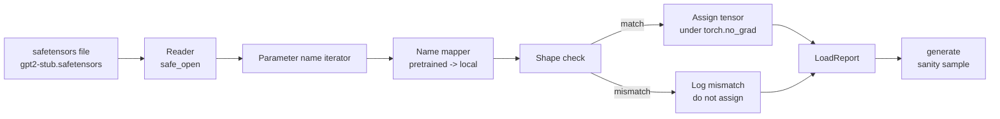

# Loading Pretrained Weights

> Việc huấn luyện một mô hình 124 triệu tham số từ đầu là một quyết định về ngân sách; còn việc tải một checkpoint đã được công bố chỉ là chuyện thường ngày. Bài học này sẽ tải các trọng số pretrained theo phong cách GPT-2 từ một tệp safetensors vào đúng kiến trúc từ bài học 35, đi sâu vào việc ánh xạ tên tham số từng phần một, và thực hiện tạo văn bản (generation) để kiểm chứng việc tải đã thành công. Không mạng, không trình tải của bên thứ ba, không phép thuật khó hiểu.

**Type:** Build
**Languages:** Python
**Prerequisites:** Phase 19 lessons 30 to 36
**Time:** ~90 minutes

## Learning Objectives

- Đọc tệp safetensors bằng thư viện Python `safetensors` và kiểm tra tên cũng như hình dạng (shape) của các tensor.
- Ánh xạ từng tên tham số pretrained vào một tham số bên trong mô hình GPT của bài học 35.
- Xử lý hai quy ước đặt tên khác biệt giữa các trọng số GPT-2 đã công bố và mô hình trong lộ trình này: `wte/wpe/h.N.attn.c_attn/c_proj` và `mlp.c_fc/c_proj` so với `tok_embed/pos_embed/blocks.N.attn.qkv/out_proj` và `mlp.fc1/fc2` được đặt tên cục bộ.
- Phát hiện và từ chối việc không khớp hình dạng (shape mismatch) với một thông báo lỗi rõ ràng trước khi bất kỳ phép gán trọng số nào diễn ra.
- Tạo một đoạn văn bản ngắn với các trọng số đã tải và xác nhận các token đến từ phân phối đã tải, thay vì phân phối được khởi tạo ngẫu nhiên.

## The Problem

Các trọng số được công bố không được đóng gói cho kiến trúc của bạn. Chúng mang những cái tên mà bản triển khai gốc đã sử dụng. Tệp pretrained có `transformer.h.0.attn.c_attn.weight` với hình dạng `(2304, 768)`; mô hình của bạn mong đợi `blocks.0.attn.qkv.weight` với hình dạng `(2304, 768)` (đây là cùng một ma trận nhưng theo quy ước bố cục khác) hoặc mô hình của bạn sử dụng `nn.Linear`, nơi lưu trữ ma trận đã được chuyển vị. Cùng một tham số xuất hiện với ba danh tính khác biệt tinh vi (tên, hình dạng, bố cục byte) và trình tải phải hòa giải cả ba.

Một trình tải sao chép một cách mù quáng sẽ đặt đúng tensor vào sai vị trí và bạn sẽ nhận được một mô hình tạo ra những nội dung vô nghĩa. Một trình tải từ chối sao chép khi hình dạng khác nhau nhưng không ghi lại nhật ký sẽ khiến bạn phải đoán xem tensor nào đã tải thất bại. Trình tải trong bài học này rất rõ ràng: mọi phép gán đều được ghi nhật ký, mọi hình dạng đều được kiểm tra, và một `LoadReport` sẽ tóm tắt các kết quả thành công, thất bại và các trường hợp không khớp hình dạng để bạn có thể đọc được những gì đã xảy ra.

## The Concept



Trình ánh xạ tên chỉ là một hàm từ chuỗi sang chuỗi. Việc kiểm tra hình dạng chỉ là một câu lệnh if. Phép gán diễn ra bên trong `torch.no_grad()` để autograd không theo dõi quá trình tải. Báo cáo sẽ lưu giữ kết quả của từng tên.

### The GPT-2 naming convention

Các trọng số GPT-2 đã công bố tồn tại dưới các tên như:

| Tên Pretrained | Hình dạng | Ý nghĩa |
|-----------------|-------|---------|
| `wte.weight` | (50257, 768) | Token embedding |
| `wpe.weight` | (1024, 768) | Position embedding |
| `h.N.ln_1.weight` | (768,) | LayerNorm 1 scale tại block N |
| `h.N.ln_1.bias` | (768,) | LayerNorm 1 shift tại block N |
| `h.N.attn.c_attn.weight` | (768, 2304) | Fused QKV linear weight |
| `h.N.attn.c_attn.bias` | (2304,) | Fused QKV linear bias |
| `h.N.attn.c_proj.weight` | (768, 768) | Attention output projection |
| `h.N.attn.c_proj.bias` | (768,) | Attention output projection bias |
| `h.N.ln_2.weight` | (768,) | LayerNorm 2 scale |
| `h.N.ln_2.bias` | (768,) | LayerNorm 2 shift |
| `h.N.mlp.c_fc.weight` | (768, 3072) | MLP fc1 weight |
| `h.N.mlp.c_fc.bias` | (3072,) | MLP fc1 bias |
| `h.N.mlp.c_proj.weight` | (3072, 768) | MLP fc2 weight |
| `h.N.mlp.c_proj.bias` | (768,) | MLP fc2 bias |
| `ln_f.weight` | (768,) | Final LayerNorm scale |
| `ln_f.bias` | (768,) | Final LayerNorm shift |

Có hai điều bất ngờ cần lên kế hoạch. Các lớp tuyến tính `c_attn`, `c_proj`, `c_fc` được lưu trữ với ma trận đã được chuyển vị so với những gì `nn.Linear.weight` mong đợi. Trình tải sẽ thực hiện chuyển vị trong quá trình gán. LM head không có trong tệp; mô hình dựa vào việc ràng buộc trọng số (weight tying) với `wte`, vì vậy head được thiết lập bằng cách gán bí danh (aliasing) sau khi `wte` được tải xong.

### The local naming convention

Mô hình trong lộ trình này sử dụng các tên mô tả:

| Tên cục bộ | Ý nghĩa |
|------------|---------|
| `tok_embed.weight` | Token embedding |
| `pos_embed.weight` | Position embedding |
| `blocks.N.ln1.scale` | LayerNorm 1 scale tại block N |
| `blocks.N.ln1.shift` | LayerNorm 1 shift |
| `blocks.N.attn.qkv.weight` | Fused QKV |
| `blocks.N.attn.qkv.bias` | Fused QKV bias |
| `blocks.N.attn.out_proj.weight` | Attention output projection |
| `blocks.N.attn.out_proj.bias` | Output projection bias |
| `blocks.N.ln2.scale` | LayerNorm 2 scale |
| `blocks.N.ln2.shift` | LayerNorm 2 shift |
| `blocks.N.mlp.fc1.weight` | MLP fc1 |
| `blocks.N.mlp.fc1.bias` | MLP fc1 bias |
| `blocks.N.mlp.fc2.weight` | MLP fc2 |
| `blocks.N.mlp.fc2.bias` | MLP fc2 bias |
| `final_ln.scale` | Final LayerNorm scale |
| `final_ln.shift` | Final LayerNorm shift |

Việc ánh xạ là một hàm cố định. Bài học cung cấp nó dưới dạng một dict mà trình tải sẽ lặp qua.

### The stub fixture

Trọng số GPT-2 thực tế nặng 0.5 GB. Bản demo không tải xuống chúng; nó tạo ra một tệp fixture safetensors nhỏ ở lần chạy đầu tiên, với quy ước đặt tên GPT-2 chính xác và các hình dạng phù hợp với mô hình 12-block tại d_model 192 thay vì 768. Fixture này có cấu trúc phù hợp để thực thi mọi đường dẫn mã trong trình tải. Hãy thay thế fixture bằng tệp thực tế và trình tải sẽ hoạt động mà không cần sửa đổi.

```figure
cc-weight-remap
```

## Build It

`code/main.py` triển khai:

- Một bản sao nhỏ của `GPTModel` từ bài học 35 để bài học này có thể tự vận hành.
- `make_pretrained_to_local(num_layers)` giúp mở rộng các mục nhập theo từng lớp.
- `load_safetensors(model, path)` giúp lặp qua các tên, ánh xạ chúng, kiểm tra hình dạng, chuyển vị các trọng số kiểu conv1d và gán dưới `torch.no_grad()`. Trả về một `LoadReport`.
- `make_stub_safetensors(path, cfg)` giúp tạo tệp fixture với quy ước đặt tên pretrained chính xác.
- Một bản demo tạo `outputs/gpt2-stub.safetensors` trong lần chạy đầu tiên, xây dựng một mô hình mới, ghi lại một đoạn văn bản được tạo từ khởi tạo ngẫu nhiên, tải stub, ghi lại một đoạn văn bản khác, in cả hai và xác minh rằng chúng khác nhau (việc tải thực sự đã thay đổi mô hình).

Chạy nó:

```bash
python3 code/main.py
```

Đầu ra: đường dẫn fixture, nhật ký tải theo từng tên, tóm tắt `LoadReport`, đoạn văn bản trước khi tải, đoạn văn bản sau khi tải, và lỗi không khớp hình dạng trên một tensor xấu được cố tình đưa vào fixture để kiểm tra đường dẫn lỗi.

## Stack

- `safetensors` cho định dạng trên đĩa và trình đọc streaming.
- `torch` cho mô hình và các phép toán gán.
- Không `transformers`, không `huggingface_hub`, không gọi mạng.

## Production patterns in the wild

Ba mô hình giúp trình tải tồn tại khi tiếp xúc với các trọng số mà bạn không tạo ra.

**Luôn xác thực tệp trước khi thực hiện bất kỳ phép gán nào.** Mở tệp, liệt kê mọi tên tensor cùng với dtype và hình dạng của chúng, chạy toàn bộ quá trình ánh xạ với các kiểm tra hình dạng, và chỉ khi thành công mới bắt đầu gán. Các mô hình được tải một nửa là những cỗ máy thất bại thầm lặng.

**Ghi nhật ký mọi phép gán với tên nguồn và tên đích.** Khi có điều gì đó trông không ổn, nhật ký sẽ cho bạn biết tensor nào đã nằm ở đâu; giải pháp thay thế là đọc hexdump. Dataclass `LoadReport` trong bài học này theo dõi các danh sách `loaded`, `missing`, `unexpected` và `shape_mismatch` và in tóm tắt ở cuối.

**LM head là một bí danh ràng buộc trọng số, không phải là một bản sao riêng biệt.** Thiết lập `model.lm_head.weight = model.tok_embed.weight` sau khi tải `tok_embed` là mô hình chuẩn. Việc sao chép ma trận embedding vào một tham số `lm_head.weight` mới sẽ phá vỡ sự ràng buộc và âm thầm làm tăng gấp đôi số lượng tham số của bạn.

## Use It

- Trình tải hoạt động với bất kỳ tệp safetensors nào sử dụng quy ước đặt tên pretrained. Các tệp GPT-2 thực tế (small / medium / large / xl) hoạt động mà không cần thay đổi mã; chỉ có cấu hình mô hình là khác biệt.
- Mô hình tương tự mở rộng sang các trọng số LLaMA, Mistral, Qwen khi bạn cập nhật bản đồ tên. Các kiểm tra hình dạng và báo cáo vẫn giữ nguyên.
- Tạo văn bản kiểm chứng sau khi tải là một bước kiểm tra nhanh: nếu các mẫu sau khi tải trông giống như các mẫu trước khi tải, việc tải đã không thay đổi mô hình, nghĩa là quá trình ánh xạ đã âm thầm bỏ lỡ mọi tensor.

## Exercises

1. Thêm đối số `dtype` vào trình tải để ép kiểu (cast) mỗi tensor sang một dtype mục tiêu (`bfloat16`, `float16`, `float32`) trong quá trình gán. Xác nhận rằng mô hình `float32` có thể được ép kiểu xuống `bfloat16` và vẫn tạo văn bản được.
2. Thêm đối số `expected_layers` từ chối tải checkpoint có các chỉ số `h.N` không khớp với `num_layers` của mô hình.
3. Kết nối trình tải vào hàm tạo văn bản của bài học 35 và tạo hai mẫu song song: một từ khởi tạo ngẫu nhiên, một từ fixture đã tải.
4. Thêm đường dẫn xuất: ghi trạng thái mô hình hiện tại vào một tệp safetensors mới sử dụng quy ước đặt tên pretrained. Chạy trình tải khứ hồi và xác nhận báo cáo có số lượng không khớp hình dạng bằng không.
5. Mở rộng `NAME_MAP` để xử lý quy ước đặt tên LLaMA (không có bias, RMSNorm, bố cục qkv fused) và chạy lại trình tải trên một stub fixture LLaMA mà bạn tạo ra.

## Key Terms

| Thuật ngữ | Cách gọi thông thường | Ý nghĩa thực tế |
|------|-----------------|------------------------|
| Name map | "Key remapping" | Hàm ánh xạ từ tên tensor pretrained sang tên tham số cục bộ; thường là một dict với một mục nhập cho mỗi chỉ số lớp được mở rộng qua vòng lặp |
| Shape mismatch | "Bad shape" | Tensor pretrained tồn tại dưới tên đã ánh xạ nhưng kích thước không khớp với tham số cục bộ; trình tải từ chối gán và ghi nhật ký cặp đó |
| Transpose-on-load | "Conv1d layout" | GPT-2 công bố lưu trữ các projection attention và MLP dưới dạng chuyển vị của những gì nn.Linear mong đợi; trình tải thực hiện chuyển vị trong khi gán |
| Weight tying alias | "Shared LM head" | Thiết lập model.lm_head.weight = model.tok_embed.weight để head và embedding chia sẻ bộ nhớ; head không có trong tệp vì lý do này |
| Load report | "Coverage summary" | Một dataclass nhỏ theo dõi các danh sách đã tải, thiếu, không mong đợi và không khớp hình dạng; việc in nó ra là cách bạn biết liệu quá trình tải có thành công hay không |

## Further Reading

- Phase 19 lesson 35 cho kiến trúc nhận các trọng số.
- Phase 19 lesson 36 cho vòng lặp huấn luyện tạo ra checkpoint cùng hình dạng.
- Phase 10 lesson 11 (quantization) cho việc xử lý các trọng số đã tải khi bộ nhớ hạn chế.
- Phase 10 lesson 13 (xây dựng pipeline LLM hoàn chỉnh) cho toàn bộ vòng đời xung quanh việc tải và suy luận (inference).