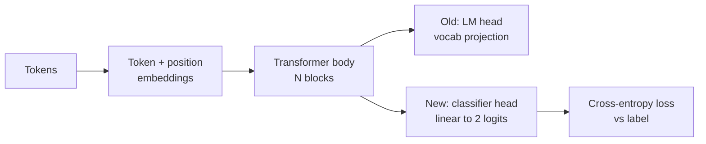
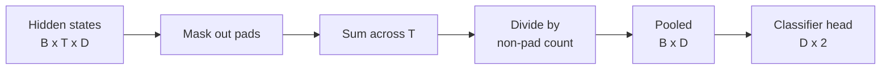
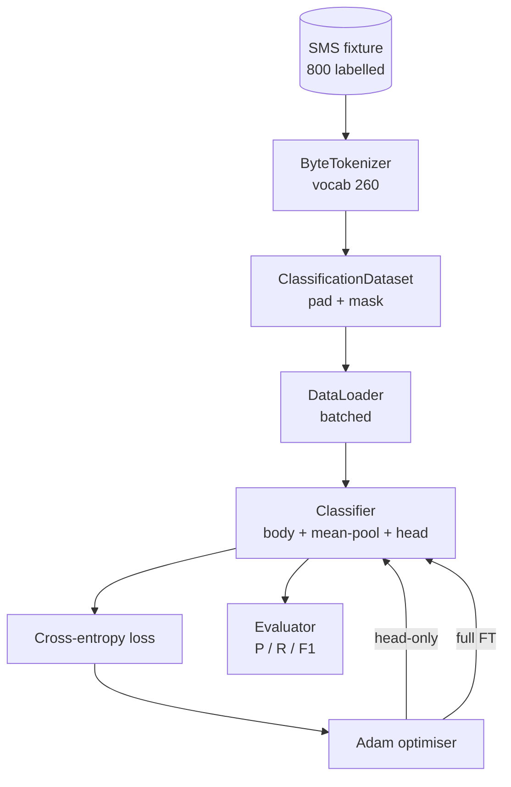

# Bài học Capstone 38: Tinh chỉnh bộ phân loại bằng cách thay thế Head

> Bài tập capstone đầu tiên của Track B. Một mô hình ngôn ngữ được huấn luyện trước (pretrained) là một chồng các khối self-attention kết thúc bằng một head dự đoán token. Khi bạn muốn phân loại spam và ham, head này không còn phù hợp nhưng phần thân (body) của mô hình thì phần lớn vẫn đúng. Bài học này sẽ loại bỏ head cũ, gắn một lớp tuyến tính hai lớp vào biểu diễn được gộp (pooled representation), và huấn luyện bộ phân loại theo hai cách: chỉ huấn luyện lớp cuối và tinh chỉnh toàn bộ (full fine-tuning). Việc đánh giá dựa trên precision, recall và F1 trên tập dữ liệu kiểm thử (held-out split). Bạn sẽ học được mỗi chiến lược mang lại lợi ích gì và cái giá phải trả là gì.

**Type:** Build
**Languages:** Python (torch, numpy)
**Prerequisites:** Các bài học 30-37 của Phase 19 (Track NLP LLM: tokenizer, embedding table, attention block, transformer body, pre-training loop, checkpointing, generation, perplexity)
**Time:** ~90 phút

## Mục tiêu học tập

- Thay thế head của mô hình ngôn ngữ bằng một head phân loại mà không cần khởi tạo lại phần thân.
- Triển khai hai chế độ huấn luyện: đóng băng phần thân (chỉ huấn luyện head) và tinh chỉnh toàn bộ, sử dụng chung một vòng lặp huấn luyện.
- Xây dựng pipeline dữ liệu nhận biết tokenizer, thực hiện padding, mask padding và gộp (pool) đầu ra của attention.
- Tính toán precision, recall, F1 và ma trận nhầm lẫn (confusion matrix) từ các logit thô.
- Suy luận về sự đánh đổi giữa số lượng tham số, thời gian huấn luyện và khả năng học hỏi (head-room).

## Vấn đề

Bạn đã huấn luyện trước một transformer nhỏ trên một tập dữ liệu chung. Head đầu ra chiếu trạng thái ẩn cuối cùng vào một từ điển 1000 token. Bây giờ bạn có 800 tin nhắn SMS được dán nhãn spam hoặc ham và bạn muốn có một bộ phân loại nhị phân. Có ba lựa chọn.

Lựa chọn sai lầm là huấn luyện một bộ phân loại mới từ đầu trên 800 ví dụ. Phần thân của mô hình đã được huấn luyện trước đã mã hóa các cấu trúc hữu ích: định danh từ, vị trí, sự đồng xuất hiện đơn giản. Việc loại bỏ nó là lãng phí tài nguyên tính toán đã tạo ra nó.

Hai lựa chọn đúng là thay thế head với phần thân bị đóng băng, và thay thế head với phần thân có thể huấn luyện được. Huấn luyện chỉ phần head rất nhanh, gần như không tốn bộ nhớ và hiếm khi bị overfitting với lượng dữ liệu nhỏ như vậy. Tinh chỉnh toàn bộ chậm hơn, có thể bị overfitting trên dữ liệu nhỏ, nhưng đạt độ chính xác cao hơn khi miền dữ liệu hạ nguồn (downstream domain) khác biệt so với tập dữ liệu huấn luyện trước.

Bài học này xây dựng cả hai, để bạn có thể so sánh chúng trên cùng một thiết lập.

## Khái niệm



Mô hình là một hàm `f_theta(tokens) -> hidden_states`. Head là một hàm `g_phi(hidden) -> logits`. Thay thế head nghĩa là giữ lại `theta` và thay thế `g_phi`. Các tham số của phần thân là phần đắt đỏ. Head chỉ là một lớp tuyến tính đơn lẻ.

Hai tập tham số có thể huấn luyện cần quan tâm:

- `theta` (phần thân): hàng chục nghìn trọng số cho mỗi khối attention.
- `phi` (phần head): `hidden_dim * num_classes` trọng số cộng với bias.

Trong huấn luyện chỉ phần head, bạn tính toán gradient đối với `phi` và đặt chúng bằng 0 đối với `theta`. PyTorch cho phép bạn làm điều này bằng cách thiết lập `requires_grad=False` trên các tham số của phần thân. Bộ tối ưu hóa (optimizer) sau đó chỉ nhìn thấy phần head và phần thân vẫn bị đóng băng.

Trong tinh chỉnh toàn bộ, bạn để gradient chảy ngược qua toàn bộ chồng mô hình. Các trọng số của phần thân sẽ thay đổi để phù hợp với mục tiêu phân loại. Rủi ro là hiện tượng "quên thảm họa" (catastrophic forgetting) trên dữ liệu nhỏ: quá trình huấn luyện trước của phần thân bị xóa nhòa bởi nhiễu overfitting.

## Vấn đề Pooling

Một bộ phân loại cần một vector cho mỗi chuỗi, không phải một vector cho mỗi token. Ba lựa chọn phổ biến:

- **Mean pool**: lấy trung bình các trạng thái ẩn trên toàn bộ chuỗi, có trọng số theo attention mask.
- **CLS pool**: thêm một token đặc biệt vào đầu và chỉ sử dụng đầu ra của nó. Đây là cách BERT thực hiện.
- **Last-token pool**: sử dụng token không phải padding cuối cùng. Đây là cách các bộ phân loại lớp GPT thực hiện.

Bài học này sử dụng mean pooling với trọng số attention-mask rõ ràng. Đây là cách đơn giản nhất, tạo ra tín hiệu ổn định trên các độ dài chuỗi khác nhau và không yêu cầu huấn luyện trước một CLS token.



## Dữ liệu

Tám trăm tin nhắn SMS, cân bằng với 400 spam và 400 ham, được tạo ra một cách tất định trong `code/main.py`. Trình tạo sử dụng một seed cố định, chọn các mẫu và thay thế các vị trí trống, và tạo ra các tin nhắn có độ dài từ 5 đến 25 token. Các tập dữ liệu thực tế có nhiễu mà thiết lập này không có. Mục đích của thiết lập này là tính tái lập.

Dữ liệu được chia theo tỷ lệ 80/20: 640 train, 160 test. Các tập được phân tầng (stratified) để tập test giữ được sự cân bằng 50/50. Một tập dữ liệu kiểm thử với sự cân bằng đã biết cho phép precision và recall được đọc như những con số trung thực.

## Các chỉ số

Phân loại nhị phân với lớp 1 là lớp dương tính (spam). Các số đếm là:

- `TP`: dự đoán spam, thực tế là spam.
- `FP`: dự đoán spam, thực tế là ham.
- `FN`: dự đoán ham, thực tế là spam.
- `TN`: dự đoán ham, thực tế là ham.

Ba chỉ số chính:

- `precision = TP / (TP + FP)`. Trong số các tin nhắn bị gắn cờ spam, bao nhiêu phần trăm thực sự là spam?
- `recall = TP / (TP + FN)`. Trong số các tin nhắn spam thực tế, mô hình đã gắn cờ được bao nhiêu phần trăm?
- `F1 = 2 * P * R / (P + R)`. Trung bình điều hòa của hai chỉ số trên.

Ma trận nhầm lẫn in bốn số đếm dưới dạng lưới 2x2. Bản demo ghi kết quả này ra stdout cho cả hai chế độ huấn luyện.

```figure
cap-classifier-head-swap
```

## Kiến trúc



Phần thân là một transformer cực nhỏ: từ điển 260, hidden 64, 4 head, 2 khối, chuỗi tối đa 32. Nó đủ nhỏ để huấn luyện cả hai chế độ đến khi hội tụ trong vòng 90 giây trên CPU. Nó không được huấn luyện trước trong bài học; thay vào đó, trình trợ giúp `pretrain_quick` thực hiện năm epoch huấn luyện LM trên văn bản của cùng thiết lập để cung cấp cho phần thân một điểm khởi đầu không tầm thường. Điều này giúp bài học tự chứa (self-contained).

## Những gì bạn sẽ xây dựng

Việc triển khai bao gồm một `main.py` cộng với một module kiểm thử (`code/tests/test_main.py`).

1. `ByteTokenizer`: ánh xạ byte sang id, dành riêng một pad id.
2. `Block`: một khối transformer với multi-head attention và một lớp feed-forward. Pre-norm.
3. `LMBody`: token + position embeddings cộng với một chồng các khối. Trả về các trạng thái ẩn.
4. `MeanPool`: trung bình có trọng số mask trên trục chuỗi.
5. `Classifier`: phần thân, pool, linear head. Phần thân là cùng một instance trong các chế độ.
6. `freeze_body` và `unfreeze_body`: bật/tắt `requires_grad` trên các tham số của phần thân.
7. `train_classifier`: một vòng lặp dùng chung. Chấp nhận mô hình và bộ tối ưu hóa được cấu hình cho nhóm tham số có thể huấn luyện.
8. `evaluate`: chạy tập test và trả về `Metrics(precision, recall, f1, confusion)`.
9. `run_demo`: huấn luyện trước phần thân một cách ngắn gọn, sau đó huấn luyện và đánh giá chỉ phần head, sau đó là toàn bộ, in cả hai báo cáo và thoát với mã 0.

## Tại sao việc so sánh lại quan trọng

Chế độ chỉ huấn luyện head thường huấn luyện nhanh hơn và underfit một cách ổn định hơn. Trên thiết lập này, bạn thường thấy precision gần 0.9 và recall gần 0.85 sau 20 epoch huấn luyện chỉ phần head. Tinh chỉnh toàn bộ mất thời gian gấp khoảng ba lần và đạt kết quả chênh lệch vài điểm tùy thuộc vào random seed.

Bài học này không chọn người chiến thắng. Nó dạy bạn cách đọc các con số và chi phí. Với 800 ví dụ và một phần thân nhỏ, chỉ huấn luyện head là lựa chọn đúng đắn. Với 80.000 ví dụ và một phần thân lớn hơn, tinh chỉnh toàn bộ bắt đầu mang lại hiệu quả. Hợp đồng bạn nhận được từ bài học này là API: cùng một hàm `train_classifier` xử lý cả hai, và việc chuyển đổi chỉ là một lệnh gọi.

## Mục tiêu mở rộng

- Thêm chế độ thứ ba chỉ mở khóa khối cuối cùng. Đây đôi khi được gọi là tinh chỉnh một phần (partial fine-tuning). Nó tốn ít chi phí hơn tinh chỉnh toàn bộ và học được nhiều hơn so với chỉ huấn luyện head.
- Thêm bộ lập lịch tốc độ học (learning-rate scheduler). Lịch trình cosine trên head cộng với tốc độ hằng số nhỏ hơn trên phần thân là một thiết lập sản xuất phổ biến.
- Thay thế mean pooling bằng một attention pool được học: một lớp attention nhỏ với một query được học. Cách này thường vượt trội hơn mean pool trên các chuỗi dài hơn.

Việc triển khai cung cấp cho bạn các điểm móc. Các bài kiểm tra cố định hợp đồng. Các con số là của bạn để cải thiện.