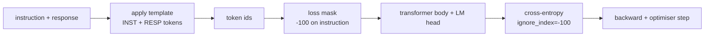
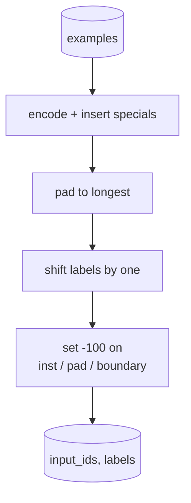
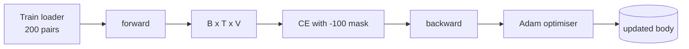

# Capstone Lesson 39: Instruction Tuning bằng Supervised Fine-Tuning

> Một base model đã được huấn luyện trước có thể mở rộng một chuỗi nhưng không thể tuân theo chỉ dẫn (instruction). Supervised fine-tuning (SFT) là thay đổi nhỏ nhất để khắc phục điều này: cung cấp cho mô hình các cặp ví dụ gồm chỉ dẫn và phản hồi mong muốn, sau đó huấn luyện phần thân (body) của mô hình để dự đoán các token phản hồi. Bí quyết ở đây là bạn chỉ muốn hàm loss tính toán trên phần phản hồi, không phải phần chỉ dẫn. Bài học này xây dựng một vòng lặp SFT theo phong cách Alpaca với một hàm collate tùy chỉnh giúp mask các token chỉ dẫn bằng `ignore_index=-100`, huấn luyện trên 200 cặp chỉ dẫn-phản hồi và đánh giá trên tập held-out bằng phương pháp exact-match.

**Type:** Build
**Languages:** Python (torch, numpy)
**Prerequisites:** Phase 19 lessons 30-37 (NLP LLM track: tokenizer, embedding table, attention block, transformer body, pre-training loop, checkpointing, generation, perplexity)
**Time:** ~90 minutes

## Mục tiêu học tập

- Định dạng dữ liệu cặp chỉ dẫn-phản hồi thành một chuỗi causal duy nhất với các token ranh giới rõ ràng.
- Xây dựng hàm collate để mask các token chỉ dẫn sao cho cross-entropy chỉ tính toán trên các token phản hồi.
- Huấn luyện một transformer body nhỏ theo mục tiêu SFT và quan sát chỉ số đánh giá thay đổi.
- Triển khai cơ chế tạo văn bản (generation) theo kiểu greedy và temperature-sampled tuân thủ ranh giới bắt đầu phản hồi.
- Tính toán chỉ số exact-match trên tập held-out đối với các kết quả được tạo ra.

## Vấn đề

Một base model được huấn luyện trên dự đoán token tiếp theo (next-token prediction) không hiểu chỉ dẫn là gì. Nếu bạn đưa cho nó chuỗi `"What is the capital of France?"`, nó sẽ tiếp tục câu hỏi hoặc tạo ra một câu mới. Mô hình có ngôn ngữ nhưng không có hợp đồng định dạng.

Hợp đồng SFT là một mẫu chuỗi (string template). Mỗi ví dụ huấn luyện trở thành một chuỗi duy nhất với ba vùng:

```text
<INST> What is the capital of France? <RESP> The capital of France is Paris.
```

Các token ranh giới là các token đặc biệt được dành riêng tại thời điểm huấn luyện. Mô hình học được rằng mọi thứ sau `<RESP>` là phản hồi và phản hồi là thứ được chấm điểm. Mục tiêu dự đoán token tiếp theo của base model vẫn được áp dụng; nó chỉ được huấn luyện trên một tập dữ liệu mà mọi ví dụ đều có hình dạng này.

Nhưng có một vấn đề. Nếu bạn đưa toàn bộ chuỗi vào hàm loss cross-entropy thông thường, bạn đang huấn luyện mô hình dự đoán cả các token chỉ dẫn. Chỉ dẫn đã được cung cấp sẵn. Bạn muốn gradient tại các vị trí đó bằng 0. Giải pháp là sử dụng mask.

## Khái niệm



`ignore_index` là một tính năng của `torch.nn.functional.cross_entropy`. Bất kỳ vị trí mục tiêu nào bằng `ignore_index` đều đóng góp loss bằng 0 và gradient bằng 0. Quy ước trong PyTorch là `-100`. Hàm collate xây dựng hai tensor cho mỗi ví dụ: `input_ids` (chuỗi đầy đủ) và `labels` (một bản sao của `input_ids` với các vị trí chỉ dẫn bị ghi đè bởi `-100`).

Mô hình nhìn thấy toàn bộ chuỗi trong quá trình forward pass; attention có thể chú ý đến chỉ dẫn. Hàm loss chỉ tính toán trên các token phản hồi. Đây chính xác là những gì bạn muốn: dựa trên chỉ dẫn để dự đoán phản hồi.

## Dữ liệu

Hai trăm cặp chỉ dẫn-phản hồi được tạo ra một cách tất định trong `main.py`. Chúng bao gồm sáu loại tác vụ:

- factual single-shot (thủ đô của X)
- số học
- trích xuất danh sách
- tóm tắt một câu
- mã nguồn (print, sort)
- định nghĩa

Mỗi tác vụ có một chỉ dẫn theo mẫu và một phản hồi tất định. Điều này được cố tình đơn giản hóa. Exact-match rất khắt khe, và bài học sử dụng một fixture nơi câu trả lời đúng là một chuỗi cụ thể. Các tập dữ liệu SFT thực tế cần các chỉ số linh hoạt (fuzzy metrics); nguyên lý thì giống hệt nhau.

Tập dữ liệu được chia thành 160 train, 40 test. Tập test bao gồm tất cả sáu loại tác vụ để có thể báo cáo exact-match theo từng danh mục.

## Tokenisation và Padding

Tokenizer là byte-level với ba token đặc biệt được dành riêng:

- `INST_ID = 256`: đánh dấu sự bắt đầu của vùng chỉ dẫn.
- `RESP_ID = 257`: đánh dấu ranh giới giữa chỉ dẫn và phản hồi.
- `PAD_ID = 258`: padding cho các batch có độ dài thay đổi.

Chuỗi có dạng `[INST] inst_bytes [RESP] resp_bytes [PAD]*`. Hàm collate:

1. Tokenize từng ví dụ.
2. Pad mọi ví dụ trong batch theo chuỗi dài nhất trong batch đó.
3. Xây dựng `labels` = `input_ids` dịch chuyển một vị trí (mục tiêu causal LM), với:
   - Vùng chỉ dẫn được thay thế bằng `-100`.
   - Vùng padding được thay thế bằng `-100`.
   - Vị trí ranh giới `RESP_ID` được thay thế bằng `-100` (bạn không huấn luyện mô hình dự đoán token ranh giới; nó dự đoán những gì theo sau).



Việc dịch chuyển là thủ thuật causal tiêu chuẩn: vị trí `i` của `input_ids` dự đoán vị trí `i+1`, do đó `labels[i] = input_ids[i+1]` (với vị trí cuối cùng bị loại bỏ khỏi input và vị trí đầu tiên bị loại bỏ khỏi target). Mask được áp dụng sau khi dịch chuyển để rơi vào đúng các vị trí cần thiết.

## Huấn luyện



Vòng lặp là vòng lặp SFT tiêu chuẩn của PyTorch. Adam, learning rate khoảng 3e-4 đến 1e-3, mười đến hai mươi epoch trên fixture này, không dùng scheduler. Mô hình đủ nhỏ (hidden 96, 2 blocks, độ dài tối đa 64) để huấn luyện đến hội tụ trên CPU trong vòng hai phút.

Cứ mỗi năm epoch, vòng lặp chạy một lượt đánh giá nhỏ trên tập held-out và in ra exact-match. Việc nhìn thấy exact-match tăng từ 0.0 ở epoch đầu tiên lên khoảng 0.85 ở epoch thứ mười lăm là thành quả của bài học: bạn có thể thấy mô hình học được định dạng và câu trả lời cùng một lúc.

## Generation

Tại thời điểm đánh giá, mô hình nhận tiền tố chỉ dẫn `[INST] inst_bytes [RESP]` và tạo các token cho đến khi:

- chuỗi đạt đến `max_len`, hoặc
- mô hình phát ra một heuristic dừng đặc biệt: hai byte kết thúc câu liên tiếp (`.`, `!`, `?`).

Bài học cung cấp greedy decoding cộng với một bộ lấy mẫu temperature tùy chọn. Exact-match sử dụng greedy vì temperature sẽ làm cho chỉ số trở nên ngẫu nhiên. Các hệ thống thực tế thường lấy mẫu, sau đó đánh giá một cách linh hoạt; quy trình đó nằm ở bài học 41.

## Đánh giá Exact-Match

Exact-match là chỉ số văn bản khắt khe nhất. Chuỗi phản hồi dự đoán được chuẩn hóa (chuyển thường, loại bỏ khoảng trắng, gộp các khoảng trắng kép) và so sánh với phản hồi tham chiếu, được chuẩn hóa theo cùng cách. Chỉ số là 1 hoặc 0 cho mỗi ví dụ. Tổng hợp lại là giá trị trung bình.

Các quy trình SFT thực tế bổ sung exact-match bằng token-level F1 (bài học 41) và một mô hình giám khảo (judge model). Exact-match vẫn hữu ích vì nó không gây mơ hồ; nếu nó báo 0.7, nghĩa là chính xác 70 phần trăm các chỉ dẫn kiểm tra đã tạo ra phản hồi chuẩn xác từng ký tự.

```figure
cc-sft-loss-mask
```

## Những gì bạn sẽ xây dựng

Việc triển khai bao gồm một `main.py` cộng với các bài kiểm tra.

1. `InstructionTokenizer`: bộ mã hóa byte-level với các token đặc biệt dành riêng. Mã hóa tiền tố chỉ dẫn hoặc một cặp đầy đủ.
2. `make_dataset`: tạo 200 cặp trên sáu loại tác vụ với một seed cố định.
3. `SFTDataset`: trả về `(input_ids, labels)` cho mỗi ví dụ, đã được chuẩn bị mask.
4. `sft_collate`: dynamic padding, xây dựng batch tensor, đặt `-100` trên các vị trí chỉ dẫn và pad.
5. `TinyGPT`: transformer body cộng với LM head (có thể tied hoặc untied).
6. `train_sft`: vòng lặp SFT, với các hook đánh giá theo epoch.
7. `generate`: causal decode từ một tiền tố, greedy hoặc lấy mẫu, với heuristic dừng.
8. `exact_match`: so sánh chuỗi đã chuẩn hóa, trả về float trong `[0, 1]`.
9. `run_demo`: xây dựng dữ liệu, huấn luyện trong hai mươi epoch, đánh giá, in bảng phân tích theo danh mục, thoát với mã 0 khi thành công.

## Tại sao mask lại quan trọng

Nếu không có mask, hàm loss sẽ coi các token chỉ dẫn là mục tiêu. Mô hình học cách dự đoán chỉ dẫn. Đây là một mục tiêu khác và tạo ra một mô hình kém hơn theo hai cách. Thứ nhất, năng lực của mô hình bị lãng phí vào việc tái tạo các input mà người dùng luôn cung cấp. Thứ hai, loss của phản hồi nhỏ hơn trong tổng gradient vì các token chỉ dẫn chiếm số lượng nhiều hơn token phản hồi trong hầu hết các batch; learning rate hiệu dụng của bộ tối ưu hóa trên phần bạn quan tâm sẽ thấp hơn dự định. Mask không phải là một chi tiết trang trí; nó chính là mục tiêu.

## Mục tiêu mở rộng

- Thêm learning-rate warmup theo sau bởi cosine decay. SFT nhạy cảm với LR hơn là pretraining.
- Thêm ghi log loss theo từng token và vẽ biểu đồ đường cong loss trong quá trình huấn luyện. Lưu ý rằng các epoch đầu bị chi phối bởi các token mẫu (`<RESP>`, các tiền tố chung) và các epoch sau bị chi phối bởi các token câu trả lời thực tế.
- Mở rộng đánh giá sang BLEU-1 hoặc chrF. Exact-match đánh giá thấp các mô hình tạo ra cách diễn đạt khác nhưng cùng câu trả lời.
- Thêm chat template với định dạng đa lượt (multi-turn) và huấn luyện trên một fixture bao gồm các câu hỏi tiếp nối.

Việc triển khai cung cấp cho bạn hợp đồng định dạng, mask và vòng lặp. Sự thay đổi mục tiêu từ base model sang instruction follower chỉ nằm ở một hàm collate.