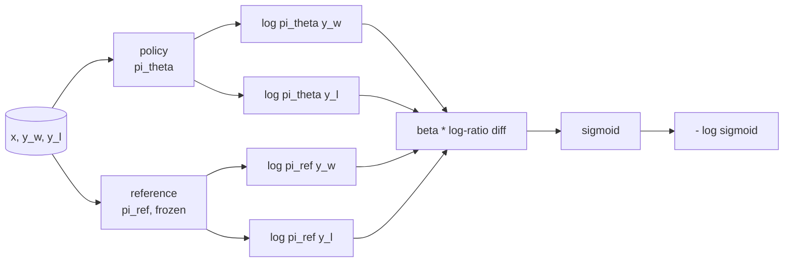
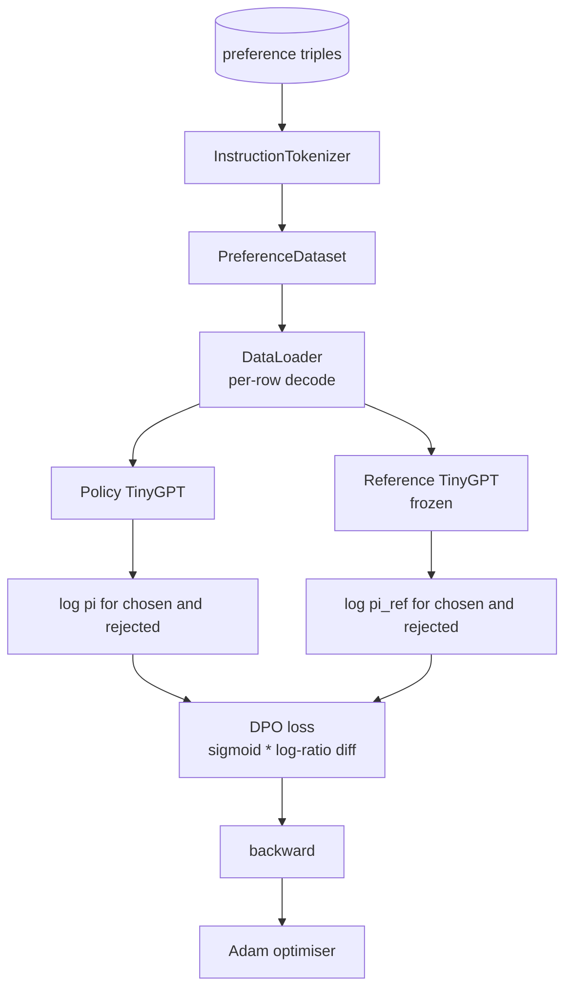

# Capstone Lesson 40: Direct Preference Optimization from Scratch

> Reward models và PPO là stack RLHF cổ điển. DPO thu gọn stack đó thành một hàm loss có giám sát duy nhất, khớp trực tiếp policy với các cặp ưu tiên (preference pairs). Bài học này dẫn xuất hàm loss DPO từ đẳng thức reward-difference, xây dựng một reference model và policy model hoạt động, tính toán log-probabilities trên mỗi token, và huấn luyện một transformer nhỏ trên tập dữ liệu ưu tiên gồm các completions được chọn và bị từ chối. Các bài kiểm tra sẽ xác nhận toán học của hàm loss và hướng gradient để đảm bảo cài đặt khớp với bài báo gốc.

**Type:** Build
**Languages:** Python (torch, numpy)
**Prerequisites:** Phase 19 lessons 30-37 (NLP LLM track: tokenizer, embedding table, attention block, transformer body, pre-training loop, checkpointing, generation, perplexity)
**Time:** ~90 minutes

## Learning Objectives

- Dẫn xuất hàm loss DPO dưới dạng sigmoid trên hiệu số log-ratio đã được scale và kết nối nó với reward ẩn (implicit reward).
- Xây dựng cặp reference model + policy model với reference bị đóng băng (frozen) và policy có thể huấn luyện.
- Tính toán log-probabilities ở cấp độ chuỗi cho cả hai mô hình, thực hiện masking các token prompt.
- Huấn luyện policy trên các bộ ba `(prompt, chosen, rejected)` và quan sát log-prob của lựa chọn được chọn tăng lên so với lựa chọn bị từ chối.
- Kiểm chứng hành vi bằng các bài test về toán học của hàm loss, dấu của gradient và tính bất biến của reference.

## The Problem

Bạn có một SFT model. Nó tuân theo hướng dẫn, nhưng đầu ra không đồng đều; một số completion rõ ràng, một số khác lại dài dòng hoặc sai lệch. Bạn cũng có một tập dữ liệu nhỏ gồm các cặp ưu tiên: với cùng một prompt, con người đánh dấu một completion là "được chọn" (chosen) và cái còn lại là "bị từ chối" (rejected).

Câu trả lời của RLHF cổ điển là một pipeline hai giai đoạn. Huấn luyện một reward model dựa trên các ưu tiên. Tối ưu hóa policy dựa trên reward đó bằng PPO. Cách này hiệu quả nhưng tốn kém: hai mô hình trong bộ nhớ trong quá trình PPO, cần kiểm soát KL để giữ policy gần với reference, và hiện tượng reward hacking khi reward model không ổn định.

DPO thay thế cả hai giai đoạn bằng một hàm loss có giám sát duy nhất. Reward model không bao giờ tồn tại một cách tường minh. Policy được huấn luyện trực tiếp trên các cặp ưu tiên, với một hình phạt KL tường minh đối với SFT reference. Cùng một nghiệm tối ưu theo mô hình ưu tiên Bradley-Terry, nhưng ít code hơn nhiều.

## The Concept

Bắt đầu từ mô hình Bradley-Terry. Với một prompt `x` và hai completion `y_w` (được chọn) và `y_l` (bị từ chối), xác suất con người ưu tiên `y_w` là

```text
P(y_w > y_l | x) = sigmoid( r(x, y_w) - r(x, y_l) )
```

trong đó `r` là một hàm reward tiềm ẩn. RLHF trước tiên khớp `r` từ các ưu tiên, sau đó huấn luyện một policy `pi` để tối đa hóa `r` với một neo KL:

```text
max_pi   E_{x, y~pi} [ r(x, y) ] - beta * KL(pi || pi_ref)
```

Dẫn xuất của DPO quan sát thấy rằng policy tối ưu `pi*` theo mục tiêu này có dạng đóng dựa trên `r`:

```text
pi*(y | x) = (1/Z(x)) * pi_ref(y | x) * exp( r(x, y) / beta )
```

Sắp xếp lại cho `r`:

```text
r(x, y) = beta * ( log pi*(y | x) - log pi_ref(y | x) ) + beta * log Z(x)
```

Số hạng `log Z(x)` là như nhau cho cả `y_w` và `y_l` (nó phụ thuộc vào `x`, không phải `y`), vì vậy nó triệt tiêu khi bạn tính hiệu số ưu tiên:

```text
r(x, y_w) - r(x, y_l) = beta * ( log pi_theta(y_w|x) - log pi_ref(y_w|x)
                                - log pi_theta(y_l|x) + log pi_ref(y_l|x) )
```

Thay vào hàm sigmoid Bradley-Terry và lấy negative log likelihood trên các cặp ưu tiên:

```text
L_DPO(theta) = - E_{(x, y_w, y_l)} [
  log sigmoid( beta * ( log pi_theta(y_w|x) - log pi_ref(y_w|x)
                       - log pi_theta(y_l|x) + log pi_ref(y_l|x) ) )
]
```

Đây chính là hàm loss. Nó là một hàm sigmoid trên một scalar duy nhất cho mỗi ví dụ, được tính từ bốn log-probabilities. Không cần reward model riêng biệt. Không PPO. Không có số hạng KL trong hàm loss; ràng buộc KL đã được tích hợp vào dẫn xuất dạng đóng.



## The Sign of the Gradient

Một bước kiểm tra nhanh hữu ích trước khi chạy huấn luyện. Lấy gradient đối với `log pi_theta(y_w | x)`:

```text
d L_DPO / d log pi_theta(y_w | x) = - beta * (1 - sigmoid(z))
```

trong đó `z` là đối số của hàm sigmoid. Giá trị này âm với mọi `z`, nghĩa là: tăng log-probability của policy đối với completion được chọn sẽ làm giảm hàm loss. Tương tự, gradient đối với `log pi_theta(y_l | x)` là dương: tăng log-probability của completion bị từ chối sẽ làm tăng hàm loss. Quá trình huấn luyện đẩy giá trị của lựa chọn được chọn lên và giá trị của lựa chọn bị từ chối xuống. Reference bị đóng băng; nó không thay đổi.

## The Data

Mười hai bộ ba ưu tiên được cung cấp kèm theo bài học. Mỗi bộ là `(prompt, chosen, rejected)`. Completion được chọn ngắn gọn và chính xác. Completion bị từ chối thì dài dòng, lạc đề hoặc sai. Các cặp này bao phủ cùng các nhóm tác vụ như bài học 39 (viết hoa, số học, danh sách) để một policy bắt đầu từ SFT base có điểm khởi đầu hợp lý.

Tập dữ liệu này cố tình được làm nhỏ. DPO hoạt động trên hàng chục nghìn cặp trong thực tế; ở đây, mục đích là để toán học của hàm loss và vòng lặp chạy end-to-end trên một tập dữ liệu nhỏ và khoảng cách log-prob giữa lựa chọn được chọn và bị từ chối tăng lên rõ rệt.

## Reference Invariance

Việc cài đặt DPO phải xử lý reference model một cách cẩn thận. Reference là SFT model được đóng băng tại chỗ. Ba thuộc tính phải được đảm bảo:

- Các tham số của reference không bao giờ nhận gradient.
- Log-probabilities của reference không bao giờ thay đổi giữa các epoch.
- Policy bắt đầu từ cùng trọng số với reference. (Giá trị `theta` tối ưu là reference cộng với một cập nhật đã học; khởi tạo policy như một bản sao của reference là điểm bắt đầu được xác định rõ ràng.)

Việc cài đặt thực thi các điều này bằng cách:

- Bao bọc reference trong `torch.no_grad()` trong các forward pass.
- Thiết lập `requires_grad=False` trên mọi tham số của reference.
- Xây dựng policy thông qua `policy.load_state_dict(reference.state_dict())` sau khi reference đã được xây dựng.

```figure
cap-dpo-preference
```

## Architecture



Mô hình là TinyGPT tương tự như trong bài học 39 (decoder-only, causal, byte tokenizer). Reference và policy chia sẻ kiến trúc; trọng số của policy lệch khỏi reference trong quá trình huấn luyện trong khi reference vẫn cố định.

## What you will build

Việc cài đặt bao gồm một `main.py` và các bài test.

1. `InstructionTokenizer`: byte tokenizer với các ký tự đặc biệt `INST` và `RESP`. Cấu trúc giống bài học 39.
2. `TinyGPT`: decoder-only transformer. Cấu trúc giống bài học 39 để bài học có thể tự hoàn thiện ngay cả khi bạn bỏ qua bài 39.
3. `make_preferences`: trả về mười hai bộ ba `(prompt, chosen, rejected)`.
4. `sequence_log_prob`: với mô hình, một prompt prefix và một completion, trả về tổng log-probabilities của các token tiếp theo trên completion (không tính phần prompt).
5. `dpo_loss`: nhận bốn log-probabilities và `beta`, trả về tensor loss cho mỗi ví dụ và delta reward ẩn để ghi log.
6. `train_dpo`: vòng lặp mỗi epoch tính toán log-probs của lựa chọn được chọn và bị từ chối dưới policy và reference, áp dụng hàm loss và thực hiện bước Adam.
7. `evaluate_margins`: trả về biên độ log-probability trung bình giữa lựa chọn được chọn và bị từ chối dưới policy tại bất kỳ thời điểm nào.
8. `run_demo`: xây dựng reference và policy từ một quá trình pretrain nhỏ, sao chép trọng số, huấn luyện trong 30 bước, in ra loss và biên độ mỗi bước, và thoát với mã 0 khi thành công.

## Why DPO works

DPO tương đương về mặt toán học với RLHF theo mô hình ưu tiên Bradley-Terry, xét đến tham số hóa của reward. Reward ẩn `r(x, y) = beta * (log pi(y|x) - log pi_ref(y|x))` có thể xác định được từ các ưu tiên cho đến một hàm của `x`, vốn sẽ triệt tiêu trong hiệu số. Policy dạng đóng cho phép bạn bỏ qua reward model tường minh. Ràng buộc KL được thực thi về mặt cấu trúc: bất kỳ sự sai lệch nào của `pi` so với `pi_ref` đều làm cho log-ratio lớn hơn, và hàm sigmoid bão hòa, giúp giảm gradient khi policy di chuyển quá xa. Reference chính là lưới an toàn của bạn.

## Stretch goals

- Thêm chuẩn hóa độ dài (length normalisation) vào tổng log-probability: chia cho độ dài của completion. Thiên kiến độ dài (length bias) là một chế độ lỗi đã biết của DPO, nơi mô hình ưu tiên chọn các completion ngắn hơn vì log-probabilities của chúng lớn hơn về giá trị tuyệt đối.
- Thêm biến thể IPO của hàm loss: thay thế sigmoid + log bằng `(z - 1)^2`. So sánh sự hội tụ trên tập dữ liệu.
- Thêm tham số label-smoothing để nội suy giữa nhãn cứng (được chọn/bị từ chối) và nhãn đồng nhất 0.5.
- Thay thế reference bằng một mô hình nhỏ hơn, rẻ hơn (theo hướng knowledge distillation).

Việc cài đặt cung cấp cho bạn hàm loss, tính bất biến của reference và vòng lặp huấn luyện. Toán học chính là bài học. Code giúp toán học trở nên cụ thể.