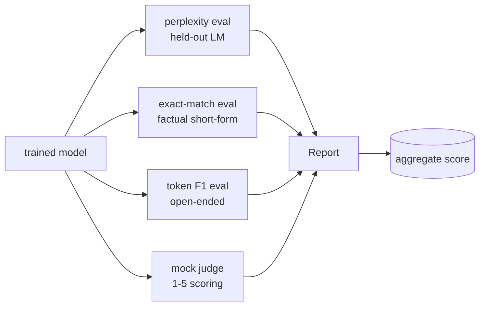
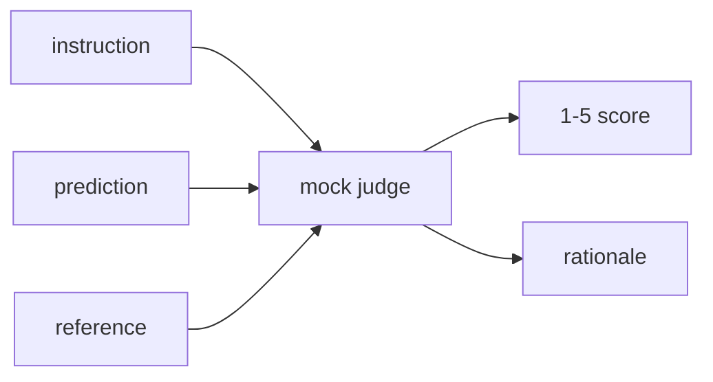
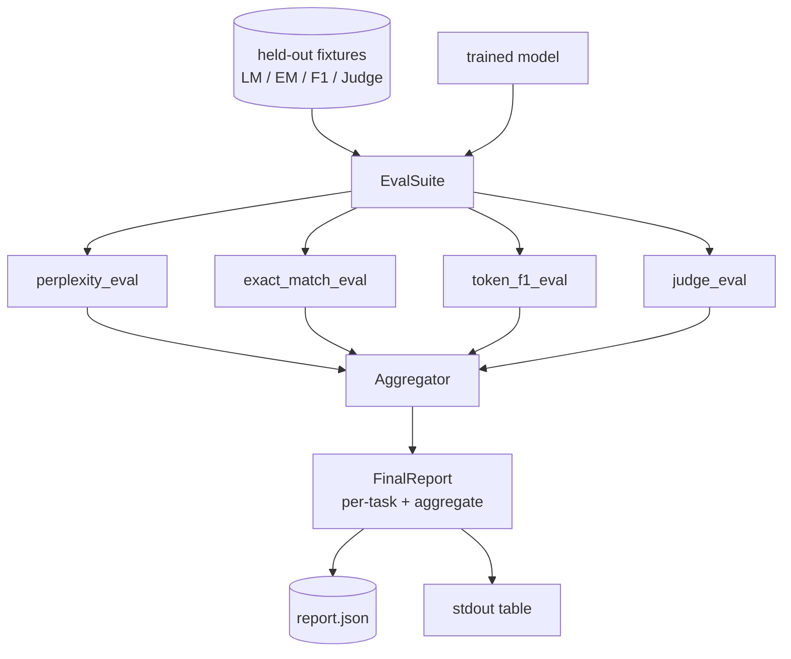

# Capstone Lesson 41: Full Evaluation Pipeline

> Training là phần bạn có thể theo dõi bằng các đường cong loss. Evaluation là phần bạn phải tự thiết kế. Bài học này xây dựng một pipeline đánh giá thống nhất, nhận vào bất kỳ language model đã được huấn luyện nào, chạy bốn bài đánh giá không đồng nhất trên đó, tổng hợp kết quả thành báo cáo theo từng tác vụ và triển khai một LLM-as-judge giả lập cục bộ để vòng lặp chạy mà không cần mạng. Bốn bài đánh giá này bao gồm các khía cạnh mà mọi mô hình triển khai thực tế đều cần: language modelling (perplexity), độ chính xác dạng ngắn (exact-match), độ tương đồng dạng mở (token F1) và chấm điểm định tính (judge).

**Type:** Build
**Languages:** Python (torch, numpy)
**Prerequisites:** Phase 19 lessons 30-37 (NLP LLM track: tokenizer, embedding table, attention block, transformer body, pre-training loop, checkpointing, generation, perplexity)
**Time:** ~90 minutes

## Learning Objectives

- Tính toán perplexity trên tập held-out với việc tính toán masked-token trên một transformer nhỏ.
- Chạy đánh giá exact-match trên các prompt thực tế dạng ngắn.
- Tính toán token-level F1 giữa chuỗi dự đoán và chuỗi tham chiếu với quá trình chuẩn hóa.
- Xây dựng một LLM-as-judge giả lập cục bộ để chấm điểm đầu ra của mô hình trên thang điểm 1-5.
- Tổng hợp bốn bài đánh giá thành một báo cáo có trọng số duy nhất với phân tích chi tiết theo từng tác vụ.

## The Problem

Một metric đơn lẻ không bao giờ mô tả đầy đủ một language model. Perplexity cho biết mô hình khớp với phân phối ngôn ngữ tốt như thế nào nhưng không nói lên việc nó có trả lời câu hỏi hay không. Exact-match cho biết liệu mô hình có tạo ra chuỗi chính xác hay không nhưng lại phạt các cách diễn đạt lại (paraphrase) đúng. Token F1 tha thứ cho việc diễn đạt lại nhưng lại bị đánh lừa bởi sự trùng lặp từ vựng với nội dung sai. LLM-as-judge nắm bắt được các khía cạnh định tính nhưng lại đắt đỏ và mang tính ngẫu nhiên.

Pipeline mà bạn thực sự cần phải có cả bốn. Mỗi bài đánh giá bao gồm một khía cạnh mà các bài khác bỏ lỡ. Mỗi bài chạy trên một tập dữ liệu held-out khác nhau được định hình cho metric đó. Báo cáo cuối cùng hiển thị các con số theo từng tác vụ cạnh nhau và một giá trị tổng hợp, để người đánh giá có thể nhìn thấy ngay lập tức mô hình đang thực hiện các đánh đổi nào.

Bài học này xây dựng pipeline đó, từ đầu đến cuối, trong một file duy nhất.

## The Concept



Mỗi bài đánh giá là một hàm từ `(model, dataset) -> EvalResult`. Kết quả mang theo giá trị metric, chi tiết từng ví dụ để kiểm tra và tên cho phần tổng hợp. Pipeline kết hợp chúng với một cấu hình cho biết bài đánh giá nào cần chạy và cách gán trọng số cho chúng.

## Perplexity, properly counted

Perplexity là `exp(mean negative log-likelihood per token)`. Việc triển khai có hai cái bẫy:

- Giá trị trung bình phải được tính trên các vị trí token thực tế, không phải trên batch * sequence. Các token padding phải được loại trừ khỏi mẫu số, nếu không perplexity sẽ trông tốt hơn thực tế.
- Mô hình dự đoán token tiếp theo, vì vậy logits tại vị trí `i` dự đoán token tại vị trí `i+1`. Các lỗi lệch một vị trí (off-by-one) ở đây thường không gây lỗi runtime: loss vẫn huấn luyện được, nhưng metric trở nên vô nghĩa.

Bài đánh giá tính tổng theo batch của `-log p(token)` trên các vị trí không phải pad và đếm số lượng token theo batch, sau đó chia ở bước cuối cùng. Cách này an toàn hơn về mặt số học so với việc lấy trung bình perplexity theo từng batch (vốn làm giảm trọng số của các chuỗi ngắn) và khớp với định nghĩa trong sách giáo khoa.

## Exact-match, with normalisation

Harness sẽ chuẩn hóa cả dự đoán và tham chiếu trước khi so sánh:

- Chuyển về chữ thường.
- Loại bỏ khoảng trắng thừa xung quanh.
- Thu gọn các khoảng trắng liên tiếp bên trong thành một khoảng trắng duy nhất.
- Loại bỏ dấu câu kết thúc (`.`, `!`, `?`) nếu cả hai bên chỉ khác nhau về dấu câu.

Việc chuẩn hóa làm cho exact-match trở nên hữu ích trong thực tế. Một mô hình trả lời `"Paris"` là đúng; một mô hình trả lời `"Paris."` cũng đúng; một mô hình trả lời `"  paris  "` cũng đúng. Metric vẫn yêu cầu câu trả lời phải là cùng một chuỗi sau khi chuẩn hóa.

## Token F1, the right way

Token F1 là trung bình điều hòa của precision và recall được tính trên tập hợp các token (bag-of-tokens). Các bước:

1. Chuẩn hóa dự đoán và tham chiếu (các quy tắc giống như exact-match).
2. Tách mỗi chuỗi thành một danh sách các token (tách theo khoảng trắng).
3. Đếm phần giao của đa tập hợp (multiset intersection).
4. Precision = `intersection_count / len(pred_tokens)`. Recall = `intersection_count / len(ref_tokens)`. F1 = trung bình điều hòa.

Nếu cả dự đoán và tham chiếu đều trống, F1 là 1 (khớp rỗng). Nếu chỉ một trong hai trống, F1 là 0. Mô hình này khớp với tài liệu tham khảo đánh giá SQuAD và tạo ra các con số ổn định qua các cách diễn đạt lại.

## Local Mock LLM-as-Judge

Một judge thực thụ là một mô hình tiên phong (frontier model) nằm sau một API. Đối với bài học này, judge phải chạy offline. Mock judge là một bộ chấm điểm tất định (deterministic) nhận vào một hướng dẫn, dự đoán của mô hình và tham chiếu, sau đó trả về điểm số trong `{1, 2, 3, 4, 5}` cùng với một dòng lý do. Các quy tắc chấm điểm rất rõ ràng:

- 5 nếu dự đoán đã chuẩn hóa bằng với tham chiếu đã chuẩn hóa.
- 4 nếu token F1 giữa dự đoán và tham chiếu ít nhất là 0.8.
- 3 nếu token F1 nằm trong `[0.5, 0.8)`.
- 2 nếu token F1 nằm trong `[0.2, 0.5)`.
- 1 trong các trường hợp còn lại.

Đây không phải là một judge thực thụ, nhưng nó có giao diện đúng. Hãy thay thế bằng một mô hình thực tế sau này bằng cách thay đổi một hàm. Pipeline không quan tâm đến điều đó.



## Aggregation

Giá trị tổng hợp là trung bình có trọng số của các điểm số đánh giá đã chuẩn hóa. Mỗi bài đánh giá báo cáo con số của riêng nó trong `[0, 1]`:

- Perplexity: chuẩn hóa thành `1 / (1 + log(perplexity))`. Perplexity bằng 1 ánh xạ tới 1, vô cùng ánh xạ tới 0.
- Exact-match: đã nằm trong `[0, 1]`.
- Token F1: đã nằm trong `[0, 1]`.
- Judge: chia cho 5.

Trọng số có thể cấu hình được. Tỷ lệ mặc định là 0.2 perplexity, 0.3 exact-match, 0.3 token F1, 0.2 judge. Việc lựa chọn trọng số là một quyết định về sản phẩm; bài học cung cấp nút điều chỉnh để bạn có thể thử nghiệm.

```figure
cg-eval-quadrant
```

## Architecture



`EvalSuite` là một bộ điều phối mỏng. Mỗi bài đánh giá riêng lẻ là một hàm tự do nhận vào `(model, tokenizer, dataset, config)` và trả về một `EvalResult`. `Aggregator` thu thập kết quả và tạo ra báo cáo cuối cùng. Bản demo in bảng và ghi một bản sao JSON để CI hạ nguồn có thể tiếp nhận.

## What you will build

Việc triển khai bao gồm một `main.py` cộng với các bài kiểm tra.

1. `TinyGPT`: cùng kiến trúc decoder-only được sử dụng trong các bài 38-40, được bao gồm để bài học có thể đứng độc lập.
2. `InstructionTokenizer`: byte tokenizer với các token đặc biệt INST / RESP / PAD.
3. Bốn bộ dữ liệu mẫu (fixtures): một corpus LM, một tập EM, một tập F1 và một tập judge. Mỗi tập 20 ví dụ, tất định.
4. `perplexity_eval`: trả về `EvalResult` với giá trị perplexity và biểu đồ histogram loss theo từng token.
5. `exact_match_eval`: trả về EM trung bình và các bản ghi theo từng ví dụ.
6. `token_f1_eval`: trả về token F1 trung bình và các bản ghi theo từng ví dụ.
7. `mock_judge` và `judge_eval`: điểm số và lý do theo từng ví dụ, điểm trung bình trên toàn tập.
8. `Aggregator.normalise`: quy tắc chuẩn hóa theo từng bài đánh giá.
9. `Aggregator.aggregate`: trung bình có trọng số và báo cáo đã tập hợp.
10. `run_demo`: huấn luyện nhanh một mô hình nhỏ, chạy cả bốn bài đánh giá, in bảng báo cáo, ghi file JSON và thoát với mã 0 khi thành công.

## Reading the report

Báo cáo có ba lớp. Trên cùng là điểm tổng hợp. Bên dưới là bốn con số theo từng bài đánh giá. Bên dưới nữa là phân tích chi tiết theo từng ví dụ để chẩn đoán. Một lần chạy CI thất bại thường cần điểm tổng hợp, nhưng người đánh giá đang truy vết một sự suy giảm (regression) sẽ cần phân tích chi tiết theo từng ví dụ để xem mô hình đã sai ở những đầu vào nào.

File JSON dump sử dụng các khóa ổn định để dashboard CI có thể vẽ các đường xu hướng qua các phiên bản. Bảng được định dạng đẹp mắt dành cho con người nhìn vào terminal sau khi chạy huấn luyện.

## Stretch goals

- Thêm bài đánh giá hiệu chuẩn (calibration eval): liệu xác suất softmax của mô hình có khớp với độ chính xác của nó không? Phân nhóm các dự đoán theo độ tin cậy và báo cáo độ chính xác thực nghiệm trên mỗi nhóm.
- Thêm bài đánh giá độ bền vững (robustness eval): gắn thẻ mỗi ví dụ với một nhiễu (lỗi chính tả, diễn đạt lại, yếu tố gây nhiễu) và báo cáo mức giảm metric trên mỗi nhiễu.
- Thay thế mock judge bằng một mô hình thực tế thông qua gọi HTTP. Chữ ký hàm không thay đổi.
- Thêm tính năng học trọng số theo tác vụ: thay vì trọng số cố định, hãy khớp trọng số với thứ tự ưu tiên mục tiêu giữa các mô hình.

Việc triển khai cung cấp cho bạn bốn bài đánh giá, bộ tổng hợp và báo cáo. Các pipeline đánh giá thực tế xếp chồng nhiều khía cạnh hơn lên trên; mô hình vẫn giữ nguyên: một hàm cho mỗi bài đánh giá, một bộ tổng hợp, một báo cáo.