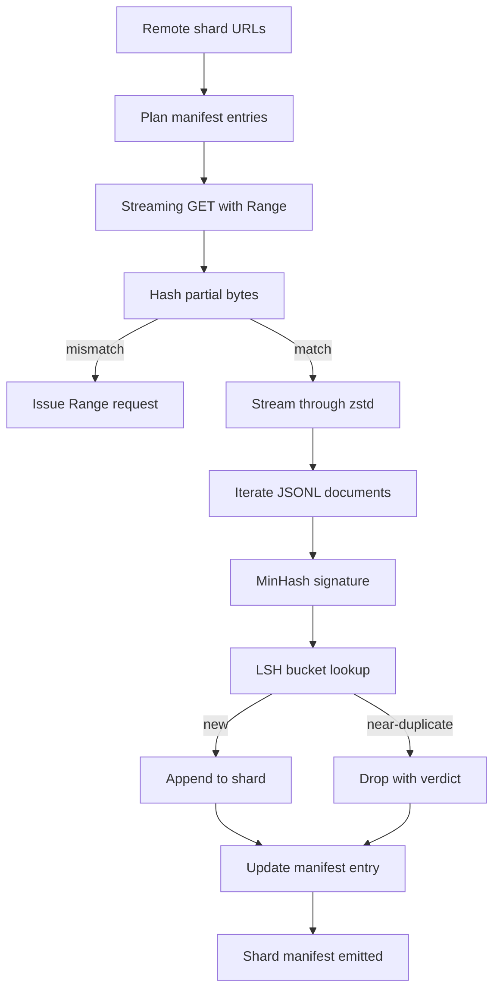

# Large Corpus Downloader

> Việc huấn luyện một mô hình ngôn ngữ bắt đầu từ rất lâu trước khi lượt forward pass đầu tiên diễn ra. Corpus phải được lưu trữ trên đĩa, giải nén, khử trùng lặp (deduplicated) và có thể truy cập được, với quy trình resume (tiếp tục tải) đã được thiết lập sẵn trước khi mạng bị rớt ở mức 4 phần trăm. Bài học này xây dựng một trình tải xuống dạng streaming giúp kéo các shard nén, giải nén ngay lập tức (on-the-fly) với Zstandard, tạo dấu vân tay cho các tài liệu gần giống nhau thông qua MinHash kết hợp với locality-sensitive hashing, và ghi lại một shard manifest mà các phần còn lại của pipeline có thể tin tưởng.

**Type:** Build
**Languages:** Python
**Prerequisites:** Phase 19 lessons 30-37
**Time:** ~90 minutes

## Learning Objectives

- Stream các shard từ xa với `urllib` và giải nén với `zstandard` mà không cần lưu toàn bộ tệp vào bộ nhớ đệm.
- Resume các lượt tải xuống dang dở bằng cách gửi các yêu cầu HTTP `Range` dựa trên một byte offset đã được xác minh.
- Xây dựng chữ ký MinHash cho mỗi tài liệu và phân nhóm nó với LSH để các tài liệu gần giống nhau va chạm (collide) với nhau.
- Xuất ra một shard manifest bao gồm mã băm nội dung, kích thước byte, số lượng tài liệu và kết quả khử trùng lặp.

## The Problem

Lần đầu tiên bạn huấn luyện trên một corpus 200 GB, mạng bị rớt ở mức 41 phần trăm và script thoát với một ngoại lệ `urllib`. Lần thứ hai, nó rớt ở mức 78 phần trăm. Đến mức 99 phần trăm, bạn đã viết lại vòng lặp ba lần. Hai lỗi mà bạn phải thiết kế để xử lý ngay từ phút đầu tiên là resume khi tải xuống dang dở và loại bỏ tài liệu trùng lặp. Cả hai đều có các giải pháp nổi tiếng; cả hai đều thường xuyên bị bỏ qua vì pipeline bắt đầu như một lệnh `requests.get` một dòng rồi dần trở nên phức tạp.

Resume là một vấn đề của HTTP. Server phải hỗ trợ `Range`, client phải theo dõi offset đã xác minh so với bản ghi trên đĩa, và offset đã xác minh đó phải tồn tại sau khi tiến trình bị ngắt. Nếu offset và tệp lệch nhau dù chỉ một byte, lượt tải xuống được resume sẽ ghi dữ liệu rác và corpus bị hỏng theo cách chỉ xuất hiện trong quá trình tokenization.

Deduplication là một vấn đề về chữ ký. Khử trùng lặp bằng mã băm chính xác (exact-hash) sẽ bỏ lỡ các tài liệu gần giống nhau: cùng một bài viết Wikipedia xuất hiện với ba phần chân trang khác nhau, cùng một tệp mã nguồn với tiêu đề bản quyền khác nhau, cùng một bài blog với tham số theo dõi trên mỗi liên kết. MinHash kết hợp với LSH bắt được những trường hợp này với chi phí dưới tuyến tính. Chi phí là một chữ ký cho mỗi tài liệu và một lần tra cứu bucket cho mỗi chữ ký.

## The Concept



### Streaming với `urllib`

Thư viện tiêu chuẩn `urllib.request.urlopen` trả về một đối tượng giống tệp (file-like object). Hãy bao bọc nó trong một `zstandard.ZstdDecompressor().stream_reader` và các byte sẽ chảy từ mạng qua bộ giải nén vào trình lặp tài liệu mà không bao giờ cần nạp toàn bộ shard nén hoặc shard đã giải nén vào bộ nhớ. Chi phí bộ nhớ duy nhất là bộ đệm dòng, chữ ký MinHash cho tài liệu hiện tại và chỉ mục LSH.

### Resume với `Range`

Trình tải xuống ghi hai tệp cho mỗi shard: bản thân shard đó và một checkpoint `.partial.json`. Checkpoint ghi lại `verified_bytes`, `expected_size`, `sha256_prefix` (được tính toán trên `verified_bytes` byte đầu tiên) và URL nguồn. Khi khởi động, trình tải xuống đọc checkpoint, tính toán lại `sha256_prefix` trên các byte đã có trên đĩa và chỉ resume nếu mã băm tính toán lại khớp. Nếu mã băm sai, phần dữ liệu dang dở sẽ bị loại bỏ và quá trình tải xuống bắt đầu lại từ byte số 0. Sự hỏng hóc âm thầm là không thể xảy ra vì các byte đã xác minh được kiểm tra, không phải giả định.

### MinHash cộng với LSH

MinHash ước tính độ tương đồng Jaccard của hai tập hợp trong không gian cố định. Đối với một tài liệu, tập hợp đó là các shingle (n-gram chồng lấp) của văn bản. Chữ ký là `k` giá trị băm tối thiểu, mỗi giá trị cho một hàm băm độc lập. Hai tài liệu có độ tương đồng Jaccard `s` có xác suất `s` đồng ý trên bất kỳ thành phần đơn lẻ nào của chữ ký.

LSH sau đó nhóm `k` thành phần thành `b` dải (band), mỗi dải có `r` hàng, trong đó `k = b * r`. Hai tài liệu va chạm trong ít nhất một dải với xác suất `1 - (1 - s^r)^b`, đây là một ngưỡng sắc nét xung quanh giá trị `s` mà bạn điều chỉnh `(b, r)`. Ngưỡng cho việc khử trùng lặp corpus điển hình là `s = 0.8`, mà tài liệu nghiên cứu LSH đạt được với `k = 128`, `b = 32`, `r = 4`.

### Shard manifest như một hợp đồng

Đầu ra bền vững duy nhất của trình tải xuống là manifest. Manifest lưu giữ, cho mỗi shard, URL, số lượng byte đã giải nén, số lượng tài liệu, số lượng tài liệu duy nhất sau khi khử trùng lặp và sha256 của tệp shard cuối cùng. Quá trình tokenization ở hạ nguồn đọc manifest, không phải danh sách thư mục. Nếu một shard bị thiếu hoặc sha256 của nó sai, manifest sẽ yêu cầu giai đoạn tiếp theo từ chối khởi chạy. Manifest là ranh giới quyết định giữa "dữ liệu đã được tải xuống" và "dữ liệu đã được tải xuống và có thể xác minh".

```figure
cap-corpus-downloader
```

## Build It

`code/main.py` triển khai:

- `ShardPlanner` - đọc danh sách các URL shard và tạo ra các mục manifest dự kiến.
- `StreamingDownloader` - mở một luồng `urllib` với `Range` tùy chọn, ghi vào một tệp tạm thời, cập nhật checkpoint `.partial.json` trên mỗi chunk và xác minh tiền tố sha256 khi resume.
- `ZstdDocIterator` - bao bọc luồng giống tệp trong `zstandard.ZstdDecompressor` và trả về một tài liệu mỗi dòng.
- `MinHasher` - tạo chữ ký `k` thành phần cho một chuỗi sử dụng một họ hạt giống băm cố định.
- `LSHIndex` - phân nhóm các chữ ký theo dải và báo cáo các va chạm.
- `Dedup` - kết hợp bộ băm và chỉ mục để gắn nhãn mỗi tài liệu là `keep` hoặc `near_duplicate` cùng với id shard khớp.
- `ManifestWriter` - thu thập số liệu thống kê cho mỗi shard và ghi `manifest.json`.

Một bản demo ở cuối tệp xây dựng một corpus tổng hợp nhỏ trên đĩa, nén nó với `zstandard`, tải xuống qua URL `file://`, khử trùng lặp và in ra manifest.

Chạy nó:

```bash
python3 code/main.py
```

Script thoát với mã 0 và in ra bản tóm tắt manifest.

## Production Patterns

Bốn mô hình giúp mở rộng bài học này cho các corpus thực tế.

**Checkpoint trước khi ghi.** `.partial.json` phải được `fsync` trước khi các byte được thêm vào shard. Nếu không, mất điện sẽ đảo ngược thứ tự: byte shard trên đĩa, checkpoint không có chúng, lần resume tiếp theo tin rằng nó có ít byte đã xác minh hơn thực tế, các byte hậu tố trùng lặp làm hỏng tệp. Checkpoint trước, sau đó mới ghi. Đây là kỷ luật tương tự như write-ahead log.

**Chỉ mục LSH được phân mảnh (Sharded LSH index).** Một chỉ mục LSH duy nhất trên toàn bộ corpus không vừa với RAM ở quy mô 200 GB. Hãy phân vùng chỉ mục LSH theo mã băm dải đầu tiên, lưu trữ các phân vùng trên đĩa và chỉ tham vấn phân vùng mà một chữ ký mới sẽ rơi vào. Chi phí là một lần đọc đĩa bổ sung cho mỗi tài liệu; lợi ích là chỉ mục LSH không còn là giới hạn bộ nhớ cứng nữa.

**Tombstone, không xóa.** Các bản sao bị loại bỏ được ghi lại trong manifest với phán quyết `near_duplicate` và id shard của tài liệu mà chúng va chạm. Việc xóa chúng sẽ làm mất liên kết giữa bản sao và bản gốc. Tombstoning bảo tồn dấu vết kiểm toán và cho phép một lượt xử lý ở hạ nguồn thay đổi quyết định về ngưỡng.

**sha256 cho mỗi shard trong manifest, cộng với một sha256 cho manifest.** Bản thân manifest cũng có một mã băm nội dung. Các giai đoạn hạ nguồn xác minh mã băm manifest trước khi chúng tin tưởng các mục cho mỗi shard. Nếu không có điều này, manifest là bề mặt tấn công âm thầm: một kẻ tấn công có thể chỉnh sửa một tệp duy nhất và làm hỏng toàn bộ pipeline.

## Use It

Các mô hình sản xuất:

- **Resume trên mỗi lần chạy CI.** Các runner CI là tạm thời. Trình tải xuống phải giả định một đĩa mới trên mỗi lần chạy và khôi phục từ bộ nhớ đệm hoặc từ xa. `--cache-dir` là một flag hạng nhất.
- **Khử trùng lặp trước khi tokenization.** Tokenization rất đắt đỏ. Chạy nó hai lần trên cùng một tài liệu là tốn gấp đôi chi phí cho cùng một đường cong mất mát. Khử trùng lặp nằm ở thượng nguồn của tokenization, không phải hạ nguồn.
- **Manifest như cổng hợp nhất (merge gate).** Lượt huấn luyện đọc sha256 của manifest từ một commit đã được ghim. Một phiên bản dataset mới yêu cầu một commit manifest mới. Liên kết giữa mã nguồn và dữ liệu là git, không phải truyền miệng.

## Ship It

`outputs/skill-corpus-downloader.md`, trong một dự án thực tế, sẽ mô tả các URL nào cung cấp cho trình tải xuống, thư mục checkpoint được bố trí như thế nào, độ rộng shingle và `(k, b, r)` mà quá trình khử trùng lặp sử dụng, và manifest nằm ở đâu trong hệ thống kiểm soát phiên bản. Bài học này cung cấp công cụ (engine).

## Exercises

1. Thêm flag `--shingle-width` và đo lường cách phán quyết khử trùng lặp thay đổi ở độ rộng 3, 5, 9. Bảo vệ lựa chọn mặc định.
2. Thêm hỗ trợ gzip bên cạnh zstd bằng cách nhận diện magic bytes. Trình tải xuống không nên yêu cầu người gọi chỉ định codec.
3. Thêm chế độ `--resume-only` từ chối bắt đầu tải xuống mới nếu không tìm thấy checkpoint. Hữu ích trong CI để ngăn một lần chạy vô tình tải lại 200 GB.
4. Di chuyển chỉ mục LSH sang tệp shelf hoặc sqlite và đo lường thông lượng so với biến thể trong bộ nhớ.
5. Thêm kiểm tra sha256 manifest khi khởi động. Trình tải xuống nên đóng lại nếu manifest trên đĩa không khớp với mã băm manifest trong `manifest.lock`.

## Key Terms

| Thuật ngữ | Cách mọi người nói | Ý nghĩa thực tế |
|------|-----------------|------------------------|
| Shard | "Một tệp" | Một lát cắt tự chứa của corpus với sha256 riêng, được sử dụng làm đơn vị để resume và khử trùng lặp |
| Chữ ký MinHash | "Dấu vân tay" | Một bản phác thảo `k` thành phần của một tập hợp, trong đó mỗi thành phần là giá trị tối thiểu của một hàm băm độc lập trên tập hợp |
| LSH band | "Bucket" | Một nhóm `r` thành phần chữ ký được sử dụng làm khóa bucket duy nhất để phát hiện va chạm |
| Verified bytes | "Resume offset" | Các byte trên đĩa có tiền tố sha256 khớp với checkpoint; offset an toàn duy nhất để resume |
| Manifest | "Chỉ mục" | Bản ghi bền vững duy nhất về những gì trình tải xuống đã tạo ra, bao gồm các mã băm nội dung |

## Further Reading

- [RFC 7233](https://datatracker.ietf.org/doc/html/rfc7233) - Yêu cầu HTTP Range, giao thức resume
- [Đặc tả định dạng Zstandard](https://datatracker.ietf.org/doc/html/rfc8478) - định dạng khung giúp việc giải nén streaming an toàn
- [MinHash](https://en.wikipedia.org/wiki/MinHash) - họ chữ ký mà bài học này sử dụng
- [Locality-sensitive hashing](https://en.wikipedia.org/wiki/Locality-sensitive_hashing) - lược đồ phân dải đằng sau ngưỡng khử trùng lặp
- Phase 19 · 43 - corpus đã token hóa HDF5 mà trình tải xuống cung cấp
- Phase 19 · 44 - lịch trình cosine huấn luyện trên corpus
- Phase 19 · 45 - vòng lặp AMP tiêu thụ lịch trình đó