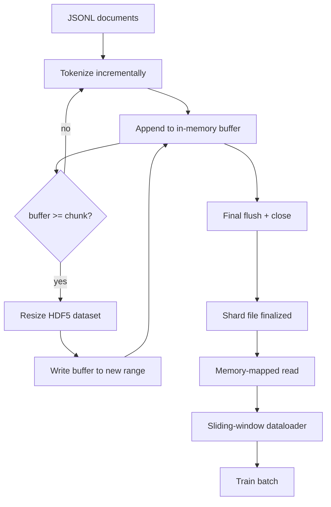

# HDF5 Tokenized Corpus

> Corpus đã tải xuống cần được sắp xếp theo bố cục mà trình huấn luyện (trainer) có thể truyền phát (stream) ở tốc độ đường truyền. JSONL trên đĩa không thể chịu tải được 16 worker của dataloader. HDF5 với tập dữ liệu số nguyên có thể thay đổi kích thước và chia thành các chunk (khối) thì có thể. Bài học này xây dựng quá trình token hóa truyền phát vào một tập dữ liệu HDF5 có thể thay đổi kích thước, ghi phân mảnh (shard) trên nhiều tệp, đọc bằng ánh xạ bộ nhớ (memory-mapped) tại thời điểm huấn luyện, và một dataloader cửa sổ trượt (sliding-window) tạo ra các chuỗi có độ dài cố định với quy tắc đóng gói (packing) phù hợp.

**Type:** Build
**Languages:** Python
**Prerequisites:** Phase 19 lessons 30-37
**Time:** ~90 phút

## Mục tiêu học tập

- Truyền phát các tài liệu vào một tập dữ liệu số nguyên HDF5 có thể thay đổi kích thước với cơ chế chia chunk xác định.
- Ghi phân mảnh trên nhiều tệp HDF5 để giới hạn lỗi và cho phép thực hiện song song.
- Đọc lại các token thông qua bố cục chunk được hỗ trợ bởi page-cache của HDF5, giúp dataloader chỉ sao chép vào bộ đệm batch tại thời điểm cần thiết.
- Triển khai dataloader cửa sổ trượt để tạo ra các chuỗi huấn luyện có độ dài cố định với các quy tắc đóng gói rõ ràng.

## Vấn đề

Một quá trình huấn luyện mô hình ngôn ngữ hiện đại đọc hàng trăm nghìn mẫu token mỗi giây trên hàng chục worker. JSONL trên đĩa sẽ bị nghẽn ngay tại lỗi page fault đầu tiên khi cache lạnh: trình phân tích cú pháp JSON chậm, ranh giới tài liệu không thể truy cập trực tiếp, và việc tìm kiếm đến "mẫu 4.217.884" đòi hỏi phải quét toàn bộ tệp. Ngay cả Parquet, dù nén tốt, cũng không phù hợp vì trình huấn luyện không cần các cột; nó cần một luồng token phẳng với khả năng truy cập ngẫu nhiên O(1).

HDF5 phù hợp vì nó cung cấp một tập dữ liệu chỉ chứa số nguyên, có thể thay đổi kích thước và chia chunk, trong đó các chunk thân thiện với page-cache tại thời điểm đọc. Trình huấn luyện yêu cầu một lát cắt (slice) `tokens[3,200,000 : 3,200,8192]` và HDF5 sao chép hyperslab được yêu cầu từ page-cache vào một mảng NumPy mới được cấp phát. Chi phí chỉ là một handle tệp đang mở và dung lượng page-cache bằng kích thước chunk cho mỗi worker, điều này không đáng kể so với chi phí giải mã JSONL.

Vấn đề xây dựng nằm ở việc thực hiện ghi một cách chuẩn xác. Các tập dữ liệu có thể thay đổi kích thước rất dễ bị sử dụng sai: nếu ghi từng tài liệu một, tệp HDF5 sẽ bị phân mảnh đến mức không thể sử dụng được. Nếu ghi tất cả tài liệu trong một lần thay đổi kích thước, một tiến trình bị chết sẽ làm mất toàn bộ shard. Kỷ luật đúng đắn là đệm-rồi-mở rộng (buffer-then-extend), với kích thước bộ đệm khớp với kích thước chunk, và ghi phân mảnh để chia nhỏ khối lượng công việc trên các tệp sao cho một sự cố chỉ làm mất tối đa một shard.

## Khái niệm



### HDF5 có thể thay đổi kích thước đúng cách

Tập dữ liệu token được tạo với `maxshape=(None,)` và một `chunks=(chunk_size,)` cố định. Quá trình ghi được thực hiện bằng cách đệm các token vào một mảng NumPy có độ dài `chunk_size`. Khi bộ đệm đầy, tập dữ liệu được thay đổi kích thước chính xác thêm `chunk_size` và bộ đệm được ghi vào phạm vi mới. Khi kết thúc shard, bộ đệm còn dư sẽ được ghi vào một phạm vi cuối cùng. Mọi thao tác ghi đều liên tục và căn chỉnh theo chunk ngoại trừ lần cuối cùng, phần này sẽ được trình đọc cắt bỏ tại `token_count` đã ghi trong các thuộc tính HDF5 của shard.

### Ghi phân mảnh (Sharded write)

Một tệp HDF5 đơn lẻ là một điểm lỗi duy nhất. Pipeline ghi các shard song song: mỗi shard đầu vào từ Phase 19 lesson 42 tạo ra một shard đầu ra HDF5. Một chỉ mục `shards.json` ghi lại đường dẫn tệp, số lượng token, số lượng tài liệu và mã sha256 của các token cho mỗi shard. Trình huấn luyện đọc `shards.json` để tính toán các offset toàn cục và xác thực corpus.

### Đọc bằng ánh xạ bộ nhớ (Memory-mapped read)

Tại thời điểm huấn luyện, mỗi worker mở phần shard HDF5 của mình ở chế độ `swmr=True` và yêu cầu `tokens[start:stop]`. Bố cục chunk của HDF5 biến đây thành một thao tác đọc dựa trên page-cache khi chunk đã được tải vào bộ nhớ. Worker không bao giờ tải toàn bộ tệp vào bộ nhớ: lát cắt được sao chép vào bộ đệm batch của dataloader, sau đó dataloader sao chép vào tensor huấn luyện trong bộ nhớ pinned tại thời điểm batch. Đường dẫn nóng (hot path) chỉ có một syscall cho mỗi lần chuyển đổi chunk; mọi thứ khác đều là truy cập RAM.

### Dataloader cửa sổ trượt

Dataloader là giai đoạn duy nhất biết về độ dài chuỗi huấn luyện. Nó chọn một chỉ mục bắt đầu ngẫu nhiên trong luồng token toàn cục, đọc `window_size + 1` token và trả về `(input, target) = (tokens[:-1], tokens[1:])`. Ranh giới tài liệu không được thực thi: một cửa sổ có thể nằm vắt qua hai tài liệu, với một `boundary_token_id` rõ ràng ở giữa để mô hình học cách sử dụng dấu phân cách. Đây là quy tắc đóng gói tiêu chuẩn; đây cũng là quy tắc mà người mới bắt đầu thường quên, dẫn đến một corpus chứa 8% là token ranh giới huấn luyện và 92% là văn bản tự nhiên.

```figure
cc-hdf5-corpus
```

## Xây dựng

`code/main.py` triển khai:

- `Tokenizer` - một tokenizer cấp byte xác định đủ tốt cho bản demo. Giao diện là `encode(text) -> list[int]` và `vocab_size`.
- `HDF5ShardWriter` - mở một tập dữ liệu số nguyên có thể thay đổi kích thước, đệm các token theo kích thước chunk, thay đổi kích thước và ghi theo các bước có kích thước cố định, ghi lại `token_count` và `sha256` dưới dạng thuộc tính HDF5 khi đóng.
- `ShardedTokenizationPipeline` - lặp qua các tài liệu đầu vào, định tuyến chúng đến trình ghi và tạo ra một chỉ mục `shards.json`.
- `MmapTokenStore` - mở các tệp shard để đọc bằng ánh xạ bộ nhớ, tính toán các offset toàn cục, cung cấp một API `get_slice(start, stop)` duy nhất.
- `SlidingWindowDataloader` - chọn các cửa sổ ngẫu nhiên từ luồng toàn cục và trả về các mảng NumPy `(input_ids, target_ids)`.

Một bản demo ở cuối tệp xây dựng một corpus nhỏ trong bộ nhớ, token hóa thành hai shard, mở chúng qua ánh xạ bộ nhớ, chạy dataloader trong 10 batch, và in ra hình dạng (shape) của mỗi batch cùng với checksum.

Chạy nó:

```bash
python3 code/main.py
```

Script thoát với mã 0 và in ra các checksum của batch.

## Các mô hình sản xuất (Production Patterns)

Bốn mô hình giúp mở rộng bài học này cho một quá trình huấn luyện thực tế.

**Kích thước chunk bằng với kích thước đọc điển hình.** Trình huấn luyện đọc `window_size + 1` token mỗi mẫu. Hãy đặt chunk HDF5 là bội số của `window_size` để các thao tác đọc được căn chỉnh theo page-cache. Các chunk không khớp sẽ làm giảm một nửa thông lượng vì mỗi mẫu sẽ chạm vào hai chunk.

**Số lượng token nằm trong thuộc tính, không phải trong tập dữ liệu.** Lát cắt cuối cùng của tập dữ liệu có thể chỉ đầy một phần vì kích thước chunk không chia hết cho ranh giới tài liệu. Hãy lưu `token_count` thực tế dưới dạng thuộc tính HDF5 trên tập dữ liệu và yêu cầu trình đọc cắt bỏ tại giá trị đó. Nếu không, trình đọc sẽ đi quá giới hạn vào các token đệm bằng 0 và mô hình sẽ học cách dự đoán số 0.

**Sha256 phân mảnh với xác thực song song.** Mỗi shard có mã sha256 riêng cho các byte token. Trình huấn luyện có thể xác thực tất cả các shard song song trước khi bắt đầu huấn luyện. Một mã sha256 sai sẽ làm thất bại quá trình sớm, thay vì đợi đến epoch thứ ba sau mười sáu giờ.

**`swmr=True` ở cả hai phía, với `libver="latest"` trên trình ghi.** Chế độ Single-Writer-Multiple-Reader yêu cầu trình ghi mở bằng `libver="latest"`, tạo mọi tập dữ liệu ngay từ đầu, sau đó thiết lập `file.swmr_mode = True`. Sau đó, trình ghi phải gọi `dataset.flush()` sau mỗi lần thay đổi kích thước để các worker đọc (được mở bằng `swmr=True`) thấy dữ liệu nhất quán. Việc bỏ qua `libver="latest"` hoặc bật SWMR sau các thay đổi cấu trúc là nguyên nhân phổ biến gây ra lỗi "file is locked".

## Sử dụng

Các mô hình sản xuất:

- **Một HDF5 cho mỗi shard nguồn.** Trình tải xuống (lesson 42) tạo ra một shard cho mỗi URL; quá trình token hóa (bài học này) tạo ra một HDF5 cho mỗi shard nguồn. Ánh xạ 1:1 giúp việc khôi phục sau khi gián đoạn hoặc lỗi một phần trở nên đơn giản.
- **ID token ranh giới.** Token ranh giới là một phần của từ vựng tokenizer và là token duy nhất mà dataloader chèn vào. Hàm mất mát (loss) huấn luyện sẽ mask token ranh giới nếu mô hình được yêu cầu bỏ qua nó; nếu không, nó sẽ học cách sử dụng nó như một dấu phân cách chuỗi.
- **`shards.json` là nguồn sự thật.** Thêm một shard mới nghĩa là ghi tệp HDF5, tính toán sha256 của nó và thêm một mục vào chỉ mục. Trình huấn luyện đọc tệp một lần khi khởi động và không bao giờ chạm vào danh sách thư mục.

## Triển khai

`outputs/skill-hdf5-tokenized-corpus.md` trong một dự án thực tế sẽ mô tả tokenizer nào cung cấp dữ liệu cho pipeline, kích thước chunk nào khớp với cửa sổ của trình huấn luyện, `shards.json` nằm ở đâu trong hệ thống kiểm soát phiên bản, và các worker dataloader được phân mảnh trên các tệp như thế nào. Bài học này cung cấp bộ máy thực thi.

## Bài tập

1. Thêm cờ `--compression gzip` vào trình ghi HDF5 và đo lường chi phí thông lượng trên corpus demo. Biện luận cho giá trị mặc định đã chọn.
2. Thêm một seed xác định vào dataloader cửa sổ trượt và xác minh rằng hai lần chạy với cùng một seed tạo ra các batch giống hệt nhau.
3. Thêm chế độ `--validate` để đọc mọi shard, tính toán lại sha256 trên các token của nó và so sánh với `shards.json`. CI nên chạy kiểm tra này trước khi bắt đầu huấn luyện.
4. So sánh thông lượng dataloader ở các kích thước chunk bằng, bằng một nửa và gấp đôi kích thước cửa sổ. Báo cáo hiệu ứng page-cache.
5. Thêm cờ `--max-document-tokens` để cắt bỏ các tài liệu quá dài tại thời điểm ghi. Biện luận cho sự đánh đổi so với việc quyết định tại thời điểm đọc.

## Thuật ngữ chính

| Thuật ngữ | Cách gọi thông thường | Ý nghĩa thực tế |
|-----------|----------------------|------------------|
| Resizable dataset | "Chỉ ghi thêm" | Một tập dữ liệu HDF5 với `maxshape=(None,)` tăng trưởng thông qua các lệnh gọi `resize` theo các bước kích thước chunk |
| Chunked layout | "Cách HDF5 lưu trữ" | Các trang có kích thước cố định trên đĩa mà kernel có thể ánh xạ bộ nhớ và dataloader có thể đọc liên tục |
| `swmr` mode | "Đọc trong khi ghi" | Chế độ Single-Writer-Multiple-Reader cho phép các worker dataloader chia sẻ tệp một cách an toàn |
| Shard index | "shards.json" | Chỉ mục bền vững của tất cả các shard token với các offset và mã băm nội dung |
| Sliding window | "Mẫu huấn luyện" | Một lát cắt có độ dài cố định của luồng token toàn cục mà trình huấn luyện ghép nối với mục tiêu dịch-một-vị-trí của nó |

## Đọc thêm

- [Tài liệu về chunking của HDF5](https://support.hdfgroup.org/documentation/hdf5/latest/hdf5_chunking.html) - bố cục tập dữ liệu có thể thay đổi kích thước, chia chunk mà bài học này sử dụng
- [Hướng dẫn sử dụng h5py](https://docs.h5py.org/en/stable/) - các ràng buộc Python cho HDF5
- [Ánh xạ bộ nhớ NumPy](https://numpy.org/doc/stable/reference/generated/numpy.memmap.html) - nguyên hàm phía đọc mà HDF5 cung cấp thông qua h5py
- Phase 19 · 42 - trình tải xuống mà bài học này thực hiện token hóa đầu ra
- Phase 19 · 44 - lịch trình cosine tiêu thụ dataloader này
- Phase 19 · 45 - vòng lặp AMP bao bọc bước huấn luyện