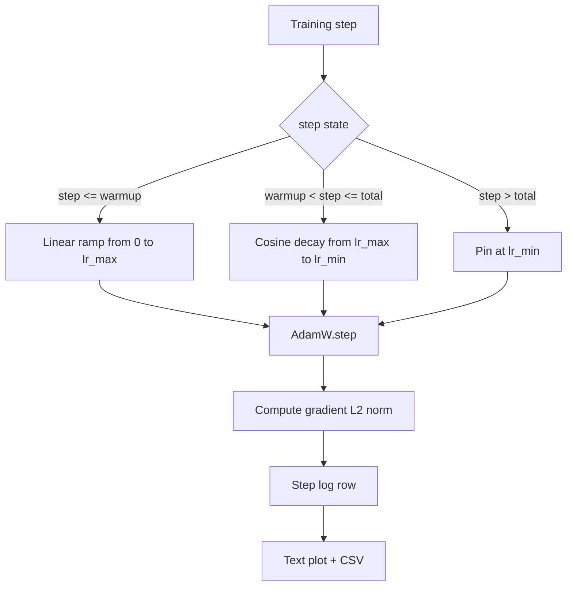

# Cosine LR with Linear Warmup

> Lịch trình learning-rate là quyết định quan trọng thứ hai sau hàm mất mát (loss function). AdamW với cosine decay và linear warmup là lựa chọn mặc định hiện đại cho việc huấn luyện mô hình ngôn ngữ vì nó cho phép mô hình trải qua một bước nhảy hiệu dụng nhỏ trong hàng nghìn bước cập nhật đầu tiên đầy biến động, tăng dần đến đỉnh đã cấu hình, và giảm dần một cách mượt mà về 0. Bài học này xây dựng lịch trình đó, vẽ biểu đồ đường cong qua các bước huấn luyện, ghi lại gradient norm bên cạnh lịch trình, và chứng minh rằng lịch trình tuân thủ các ranh giới warmup, đỉnh và decay.

**Type:** Build
**Languages:** Python
**Prerequisites:** Phase 19 lessons 30-37
**Time:** ~90 minutes

## Learning Objectives

- Triển khai bộ tối ưu hóa AdamW kết nối với lịch trình learning-rate cosine có linear warmup.
- Tính toán giá trị chính xác của lịch trình tại bất kỳ bước nào mà không bị trôi số thực (floating-point drift) giữa các lần chạy.
- Ghi lại L2 norm của gradient song song với learning rate để có thể quan sát tình trạng sức khỏe của quá trình huấn luyện.
- Hiển thị lịch trình dưới dạng biểu đồ văn bản dễ đọc và tệp CSV mà bất kỳ công cụ nào cũng có thể sử dụng.

## The Problem

Một nghìn bước cập nhật huấn luyện đầu tiên là giai đoạn ồn ào nhất. Trọng số của mô hình vẫn còn gần với trạng thái khởi tạo. Ước tính mô-men thứ hai (running second-moment estimate) của bộ tối ưu hóa vẫn chưa ổn định. Gradient norm lớn và nhiễu. Nếu learning rate ở mức đỉnh trong các bước cập nhật này, mô hình sẽ bị phân kỳ hoàn toàn hoặc rơi vào trạng thái bão hòa mất mát (loss plateau) mà không bao giờ thoát ra được. Hai giải pháp nổi tiếng là gradient clipping, chủ đề của bài 45 trong Phase 19, và một lịch trình learning-rate bắt đầu nhỏ rồi tăng dần.

Lịch trình cosine-with-warmup có ba vùng. Từ bước 0 đến bước `warmup_steps`, learning rate tăng tuyến tính từ 0 đến đỉnh đã cấu hình `lr_max`. Từ bước `warmup_steps` đến bước `total_steps`, learning rate tuân theo nửa trên của đường cong cosine, giảm từ `lr_max` xuống `lr_min`. Sau `total_steps`, learning rate được cố định tại `lr_min` để một bộ huấn luyện bị cấu hình sai dẫn đến vượt ngưỡng sẽ không âm thầm thoát khỏi lịch trình.

Vấn đề khi xây dựng là các lịch trình rất dễ bị sai lệch một đơn vị (off-by-one). Lỗi này sẽ xuất hiện sau sáu giờ huấn luyện dưới dạng learning rate cao hơn hoặc thấp hơn 1 phần trăm tại thời điểm mô hình bắt đầu quá khớp (overfitting), điều này sẽ không thể phát hiện trừ khi lịch trình được kiểm thử kỹ lưỡng tại các ranh giới.

## The Concept



### Warmup formula

Với `step` trong `[0, warmup_steps]` với `warmup_steps > 0`, learning rate là `lr_max * step / warmup_steps`. Trường hợp suy biến `warmup_steps = 0` được coi là "không warmup": lịch trình bắt đầu trực tiếp tại `lr_max` ở bước 0 và ngay lập tức đi vào cosine decay. Một số bộ kiểm thử truyền `warmup_steps = 0` để kiểm tra xem lịch trình có tạo ra đường cong sử dụng được hay không.

### Cosine formula

Với `step` trong `(warmup_steps, total_steps]`, learning rate là `lr_min + 0.5 * (lr_max - lr_min) * (1 + cos(pi * progress))` trong đó `progress = (step - warmup_steps) / max(1, total_steps - warmup_steps)`. Tại `step = warmup_steps`, hàm cosine cho kết quả `cos(0) = 1`, tạo ra `lr_max`, khớp chính xác với điểm cuối của warmup. Tại `step = total_steps`, hàm cosine cho kết quả `cos(pi) = -1`, tạo ra `lr_min`, khớp chính xác với điểm cuối của decay.

Tính liên tục tại cả hai điểm cuối không phải là ngẫu nhiên. Đó là lý do tại sao lịch trình được triển khai như một hàm duy nhất trên `step`, thay vì ba hàm khác nhau được ghép lại. Một lịch trình ghép sẽ mất đi tính liên tục tại ranh giới ngay khi `lr_max` bị thay đổi.

### Floor after total steps

Với `step > total_steps`, learning rate giữ nguyên tại `lr_min`. Hợp đồng ở đây rất rõ ràng: lịch trình không gây lỗi và không ngoại suy; nó cố định tại mức sàn và để bộ huấn luyện ghi lại cảnh báo. Các bộ huấn luyện cần kéo dài thời gian huấn luyện sẽ thay đổi `total_steps` của lịch trình, chứ không phải vòng lặp.

### Gradient norm logging alongside the rate

Lịch trình là một nửa của sức khỏe huấn luyện. Gradient norm là nửa còn lại. Vòng lặp huấn luyện ghi lại cả hai theo từng bước. Một quá trình huấn luyện phân kỳ sẽ cho thấy gradient norm tăng vọt trước khi mất mát tăng; một quá trình warmup được tinh chỉnh tốt sẽ giữ cho norm tăng tuyến tính cùng với tốc độ; một đỉnh quá mạnh sẽ thể hiện ở việc norm vẫn duy trì ở mức cao sau khi warmup. Tập dữ liệu trên đĩa là `step, lr, grad_l2_norm, loss`. Tệp CSV là bản ghi bền vững duy nhất.

```figure
cap-cosine-warmup
```

## Build It

`code/main.py` triển khai:

- `CosineWithWarmup` - một hàm không trạng thái `lr(step) -> float` dựa trên lịch trình đã cấu hình.
- `TrainState` - bao bọc một mô hình, một bộ tối ưu hóa `AdamW`, và lịch trình vào một hàm bước duy nhất.
- `TrainState.step` - chạy một lượt forward, một lượt backward, ghi lại L2 norm của gradient, và áp dụng `lr(step)` cho bộ tối ưu hóa.
- `plot_schedule_ascii` - hiển thị lịch trình dưới dạng biểu đồ văn bản dễ đọc.
- `write_schedule_csv` - xuất ra một hàng mỗi bước với learning rate.

Một bản demo ở cuối tệp xây dựng một mô hình `nn.Linear` nhỏ, huấn luyện trong 20 bước trên một batch đầu vào cố định, và in ra learning rate, gradient norm, và loss theo từng bước. Lịch trình cũng được hiển thị dưới dạng biểu đồ văn bản để kiểm tra trực quan.

Chạy nó:

```bash
python3 code/main.py
```

Tập lệnh thoát với mã 0 và in ra nhật ký huấn luyện theo từng bước cùng với biểu đồ lịch trình.

## Production Patterns

Bốn mô hình nâng tầm lịch trình thành một sản phẩm thực tế.

**Lịch trình nằm trong cấu hình, không phải trong mã nguồn.** Bộ huấn luyện đọc `warmup_steps`, `total_steps`, `lr_max`, `lr_min` từ cấu hình YAML hoặc JSON được commit vào git. Lịch trình có thể tái lập vì cấu hình được định địa chỉ theo nội dung; lịch trình có thể kiểm toán vì cấu hình là một phần của PR diff.

**Bộ đếm bước là đơn điệu và tách biệt khỏi các epoch.** Một số framework gây nhầm lẫn giữa bước và epoch khi tập dữ liệu được phân mảnh hoặc dataloader khởi động lại. Lịch trình đọc `global_step` từ checkpoint của bộ huấn luyện, không phải từ bộ đếm cục bộ. Một lần chạy tiếp tục sẽ bắt đầu tại đúng vị trí lịch trình vì bộ đếm bước là trục bền vững.

**Biểu đồ lịch trình trong thư mục chạy.** Mỗi lần huấn luyện ghi `outputs/lr_schedule.png` (hoặc trong bài học này là biểu đồ văn bản) vào thư mục chạy của nó. Người đánh giá lướt qua thư mục có thể kiểm tra nhanh lịch trình mà không cần chạy lại bất cứ thứ gì. Điều này giúp phát hiện các lỗi cấu hình lịch trình ngay tại thời điểm PR.

**Schema của hàng nhật ký là cố định.** `step, lr, grad_l2_norm, loss` theo thứ tự đó. Một notebook hoặc dashboard hạ nguồn đọc schema này; việc đổi tên cột mà không tăng phiên bản sẽ làm hỏng mọi dashboard hiện có.

## Use It

Các mô hình sản xuất:

- **Quét đỉnh trước khi quét bất cứ thứ gì khác.** `lr_max` là núm điều chỉnh nhạy cảm nhất. Hãy quét nó trên một mô hình nhỏ trước; `lr_max` tối ưu tỷ lệ thuận yếu với kích thước mô hình, vì vậy việc quét trên mô hình nhỏ là một tiền đề mạnh mẽ.
- **Warmup là một phần của tổng số bước, không phải là số đếm tuyệt đối.** Một lần chạy 200 triệu bước với 2.000 bước warmup sẽ đạt đỉnh gần như ngay lập tức; một lần chạy 20.000 bước với cùng số lượng đó sẽ warmup trong 10 phần trăm. Hãy cấu hình warmup dưới dạng phân số (thông thường: 1-3 phần trăm) để lịch trình tỷ lệ thuận với thời gian huấn luyện.
- **`lr_min` cố tình khác 0.** Một mức sàn bằng 10 phần trăm của `lr_max` giúp bộ tối ưu hóa tiếp tục học trong giai đoạn cuối dài. Một lịch trình `lr_min = 0` tạo ra đường cong huấn luyện trông rất đẹp trên biểu đồ nhưng mô hình thực tế chưa hoàn thành việc học.

## Ship It

`outputs/skill-cosine-warmup.md`, trong một dự án thực tế, sẽ mô tả cấu hình nào mang lịch trình, bộ huấn luyện nào đọc bộ đếm toàn cục, và quá trình quét `lr_max` nào đã tạo ra giá trị được triển khai. Bài học này cung cấp bộ máy.

## Exercises

1. Thêm một biến thể căn bậc hai nghịch đảo (inverse-square-root) của lịch trình và so sánh nó trên một lần chạy huấn luyện thử nghiệm 200 bước. Đường cong nào tạo ra loss cuối cùng thấp hơn?
2. Thêm cờ `--restart` để thêm một lần warmup thứ hai tại `total_steps / 2`. Hãy biện luận xem việc khởi động lại (warm restarts) có cải thiện hay gây hại cho lần chạy thử nghiệm hay không.
3. Thêm một unit test để kiểm tra tính liên tục của lịch trình: với mỗi bước trong `[0, total_steps]`, sự khác biệt `|lr(step+1) - lr(step)|` bị giới hạn bởi `lr_max / warmup_steps`.
4. Kết nối lịch trình vào một `torch.optim.lr_scheduler.LambdaLR` để nó có thể kết hợp với mã framework. Bài học sử dụng một hàm bước đơn giản; wrapper thay đổi điều gì?
5. Thêm cờ `--plot-png` để ghi một biểu đồ thực qua `matplotlib`. Hãy biện luận xem biểu đồ văn bản của bài học hay tệp PNG là mặc định tốt hơn cho các lần chạy CI.

## Key Terms

| Thuật ngữ | Cách gọi thông thường | Ý nghĩa thực tế |
|------|-----------------|------------------------|
| Warmup | "Khởi động chậm" | Tăng tuyến tính từ 0 đến `lr_max` trong `warmup_steps` bước cập nhật đầu tiên |
| Cosine decay | "Giảm mượt" | Đường cong cosine nửa trên từ `lr_max` đến `lr_min` trong các bước còn lại |
| Floor | "Sau huấn luyện" | Giá trị `lr_min` cố định mà lịch trình ghim tại đó sau `total_steps` |
| Gradient norm | "L2 của grads" | Norm Euclid của vector gradient nối tiếp, được ghi lại mỗi bước |
| Global step | "Trục lịch trình" | Bộ đếm bước đơn điệu tồn tại qua các lần khởi động lại và điều khiển lịch trình |

## Further Reading

- [Loshchilov and Hutter, SGDR: Stochastic Gradient Descent with Warm Restarts (arXiv 1608.03983)](https://arxiv.org/abs/1608.03983) - bài báo tham khảo về lịch trình cosine
- [Loshchilov and Hutter, Decoupled Weight Decay Regularization (arXiv 1711.05101)](https://arxiv.org/abs/1711.05101) - bài báo tham khảo về AdamW
- [PyTorch torch.optim.lr_scheduler](https://docs.pytorch.org/docs/stable/optim.html#how-to-adjust-learning-rate) - cách các hàm bước kết hợp với các bộ lập lịch của framework
- Phase 19 · 42 - trình tải xuống mà lịch trình này tiêu thụ corpus
- Phase 19 · 43 - dataloader mà lịch trình cùng phát triển
- Phase 19 · 45 - gradient clipping và AMP, lớp tiếp theo trong vòng lặp