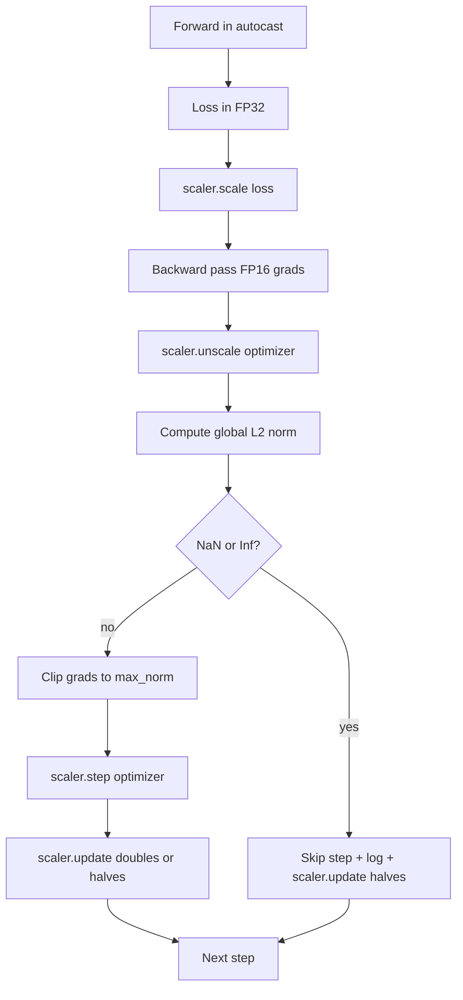

# Gradient Clipping và Mixed Precision

> Bộ tối ưu hóa và schedule từ bài học trước giả định rằng các gradient đều ở trạng thái bình thường. Thực tế thường không như vậy. Một batch lỗi duy nhất có thể khiến gradient norm tăng vọt gấp ba lần biên độ thông thường. Huấn luyện Mixed-precision càng làm trầm trọng thêm vấn đề này bằng cách gây ra lỗi tràn số (overflow) FP16 ở phía loss. Bài học này xây dựng hai "đai an toàn" mà quá trình huấn luyện thực tế không thể thiếu: gradient clipping theo chuẩn L2 toàn cục được cấu hình sẵn, và một vòng lặp mixed-precision với autocast và GradScaler để phát hiện NaN và Inf, bỏ qua bước lỗi một cách sạch sẽ và log lại hệ số tỷ lệ (scaling factor) để truy vết nguyên nhân.

**Type:** Build
**Languages:** Python
**Prerequisites:** Phase 19 lessons 30-37
**Time:** ~90 phút

## Learning Objectives

- Tính toán chuẩn L2 toàn cục trên tất cả các gradient tham số và thực hiện clipping tại chỗ khi nó vượt quá ngưỡng cấu hình.
- Bao bọc một bước huấn luyện trong autocast cùng với GradScaler để các lượt forward và backward pass bằng FP16 có thể sống sót qua lỗi tràn số.
- Phát hiện NaN và Inf trong loss hoặc gradient, bỏ qua bước tối ưu hóa và ghi log lại việc bỏ qua đó.
- Báo cáo hệ số tỷ lệ của GradScaler ở mỗi bước để có thể nhận thấy ngay lập tức một chuỗi các bước bị bỏ qua kéo dài.

## The Problem

Một lượt huấn luyện chạy mượt mà ngày hôm qua bỗng tạo ra đường cong loss dựng đứng tại bước 8,217. Thủ phạm là một batch duy nhất có gradient norm lên tới 4,200, gấp 20 lần mức đỉnh trước đó. Nếu không có clipping, bộ tối ưu hóa sẽ áp dụng một bước cập nhật xóa sạch mọi thứ mà mô hình đã học được trong giờ trước đó. Với một global L2 clip ở mức norm 1.0, chính batch đó sẽ đóng góp một bản cập nhật có chuẩn đơn vị; loss vẫn giữ đúng xu hướng; lượt huấn luyện được cứu vãn.

Huấn luyện Mixed-precision giúp tăng throughput lên gấp 2-3 lần bằng cách tính toán forward pass và hầu hết backward pass ở định dạng FP16. Cái giá phải trả là FP16 có dải số mũ hẹp. Một gradient điển hình bị tràn số trong FP16 sẽ trở thành Inf, sau đó lan truyền qua các lớp tiếp theo dưới dạng NaN, khiến mọi trọng số bị biến thành NaN ở bước tối ưu hóa kế tiếp. GradScaler của PyTorch giải quyết vấn đề này bằng cách nhân loss với một hệ số tỷ lệ lớn trước khi backward pass và chia các gradient cho chính hệ số đó trước bước tối ưu hóa. Nếu bất kỳ gradient nào là Inf hoặc NaN tại thời điểm unscale, scaler sẽ bỏ qua bước đó và giảm một nửa hệ số tỷ lệ; nếu N bước trước đó đều sạch, scaler sẽ gấp đôi hệ số. Trong suốt quá trình huấn luyện, hệ số này sẽ tìm thấy giá trị cao nhất mà dải FP16 cho phép.

Vấn đề khi xây dựng là kết nối hai cơ chế này một cách chính xác. Nếu clip trước khi unscale, ngưỡng sẽ áp dụng trên các gradient đã được scale; nếu clip sau khi unscale, thứ tự các thao tác trên GradScaler là rất quan trọng. Thứ tự đúng là: `scaler.scale(loss).backward()`, sau đó đến `scaler.unscale_(optimizer)`, tiếp theo là `clip_grad_norm_`, rồi `scaler.step(optimizer)`, và cuối cùng là `scaler.update()`. Bất kỳ thứ tự nào khác đều tạo ra một vòng lặp bị lỗi ngầm.

## The Concept



### Global L2 norm

Chuẩn L2 toàn cục là chuẩn Euclidean của vector gradient được nối lại (concatenated), không phải chuẩn trên từng tham số riêng lẻ. PyTorch thực hiện điều này thông qua `torch.nn.utils.clip_grad_norm_(parameters, max_norm)`. Hàm này trả về giá trị norm trước khi clip để bài học có thể log lại cả giá trị tự nhiên và giá trị đã clip, điều này rất cần thiết để chẩn đoán tình trạng "chúng ta đang bị clipping ở mọi bước".

### autocast và GradScaler

`torch.amp.autocast(device_type)` là trình quản lý ngữ cảnh (context manager) giúp chạy chọn lọc các thao tác đủ điều kiện (hầu hết là các thao tác dạng matmul) ở định dạng FP16. `torch.amp.GradScaler(device_type)` là công cụ hỗ trợ scale loss trước khi backward và thực hiện inverse-scale gradient trước bước tối ưu hóa. Cả hai được thiết kế để đi cùng nhau; việc sử dụng cái này mà không có cái kia là một lỗi cấu hình mà bài kiểm tra cần phát hiện.

Bài học này sử dụng autocast trên CPU vì đó là môi trường chạy CI; mô hình tương tự có thể chuyển nguyên văn sang CUDA bằng cách thay đổi `device_type="cpu"` thành `device_type="cuda"`. GradScaler trên CPU chỉ là một bản giả (stub) (vì autocast trên CPU mặc định hoạt động ở BF16 và không cần loss scaling), nhưng bài học vẫn bao gồm các vị trí gọi hàm để cấu hình giống hệt với vòng lặp trên GPU.

### NaN và Inf detection

Việc phát hiện xảy ra ở hai nơi. Đầu tiên, chính loss được kiểm tra bằng `torch.isfinite` trước khi backward; một giá trị loss Inf hoặc NaN sẽ không tạo ra gradient hữu ích và sẽ bị bỏ qua mà không đi vào bộ tối ưu hóa. Thứ hai, sau `scaler.unscale_(optimizer)`, bài học sẽ quét các gradient đã unscale bằng `has_non_finite_grad(...)` và coi bất kỳ giá trị Inf hoặc NaN nào là một bước cần bỏ qua. Hai lần kiểm tra này cùng nhau bao quát cả các chế độ lỗi ở forward-pass và backward-pass.

### Scaling factor diagnostics

Hệ số tỷ lệ là trạng thái nội bộ của GradScaler. Ở mỗi bước, bài học sẽ đọc `scaler.get_scale()` và log nó bên cạnh learning rate và gradient norm. Một lượt chạy khỏe mạnh sẽ thấy hệ số tỷ lệ tăng dần theo lũy thừa của 2 cho đến khi bão hòa gần `2^17` hoặc `2^18`. Một lượt chạy bất thường sẽ thấy hệ số dao động giữa các giá trị cao và thấp, đó là tín hiệu cho thấy gradient của mô hình đôi khi nằm trong dải cho phép và đôi khi không. Chẩn đoán này sẽ không thể thấy được nếu không ghi log.

```figure
grad-clip-monitor
```

## Build It

`code/main.py` thực hiện:

- `clip_global_l2_norm` - một wrapper quanh `torch.nn.utils.clip_grad_norm_` trả về cả norm trước và sau khi clip.
- `has_non_finite_grad` - một helper quét gradient để tìm NaN và Inf.
- `AmpTrainState` - bao bọc một mô hình, một bộ tối ưu hóa `AdamW`, một GradScaler và một thiết bị autocast. Cung cấp một `step(inputs, targets)` thực hiện toàn bộ pipeline clipping, scaling và skip-on-NaN.
- `StepLog` và `SkipLog` - các bản ghi có cấu trúc cho mỗi bước.
- Một bản demo huấn luyện một mô hình `nn.Linear` nhỏ trong 20 bước, chèn một giá trị Inf vào gradient ở bước 5 để thực thi nhánh bỏ qua (skip path), và in ra log kết quả.

Chạy nó:

```bash
python3 code/main.py
```

Script sẽ thoát với mã 0 và in ra log theo từng bước với mỗi hàng được gắn nhãn `STEP` hoặc `SKIP`; ít nhất một hàng sẽ là `SKIP`.

## Production Patterns

Bốn mô hình sau đây nâng tầm vòng lặp này thành một bước huấn luyện thực tế (production).

**Bộ đếm bỏ qua đóng vai trò là cảnh báo, không chỉ là một dòng log.** Một vài bước bị bỏ qua trong mỗi lượt huấn luyện là bình thường. Nhưng hàng trăm lần bỏ qua trong mỗi epoch là một cảnh báo nghiêm trọng: mô hình đang ở trong trạng thái mà FP16 không thể xử lý và vòng lặp đang thất bại ngầm. Bài học này theo dõi tỷ lệ bỏ qua trượt (rolling skip rate) trong 1,000 bước và trong thực tế sẽ phát cảnh báo nếu tỷ lệ này vượt quá 5%.

**Ngưỡng clip nằm trong file cấu hình.** `max_norm = 1.0` là giá trị mặc định hiện đại cho việc huấn luyện mô hình ngôn ngữ. Hãy thử nghiệm (sweep) nó trên một mô hình nhỏ trước; ngưỡng lớn hơn cho phép mô hình phục hồi từ các batch thực sự khó; ngưỡng nhỏ hơn giới hạn trường hợp xấu nhất nhưng phải trả giá bằng đường cong loss nhiễu hơn. Ngưỡng này nên nằm trong cùng file cấu hình YAML hoặc JSON với schedule từ bài 44.

**Log của norm được ghi vào CSV cùng với schedule.** Các cột CSV là `step, lr, grad_l2_pre_clip, grad_l2_post_clip, loss, skipped, skip_reason, scaler_scale`. Một người đánh giá khi mở file sẽ thấy schedule, diễn biến gradient, hệ số tỷ lệ và kết quả bước (cùng lý do) trong một hàng duy nhất. Việc chia tách các cột ra nhiều file khác nhau là công thức dẫn đến các phân tích sai lệch.

**`scaler.update()` chạy ở mọi bước, ngay cả khi bỏ qua.** Ở một bước sạch, scaler đọc bộ đếm no-inf của nó, tăng nó lên và có thể gấp đôi hệ số. Ở một bước bị bỏ qua, scaler giảm một nửa hệ số và reset bộ đếm. Quên `update()` trên nhánh bỏ qua là lỗi dẫn đến tình trạng "hệ số tỷ lệ không bao giờ thay đổi".

## Use It

Các mô hình thực tế:

- **Thiết bị autocast phải khớp với thiết bị của bộ tối ưu hóa.** `torch.amp.autocast(device_type="cuda")` cho huấn luyện GPU; `torch.amp.autocast(device_type="cpu")` cho CPU. Việc trộn lẫn các thiết bị tạo ra một lỗi kiểu dữ liệu ngầm, biểu hiện là đường cong loss trông có vẻ ổn nhưng mô hình không hề học được gì.
- **Kiểm tra loss trước khi backward.** `torch.isfinite(loss).all()` là một thao tác rút gọn tensor (tensor reduction); chi phí là không đáng kể nhưng lợi ích khi gặp loss NaN là tiết kiệm được cả một bước huấn luyện. Luôn luôn chạy nó.
- **`set_to_none=True` trong `zero_grad`.** Đặt gradient thành `None` thay vì zero, giúp bộ tối ưu hóa bỏ qua tính toán cho các nhóm tham số không bị ảnh hưởng. Cấu hình này giúp cải thiện throughput miễn phí và giảm thiểu khả năng xảy ra lỗi nhỏ.

## Ship It

`outputs/skill-clip-amp.md` trong một dự án thực tế sẽ mô tả ngưỡng clip và thiết bị autocast nào được sử dụng, file CSV theo từng bước nằm ở đâu trong hệ thống quản lý phiên bản, và ngưỡng cảnh báo tỷ lệ bỏ qua là bao nhiêu. Bài học này cung cấp phần "động cơ" cho hệ thống đó.

## Exercises

1. Thay thế việc chèn Inf giả lập bằng một cú spike loss thực tế (nhân target của một batch với 1e8) và xác nhận nhánh bỏ qua được kích hoạt.
2. Thêm chế độ `--bf16` để chuyển autocast sang BF16 thay vì FP16. BF16 có dải số mũ rộng hơn FP16 và hiếm khi cần loss scaling; xác nhận tỷ lệ bỏ qua giảm xuống bằng 0 trên cùng bản demo.
3. Thêm một unit test để đảm bảo wrapper gradient-clip trả về đúng norm trước và sau khi clip khi không có hiện tượng clipping xảy ra.
4. Thêm tính toán tỷ lệ bỏ qua trong một cửa sổ trượt (rolling-window) và một CLI flag để dừng lượt chạy nếu tỷ lệ vượt quá ngưỡng cấu hình trong 100 bước liên tiếp.
5. Kết nối vòng lặp để ghi file CSV chuẩn (`step, lr, grad_l2_pre_clip, grad_l2_post_clip, loss, skipped, skip_reason, scaler_scale`) và xác nhận file vẫn tồn tại sau khi nhấn Ctrl-C bằng cách flush dữ liệu sau mỗi hàng.

## Key Terms

| Thuật ngữ | Cách mọi người gọi | Ý nghĩa thực sự |
|-----------|-------------------|-----------------|
| Global L2 norm | "Clip target" | Chuẩn Euclidean của vector gradient được nối lại từ tất cả các tham số có thể huấn luyện |
| autocast | "Mixed precision" | Thực thi chọn lọc FP16 (hoặc BF16) cho các thao tác đủ điều kiện bên trong khối `with` |
| GradScaler | "Loss scaler" | Công cụ hỗ trợ nhân loss trước khi backward và inverse-scale gradient trước bước tối ưu hóa |
| Skip | "Bad step" | Một bước tối ưu hóa bị từ chối vì gradient hoặc loss không hữu hạn; scaler sẽ giảm một nửa hệ số |
| Scaling factor | "Scaler state" | Hệ số nhân hiện tại của GradScaler; gấp đôi sau các chuỗi bước sạch và giảm một nửa sau mỗi lần bỏ qua |

## Further Reading

- [Micikevicius et al., Mixed Precision Training (arXiv 1710.03740)](https://arxiv.org/abs/1710.03740) - đề xuất gốc về loss-scaling.
- [Pascanu, Mikolov, Bengio, On the difficulty of training recurrent neural networks (arXiv 1211.5063)](https://arxiv.org/abs/1211.5063) - bài báo tham chiếu về gradient-clipping.
- [PyTorch torch.amp.GradScaler](https://docs.pytorch.org/docs/stable/amp.html) - API scaler mà bài học này bao bọc.
- [PyTorch torch.nn.utils.clip_grad_norm_](https://docs.pytorch.org/docs/stable/generated/torch.nn.utils.clip_grad_norm_.html) - nguyên mẫu clipping mà bài học này sử dụng.
- Phase 19 · 42 - bộ tải dữ liệu có corpus cung cấp cho vòng lặp.
- Phase 19 · 43 - dataloader mà vòng lặp tiêu thụ.
- Phase 19 · 44 - schedule mà vòng lặp này kết hợp cùng.