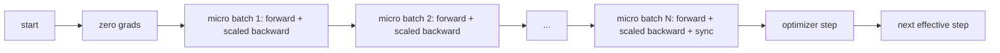
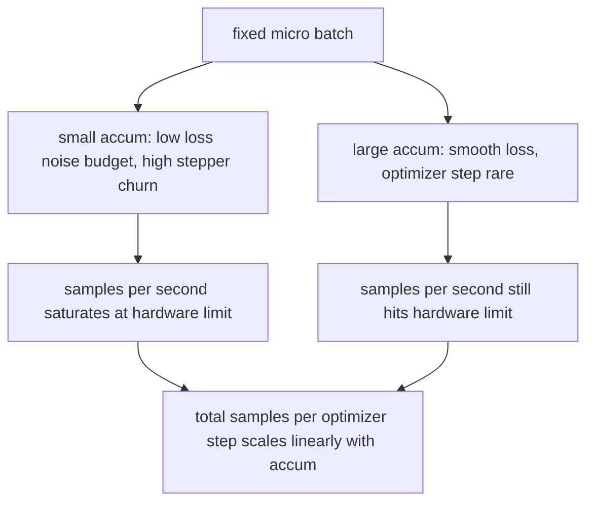

# Gradient Accumulation

> Huấn luyện với một effective batch mà bạn không đủ bộ nhớ để đáp ứng, thực hiện từng micro-batch một. Scale loss, giữ lại bước optimizer, và để các gradient tích lũy dần lên.

**Type:** Build
**Languages:** Python
**Prerequisites:** Phase 19 lessons 42 to 45
**Time:** ~90 phút

## Learning Objectives

- Suy luận công thức định danh effective batch: `effective_batch = micro_batch * accum_steps`.
- Triển khai loss-per-micro-batch scaling để gradient tích lũy khớp với một lần backward trên full-batch duy nhất.
- Bỏ qua việc đồng bộ hóa optimizer cho đến micro-batch cuối cùng (sync-on-last-step).
- Đọc biểu đồ throughput so với effective batch và giải thích hiện tượng hiệu suất giảm dần (diminishing return).

## The Problem

Bạn muốn huấn luyện với một effective batch là 512 vì đường cong loss sẽ mượt hơn và bước optimizer sẽ hợp lý hơn ở quy mô đó. Tuy nhiên, thiết bị accelerator trên bàn làm việc chỉ chứa được 32 ví dụ trước khi hết bộ nhớ (out of memory). Gấp đôi batch không phải là một lựa chọn. Chia đôi mô hình cũng không phải là một lựa chọn. Kỹ thuật mà giới chuyên môn đã áp dụng từ năm 2017 và chưa bao giờ ngừng sử dụng là chạy 16 lượt backward, để các gradient tích lũy bên trong các parameter buffers, và chỉ thực hiện bước optimizer khi số lượng đạt đến mục tiêu.

Rủi ro là loss không còn là con số giống như khi chạy với batch lớn hơn. Cross entropy của 16 mini-batches nếu cộng dồn một cách ngây thơ sẽ gấp 16 lần loss của một full batch. Nếu không scale, hướng của gradient là chính xác nhưng độ lớn (magnitude) sẽ sai, và bước optimizer sẽ lớn gấp 16 lần mức cần thiết. Cách khắc phục chỉ là một phép chia. Nhưng cách khắc phục này cũng rất dễ bị lãng quên.

## The Concept



Nguyên tắc rất đơn giản:

- Loss của mỗi micro-batch được chia cho `accum_steps` trước khi `backward()`. PyTorch mặc định cộng dồn gradient vào `param.grad`; phép chia này giúp đưa tổng tích lũy về đúng tỷ lệ.
- Bước optimizer chỉ kích hoạt một lần cho mỗi effective batch, sau lượt backward của micro-batch cuối cùng. Việc thực hiện bước optimizer giữa chừng khi đang tích lũy sẽ làm sai lệch mọi tham số mà phần còn lại của quá trình chạy phụ thuộc vào.
- Trạng thái của optimizer (momentum buffers, Adam moments) tiến triển một lần cho mỗi bước effective step, không phải cho mỗi micro-batch. Nếu không, các exponential moving averages sẽ thấy sai tần suất và làm hỏng lịch trình (schedule) huấn luyện.
- Trên một thiết bị đơn lẻ, đây là việc quản lý sổ sách (bookkeeping). Trên một cụm multi-rank, mô hình tương tự sẽ bao bọc các micro-batch không phải cuối cùng trong một context `no_sync` để bỏ qua việc gradient all-reduce; micro-batch cuối cùng sẽ thực hiện reduce toàn bộ gradient đã tích lũy trong một lượt thay vì phải trả chi phí mạng N lần.

### Chứng minh tính tương đương bằng code

```python
loss = criterion(model(x_full), y_full)
loss.backward()
opt.step()
```

tương đương với

```python
for x, y in chunks(x_full, y_full, n):
    scaled = criterion(model(x), y) / n
    scaled.backward()
opt.step()
```

ngoại trừ sai số do thứ tự cộng số dấu phẩy động (floating point). Buffer gradient tích lũy ở cuối vòng lặp chính là tensor mà một lượt backward trên full-batch duy nhất tạo ra. Mã nguồn bài học khẳng định điều này với sai lệch max-abs dưới 1e-4 trong `equivalence_check`.

### Chi phí nằm ở đâu

Mỗi micro-batch tiêu tốn một lượt forward và một lượt backward. Với kỹ thuật tích lũy, bạn đánh đổi bộ nhớ lấy thời gian. Đường cong throughput trong `outputs/accum-curve.json` cho thấy điều gì xảy ra khi effective batch tăng lên với micro-batch cố định:



Không có bữa trưa nào miễn phí. Gấp đôi `accum_steps` sẽ gấp đôi wall time cho mỗi bước optimizer. Điều thay đổi là phương sai của ước lượng gradient: với cùng một ngân sách thời gian thực tế, bạn thực hiện ít bước optimizer hơn nhưng mỗi bước được tính trung bình trên nhiều mẫu hơn. Các tài liệu nghiên cứu coi large batch và small batch là các bài toán tối ưu hóa khác nhau; bài học ở đây mang tính kỹ thuật (mechanical), không phải tính thống kê (statistical).

```figure
cc-grad-accumulation
```

## Build It

`code/main.py` là artifact có thể thực thi. Nó thực hiện ba việc.

### Bước 1: Kiểm tra tính tương đương (equivalence check)

`equivalence_check()` xây dựng hai bản sao của cùng một mạng với cùng một seed. Một bản xử lý batch 16 mẫu trong một lượt forward. Bản còn lại xử lý bốn phần (chunks) 4 mẫu với loss được chia cho bốn. Hàm này so sánh các gradient buffers trước bước optimizer và các tham số sau đó. Khẳng định được đưa ra là `max_abs_diff < 1e-4`.

### Bước 2: Mô hình sync-on-last-step

`train_one_optimizer_step` duyệt qua các micro-batches. Đối với mọi micro-batch ngoại trừ cái cuối cùng, nó đi vào `no_sync_context(model)`. Trên một tiến trình đơn lẻ, context này là một no-op; trên DDP, đây là nơi việc gradient all-reduce được bỏ qua. Việc quản lý sổ sách là giống nhau trong cả hai trường hợp. Một `sync_counter` ghi lại số lần chúng ta rời khỏi phạm vi no_sync; đối với N micro-batches, số lượng là một lần cho mỗi effective step, không phải N.

### Bước 3: Đường cong throughput

`sweep_effective_batches` chạy cùng một mô hình với micro-batch cố định và một danh sách các bước tích lũy (accumulation steps). Với mỗi thiết lập, nó ghi lại:

- `samples_per_sec`: tổng số mẫu đã xử lý chia cho wall time
- `median_step_ms`: phân vị thứ 50 cho mỗi effective step
- `sync_calls`: các điểm tập thể được thực thi
- `avg_loss`: trung bình qua các bước optimizer của quá trình sweep

Kết quả được lưu vào `outputs/accum-curve.json` và có thể tái sử dụng từ một notebook.

Chạy nó:

```bash
python3 code/main.py
```

Script sẽ in ra sai lệch tương đương (equivalence diff), sau đó là bảng sweep, và cuối cùng là đường dẫn JSON. Mã thoát (exit code) bằng không.

## Use It

Trong huấn luyện thực tế (production), gradient accumulation nằm sau một nút điều chỉnh duy nhất. Mô hình của PyTorch là `accumulation_steps = effective_batch // (micro_batch * world_size)`. Các framework mà bạn không được phép sử dụng ở đây cũng bao bọc vòng lặp tương tự, nhưng các bước là như nhau: scale loss, bỏ qua sync trên các micro-batch không phải cuối cùng, tích lũy, và thực hiện bước optimizer một lần.

Ba mô hình phổ biến trong thực tế:

- Kích thước micro-batch được chọn để làm đầy (saturate) bộ nhớ thiết bị. Bất cứ thứ gì nhỏ hơn đều lãng phí chu kỳ của accelerator. Bất cứ thứ gì lớn hơn đều gây crash.
- Effective batch được chọn từ một learning rate schedule. Effective batch lớn cần learning rate được scale và warmup; đây là quy tắc scale tuyến tính (linear scaling rule) được thảo luận từ năm 2017.
- Số lượng tích lũy (accumulation count) là cầu nối giữa hai yếu tố trên và là nút duy nhất bạn có thể tự do điều chỉnh khi chạy mà không cần viết lại data loader.

## Ship It

`outputs/skill-gradient-accumulation.md` ghi lại công thức để đồng nghiệp có thể đưa vào một repo mới: scale loss theo `accum_steps`, bỏ qua optimizer sync trên các micro-batch không phải cuối cùng, thực hiện bước optimizer một lần cho mỗi effective batch, ghi lại throughput so với effective batch dưới dạng JSON để có thể quan sát sự đánh đổi.

## Exercises

1. Chạy lại sweep với `--num-steps 100` và vẽ biểu đồ số mẫu trên giây (samples per second) so với effective batch. Đường cong bắt đầu đi ngang (flatten) ở đâu?
2. Thêm một biến thể scale sai (không chia) và hiển thị sự khác biệt tham số ở bước 1 so với bản tham chiếu.
3. Thay thế SGD bằng AdamW và xác nhận trạng thái optimizer tiến triển một lần cho mỗi effective step, không phải mỗi micro-batch.
4. Đưa vào một wrapper `DistributedDataParallel` thực tế và định tuyến `no_sync_context` đến phương thức của nó. Xác nhận sync_calls giảm đi N-1 cho mỗi effective batch.
5. Sửa đổi phần kiểm tra tính tương đương để so sánh hai cách chia micro khác nhau (2 lần 8 so với 4 lần 4) và giải thích bất kỳ sai số (tolerance) nào bạn cần nới lỏng.

## Key Terms

| Thuật ngữ | Cách mọi người gọi | Ý nghĩa thực sự |
|-----------|-------------------|-----------------|
| Micro batch | Batch bạn forward | Phần dữ liệu vừa với bộ nhớ trong một lượt forward duy nhất |
| Accum steps | Lượt backward mỗi bước | Số lượt backward được cộng dồn trước một bước optimizer |
| Effective batch | Batch | Micro batch nhân với accum steps nhân với data parallel world size |
| Loss scaling | Chia cho N | Phép chia trên mỗi micro-batch để tổng gradient khớp với full batch |
| Sync on last | Bỏ qua phần còn lại | Chỉ chạy gradient collective ở lượt backward cuối cùng trong cửa sổ tích lũy |

## Further Reading

- Tài liệu PyTorch về `DistributedDataParallel.no_sync` cho phiên bản production của kỹ thuật sync-on-last-step.
- Goyal et al., 2017, về linear scaling cho huấn luyện batch lớn, lý do kinh điển để quan tâm đến effective batch.
- PyTorch issue tracker về tương tác giữa gradient accumulation và mixed precision unscaling.
- Phase 19 bài 42 đến 45 bao gồm khung sườn về mô hình, data loader, optimizer và trainer mà bài học này giả định.
- Phase 19 bài 47 bao gồm checkpoint và resume để quá trình tích lũy dài hơi có thể sống sót qua giới hạn thời gian chạy.