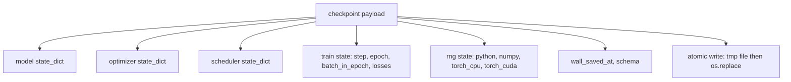
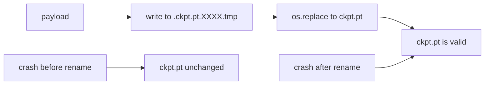
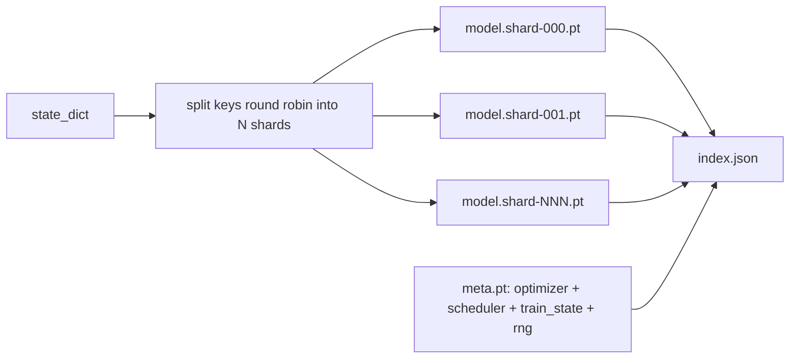

# Lưu và Khôi phục Checkpoint

> Việc gián đoạn huấn luyện làm hỏng các lượt chạy; checkpoint cho phép chúng tiếp tục. Lưu model, optimizer, scheduler, lịch sử loss, bộ đếm step, và trạng thái RNG một cách atomic (nguyên tử), để việc dừng đột ngột tại bất kỳ thời điểm nào cũng để lại một file hợp lệ trên đĩa.

**Type:** Build
**Languages:** Python
**Prerequisites:** Phase 19 lessons 42 to 45
**Time:** ~90 phút

## Mục tiêu học tập

- Ghi lại toàn bộ trạng thái huấn luyện vào một payload duy nhất có thể nạp lại vào một tiến trình mới.
- Triển khai lưu atomic bằng cách ghi vào file tạm rồi đổi tên để sự cố crash không bao giờ để lại một file ghi dở dang.
- Khôi phục trạng thái RNG cho Python, NumPy, và PyTorch để loss sau khi khôi phục khớp với baseline không bị gián đoạn.
- Xây dựng cấu trúc checkpoint phân mảnh (sharded) cho các model không còn vừa trong một file duy nhất, với các shard được xác thực bằng mã hash và một chỉ mục JSON.

## Vấn đề

Bạn thiết lập một công việc huấn luyện trong 18 giờ. Giới hạn thời gian thực (wallclock cap) là 4 giờ. Cụm máy chủ khởi động lại vào giờ thứ 11 vì ai đó cấp cao hơn bạn đã phê duyệt nâng cấp kernel. Không có checkpoint, bạn phải bắt đầu lại từ đầu. Không có tính năng khôi phục (resume), bạn cũng mất luôn trạng thái optimizer vốn đã mất 11 giờ đầu tiên để học, vì vậy ngay cả khi trọng số model còn sống sót, các moment của AdamW cũng biến mất và bước tiếp theo sẽ chệch hướng so với quỹ đạo huấn luyện đã đi qua.

Artifact đúng đắn là một file duy nhất chứa mọi thứ cần thiết để tiếp tục: các tham số model, trạng thái optimizer, trạng thái scheduler, lịch sử loss để vẽ biểu đồ, các bộ đếm step, epoch và batch-in-epoch hiện tại, cùng trạng thái RNG cho mọi nguồn ngẫu nhiên. Không có trạng thái RNG, đường cong loss sau khi khôi phục sẽ là một đường cong khác. Cùng một model, cùng một dữ liệu, nhưng xáo trộn khác nhau, dropout mask khác nhau, con số trên dashboard cũng khác nhau.

Lưu atomic là nửa còn lại của cam kết. Ghi trực tiếp vào tên file cuối cùng có nghĩa là một cú crash giữa chừng khi đang ghi sẽ để lại một file bị hỏng; việc khôi phục sẽ đọc phải dữ liệu rác. Ghi vào một file tạm thời trong cùng thư mục rồi đổi tên có nghĩa là một cú crash giữa chừng sẽ giữ nguyên file tốt trước đó. Việc đổi tên (rename) mang tính atomic trên các hệ thống file POSIX.

## Khái niệm



### Năm nhóm trạng thái

| Nhóm | Tại sao nó quan trọng |
|--------|----------------|
| Model | Trọng số và buffer; bản chất của model. |
| Optimizer | Momentum và các moment thích nghi; không có chúng, bước tiếp theo sẽ là một bài toán tối ưu hóa khác. |
| Scheduler | Vị trí của learning rate trên đường cong của nó; đặc biệt quan trọng với cosine schedule. |
| Bộ đếm huấn luyện | Step, epoch, batch-in-epoch, cộng với lịch sử loss để vẽ dashboard. |
| Trạng thái RNG | Tính tất định cho dropout, xáo trộn dữ liệu, và bất kỳ việc lấy mẫu nào bên trong model. |

### Lưu atomic



Hai quy tắc. Đầu tiên, file tạm thời nằm trong cùng thư mục với mục tiêu để việc đổi tên diễn ra trong cùng hệ thống file; việc đổi tên xuyên thiết bị (cross-device) không mang tính atomic. Thứ hai, tên tạm thời là duy nhất cho mỗi lần thử để hai tiến trình ghi không đè lên nhau.

### Checkpoint phân mảnh (Sharded checkpoints)

Khi model trở nên lớn, payload file đơn lẻ sẽ quá to để load nhanh, quá khó để kiểm tra, và gây phiền toái khi kết nối mạng bị lỗi giữa chừng. Giải pháp là chia trạng thái tham số thành các shard và ghi một index nhỏ để liên kết chúng lại.



Index ghi lại số lượng shard, mã sha256 của mỗi shard, và mã sha256 của file meta. Trình nạp (loader) sẽ báo lỗi lớn khi có bất kỳ mã hash nào không khớp. Các shard có thể nằm trên các đĩa vật lý khác nhau; file meta nhỏ và được đọc trước.

### Khôi phục tiếp tục giữa epoch

Việc khôi phục quay lại đầu epoch tiếp theo sẽ lãng phí từ vài phút đến cả ngày. Giải pháp là `(epoch, batch_in_epoch)` cộng với trạng thái RNG. Sau khi load, vòng lặp huấn luyện sẽ tua nhanh (fast-forward) bộ sinh số ngẫu nhiên qua các batch đã tiêu thụ trong epoch hiện tại và tiếp tục từ `batch_in_epoch`. Mã nguồn bài học thực hiện chính xác điều này; khẳng định là quỹ đạo loss sau khi khôi phục khớp với baseline không bị gián đoạn trong khoảng sai số 1e-4.

```figure
cc-atomic-checkpoint
```

## Xây dựng

`code/main.py` cung cấp bốn hàm cơ bản và một trình điều khiển demo.

### Bước 1: Ghi lại và khôi phục trạng thái RNG

`capture_rng_state` trả về một dict chứa `random.getstate` của Python, `np.random.get_state` của NumPy, và các byte RNG của PyTorch CPU và CUDA. `restore_rng_state` đảo ngược quá trình này. CPU tensor là một bộ đệm byte uint8 mà bộ sinh RNG của PyTorch biết cách tiêu thụ.

### Bước 2: Lưu atomic

`atomic_save` ghi payload vào một file tạm trong thư mục mục tiêu, sau đó `os.replace` hoán đổi nó thành tên file cuối cùng. `atomic_write_json` thực hiện tương tự cho sharded index.

### Bước 3: Quy trình checkpoint khép kín

`save_checkpoint` đóng gói model, optimizer, scheduler, trạng thái huấn luyện và RNG vào một dict. `load_checkpoint` đảo ngược nó và trả về một `TrainState`. Trường schema là điểm móc để nâng cấp: các thay đổi định dạng trong tương lai sẽ tăng chuỗi phiên bản và trình nạp sẽ điều phối tương ứng.

### Bước 4: Biến thể phân mảnh

`save_sharded_checkpoint` phân bổ xoay vòng (round-robin) các khóa tham số qua N shard, ghi mỗi shard bằng cách lưu atomic riêng, ghi một file meta với optimizer, scheduler và trạng thái huấn luyện, sau đó ghi index JSON với các mã sha256 của shard. `load_sharded_checkpoint` xác thực mọi shard trước khi hợp nhất.

### Bước 5: Demo khôi phục

`run_resume_demo` huấn luyện một model nhỏ trong `total_steps`, lưu một checkpoint tại `interrupt_at`, sau đó tiếp tục. Một tiến trình thứ hai khôi phục checkpoint và chạy các bước còn lại. Hàm trả về sai lệch tuyệt đối tối đa giữa hai quỹ đạo loss sau điểm gián đoạn. Với RNG được khôi phục, sai lệch sẽ bằng không hoặc chỉ là nhiễu số thực dấu phẩy động.

Chạy nó:

```bash
python3 code/main.py
```

Cả demo file đơn lẻ và phân mảnh đều khẳng định max-diff dưới 1e-4. Bản tóm tắt nằm trong `outputs/resume-demo.json`.

## Sử dụng

Các hệ thống huấn luyện thực tế cung cấp tính năng checkpoint như một phần của trainer. Cấu trúc là tương tự: model + optimizer + scheduler + bộ đếm + RNG, được ghi atomic, đặt tên theo step để dễ dàng tìm thấy bản mới nhất. Cấu trúc phân mảnh hỗ trợ nạp model lớn với các lần đọc song song; file index.json là thứ giúp điều đó hoạt động.

Ba mô hình cần tuân thủ:

- **Schema là một chuỗi trong payload.** Các lần di chuyển (migration) sẽ rẽ nhánh dựa trên nó. Không có nó, bạn không thể phát triển định dạng mà không làm hỏng các lượt chạy cũ.
- **Sha256 mọi shard.** Một bản tải xuống bị cắt ngắn âm thầm là loại bug tồi tệ nhất; trình nạp phải thất bại sớm hoặc nó sẽ thất bại muộn.
- **Giữ tần suất checkpoint trung thực.** Lưu sau mỗi N step và mỗi phút thời gian thực, tùy theo điều kiện nào đến trước. Nếu không, một step dài bị crash sẽ lãng phí toàn bộ một khoảng thời gian làm việc.

## Triển khai

`outputs/skill-checkpoint-save-resume.md` là công thức cho bất kỳ script huấn luyện mới nào: cấu trúc payload, ghi atomic, ghi lại RNG, sharded index. Đưa kỹ năng này vào repo, kết nối `save_checkpoint` tại vị trí lưu định kỳ, kết nối `load_checkpoint` khi khởi động, và lượt chạy sẽ sống sót sau các lần bị dừng đột ngột.

## Bài tập

1. Thay thế phân mảnh round-robin bằng phân mảnh theo nhóm tham số (các layer kết thúc bằng `.weight` so với `.bias`). Khi nào thì mỗi cấu trúc sẽ ưu việt hơn?
2. Mở rộng vòng lặp lưu để giữ K checkpoint cuối cùng và xóa các bản cũ hơn. K bao nhiêu là đúng khi đĩa nhỏ?
3. Thêm một flag `--ckpt-every-seconds` để kích hoạt việc lưu theo khoảng thời gian thực, không chỉ theo số lượng step.
4. Thêm một đường dẫn xác thực checksum chạy khi khởi động, quét mọi checkpoint trong thư mục và báo cáo cái nào bị hỏng.
5. Triển khai một hàm `migrate_v1_to_v2` để thêm một trường mới vào payload và tăng chuỗi schema. Làm cho trình nạp chấp nhận cả hai phiên bản.

## Thuật ngữ chính

| Thuật ngữ | Mọi người hay nói | Ý nghĩa thực sự |
|------|-----------------|------------------------|
| Lưu atomic | "Ghi và cầu nguyện" | Ghi vào một file tạm trong cùng thư mục, sau đó dùng os.replace để đổi thành tên mục tiêu |
| State dict | "Các trọng số" | Các tham số và buffer của model, được định danh bằng tên tham số |
| Checkpoint phân mảnh | "File model lớn" | Nhiều file, mỗi file một shard, cộng với một file meta và một index JSON với các mã sha256 |
| Trạng thái RNG | "Random seed" | Trạng thái được ghi lại của python random, numpy, torch CPU, torch CUDA; không chỉ là seed |
| Khôi phục giữa epoch | "Khởi động lại" | Tua nhanh RNG và tiếp tục từ batch tiếp theo trong cùng epoch đó |

## Đọc thêm

- Ngữ nghĩa POSIX `rename` cho khẳng định về tính atomic mà `os.replace` dựa vào.
- Tài liệu PyTorch về `torch.save` và `torch.load`, bao gồm `map_location` để khôi phục xuyên thiết bị.
- Bài 46 Phase 19 đề cập đến tích lũy gradient (gradient accumulation) mà payload checkpoint của bài này có thể duy trì xuyên suốt.
- Bài 48 Phase 19 đề cập đến các distributed wrapper mà định dạng state dict của sơ đồ này có thể thích ứng.
- Tài liệu Linux kernel `fsync` về đảm bảo tính bền vững đằng sau việc đổi tên atomic.