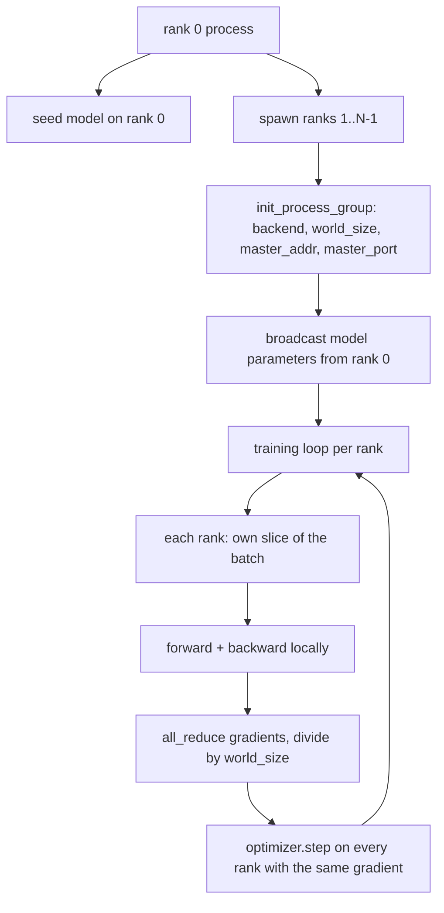
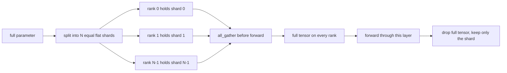

# Distributed Data Parallel và FSDP từ con số 0

> Huấn luyện đa rank (multi-rank) bao gồm hai tập hợp (collectives) và một quy tắc. Broadcast các tham số khi khởi động, trung bình hóa các gradient sau lượt backward, và đừng bao giờ để các rank bất đồng về bước (step) hiện tại.

**Type:** Build
**Languages:** Python
**Prerequisites:** Phase 19 lessons 42 to 45
**Time:** ~90 phút

## Learning Objectives

- Khởi tạo một process group trên N rank với backend `gloo`, không yêu cầu phần cứng đặc biệt.
- Triển khai một DDP wrapper tối giản thực hiện broadcast tham số khi khởi tạo và all-reduce gradient sau lượt backward.
- Chứng minh rằng việc all-reduce các gradient trên mỗi rank khớp với gradient của một tiến trình đơn lẻ trên dữ liệu đầu vào được nối lại (concatenated).
- Phác thảo cơ chế sharding tham số của FSDP: mỗi rank giữ một phần (slice), tensor đầy đủ được thu thập (gather) cho lượt forward và bị xóa bỏ sau đó.

## The Problem

Mô hình vừa vặn trên một thiết bị. Tập dữ liệu thì không. Ngân sách tối ưu hóa yêu cầu bạn phải xử lý số lượng ví dụ gấp N lần mỗi giây thời gian thực. Đòn bẩy đầu tiên là data parallel: mỗi rank chạy cùng một mô hình trên một phần khác nhau của batch, sau đó trung bình hóa gradient trước bước optimizer. Đòn bẩy thứ hai là FSDP: mô hình cũng không vừa trên một thiết bị, vì vậy mỗi rank giữ một phần của mọi tham số và tái cấu trúc các tensor đầy đủ theo từng lớp trong lượt forward.

Khó khăn nằm ở việc quản lý (bookkeeping). Nếu các tham số bị lệch giữa các rank, quá trình chạy sẽ bị hỏng một cách âm thầm. Nếu bạn trung bình hóa gradient nhưng không trung bình hóa loss, dashboard sẽ hiển thị sai. Nếu collective backend không thể thống nhất về cấu trúc liên kết (topology), quá trình chạy sẽ bị treo vĩnh viễn. Cách khắc phục là tự tay viết các collectives một lần và đừng bao giờ tin tưởng một wrapper mà bạn không thể tái hiện.

Bài học này chạy trên CPU. Không giả định có CUDA. Backend `gloo` đi kèm với mọi bản build PyTorch và chấp nhận `torch.multiprocessing` worker; cùng một mã nguồn này có thể chuyển sang `nccl` trên một node đa GPU mà không cần thay đổi cấu trúc.

## The Concept



### Hai collectives quan trọng nhất

| Collective | Chức năng | Thời điểm |
|------------|--------------|------|
| `broadcast` | Sao chép một tensor từ một rank sang tất cả các rank khác | Khởi tạo tham số, trạng thái scheduler, bất kỳ quá trình đồng bộ one-to-all nào |
| `all_reduce` | Tổng hợp (hoặc trung bình, hoặc cực đại) một tensor trên tất cả các rank, mọi rank đều nhận được kết quả | Trung bình hóa gradient sau lượt backward |
| `all_gather` | Mỗi rank đóng góp một tensor, mọi rank đều nhận được kết quả nối lại | Thu thập logits, unshard tham số FSDP |

Nguyên tắc của DDP là `broadcast` khi khởi tạo và `all_reduce` sau lượt backward. Phác thảo FSDP bổ sung thêm `all_gather` trước lượt forward của mỗi lớp.

### Gradient averaging khớp với single-process gradient

Một mô hình được huấn luyện trên một batch gồm B ví dụ qua N rank phải tạo ra cùng một gradient như một tiến trình đơn lẻ huấn luyện trên một batch kích thước N*B. Bí quyết là việc cộng các gradient của từng rank và chia cho N sẽ cho ra gradient của loss trung bình, tương đương với những gì cross entropy với mean reduction tạo ra trên toàn bộ batch. Mã nguồn bài học khẳng định điều này bằng `max-abs-diff < 1e-3` giữa gradient all-reduce thủ công và gradient tham chiếu của tiến trình đơn lẻ.

### Phác thảo FSDP



Lợi ích về bộ nhớ là chính xác: bộ nhớ cho tham số trên mỗi rank giảm xuống còn 1/N. Chi phí là thao tác gather, phải thực hiện ở mỗi lượt forward. FSDP trong môi trường thực tế (production) thực hiện gối đầu (overlap) thao tác gather với tính toán của lớp trước đó, do đó chi phí thời gian thực nhỏ hơn nhiều so với tính toán lý thuyết. Bài học này thực hiện chu trình khép kín trên mọi tham số và khẳng định việc tái cấu trúc là khớp từng bit với bản gốc.

### CPU và gloo backend

CUDA là mục tiêu cho môi trường thực tế, nhưng các luồng mã tương tự cũng tồn tại trên CPU. `gloo` là collective backend cho CPU. Nó chậm hơn `nccl` trên GPU nhiều bậc quy mô, nhưng giao diện API là giống hệt nhau. Process group trong bài học được khởi tạo với `backend="gloo"` và các rank được tạo ra (spawn) bằng `torch.multiprocessing` thay vì `torchrun`; cả hai đều dẫn đến cùng các lệnh gọi `torch.distributed`. Trên một node đa GPU, những thay đổi duy nhất là `backend="nccl"`, các device tensor, và `torchrun` để khởi chạy.

```figure
cg-allreduce-ring
```

## Build It

`code/main.py` là thành phẩm có thể chạy được.

### Bước 1: Khởi tạo process group

```python
os.environ["MASTER_ADDR"] = "127.0.0.1"
os.environ["MASTER_PORT"] = str(port)
dist.init_process_group(backend="gloo", rank=rank, world_size=world_size)
```

`MASTER_ADDR` và `MASTER_PORT` là điểm hẹn (rendezvous): mọi rank kết nối tới cùng một cổng trên cùng một máy chủ. Bài học chọn một cổng trống thông qua mẹo bind-and-close để tránh xung đột khi nhiều lượt chạy chia sẻ cùng một máy.

### Bước 2: Broadcast khi khởi tạo

`MinimalDDP.__init__` duyệt qua mọi tham số và buffer và gọi `dist.broadcast(tensor, src=0)`. Các giá trị của Rank 0 trở thành giá trị khởi tạo chuẩn. Nếu không có bước này, mỗi rank sẽ khởi tạo với seed riêng và các rank sẽ bị lệch nhau ngay từ bước đầu tiên.

### Bước 3: All-reduce gradient sau lượt backward

```python
def all_reduce_grads_(module, world_size):
    for p in module.parameters():
        if p.grad is None:
            p.grad = torch.zeros_like(p.data)
        dist.all_reduce(p.grad.data, op=dist.ReduceOp.SUM)
        p.grad.data.div_(world_size)
```

Mọi rank đều kết thúc với cùng một gradient trung bình. Bước optimizer giờ đây là một hàm của cùng một đầu vào trên mọi rank, đó là lý do tại sao các tham số luôn đồng bộ trong suốt quá trình chạy.

### Bước 4: Chứng minh sự tương đương

`manual_all_reduce_matches_single_process` xây dựng cùng một mô hình trên rank 0 và so sánh gradient sau khi all-reduce với gradient mà một tiến trình đơn lẻ sẽ tính toán trên đầu vào được nối lại. Sai số tuyệt đối tối đa (max-abs-diff) vào khoảng 1e-8.

### Bước 5: Chu trình FSDP (round trip)

`fsdp_round_trip_sketch` làm phẳng (flatten) mỗi tham số, đệm (pad) cho đến khi là bội số của `world_size`, cắt lát (slice), all-gather, và bỏ đệm (unpad). Kết quả tái cấu trúc của mọi rank đều bằng với bản gốc. Đây là bước unshard; bước ngược lại (re-shard sau lượt forward) là lấy một lát cắt từ tensor đã gather.

Chạy thử:

```bash
python3 code/main.py
```

World size mặc định là 2. Hai tiến trình CPU được tạo ra, giao tiếp với nhau qua `gloo`, và kết thúc thành công. Đầu ra `outputs/ddp-demo.json` ghi lại tổng tham số trên mỗi rank, gradient norm sau all-reduce, kết quả chu trình FSDP, và sai khác giữa gradient thủ công so với tham chiếu.

## Use It

Các hệ thống huấn luyện thực tế gọi cùng các hàm nguyên thủy (primitives) này. `DistributedDataParallel` của PyTorch bổ sung thêm: các gradient hook sau lượt backward để gối đầu all-reduce với backward, bucketed all-reduce kết hợp nhiều gradient nhỏ thành một collective duy nhất, và context `no_sync` đã sử dụng trong bài 46.

PyTorch FSDP bổ sung thêm: một flat parameter view cho mỗi lớp để mỗi rank giữ một buffer liên tục, gối đầu thao tác unshard của lớp tiếp theo với tính toán của lớp hiện tại, và tùy chọn CPU offload cho các shard.

Cấu trúc vẫn giữ nguyên: broadcast khi khởi động, reduce sau lượt backward, shard tham số khi chúng không còn vừa bộ nhớ.

## Ship It

`outputs/skill-distributed-fsdp-ddp.md` chứa công thức cho một script huấn luyện mới: khởi tạo process group với `gloo` cho CPU và `nccl` cho GPU, bao bọc mô hình trong một lớp vỏ DDP thực hiện broadcast khi khởi tạo và reduce sau lượt backward, tùy chọn shard tham số với mô hình all_gather từ phác thảo FSDP.

## Exercises

1. Chạy với `--world-size 4` và xác nhận độ lệch tham số (param spread) duy trì dưới 1e-3 trong suốt quá trình chạy.
2. Thay thế việc trung bình hóa thủ công bằng `dist.all_reduce(op=dist.ReduceOp.AVG)` và đo lường sự khác biệt về thời gian.
3. Thêm một post-backward hook vào DDP wrapper để all-reduce gối đầu với phần còn lại của backward; đo lường sự cải thiện về thời gian thực.
4. Triển khai bước re-shard của FSDP: sau lượt forward, thay thế tensor đầy đủ bằng shard cục bộ một lần nữa. Xác nhận bộ nhớ trên mỗi rank giảm xuống.
5. Chuyển backend sang `nccl` trên một máy có CUDA. Lưu ý biến môi trường nào thay đổi và biến nào giữ nguyên.

## Key Terms

| Thuật ngữ | Cách gọi thông thường | Ý nghĩa thực sự |
|------|-----------------|------------------------|
| Backend | "gloo hoặc nccl" | Thư viện triển khai các toán tử collective; gloo dành cho CPU, nccl dành cho GPU |
| World size | "Tổng số rank" | Số lượng tiến trình trong nhóm; nhóm là đơn vị mà các collectives hoạt động trên đó |
| Rank | "Worker id" | Định danh tiến trình trong nhóm, bắt đầu từ 0 |
| All-reduce | "Tổng hợp gradient" | Tổng hợp một tensor trên tất cả các rank, mọi rank kết thúc với cùng một kết quả |
| Unshard | "Gather tham số" | Tái cấu trúc tensor đầy đủ từ các phần (slices) trên mỗi rank thông qua all_gather |

## Further Reading

- Tài liệu PyTorch `torch.distributed` về ngữ nghĩa collective mà bài học này dựa trên.
- Danh sách collective của thư viện `gloo`, có cấu trúc giống hệt với các hàm nguyên thủy `nccl` hỗ trợ CUDA.
- Phase 19 bài 46 cho mô hình tích lũy gradient bao bọc DDP all-reduce trong `no_sync`.
- Phase 19 bài 47 cho cấu trúc checkpoint có thể dùng được cho cả DDP và FSDP.
- Tài liệu PyTorch FSDP cho việc triển khai thực tế cơ chế sharding tham số được phác thảo ở đây.