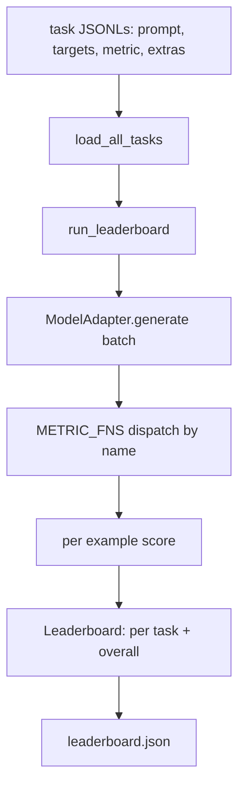
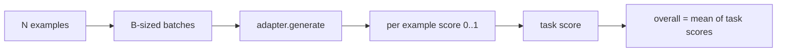

# Language Model Evaluation Harness

> Một mô hình hoạt động tốt trên một tác vụ mà bạn không thể định nghĩa là một mô hình hoạt động tốt một cách tình cờ. Harness chính là định nghĩa tác vụ, độ đo (metric), trình chạy (runner) và bảng xếp hạng (leaderboard), tất cả gói gọn trong một cấu trúc ngắn gọn và có thể thay thế linh hoạt.

**Type:** Build
**Languages:** Python
**Prerequisites:** Phase 19 lessons 42 to 45
**Time:** ~90 minutes

## Learning Objectives

- Định nghĩa một tác vụ dưới dạng tệp JSONL với `prompt`, `targets`, `metric`, và `extras` tùy chọn cho mỗi ví dụ.
- Triển khai năm độ đo (metrics): exact match, rouge-l F1, executable check, multiple choice, và substring contains.
- Xây dựng một runner thực hiện xử lý theo lô (batch) các ví dụ cho mỗi tác vụ và gửi đến một model adapter có thể thay thế được.
- Xuất ra một leaderboard JSON với điểm số theo từng tác vụ, độ trễ (latency), và một điểm trung bình tổng thể có khả năng tái lập.

## The Problem

Mỗi tuần lại có một mô hình ngôn ngữ mới ra đời. Những lời quảng cáo luôn khẳng định rằng nó hoạt động rất tốt. Câu hỏi trung thực là: tốt ở điểm nào? Câu trả lời trung thực nhất nằm ở bảng xếp hạng (leaderboard) do chính bạn viết ra, bởi vì bảng xếp hạng của nhà cung cấp là thứ họ đã tinh chỉnh để tối ưu kết quả.

Nếu không có harness trong repo, bạn sẽ so sánh hai mô hình dựa trên cảm tính (vibes). Với một harness, bạn so sánh chúng bằng điểm số trên một tập tác vụ cố định với một độ đo cố định, trên một đầu ra JSON mà bạn có thể so sánh sự khác biệt (diff). Harness là bản hợp đồng giữa lần chạy hôm qua và lần chạy hôm nay. Nếu không có nó, các lỗi suy giảm hiệu năng (regressions) sẽ bị bỏ lọt khi phát hành.

Cái bẫy ở đây là việc quá khớp (over-fitting) harness vào một mô hình duy nhất. Cách khắc phục là đảo ngược cái bẫy đó: harness phải đủ nhỏ để có thể đọc hiểu trong mười lăm phút, các tác vụ đủ nhỏ để lưu trữ trong repo, các độ đo được viết từ đầu để đồng nghiệp có thể kiểm tra (audit), và adapter là nơi duy nhất chứa mã nguồn đặc thù của mô hình. Thay đổi adapter, leaderboard thay đổi; thay đổi tác vụ, leaderboard thay đổi. Không có gì khác được phép thay đổi.

## The Concept



### Task spec

Mỗi ví dụ là một dòng JSONL:

```json
{"id": "arith-00", "prompt": "compute: 2 + 2", "targets": ["4"], "metric": "exact_match"}
```

Đối với các độ đo cần các trình hỗ trợ chấm điểm, `extras` sẽ mang theo dữ liệu bổ sung:

```json
{
  "id": "code-00",
  "prompt": "python: write a function f that doubles its input",
  "targets": ["ok"],
  "metric": "code_exec",
  "extras": {"io_pairs": [[1, 2], [3, 6]]}
}
```

Một tác vụ là một tệp `.jsonl` nằm trong thư mục `outputs/tasks/`. Tên tệp chính là tên tác vụ. Tất cả các ví dụ trong một tệp sẽ dùng chung một độ đo.

### The five fixture tasks

| Task | Metric | What it tests |
|------|--------|---------------|
| arithmetic | exact_match | Độ chính xác ở cấp độ token trên một câu trả lời xác định |
| summary | rouge_l | F1 của chuỗi con chung dài nhất so với một dòng tóm tắt tham chiếu |
| code-exec | code_exec | Kiểm tra khả năng thực thi: hàm được dự đoán phải thỏa mãn danh sách các cặp input-output |
| multiple-choice | multiple_choice | Ký tự đầu tiên của dự đoán phải khớp với một ký tự được cho phép |
| generation | substring_contains | Văn bản tự do phải chứa ít nhất một chuỗi con mục tiêu |

### The metric contract

Mỗi độ đo là một hàm từ `(prediction, targets, extras) -> float in [0.0, 1.0]`. Harness tính trung bình điểm số của từng ví dụ để có điểm số tác vụ, sau đó tính trung bình các điểm số tác vụ để có điểm tổng thể. Các hàm độ đo rất nhỏ gọn:

- `exact_match`: chuyển chữ thường, loại bỏ khoảng trắng thừa, so sánh bằng.
- `substring_contains`: chuẩn hóa tương tự, kiểm tra chuỗi con.
- `multiple_choice`: viết hoa ký tự đầu tiên.
- `rouge_l`: độ dài LCS chia cho độ dài của dự đoán và tham chiếu, tính F1 từ precision và recall.
- `code_exec`: thực thi dự đoán trong một namespace bị hạn chế, gọi `f(x)` trên mỗi cặp input-output, đếm số lần khớp.

Độ đo code_exec chạy dự đoán trong một namespace builtins đã bị lược bỏ. Bài kiểm tra của bài học khẳng định rằng `import os` sẽ bị lỗi vì `os` không có trong namespace; bạn không thể truy cập hệ thống tệp từ một dự đoán mã nguồn.

### The model adapter

```python
class ModelAdapter(Protocol):
    def generate(self, prompts: Sequence[str]) -> List[str]: ...
    @property
    def name(self) -> str: ...
```

Adapter là điểm nối (seam). Bài học cung cấp `ToyAdapter`, một trình khớp mẫu xác định luôn trả về câu trả lời đúng cho mọi prompt trong năm tác vụ mẫu. Một adapter thực tế sẽ gọi mô hình và trả về kết quả của nó. Harness không quan tâm đó là loại nào.

### The runner

`run_task` xử lý theo lô `batch_size` prompt mỗi lần và gửi đến hàm độ đo. `run_leaderboard` duyệt qua mọi tác vụ và tính trung bình. `write_leaderboard` xuất ra JSON với một chuỗi schema để các thay đổi định dạng trong tương lai không làm hỏng các dashboard một cách âm thầm.



```figure
eval-harness-matrix
```

## Build It

`code/main.py` là thành phần có thể chạy được.

### Step 1: seed fixture tasks

`seed_fixture_tasks(target_dir)` ghi năm tệp `.jsonl`. Lần chạy đầu tiên của `main.py` sẽ khởi tạo chúng khi thư mục còn trống.

### Step 2: load tasks

`load_all_tasks(task_dir)` đọc mọi `.jsonl` và trả về một dict từ tên tác vụ đến danh sách các bản ghi `Example`. Các dòng chú thích bắt đầu bằng `#` và các dòng trống sẽ bị bỏ qua để người đóng góp có thể ghi chú vào tệp.

### Step 3: implement metrics

Mỗi độ đo là một hàm nhỏ đi kèm với một unit test. Bộ kiểm tra của bài học bao gồm 13 trường hợp bao quát việc chuẩn hóa, khớp một phần, thực thi mã và từ chối mã không an toàn.

### Step 4: write the runner

`run_task` lặp qua các lô và tạo ra một `TaskResult` với điểm số, số lượng đúng, tổng số lượng và độ trễ. `run_leaderboard` duyệt qua tất cả các tác vụ và tạo ra một `Leaderboard` với điểm trung bình tổng thể.

### Step 5: emit JSON

`write_leaderboard` tuần tự hóa bảng xếp hạng. Cờ `--include-per-example` sẽ xuất các bản ghi chi tiết cho từng ví dụ để bạn có thể so sánh sự khác biệt của dự đoán so với lần chạy trước khi điểm số thay đổi.

Chạy thử:

```bash
python3 code/main.py
```

Script sẽ khởi tạo các dữ liệu mẫu trong lần chạy đầu tiên, chấm điểm chúng với toy adapter (vốn sẽ trả lời đúng mọi câu hỏi mẫu) và ghi vào `outputs/leaderboard.json`. Điểm tổng thể là 1.0 với toy adapter; bài kiểm tra stub adapter trong `test_main.py` cho thấy cùng một harness đó sẽ tạo ra điểm 0.0 khi adapter không thể trả lời.

## Use It

Để kết nối một mô hình thực thụ, hãy viết một adapter. Cấu trúc như sau:

```python
class HttpAdapter:
    name = "vendor.v1"

    def __init__(self, endpoint, api_key):
        self.endpoint = endpoint
        self.api_key = api_key

    def generate(self, prompts):
        out = []
        for prompt in prompts:
            response = http_post(self.endpoint, prompt, self.api_key)
            out.append(response["text"])
        return out
```

Thay thế `ToyAdapter` bằng `HttpAdapter` ở đầu tệp `main()`. Harness, các tác vụ, các độ đo và bảng xếp hạng vẫn giữ nguyên.

Ba quy tắc cần thực thi khi triển khai harness trong một dự án thực tế:

- **Ghim các tệp tác vụ (Pin the task files).** Tệp leaderboard.json phải mang theo mã hash của nội dung tác vụ hoặc đi kèm với các tệp JSONL; nếu không, điểm số sẽ thay đổi khi tệp tác vụ thay đổi và bạn sẽ không biết nguyên nhân do đâu.
- **So sánh dự đoán, không chỉ điểm số (Diff predictions).** Cờ `--include-per-example` cho phép bạn xem mô hình đã trả lời những gì vào ngày điểm số bị sụt giảm.
- **Giới hạn kích thước lô (Cap the batch size).** Các adapter thực tế thường có giới hạn tốc độ (rate limits). Kích thước lô nhỏ giúp harness tương thích với nhiều nhà cung cấp khác nhau.

## Ship It

`outputs/skill-lm-eval-harness.md` chứa công thức: đặc tả tác vụ JSONL, năm độ đo, adapter có thể thay thế, runner xử lý theo lô, leaderboard JSON với chuỗi schema. Các tệp tác vụ trong `outputs/tasks/` là các dữ liệu mẫu; hãy sao chép chúng vào dự án thực tế để bắt đầu.

## Exercises

1. Thêm tác vụ thứ sáu với một độ đo tùy chỉnh do bạn tự viết (khớp kiểu BLEU, chấm điểm tham chiếu kiểu BLEURT, hoặc bất kỳ thứ gì có quy tắc rõ ràng).
2. Mở rộng `code_exec` để bắt được stdout và chấp nhận một danh sách các stdout mong đợi làm mục tiêu.
3. Thêm lệnh so sánh bảng xếp hạng (leaderboard diff): cho hai tệp `leaderboard.json`, in ra những tác vụ nào có thay đổi và thay đổi bao nhiêu.
4. Giới hạn độ trễ cho mỗi ví dụ. Bao bọc lời gọi adapter trong một timeout; hiển thị một cột `timeouts` riêng biệt trong bảng xếp hạng.
5. Ghim nội dung tác vụ bằng sha256 trong bảng xếp hạng để người xem sau này có thể xác minh họ đang chấm điểm trên cùng một tập tác vụ.

## Key Terms

| Term | What people say | What it actually means |
|------|-----------------|------------------------|
| Task spec | "Định dạng đánh giá" | Tệp JSONL với prompt, targets, metric, và các phần bổ sung tùy chọn cho mỗi ví dụ |
| Metric | "Cách chấm điểm" | Hàm nhận vào (prediction, targets, extras) và trả về một số thực trong khoảng [0, 1] |
| Adapter | "Model client" | Đối tượng có phương thức generate(prompts) -> list[str]; nơi duy nhất chứa mã đặc thù của mô hình |
| Leaderboard | "Bảng điểm" | JSON chứa điểm số từng tác vụ, tổng số lượng, độ trễ và điểm trung bình tổng thể |
| Code exec metric | "Chạy thử và kiểm tra" | Thực thi dự đoán trong một namespace bị hạn chế, so sánh với các cặp input-output |

## Further Reading

- lm-evaluation-harness gốc để tham khảo bản production, lớn hơn nhiều nhưng cùng cấu trúc.
- lighteval của HuggingFace cho một cách triển khai khác của cùng một quy trình.
- Phase 19 lesson 46 nói về các mô hình tích lũy gradient (gradient accumulation) được sử dụng trong stack huấn luyện mà harness này chấm điểm.
- Phase 19 lesson 47 nói về định dạng checkpoint mà bạn chấm điểm; hãy ghim hash của checkpoint trong bảng xếp hạng.
- Phase 19 lesson 48 nói về stack huấn luyện phân tán đã tạo ra mô hình đang được kiểm thử.