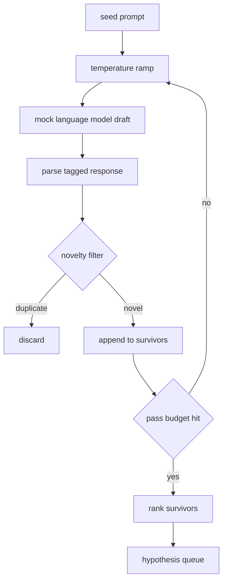

# Hypothesis Generator

> Một agent nghiên cứu hỏi cùng một câu hỏi hai lần là đang lãng phí token. Bí quyết là ép mỗi bản nháp phải hướng tới một điểm mới.

**Type:** Build
**Languages:** Python
**Prerequisites:** Phase 19 Track A lessons 20-29
**Time:** ~90 minutes

## Learning Objectives
- Điều khiển một sampler từ một seed prompt và chuyển đổi đầu ra của nó thành các bản ghi giả thuyết có kiểu dữ liệu (typed).
- Tăng dần temperature của sampler trong mỗi lượt để bản nháp tiếp theo lệch xa hơn so với bản nháp trước đó.
- Lọc các bản sao gần giống nhau bằng một embedding model nhỏ và ngưỡng khoảng cách cosine.
- Xếp hạng các bản ghi còn lại bằng một hàm chấm điểm kết hợp tính mới (novelty), tính cụ thể (specificity) và tính khả thi trong kiểm thử (testability).
- Giữ cho mọi bước đều mang tính deterministic để cùng một seed luôn tạo ra cùng một hàng đợi.

## Why generate, then filter

Một planner chỉ hỏi một model một lần sẽ nhận được một giả thuyết. Điều này ổn đối với một ví dụ minh họa. Nhưng đối với một vòng lặp nghiên cứu (research loop), nó không đúng cấu trúc. Vòng lặp cần một hàng đợi có thứ tự và có chiều sâu, để khi giả thuyết đầu tiên thất bại, runner đã có sẵn giả thuyết tiếp theo mà không cần tốn chi phí cho một lượt lấy mẫu (sampling pass) đầy đủ khác.

Hai ý tưởng kết hợp để tạo ra hàng đợi đó. Thứ nhất là temperature ramping: mỗi lượt chạy qua sampler sẽ tăng temperature lên một mức, khuyến khích các bản nháp sau này "đi chệch" hướng hơn. Thứ hai là novelty filtering: sau mỗi bản nháp, generator đo khoảng cách embedding so với mọi bản ghi đã được chấp nhận trước đó và loại bỏ bất kỳ thứ gì nằm trong cụm (cluster).

Bài học này cung cấp một mock language model trả về các chuỗi token được kịch bản hóa cho các prompt cố định. Mock model này là đủ để thực hành toàn bộ quy trình: nhận seed prompt, áp dụng temperature ramp, parse các ứng viên, chạy novelty filter, và xuất ra hàng đợi đã xếp hạng.

## The Hypothesis shape

```text
Hypothesis
  id             : int           (monotonic within a run)
  text           : str           (the claim)
  variables      : list[str]     (what changes between conditions)
  metric         : str           (what the runner will measure)
  baseline_ref   : str | None    (which paper or run the comparison cites)
  draft_pass     : int           (which sampler pass produced this)
  temperature    : float         (the sampler setting at draft time)
  novelty_score  : float         (distance from prior survivors, 0..1)
  rank_score     : float         (weighted sum used for ordering)
```

`variables` và `metric` không phải là văn bản tự do. Parser sẽ trích xuất chúng từ một phản hồi có gắn thẻ (tagged response). Runner trong bài học số 52 sẽ đọc trực tiếp các trường này khi xây dựng cấu hình thí nghiệm (experiment config).

`baseline_ref` là tùy chọn nhưng được khuyến khích. Bộ đánh giá (evaluator) trong bài học số 53 cần một baseline để so sánh. Nếu giả thuyết bỏ qua trường này, evaluator sẽ quay lại sử dụng lượt chạy trước đó trên cùng một metric.

```figure
cg-novelty-ramp
```

## Architecture



Vòng lặp này khá đơn giản. Phần thú vị là mỗi hộp (box) đều có một ràng buộc (hard contract) chặt chẽ.

## Temperature ramp

Bắt đầu tại `t_min`, kết thúc tại `t_max`, bước nhảy `(t_max - t_min) / (n_passes - 1)`. Mỗi lượt gọi sampler ở temperature hiện tại, tạo ra `n_passes` giá trị cách đều nhau từ `GeneratorConfig.schedule()`. Mock model tuân thủ temperature bằng cách chuyển đổi giữa một tập hợp nhỏ các phản hồi được kịch bản hóa dựa trên `(prompt, temp_bucket)`. Các khoảng (buckets) là khoảng hở (open intervals), vì vậy một thay đổi nhỏ trong temperature sẽ chọn một bucket khác và tạo ra một bản nháp khác. Trong môi trường production, sampler sẽ là một model thực thụ với `temperature=t` được truyền vào.

Lịch trình mặc định là sáu lượt từ `0.2` đến `1.2`. Sáu là đủ để lấp đầy hàng đợi mà không phải trả phí cho các mẫu mà novelty filter dù sao cũng sẽ loại bỏ. Dưới `0.2`, model sẽ lặp lại seed prompt. Trên `1.2`, các phản hồi có xu hướng đi chệch chủ đề và khiến parser thất bại.

## Novelty filter

Sau khi mỗi bản nháp được parse, generator sẽ embed văn bản và so sánh với mọi giả thuyết đã được chấp nhận. Embedding là một hashed bag of word tokens nhỏ, được chuẩn hóa về độ dài đơn vị (unit length). Khoảng cách cosine giữa hai vector đơn vị là `1 - dot(a, b)`. Một bản nháp được thông qua nếu khoảng cách tối thiểu của nó tới bất kỳ bản ghi nào trước đó lớn hơn `novelty_threshold`. Mặc định là `0.25`.

Hashed embedding này không hề phức tạp. Nó mang tính deterministic, không có phụ thuộc (zero dependencies), và đủ để bắt được các trường hợp rõ ràng: hai bản nháp chia sẻ hầu hết các danh từ. Một triển khai production sẽ thay thế bằng một sentence model nhỏ. Interface vẫn giữ nguyên.

## Rank score

```text
rank_score = w_novelty * novelty_score
           + w_specificity * specificity_score
           + w_testability * testability_score
```

Ba điểm thành phần. `novelty_score` là khoảng cách embedding tối thiểu từ các bản ghi trước đó. `specificity_score` là số lượng các biến cụ thể trong giả thuyết chia cho một số lượng mục tiêu. `testability_score` bằng 1 nếu giả thuyết chỉ định cả metric và baseline, bằng 0.5 nếu chỉ có metric, và bằng 0 nếu không có cả hai.

Các trọng số mặc định là `0.4`, `0.3`, `0.3`. Các trọng số này nằm trong cấu hình generator để bài học sau có thể thay đổi chúng mà không cần fork mã nguồn.

## Mock language model

```python
class MockLLM:
    def sample(self, prompt: str, temperature: float, seed: int) -> str:
        ...
```

Sampler mang tính deterministic khi có bộ ba `(prompt, temperature, seed)`. Mock model duy trì một bảng phản hồi kịch bản dựa trên `(prompt_signature, temperature_bucket)`. Nếu bảng không có mục nhập cho một key, sampler sẽ trả về một fallback khiến parser thất bại. Nhánh fallback này được kiểm tra bởi một trong các test.

Seed được trộn vào phản hồi để cùng một cặp `(prompt, temperature)` với các seed khác nhau sẽ tạo ra các bản nháp khác nhau. Trong các test, chúng ta cố định seed để giữ cho kết quả có thể tái lập. Trong triển khai thực tế, seed sẽ đến từ đồng hồ hệ thống hoặc một bộ đếm.

## Output queue

Đầu ra là một danh sách các bản ghi `Hypothesis` được sắp xếp theo `rank_score` giảm dần. Runner trong bài học số 52 lấy phần tử đầu hàng đợi (head), chạy thí nghiệm, và evaluator trong bài học số 53 ghi lại phán quyết (verdict). Nếu phán quyết nói rằng giả thuyết sai, runner sẽ lấy phần tử tiếp theo.

Hàng đợi là hữu hạn. Khi nó trống, orchestrator có thể mở rộng seed prompt và chạy lại generator hoặc dừng lại và báo cáo rằng ngân sách đã cạn kiệt.

## How to read the code

`code/main.py` định nghĩa `Hypothesis`, `MockLLM`, `HypothesisGenerator`, và một bản demo mang tính deterministic. Generator cung cấp một phương thức `run(seed_prompt)` duy nhất trả về một hàng đợi đã sắp xếp; số lượt chạy được đọc từ `GeneratorConfig.n_passes` thay vì được truyền vào như một đối số. Embedding là một hashed bag of tokens. Novelty filter là một hàm duy nhất. Rank score là một hàm duy nhất. Không có gì phụ thuộc vào `numpy`; các phép toán embedding là thư viện chuẩn (stdlib) thuần túy để bài học luôn có tính di động (portable).

`code/tests/test_generator.py` bao quát luồng xử lý tuyến tính, luồng từ chối bản sao, luồng thất bại của parser, các ranh giới của temperature ramp, và thứ tự xếp hạng.

## Where this slots in

Bài học số 50 tạo ra hàng đợi. Bài học số 51 lấy phần tử đầu hàng đợi và thực hiện tìm kiếm tài liệu (literature search) để xác nhận hoặc bác bỏ nó. Bài học số 52 lấy cùng phần tử đó và thực hiện một thí nghiệm thực tế. Bài học số 53 đọc cả hai đầu ra và viết một phán quyết. Bốn bài học này kết hợp thành một vòng lặp nghiên cứu (research loop) không có con người can thiệp; con người có thể tham gia vào bất kỳ ranh giới nào.