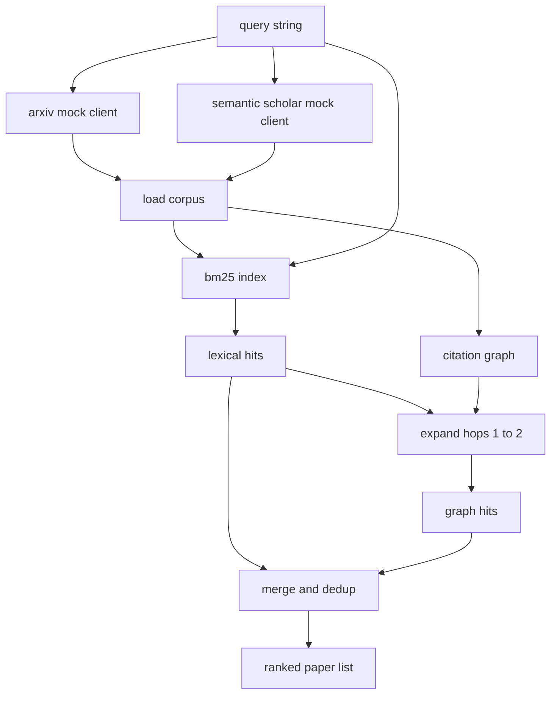

# Literature Retrieval

> Một giả thuyết thì rẻ tiền. Biết được liệu ai đó đã chứng minh nó chưa mới là phần đắt giá. Hãy xây dựng lớp truy xuất để trả lời câu hỏi đó trước khi runner khởi chạy sandbox.

**Type:** Build
**Languages:** Python
**Prerequisites:** Phase 19 Track A lessons 20-29
**Time:** ~90 phút

## Learning Objectives
- Mô hình hóa một bản ghi bài báo nhỏ với các trường mà vòng lặp sẽ đọc ở phía hạ nguồn (downstream).
- Xây dựng một index BM25 trên các bản tóm tắt (abstracts) chỉ sử dụng các cấu trúc dữ liệu thư viện chuẩn (stdlib).
- Duyệt đồ thị trích dẫn để tìm ra các bài báo mà tìm kiếm từ vựng (lexical search) đã bỏ lỡ.
- Loại bỏ trùng lặp (deduplicate) các kết quả tìm được qua các lượt tìm kiếm từ vựng và đồ thị bằng ID bài báo cố định.
- Bao bọc (wrap) hai API bên ngoài giả lập đằng sau một client duy nhất để vị trí gọi ở phía thượng nguồn (upstream) không thay đổi khi các endpoint thực tế được triển khai.

## Why two retrieval passes

Việc tìm kiếm từ khóa trên các bản tóm tắt trả về các bài báo có chung từ vựng với truy vấn. Điều này bao phủ hầu hết bề mặt. Nó bỏ lỡ hai trường hợp. Thứ nhất là khi bài báo nền tảng sử dụng từ vựng khác; ví dụ: một truy vấn cho "sparse attention" sẽ bỏ lỡ bài báo có tiêu đề "block selection in transformer routing." Thứ hai là khi bài báo liên quan là một phần tiếp nối trích dẫn một mỏ neo (anchor) đã biết; việc tìm mỏ neo và đi tiếp sẽ hiệu quả hơn là vét cạn (brute force) kho tóm tắt.

Bài học này xây dựng cả hai lượt. BM25 trên các bản tóm tắt bắt được các kết quả khớp về từ vựng. Một quá trình duyệt đồ thị trích dẫn mở rộng tập hợp hạt giống (seed set) tiến và lùi một hoặc hai bước (hops). Kết quả hợp nhất được loại bỏ trùng lặp theo ID bài báo và được xếp hạng bởi một điểm số kết hợp nhỏ.

## The Paper shape

```text
Paper
  id          : str           (stable identifier, "p001" for the mock corpus)
  title       : str
  abstract    : str
  year        : int
  authors     : list[str]
  references  : list[str]     (paper ids this paper cites)
  citations   : list[str]     (paper ids that cite this paper)
  source      : str           (which mock api supplied it, "arxiv" or "s2")
```

Các trường references và citations tạo thành đồ thị trích dẫn có hướng. Hai API giả lập trả về các trường chồng lấn nhưng không giống hệt nhau, vì vậy bộ nạp kho dữ liệu (corpus loader) sẽ hợp nhất chúng trên `id`.

```figure
cg-citation-hops
```

## Architecture



Retrieval client sở hữu cả hai lượt truy xuất và việc hợp nhất. Bên gọi đưa cho nó một truy vấn và nhận lại một danh sách đã xếp hạng, trong đó mỗi mục mang các trường điểm số cho từng bài báo (`bm25_score`, `graph_distance`, `recency_score`, `final_score`) để giải thích thứ hạng.

## BM25 from scratch

Bản thực thi là Okapi BM25 tiêu chuẩn với các tham số mặc định `k1=1.5`, `b=0.75`. Index gồm hai dictionary: `term -> doc_frequency` và `term -> list of (doc_id, term_count)`. Độ dài tài liệu là số lượng token của bản tóm tắt. Độ dài tài liệu trung bình được tính toán một lần tại thời điểm xây dựng index. Việc tính điểm một truy vấn là tổng các số hạng truy vấn của `idf * tf_norm`, trong đó `tf_norm` là tần suất thuật ngữ (term frequency) chuẩn hóa theo độ dài BM25 tiêu chuẩn.

Tokeniser là `lower` sau đó tách theo các ký tự không phải chữ cái và số (non-alphanumeric). Nó không được thực hiện stemming. Một hệ thống thực tế sẽ thay thế bằng một bộ stemmer nhỏ. Giao diện vẫn giữ nguyên.

```text
idf(t)      = log((N - df + 0.5) / (df + 0.5) + 1.0)
tf_norm(t)  = (f * (k1 + 1)) / (f + k1 * (1 - b + b * dl / avgdl))
score(d, q) = sum over t in q of idf(t) * tf_norm(t)
```

## Citation graph traversal

Đồ thị được xây dựng một lần từ kho dữ liệu. Các cạnh tiến (forward edges) đi từ một bài báo đến các tài liệu tham khảo của nó. Các cạnh lùi (backward edges) đi từ một bài báo đến các trích dẫn của nó. Việc duyệt là tìm kiếm theo chiều rộng (breadth first search) được gieo mầm bởi các kết quả BM25 hàng đầu, giới hạn ở hai bước (hops).

Hai bước là một mức trần có chủ đích. Một bước là quá nông; agent thường muốn tìm tổ tiên hoặc hậu duệ trực tiếp. Ba bước làm bùng nổ kích thước kết quả trên một đồ thị liên thông và có xu hướng đi chệch chủ đề. Bài học này để lộ giới hạn bước như một nút cấu hình (config knob) để vòng lặp hạ nguồn có thể thắt chặt nó.

## Dedup and ranking

Hai lượt trả về các tập hợp chồng lấn. Việc hợp nhất dựa trên ID bài báo. Đối với mỗi bài báo, điểm số cuối cùng là một sự pha trộn có trọng số.

```text
final_score = w_bm25 * bm25_score_norm
            + w_graph * graph_score
            + w_recency * recency_score
```

`bm25_score_norm` là điểm BM25 chia cho điểm BM25 tối đa trong tập hợp đã hợp nhất (để trường này nằm trong khoảng từ 0 đến 1). `graph_score` là 1 cho các kết quả khớp từ vựng trực tiếp, sau đó là `0.6` cho một bước, `0.3` cho hai bước, và bằng 0 nếu không phải. `recency_score` là một dốc tuyến tính từ 0 tại năm nhỏ nhất trong kho dữ liệu đến 1 tại năm lớn nhất.

Các trọng số mặc định là `0.5`, `0.3`, `0.2`. Các trọng số này là cấu hình; một chủ đề cũ có thể điều chỉnh độ mới (recency) xuống trong khi một chủ đề đang phát triển nhanh sẽ tăng nó lên.

## Mock corpus

Kho dữ liệu gồm một trăm bài báo, được tạo bởi `build_corpus()`. Mỗi bài báo có tiêu đề và bản tóm tắt được viết tay về một trong năm chủ đề: attention sparsity, retrieval augmentation, low rank adapters, dataset distillation, và evaluation harnesses. Các tham khảo và trích dẫn được kết nối sao cho mỗi chủ đề tạo thành một đồ thị con liên thông với một vài cạnh xuyên chủ đề.

Hai mock API client (`ArxivMockClient`, `SemanticScholarMockClient`) đọc từ cùng một kho dữ liệu nhưng để lộ các trường khác nhau. Arxiv trả về tiêu đề, bản tóm tắt, năm, tác giả. Semantic Scholar thêm các tham khảo và trích dẫn. Retrieval client hợp nhất theo ID; việc xử lý sự không đồng nhất giữa các trường của các client khác nhau được hoãn lại cho bài học tiếp theo.

## What lessons 52 and 53 read

Runner trong bài học số 52 đọc `paper.id`, `paper.title`, và ba câu đầu tiên của bản tóm tắt làm ngữ cảnh cho thí nghiệm. Người đánh giá (evaluator) trong bài học số 53 đọc `paper.year` và `paper.references` để quy kết một baseline cho một bài báo cụ thể.

Retrieval client trả về một `RetrievalResult` với cả danh sách đã xếp hạng và các chỉ số cho mỗi truy vấn: số lượng kết quả (hit count), điểm số trung bình, điểm số cao nhất, tổng thời gian thực tế (wall time). Runner ghi nhật ký các thông số này để một lượt quan sát (observability pass) ở hạ nguồn có thể vẽ biểu đồ chất lượng theo thời gian.

## How to read the code

`code/main.py` định nghĩa `Paper`, `ArxivMockClient`, `SemanticScholarMockClient`, `BM25Index`, `CitationGraph`, `RetrievalClient`, và một bản demo xác định (deterministic). Các mock client và kho dữ liệu nằm trong cùng một tệp để bài học luôn có tính di động. Bản thực thi BM25 là một class, sáu mươi dòng. Việc duyệt đồ thị là một method.

`code/tests/test_retrieval.py` bao phủ đường dẫn từ vựng, đường dẫn đồ thị, việc hợp nhất, loại bỏ trùng lặp, và truy vấn trống.

## Where this slots in

Bài học số 50 tạo ra một giả thuyết. Bài học số 51 tìm kiếm tài liệu để xem liệu giả thuyết đó đã được giải quyết chưa. Bài học số 52 chạy thí nghiệm nếu nó chưa được giải quyết. Bài học số 53 đọc cả kết quả truy xuất và các chỉ số thí nghiệm để đưa ra phán quyết. Retrieval client là giai đoạn rẻ nhất trong bốn giai đoạn và chạy đầu tiên trong bộ điều phối (orchestrator).