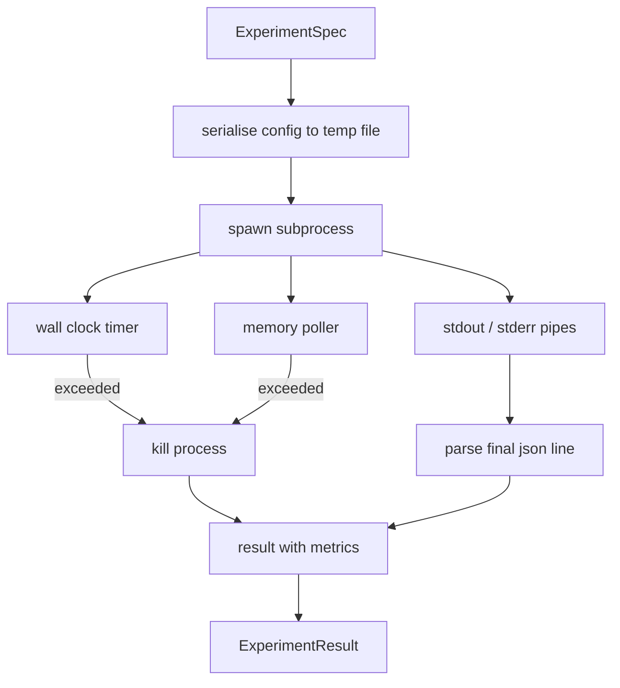

# Experiment Runner

> Vòng lặp chỉ trung thực khi các phép đo của nó trung thực. Hãy xây dựng runner nhận một spec, thực thi nó trong một subprocess được sandbox hóa, và xuất ra một blob metrics json mà evaluator có thể tin cậy.

**Type:** Build
**Languages:** Python
**Prerequisites:** Phase 19 Track A lessons 20-29
**Time:** ~90 minutes

## Learning Objectives
- Mã hóa một experiment dưới dạng một typed spec mà runner có thể serialise sang một subprocess.
- Khởi chạy một subprocess với giới hạn thời gian thực (wall clock timeout) cứng và giới hạn bộ nhớ (memory cap) mềm, đồng thời hiển thị cả hai như các điều kiện kết thúc (terminal conditions).
- Ghi lại stdout, stderr và blob metrics có cấu trúc vào một bản ghi kết quả duy nhất.
- Xây dựng một bảng ablation thực hiện sweep từng cấu hình (knob) một tại một thời điểm dựa trên một base spec cố định.
- Giữ cho mọi kết quả mang tính deterministic dựa trên một seed để evaluator thấy cùng một con số qua các lần chạy.

## Why a subprocess

Một vòng lặp nghiên cứu chạy mã không đáng tin cậy. Giả thuyết đến từ một sampler, script experiment đến từ cùng một đường dẫn; việc coi cả hai là an toàn trong cùng một process (in-process) có thể dẫn đến crash làm sập cả orchestrator. Subprocesses là hình thức cô lập đơn giản nhất mà ngôn ngữ cung cấp: một process riêng biệt, một không gian địa chỉ độc lập, một signal handle ở phía parent.

Runner ở đây không triển khai sandboxing đầy đủ. Không có cgroup, no seccomp filter, không có namespace remapping. Những gì nó có là một wall clock timeout, một vòng lặp polling cho sự tăng trưởng bộ nhớ, và một kill path để chấm dứt process khi chạm một trong hai giới hạn. Đó là runtime contract mà mọi sandbox phức tạp hơn đều mở rộng. Bài học này giữ cho contract đủ nhỏ để có thể đọc hết trong một lần.

## The ExperimentSpec shape

```text
ExperimentSpec
  spec_id        : str            (stable id, "exp_001")
  hypothesis_id  : int            (link back to the queue from lesson 50)
  script_path    : str            (path to the python script to run)
  config         : dict           (passed to the script as one json arg)
  seed           : int            (deterministic seed for the experiment)
  wall_timeout_s : float          (hard timeout, killed on exceed)
  memory_cap_mb  : int            (soft cap, polled; killed on exceed)
  metric_keys    : list[str]      (which fields the evaluator will read)
```

Script nằm trên đĩa; runner ghi config vào một đường dẫn file tạm thời mà script sẽ đọc. Script được kỳ vọng sẽ in một dòng json duy nhất ra stdout với các key là một tập siêu (superset) của `metric_keys`. Bất kỳ thứ gì khác trên stdout đều được ghi lại nhưng bị metrics parser bỏ qua.

```figure
cg-runner-limits
```

## Architecture



Runner là một class với một phương thức chính. Poller là một thread nhỏ thức dậy sau mỗi khoảng thời gian poll và đọc giá trị tương đương `psutil` của subprocess từ proc filesystem khi có sẵn, và không thực hiện gì (no op) khi nền tảng không hỗ trợ.

## Why a soft memory cap

Giới hạn bộ nhớ cứng (hard memory caps) cần `resource.setrlimit` và chỉ hoạt động trên POSIX. Bài học này cung cấp một cách tiếp cận đa nền tảng (portable): poll resident set size từ nền tảng và kill subprocess nếu nó vượt quá giới hạn. Giới hạn này là "mềm" vì poller có một khoảng thời gian nghỉ (interval) khác không; một process có thể tăng vọt quá giới hạn giữa các lần poll và sau đó giảm xuống. Runner ghi lại RSS tối đa quan sát được để evaluator có thể thấy lần chạy đó đã tiến gần đến giới hạn như thế nào.

Trên các hệ thống không hỗ trợ kiểm tra process (process inspection), poller sẽ log một cảnh báo một lần và tự vô hiệu hóa. Wall clock timeout vẫn được áp dụng. Các bài test trong bài học bao gồm cả hai trường hợp.

## Capturing stdout and stderr

Runner đọc cả hai pipe sau khi hoàn tất. Stdout được quét từng dòng; dòng cuối cùng có thể parse thành json với tất cả `metric_keys` bắt buộc sẽ được lấy làm metrics blob. Các dòng json trước đó được giữ lại trong kết quả dưới dạng `intermediate_metrics`; evaluator có thể sử dụng chúng cho các đường cong học tập (learning curves).

Stderr được ghi lại nguyên văn vào kết quả. Runner không bao giờ raise exception khi exit code khác không; thay vào đó, nó ghi lại code đó trong kết quả. Bất kỳ exit code nào khác không đều được gắn nhãn `"crash"` ngay cả khi script đã in ra metrics, vì vậy evaluator sẽ mặc định coi các lần chạy không hoàn chỉnh là thất bại.

## Ablation table

```python
def ablate(base: ExperimentSpec, knob: str, values: list[Any]) -> list[ExperimentSpec]:
    ...
```

Với một base spec và một tên knob, helper sẽ trả về một spec cho mỗi giá trị với `config[knob]` được ghi đè. Mỗi spec nhận một `spec_id` phái sinh (`f"{base.spec_id}_{knob}_{value}"`). Runner cung cấp một `AblationRunner` để chạy chúng theo thứ tự và trả về một `AblationTable` được đánh key theo giá trị của knob.

Tại sao lại là một knob tại một thời điểm. Các đợt sweep toàn bộ các tổ hợp (full factorial sweeps) sẽ bùng nổ theo cấp số nhân và tạo ra các kết quả mà evaluator không thể diễn giải. Một knob tại một thời điểm tạo ra một trục sạch (clean axis) mà evaluator có thể vẽ biểu đồ. Bài học này hỗ trợ sweep nhiều knob chỉ dưới dạng các ablation đơn lẻ lặp lại, được cấu thành bởi caller.

## Determinism

Mọi spec đều mang một seed. Runner chuyển seed tới script thông qua config dict (`config["__seed"] = spec.seed`). Các mock experiment script trong `code/experiments/` tuân thủ seed và tạo ra các metrics giống hệt nhau qua các lần chạy. Evaluator trong bài học năm mươi ba phụ thuộc vào điều này; nếu không có tính deterministic, một "sự thụt lùi" (regression) có thể chỉ là do một khởi tạo ngẫu nhiên khác nhau.

## The mock experiment script

Bài học cung cấp một experiment script: `code/experiments/sparsity_experiment.py`. Đó là một script thực thụ đọc file config của nó, mô phỏng một lượt training nhỏ với một NumPy random pass, và in ra một json metrics blob. Script tuân thủ một knob `sleep_s` để test timeout và một knob `allocate_mb` để test memory poller.

Việc mô phỏng không training bất cứ thứ gì thực tế. Nó là một tính toán số học mô phỏng hình thái của một vòng lặp training: một loss curve, một perplexity cuối cùng, một wall time. Mục tiêu của bài học là runner, không phải việc mô phỏng. Một experiment script thực tế sẽ import một model.

## Result shape

```text
ExperimentResult
  spec_id              : str
  hypothesis_id        : int
  exit_code            : int
  terminal             : "ok" | "timeout" | "oom" | "crash"
  wall_time_s          : float
  peak_rss_mb          : float | None
  metrics              : dict
  intermediate_metrics : list[dict]
  stdout_tail          : str
  stderr_tail          : str
```

Evaluator đọc `metrics` và `terminal` trước. Nếu terminal là bất kỳ thứ gì khác ngoài `"ok"`, experiment được tính là một lần chạy thất bại và phán quyết của evaluator là tự động. Nếu không, các metrics sẽ được chuyển qua significance test.

## How to read the code

`code/main.py` định nghĩa `ExperimentSpec`, `ExperimentResult`, `ExperimentRunner`, `AblationRunner`, và một bản demo deterministic. Việc quản lý subprocess nằm trong một class. Memory poller là một thread nhỏ. Ablation helper là một hàm duy nhất.

`code/experiments/sparsity_experiment.py` là mock experiment được sử dụng trong các bài test. Nó đọc đường dẫn file config từ argv và ghi một dòng json metrics duy nhất khi hoàn tất.

`code/tests/test_runner.py` bao quát success path, timeout path, crash path, ablation table, và kiểm tra tính determinism qua hai lần chạy.

## Where this slots in

Bài học năm mươi tạo ra giả thuyết. Bài học năm mươi mốt lọc ra bất cứ thứ gì mà tài liệu nghiên cứu đã giải quyết xong. Bài học năm mươi hai chạy experiment cho những gì còn lại. Bài học năm mươi ba đọc kết quả, chạy significance test, và viết phán quyết mà orchestrator lưu trữ cùng với hypothesis id.