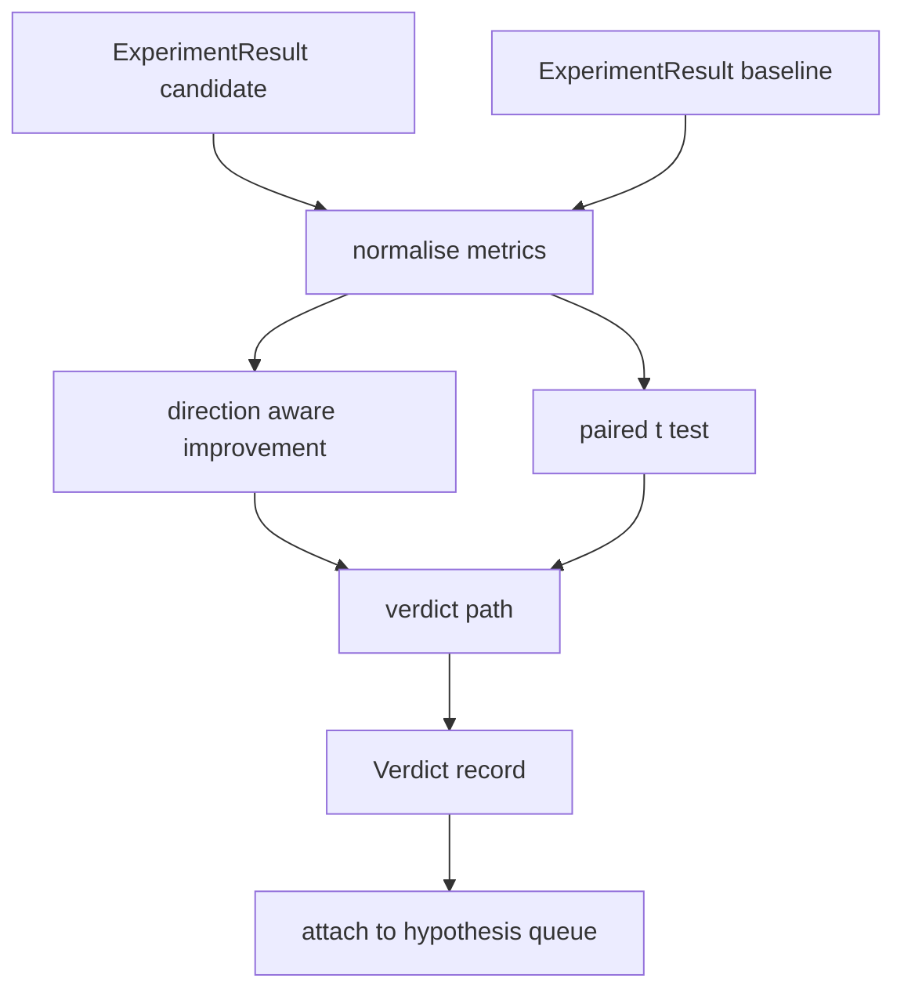

# Result Evaluator

> Runner tạo ra các con số. Evaluator quyết định xem những con số đó là sự cải thiện, thụt lùi hay nhiễu. Xây dựng luồng phán quyết (verdict path) để biến các metric thành một kết luận ngắn gọn trên một dòng.

**Type:** Build
**Languages:** Python
**Prerequisites:** Phase 19 Track A lessons 20-29
**Time:** ~90 minutes

## Learning Objectives
- So sánh một candidate run với baseline bằng cách sử dụng cải thiện có nhận biết hướng (direction aware improvement) và một ngưỡng cố định (fixed threshold).
- Thực hiện một paired t-test từ đầu (from scratch) trên các metric theo từng seed và đọc giá trị p-value kết quả.
- Chuẩn hóa các metric theo thang log để báo cáo hạ nguồn có thể kết hợp chúng với các metric tuyến tính (linear metrics).
- Đưa ra phán quyết cho mỗi giả thuyết (hypothesis) mà orchestrator có thể đính kèm vào hàng đợi từ bài học số 50.
- Giữ cho mọi bước đều là hàm thuần túy (pure) để cùng một đầu vào luôn tạo ra cùng một phán quyết.

## Why a paired test

Một con số duy nhất từ runner không nói lên được liệu thay đổi đó có thực sự hiệu quả hay không. Cùng một cấu hình với seed khác nhau sẽ cho ra perplexity khác nhau. Thay đổi đó có thể là nhiễu. Cách so sánh đúng đắn là so sánh cặp (paired): cùng các seed với cùng dữ liệu, chạy một lần với candidate và một lần với baseline. Mỗi seed đóng góp một sự khác biệt. Giá trị trung bình của những khác biệt đó là hiệu ứng (effect). Sai số chuẩn (standard error) của những khác biệt đó là ngưỡng nhiễu (noise floor).

Bài học này triển khai kiểm định từ đầu. Không dùng `scipy.stats`. Các phép toán đủ nhỏ để có thể đọc hết trên một màn hình.

```text
diffs    = [a_i - b_i for i in seeds]
mean     = sum(diffs) / n
variance = sum((d - mean) ** 2 for d in diffs) / (n - 1)
t_stat   = mean / sqrt(variance / n)
df       = n - 1
p_value  = two_sided_p(t_stat, df)
```

Giá trị p-value hai phía (two-sided) sử dụng hàm regularised incomplete beta. Bài học cung cấp một triển khai nhỏ sử dụng liên phân số Lentz (Lentz continued fraction). Toàn bộ mã nguồn chỉ khoảng 60 dòng toán học từ thư viện chuẩn (stdlib).

## Direction aware improvement

Một số metric cải thiện khi chúng tăng lên (accuracy, throughput). Những metric khác cải thiện khi chúng giảm xuống (loss, perplexity, wall time). Evaluator mang theo một trường `direction` trên mỗi metric.

```text
if direction == "higher_is_better":
    improvement = (candidate - baseline) / abs(baseline)
elif direction == "lower_is_better":
    improvement = (baseline - candidate) / abs(baseline)
```

Sự cải thiện có mang dấu (signed). Một sự cải thiện âm trên một metric "càng cao càng tốt" có nghĩa là candidate tệ hơn. Luồng phán quyết đọc cả dấu và độ lớn cùng lúc.

Một ngưỡng cố định (`improvement_threshold=0.02`, 2%) quyết định xem thay đổi đó có đủ lớn để ghi nhận hay không. Dưới mức đó, phán quyết sẽ là "nhiễu" (noise) bất kể p-value là bao nhiêu; vòng lặp không quan tâm đến những thay đổi mà người dùng không thể đo lường được.

```figure
cg-paired-verdict
```

## Architecture



Evaluator thực hiện ba phép tính độc lập và kết hợp chúng trong luồng phán quyết. Mỗi phép tính là một hàm thuần túy không có trạng thái chia sẻ (shared state).

## Log normalisation

Perplexity có quan hệ hàm mũ với loss. Việc giảm 0.1 loss là sự sụt giảm perplexity lớn hơn nhiều. So sánh trực tiếp perplexity giữa hai cấu hình thì không sao, nhưng việc kết hợp nó với các metric tuyến tính trong một báo cáo duy nhất đòi hỏi phải chuẩn hóa.

Bài học chuẩn hóa bất kỳ metric nào có trường `scale` là `"log"` bằng cách lấy log tự nhiên trước khi tính toán sự cải thiện. Ngưỡng sau đó được áp dụng trong không gian log. Việc giảm perplexity từ 32 xuống 28 là `log(28) - log(32) = -0.133` trên một metric "càng thấp càng tốt", mức này cao hơn nhiều so với ngưỡng 2%.

```text
if scale == "log":
    a = log(candidate)
    b = log(baseline)
else:
    a = candidate
    b = baseline
```

Các metric với `scale="linear"` (mặc định) sẽ bỏ qua bước chuyển đổi này. Cùng một đường dẫn mã nguồn sẽ xử lý cả hai trường hợp.

## Per seed paired test

Runner từ bài học 52 tạo ra một khối dữ liệu metric (metrics blob) cuối cùng cho mỗi lần chạy. Đối với paired test, evaluator cần một khối dữ liệu cho mỗi seed của candidate và một khối cho mỗi seed của baseline. Orchestrator chạy cùng một thử nghiệm dưới cả hai cấu hình trên một danh sách các seed và chuyển cho evaluator hai danh sách các bản ghi `ExperimentResult`.

Evaluator ghép cặp chúng theo seed (seed nằm trong `result.metrics["seed"]`) và duyệt qua metric được yêu cầu. Nếu các seed không khớp giữa hai danh sách, evaluator sẽ báo lỗi `PairingError`. Orchestrator nên chạy lại.

## The Verdict shape

```text
Verdict
  hypothesis_id          : int
  metric                 : str
  direction              : "higher_is_better" | "lower_is_better"
  scale                  : "linear" | "log"
  candidate_mean         : float
  baseline_mean          : float
  improvement            : float       (signed, fraction; see direction rules)
  p_value                : float | None  (None if n < 2)
  significance_threshold : float
  improvement_threshold  : float
  verdict                : "improved" | "regressed" | "noise" | "failed"
  rationale              : str
```

Luồng phán quyết là một bảng quyết định nhỏ:

```text
1. If any candidate result has terminal != "ok": verdict = "failed"
2. else if |improvement| < improvement_threshold:  verdict = "noise"
3. else if p_value is None or p_value > significance: verdict = "noise"
4. else if improvement > 0:                          verdict = "improved"
5. else:                                             verdict = "regressed"
```

Rationale là một câu ngắn gọn mà con người có thể đọc được để orchestrator có thể ghi log đối chiếu với hypothesis id.

## How to read the code

`code/main.py` định nghĩa `MetricSpec`, `Verdict`, `Evaluator`, các hàm hỗ trợ t-statistic và incomplete beta, cùng một bản demo xác định (deterministic demo). Kiểm định t-test được triển khai bằng toán học thư viện chuẩn thuần túy; NumPy chỉ được sử dụng để đọc danh sách metric và tính toán giá trị trung bình (mean) và phương sai (variance).

`code/tests/test_evaluator.py` bao quát luồng cải thiện (improved), luồng thụt lùi (regressed), luồng nhiễu (noise - cải thiện nhỏ), luồng nhiễu (noise - n thấp), luồng lỗi kết thúc (failed terminal), luồng chuẩn hóa log, t-test so với một giá trị tham chiếu đã biết, và lỗi ghép cặp (pairing error).

## Where this slots in

Bài học 50 tạo ra hàng đợi giả thuyết. Bài học 51 lọc bỏ những gì tài liệu nghiên cứu đã giải quyết xong. Bài học 52 chạy thử nghiệm dưới cấu hình candidate và baseline trên các seed. Bài học 53 đọc các lần chạy đó và đưa ra phán quyết. Orchestrator kết nối bốn phần lại với nhau:

```text
for hypothesis in queue:
    literature = retrieval.search(hypothesis.text)
    if literature_settles(hypothesis, literature):
        attach(hypothesis, verdict="settled")
        continue
    candidates = runner.run_all(specs_for(hypothesis))
    baselines  = runner.run_all(baseline_specs_for(hypothesis))
    metric_spec = MetricSpec("perplexity", direction=LOWER, scale=LOG)
    verdict = evaluator.evaluate(hypothesis.id, metric_spec, candidates, baselines)
    attach(hypothesis, verdict)
```

Orchestrator đó không nằm trong bài học này; bốn bài học tự kết hợp với nhau mà không cần bất kỳ mã kết nối (glue code) nào ngoài các dataclass mà mỗi bài đã định nghĩa.