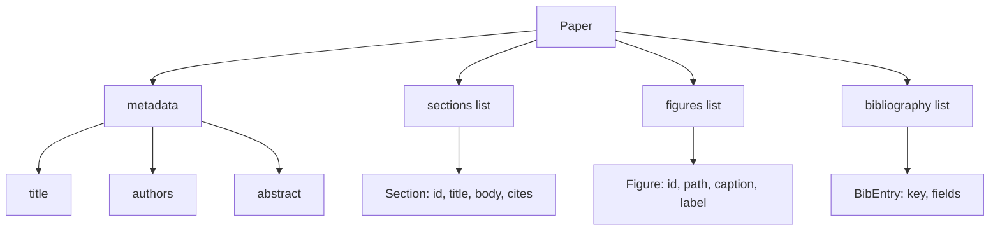
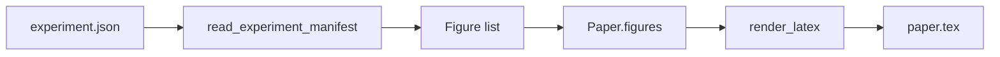
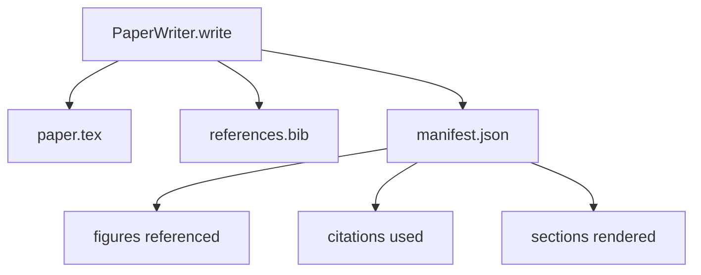

# Paper Writer

> Một khung xương LaTeX là một bản hợp đồng giữa nhà nghiên cứu và trình dàn trang. Nếu hợp đồng bị phá vỡ, tài liệu sẽ không biên dịch được, và lỗi sẽ hiển thị rõ ràng. Hãy xây dựng khung xương trước, sau đó mới lấp đầy nó.

**Type:** Build
**Languages:** Python
**Prerequisites:** Phase 19 lessons 50-53
**Time:** ~90 minutes

## Learning Objectives

- Coi một bài báo nghiên cứu là một tạo vật có cấu trúc (structured artifact) với đồ thị các phần đã biết, không phải là một tài liệu tự do.
- Tạo một khung xương LaTeX khai báo tóm tắt (abstract), các phần (sections), các vị trí hình ảnh (figure slots), và các khóa thư mục (bibliography keys) trước khi viết bất kỳ nội dung văn bản nào.
- Chèn hình ảnh từ kết quả thực nghiệm (đường dẫn và chú thích) vào khung xương thông qua một cơ chế slot xác định.
- Kết nối một trình tạo văn bản giả lập (mocked prose generator) để lấp đầy từng phần từ một dàn ý có cấu trúc, giúp bộ khung có thể kiểm thử được mà không cần model.
- Xuất ra một tệp `paper.tex` duy nhất cộng với một `references.bib` và một manifest liệt kê mọi hình ảnh được tham chiếu và mọi trích dẫn được sử dụng.

```figure
ch-paper-skeleton
```

## Tại sao cần khung xương trước

Một bản nháp bắt đầu bằng văn bản xuôi sẽ tích tụ nợ cấu trúc. Phần giới thiệu phình ra ba đoạn văn đáng lẽ phải nằm trong phần nghiên cứu liên quan. Một hình ảnh được tham chiếu trước khi nó được định nghĩa. Thư mục tài liệu tham khảo kết thúc với ba khóa cho cùng một bài báo. Đến khi tác giả nhận ra, chi phí viết lại còn cao hơn chi phí viết mới.

Một khung xương đảo ngược điều đó. Cấu trúc được khai báo trước dưới dạng dữ liệu. Các phần là các slot có tên và thứ tự. Hình ảnh là các slot có ID và chú thích. Các khóa thư mục được khai báo ở trên cùng với các mục mà chúng trỏ tới. Văn bản được tạo vào các slot đó từng cái một. Bộ khung có thể xác nhận, trước khi bất kỳ văn bản nào được viết, rằng mọi hình ảnh đều có slot, mọi trích dẫn đều có mục tương ứng, và mọi phần đều xuất hiện trong mục lục.

Đây cũng chính là kỷ luật mà các bài học trước đã áp dụng cho plans, tool calls, và traces. Cấu trúc chính là hợp đồng.

## Cấu trúc của Paper



Mọi trường đều là dữ liệu Python thuần túy. Trình kết xuất (renderer) là một hàm thuần túy từ `Paper` sang một chuỗi LaTeX. Bộ khung có thể nội soi (introspect) bài báo trước khi kết xuất: đếm các phần, liệt kê các tệp hình ảnh còn thiếu, kiểm tra xem mọi `\cite{key}` có `BibEntry` khớp hay không.

## Hợp đồng kết xuất

Trình kết xuất đảm bảo ba thuộc tính. Thứ nhất, mọi slot hình ảnh trong khung xương sẽ tạo ra một khối `\begin{figure}` với nhãn ổn định có dạng `fig:<id>`. Thứ hai, mỗi phần tạo ra một `\section{}` với nhãn ổn định dạng `sec:<id>` để các tham chiếu chéo hoạt động. Thứ ba, thư mục tài liệu tham khảo tạo ra một khối `\bibliography` mà `references.bib` của nó chứa chính xác các mục đã khai báo trong bài báo, không thừa không thiếu.

Vi phạm bất kỳ điều nào trong số này là một lỗi kết xuất (render error), không phải là cảnh báo. Khung xương là hợp đồng; một lần kết xuất âm thầm bỏ qua một hình ảnh là một sự phá vỡ hợp đồng.

## Chèn hình ảnh từ thực nghiệm

Các bài học trước trong lộ trình này đã tạo ra kết quả thực nghiệm dưới dạng các manifest JSON. Mỗi manifest mang một danh sách các tạo vật (artifacts) với đường dẫn và chú thích ngắn. Paper writer đọc manifest đó và tạo ra các bản ghi `Figure`.



Việc chèn là xác định. Các ID hình ảnh được dẫn xuất từ tên thực nghiệm cộng với một bộ đếm tăng dần. Chú thích lấy từ manifest. Các đường dẫn được chuẩn hóa tương đối so với thư mục đầu ra của bài báo để LaTeX có thể biên dịch ngay cả khi kết quả thực nghiệm nằm ở nơi khác trên đĩa.

## Trình tạo văn bản giả lập

Bài học này không gọi model. Một `MockProseGenerator` đọc một cấu trúc dàn ý và tạo ra văn bản một cách xác định. Cấu trúc dàn ý là một chuỗi ngắn cho mỗi phần. Trình tạo sẽ mở rộng chuỗi đó thành hai đoạn văn ngắn có lồng ghép tiêu đề phần. Văn bản được tạo ra sẽ nhắc đến các hình ảnh và trích dẫn chính xác khi dàn ý khai báo chúng.

Điều này đủ để kiểm thử mọi hành vi của writer. Một triển khai thực tế sẽ thay thế trình tạo bằng một lệnh gọi model. Bộ khung xung quanh nó không thay đổi. Đó là giá trị của việc khai báo trình tạo văn bản dưới dạng một callable: bài kiểm tra thay thế bằng một trình tạo xác định, môi trường thực tế thay thế bằng một model, phần còn lại của pipeline là giống hệt nhau.

## Đầu ra manifest

Writer xuất ba tệp vào thư mục đầu ra.



Manifest là thứ mà một bộ đánh giá hạ nguồn hoặc vòng lặp phản biện (critic loop) sẽ đọc. Nó không phân tích cú pháp LaTeX; nó đọc manifest. Bài học tiếp theo, vòng lặp phản biện, lấy manifest này làm đầu vào và tạo ra danh sách phản hồi. Đó là lý do tại sao manifest là một phần của hợp đồng còn LaTeX thì không.

## Các cổng kiểm định

Writer chạy bốn cổng kiểm định trước khi ghi bất kỳ tệp nào.

1. Mọi ID hình ảnh là duy nhất trong bài báo.
2. Trường `cites` của mỗi phần tham chiếu đến một khóa thư mục đã được khai báo trong bài báo.
3. Phần tóm tắt không được để trống.
4. Tiêu đề không được để trống.

Một cổng thất bại sẽ kích hoạt `PaperValidationError` với lý do chính xác. Bộ khung hiển thị lý do đó như một chế độ lỗi. Không có việc ghi tệp một phần: hoặc cả ba tệp được xuất ra, hoặc không có tệp nào.

## Cách đọc mã nguồn

`code/main.py` định nghĩa `Paper`, `Section`, `Figure`, `BibEntry`, `PaperValidationError`, `MockProseGenerator`, `PaperWriter`, và một hàm `render_latex`. Phương thức `write` nhận một thư mục đầu ra và xuất ra `paper.tex`, `references.bib`, và `manifest.json`. Hàm bổ trợ `read_experiment_manifest` chuyển đổi một danh sách các manifest thực nghiệm thành các bản ghi `Figure`.

`code/tests/test_paper_writer.py` bao gồm: kết xuất khung xương không có các phần, kết xuất đầy đủ với hai phần và hai hình ảnh, cổng kiểm định trích dẫn bị thiếu, cổng kiểm định ID hình ảnh trùng lặp, nội dung manifest, và hợp đồng chuỗi LaTeX (mọi phần tạo ra một `\section{}`, mọi hình ảnh tạo ra một `\begin{figure}`).

## Đi xa hơn

Hai phần mở rộng mà một triển khai thực tế sẽ cần. Thứ nhất, kết xuất đa định dạng: cùng một cấu trúc `Paper` có thể biên dịch sang Markdown cho các bài đăng blog và HTML để xem trước. Trình kết xuất trở thành một chiến lược trên `Paper`. Thứ hai, làm giàu trích dẫn (citation enrichment): writer lấy các mục BibTeX từ một khóa trích dẫn, dựa trên một bộ nhớ đệm cục bộ của các DOI. Cả hai đều thêm giá trị, và cả hai đều có thể được thêm vào mà không cần chạm đến hợp đồng khung xương.

Khung xương là điểm mấu chốt. Các phần, hình ảnh và trích dẫn được khai báo dưới dạng dữ liệu, văn bản được tạo vào các slot, manifest được xuất cùng với LaTeX. Mọi cải tiến khác đều được xây dựng chồng lên trên đó.