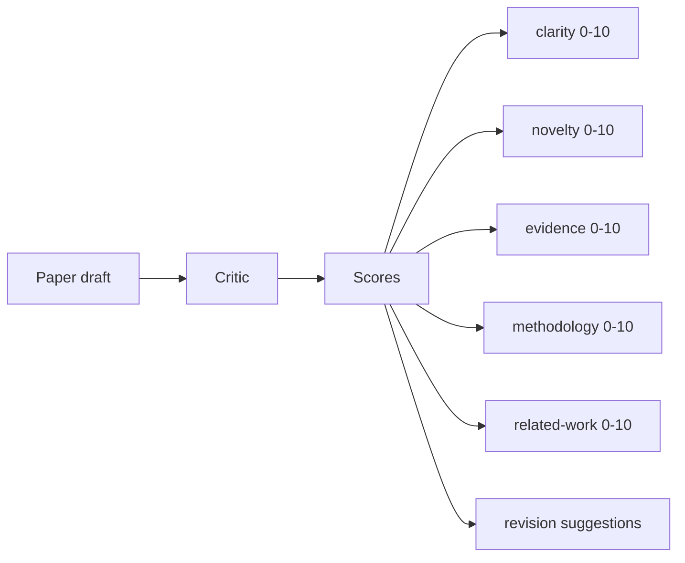
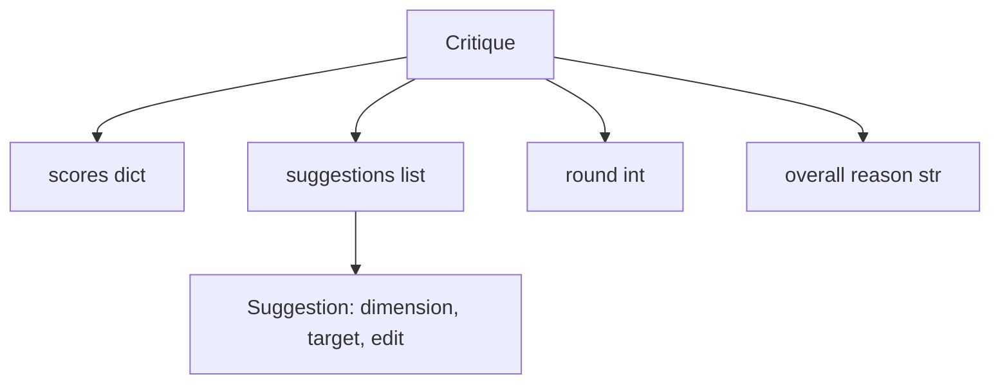
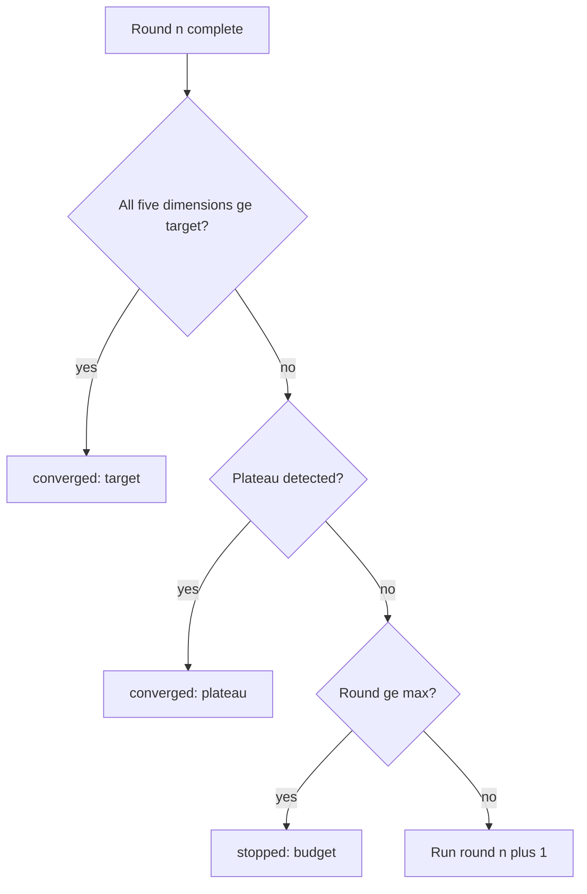
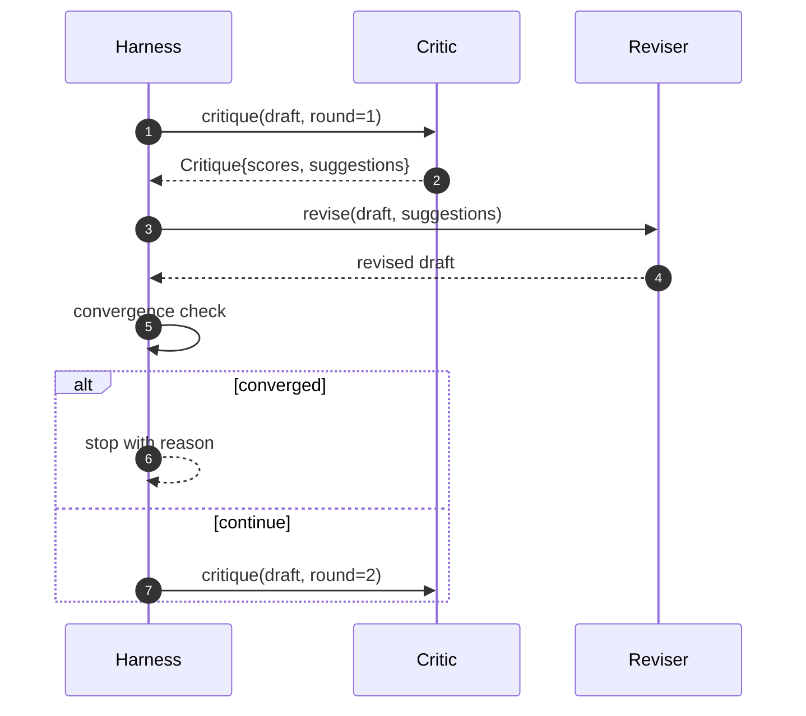

# Critic Loop

> Một critic trả về "trông ổn đấy" ngay lần đầu tiên là một critic hỏng. Một critic luôn trả về "cần chỉnh sửa thêm" cũng là một critic hỏng. Critic thú vị là critic có khả năng hội tụ, và bạn phải thiết kế kỹ thuật để đạt được sự hội tụ đó.

**Type:** Build
**Languages:** Python
**Prerequisites:** Phase 19 lessons 50-53
**Time:** ~90 minutes

## Learning Objectives

- Chấm điểm một bản thảo bài báo khoa học (paper draft) dựa trên năm chiều cố định: clarity (tính rõ ràng), novelty (tính mới), evidence (bằng chứng), methodology (phương pháp luận), related-work (công trình liên quan).
- Áp dụng phản biện của mỗi vòng dưới dạng một structured revision diff thay vì viết lại tự do.
- Phát hiện sự hội tụ bằng cách so sánh điểm số qua các vòng; dừng lại khi đạt trạng thái plateau (bão hòa), đạt mục tiêu (target), hoặc hết ngân sách (budget).
- Giới hạn các vòng lặp bằng một ngân sách max-iteration để một critic không hội tụ không chạy vô tận.
- Xuất một trace theo từng vòng để dashboard hoặc giai đoạn tiếp theo có thể hiển thị quỹ đạo điểm số.

```figure
ch-critic-converge
```

## Why five fixed dimensions

Một critic tự do là một mô hình trả về một đoạn văn chứa các gợi ý. Bản hiệu chỉnh của vòng tiếp theo coi đoạn văn đó như ngữ cảnh bao quanh. Việc bản viết lại có giải quyết được các lời phê bình hay không là không thể xác minh được vì lời phê bình đó chưa bao giờ có cấu trúc.

Năm chiều (dimensions) tạo ra một hợp đồng (contract) cho harness.



Điểm số là một vector. Harness theo dõi từng chiều qua các vòng. Một bản hiệu chỉnh làm tăng clarity nhưng làm giảm evidence là một sự thụt lùi (regression) về bằng chứng, và kiểm tra hội tụ sẽ nhận thấy điều đó. Một critic chỉ dựa trên mô hình thuần túy không thể đưa ra đảm bảo đó.

## The Critique shape



Mỗi gợi ý đều mang theo chiều mà nó cải thiện, phần (section) mà nó nhắm tới, và một chỉ dẫn `edit` mà reviser có thể áp dụng. Reviser cũng là một đối tượng có thể gọi (callable). Bài học này cung cấp một reviser đơn định (deterministic) diễn giải chỉ dẫn chỉnh sửa như một thao tác append-to-section (thêm vào cuối phần). Một reviser dựa trên mô hình sẽ diễn giải cùng một trường đó như một prompt. Hợp đồng không thay đổi.

## Convergence rules, in order

Vòng lặp critic kết thúc khi bất kỳ một trong ba điều kiện sau xảy ra.



Target là trường hợp khắt khe nhất: mỗi chiều trong số năm chiều (clarity, novelty, evidence, methodology, related_work) phải đạt mức `>= target_score` (mặc định là `8.0`) trước khi vòng lặp trả về thành công. Điểm trung bình cao nhưng có một chiều yếu là không đủ. Phát hiện plateau so sánh điểm trung bình của vòng hiện tại với vòng trước đó. Nếu mức độ cải thiện dưới `plateau_epsilon` (mặc định là `0.1`) trong hai vòng liên tiếp, vòng lặp thoát với `plateau`. Budget là một giới hạn cứng về số vòng (mặc định là `5`) và thoát với `budget`.

Thứ tự rất quan trọng. Target thắng plateau, plateau thắng budget. Nếu vòng thứ ba đạt target đồng thời kích hoạt plateau, kết quả sẽ là `target`, không phải `plateau`.

## Why plateau detection runs over two rounds

Một trạng thái plateau chỉ trong một vòng có thể là nhiễu. Một critic thực tế sẽ trả về điểm số hơi khác nhau ở mỗi lần lặp ngay cả trên cùng một bản thảo cố định, bởi vì việc chấm điểm đơn định vẫn phụ thuộc vào việc gợi ý nào đã được áp dụng và theo thứ tự nào. Yêu cầu hai vòng plateau liên tiếp sẽ lọc bỏ nhiễu đó. Nếu harness báo cáo một plateau, bản thảo đó thực sự đã ngừng cải thiện.

## The deterministic critic in this lesson

Bài học này không gọi một mô hình. Critic đi kèm là một callable chấm điểm bản thảo dựa trên ba tín hiệu: độ dài trung bình của thân bài các phần (clarity), số lượng hình ảnh và số lượng trích dẫn (evidence), và một trường `originality_tag` trong metadata của bài báo (novelty). Reviser biết cách để đẩy từng điểm số này lên cao hơn.

```text
clarity      grows when the average section body length increases
novelty      grows when originality_tag is set to "high"
evidence     grows when a section's figure_refs is non-empty
methodology  grows when a section titled "Method" exists with body
related-work grows when a section titled "Related Work" exists with body
```

Reviser diễn giải mỗi gợi ý như một thao tác append có mục tiêu. Sau vòng một, harness có thể quan sát thấy điểm số tăng lên. Các bài kiểm tra sử dụng đặc tính này để khẳng định vòng lặp làm giảm khoảng cách (gap).

## The full loop contract



Harness nắm giữ bộ đếm vòng, trace, và kiểm tra hội tụ. Critic nắm giữ điểm số. Reviser nắm giữ diff. Không ai trong ba thành phần này chạm vào trạng thái của những thành phần còn lại.

## The Trace output

Mỗi vòng xuất ra một sự kiện trace với số thứ tự vòng, vector điểm số, số lượng gợi ý, và phán quyết hội tụ. Toàn bộ trace được trả về cùng với bản thảo cuối cùng. Một dashboard ở hạ nguồn có thể hiển thị biểu đồ điểm số theo từng vòng. Trong bài học tiếp theo, iteration scheduler sẽ đọc trace để quyết định xem nhánh đó có đáng để giữ lại hay không.

## Budgets that protect against bad critics

Một critic tạo ra các gợi ý không bao giờ cải thiện được điểm số sẽ khóa vòng lặp vào mức trần max-iteration. Trace làm cho điều đó trở nên rõ ràng: năm vòng, điểm số đi ngang, phán quyết `budget`. Người dùng sẽ đọc đó là lỗi của critic, không phải lỗi của bản thảo. Cách thay thế là chỉ hiển thị bản thảo cuối cùng sẽ che giấu việc chẩn đoán này. Thiết kế ưu tiên trace (Trace-first design) sẽ làm lộ diện nó.

## How to read the code

`code/main.py` định nghĩa `Critique`, `Suggestion`, protocol `Critic`, protocol `Reviser`, `CriticLoop`, và một factory `make_deterministic_critic_pair` trả về critic đơn định và một reviser tương ứng. Một cấu trúc `Paper` tối giản được bao gồm để bài học có thể chạy độc lập.

`code/tests/test_critic_loop.py` bao gồm: cải thiện đơn điệu sau vòng một, hội tụ target trên một bản thảo đã được tinh chỉnh, phát hiện plateau sau hai vòng đi ngang, cạn kiệt ngân sách khi không có gợi ý nào cải thiện được, việc áp dụng gợi ý bởi reviser, và cấu trúc của trace.

## Going further

Hai phần mở rộng mà một triển khai thực tế sẽ cần. Thứ nhất, trọng số cho các chiều (dimension weights): một bài báo cho một workshop sẽ đặt trọng số novelty cao hơn methodology; một tạp chí (journal) thì ngược lại. Kiểm tra hội tụ khi đó sẽ trở thành một giá trị trung bình có trọng số. Thứ hai, các cặp critic (paired critics): một critic chấm điểm, một critic thứ hai thẩm định các gợi ý trước khi reviser nhìn thấy chúng. Cả hai đều thêm giá trị, và cả hai đều được xây dựng trên cùng một cấu trúc `Critique`.

Điểm mấu chốt nằm ở vector điểm số. Một khi phản biện đã được cấu trúc hóa, mọi cải tiến khác, quy tắc hội tụ, dashboard, hay paired critic đều có thể được đưa vào mà không làm thay đổi vòng lặp.