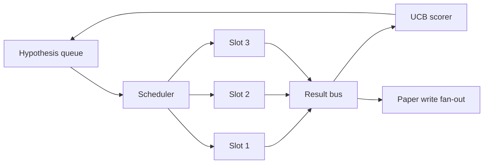
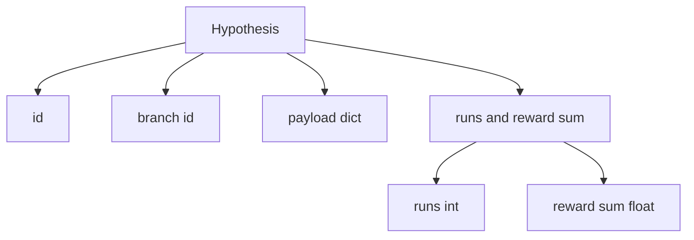
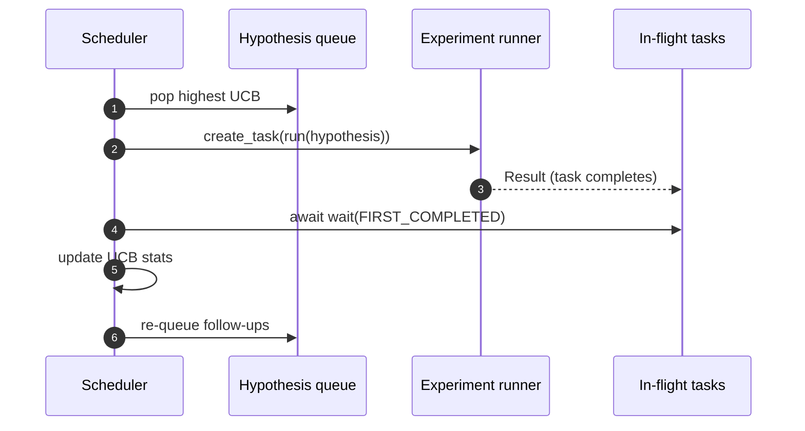

# Iteration Scheduler

> Một vòng lặp nghiên cứu mà không có bộ điều phối (scheduler) chỉ là một hàng đợi đầy ảo tưởng. Scheduler là nơi vòng lặp quyết định ngừng khám phá điều gì, và quyết định đó chính là mấu chốt của toàn bộ cuộc chơi.

**Type:** Build
**Languages:** Python
**Prerequisites:** Phase 19 lessons 50-53
**Time:** ~90 minutes

## Learning Objectives

- Mô hình hóa một quy trình nghiên cứu dưới dạng một hàng đợi giả thuyết (hypothesis queue) cung cấp cho các khe thử nghiệm (experiment slots) song song, với kết quả được tổng hợp ngược trở lại (fan back in).
- Chạy đồng thời nhiều thử nghiệm với asyncio để scheduler có thể giữ cho tất cả các khe luôn bận rộn.
- Chấm điểm từng nhánh giả thuyết bằng UCB để scheduler có thể loại bỏ (prune) các nhánh hiệu quả thấp mà không bỏ qua việc khám phá (exploration).
- Phân phối (fan out) các kết quả đã hoàn thành đến giai đoạn viết bài báo (paper-write) và giai đoạn tái xếp hàng (re-queue) để một nhánh hiệu quả cao có thể tạo ra các giả thuyết tiếp nối.
- Hiển thị vết (trace) theo từng vòng lặp với điểm số của các nhánh, trạng thái lấp đầy của các khe, và các quyết định loại bỏ.

```figure
ch-ucb-scheduler
```

## Why a scheduler, not a worklist

Một danh sách công việc (worklist) phẳng chạy các tác vụ theo thứ tự gửi. Điều đó ổn khi mỗi tác vụ là độc lập. Nghiên cứu thì không độc lập: một phát hiện từ thử nghiệm thứ ba sẽ thay đổi mức độ ưu tiên của thử nghiệm thứ tư và thứ năm. Một scheduler đọc kết quả tổng hợp (fan-in) và sắp xếp lại hàng đợi sẽ thực hiện được nhiều công việc hữu ích hơn trên mỗi đơn vị tính toán.

Lựa chọn thiết kế thú vị nằm ở quy tắc chấm điểm. Một bộ chấm điểm tham lam (greedy scorer) luôn chọn người dẫn đầu hiện tại và không bao giờ khám phá. Một bộ chấm điểm đồng nhất (uniform scorer) không bao giờ khai thác (exploit). UCB (upper confidence bound) là con đường trung đạo: khai thác người dẫn đầu trong khi vẫn dự phòng năng lực cho các nhánh ít được thử nghiệm hơn.

## The system shape



Hàng đợi giữ các giả thuyết. Scheduler chọn giả thuyết có UCB cao nhất khi một khe trống. Mỗi khe chạy một thử nghiệm một cách bất đồng bộ (asynchronously). Các thử nghiệm hoàn thành sẽ đưa kết quả lên bus. Bus cập nhật số liệu thống kê UCB cho nhánh nguồn và phân phối (fan out) đến giai đoạn viết bài báo khi hiệu suất (yield) của một nhánh vượt qua một ngưỡng nhất định.

## The Hypothesis shape



`branch` là chìa khóa cho các số liệu thống kê UCB. Nhiều giả thuyết có thể chia sẻ cùng một nhánh (nhánh là hướng nghiên cứu; giả thuyết là một lần thử nghiệm trong hướng đó). `runs` là số lượng thử nghiệm đã hoàn thành cho nhánh đó, `reward_sum` là phần thưởng tích lũy. UCB đọc cả hai giá trị này.

## UCB scoring

Công thức UCB được sử dụng trong bài học này là UCB1 cổ điển.

```text
ucb(branch) = mean_reward(branch) + c * sqrt( ln(total_runs) / runs(branch) )
```

`total_runs` là tổng số tất cả các thử nghiệm đã hoàn thành trên tất cả các nhánh. `c` là trọng số khám phá (exploration weight); bài học mặc định là `sqrt(2)`. Một nhánh với không lần chạy sẽ nhận được `+inf` để các nhánh chưa thử nghiệm luôn được lập lịch trước. Một nhánh có phần thưởng trung bình cao sẽ giữ điểm số cao cho đến khi các nhánh khác bắt kịp; một nhánh chạy nhiều lần mà không có nhiều phần thưởng sẽ bị lu mờ bởi các lựa chọn thay thế ít được chạy hơn.

Cổng loại bỏ (pruning gate) tách biệt với bộ chọn (picker). Việc loại bỏ sẽ xóa một nhánh khỏi lịch trình trong tương lai khi phần thưởng trung bình của nó rơi xuống dưới mức sàn tuyệt đối (mặc định là `0.2`) sau ít nhất `prune_after_runs` lần thử (mặc định là `3`). Điều này giúp giữ cho hàng đợi có giới hạn.

## Parallel slots with asyncio

Scheduler điều khiển các thử nghiệm bằng `asyncio.create_task`. Mỗi tác vụ chạy trình thực thi thử nghiệm (một callable `async def`) trả về một `Result`. Vòng lặp chính đợi tập hợp các tác vụ đang thực hiện với `asyncio.wait(..., return_when=asyncio.FIRST_COMPLETED)` và kích hoạt cập nhật điểm số sau mỗi lần hoàn thành.



Ba khe chạy đồng thời. Vòng lặp chính không bao giờ bị chặn (block) bởi một thử nghiệm đơn lẻ. Scheduler tiếp tục bắt đầu các tác vụ mới ngay khi một khe trống, cho đến khi cả hàng đợi trống và không còn tác vụ nào đang thực hiện.

## Fan-out: paper triggers

Khi phần thưởng trung bình của một nhánh vượt qua `paper_threshold` (mặc định là `0.7`) và nhánh đó chưa tạo ra bài báo nào, scheduler sẽ phân phối một sự kiện `paper.trigger` vào danh sách đầu ra. Ở phía hạ nguồn, trình viết bài báo từ bài học năm mươi tư sẽ tiếp nhận sự kiện này. Trong bài học này, trigger được ghi lại dưới dạng một danh sách để các bài kiểm tra (tests) có thể xác nhận (assert).

## Fan-out: follow-up hypotheses

Khi một kết quả hiệu suất cao xuất hiện, scheduler có thể gọi `expander` do người dùng cung cấp để tạo ra một hoặc nhiều giả thuyết tiếp nối trên cùng một nhánh. Trình mở rộng (expander) là một hàm thuần túy (pure function) từ `Result` sang `list[Hypothesis]`. Bài học cung cấp một trình mở rộng xác định (deterministic expander) tạo ra hai giả thuyết tiếp nối cho bất kỳ kết quả nào có phần thưởng vượt quá ngưỡng viết bài báo.

## Budgets

Hai ngân sách (budgets) bảo vệ scheduler khỏi các vòng lặp vô tận.

```text
max_experiments    : total count of experiments run across all branches
max_seconds        : wall-clock cap (asyncio time)
```

Khi một trong hai được kích hoạt, scheduler sẽ ngừng lập lịch các tác vụ mới, đợi các tác vụ đang thực hiện hoàn tất và trả về vết (trace) cuối cùng. Vết này bao gồm một `stop_reason`.

## The Trace and final report

Mỗi quyết định lập lịch (chọn, điều phối, kết quả, loại bỏ, phân phối) sẽ phát ra một sự kiện. Báo cáo cuối cùng tóm tắt các số liệu thống kê theo từng nhánh, tổng số lần chạy, tổng thời gian thực tế (wall-clock), và các trigger bài báo đã được kích hoạt. Bài học tiếp theo, bản demo đầu-cuối (end-to-end), sẽ đọc báo cáo này để điều khiển trình viết bài báo.

## How to read the code

`code/main.py` định nghĩa `Hypothesis`, `Result`, `BranchStats`, `IterationScheduler`, và một factory `make_deterministic_runner` trả về một trình thực thi thử nghiệm asyncio với các phần thưởng có thể dự đoán được. Trình thực thi tạm dừng (sleep) trong một khoảng `delay_ms` cố định (mặc định là `5ms`) để có thể quan sát được tính đồng thời.

`code/tests/test_scheduler.py` bao gồm: UCB chọn các nhánh chưa thử nghiệm trước, trạng thái lấp đầy khe song song, trigger bài báo khi vượt ngưỡng, loại bỏ nhánh sau các lần thử hiệu suất thấp, phân phối các giả thuyết tiếp nối, và thoát theo ngân sách (cả số lượng thử nghiệm và thời gian thực tế).

## Going further

Ba phần mở rộng mà một triển khai thực tế sẽ cần. Thứ nhất, số liệu thống kê UCB bền vững (persistent) qua các phiên: các số liệu hiện tại nằm trong bộ nhớ; một scheduler thực tế sẽ lưu điểm kiểm tra (checkpoint) chúng để khi khởi động lại vẫn bảo toàn được ngân sách khám phá đã chi tiêu. Thứ hai, chấm điểm đa mục tiêu (multi-objective scoring): thay vì một phần thưởng vô hướng (scalar), mỗi kết quả phát ra một vector và UCB trở thành một bộ chọn kiểu Pareto. Thứ ba, contextual bandits: bộ chọn điều kiện hóa dựa trên các đặc trưng của giả thuyết (độ dài, độ phức tạp) để các giả thuyết tương tự chia sẻ việc khám phá.

Scheduler là nơi nghiên cứu trở nên ý nghĩa hơn là một danh sách công việc đơn thuần. Một khi UCB được kết nối và các khe chạy song song, mọi cải tiến khác sẽ được xây dựng chồng lên đó.