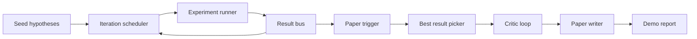
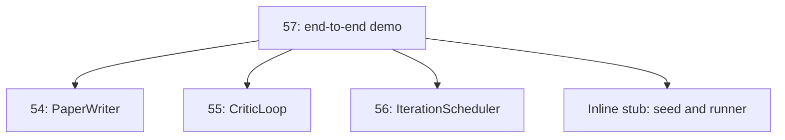
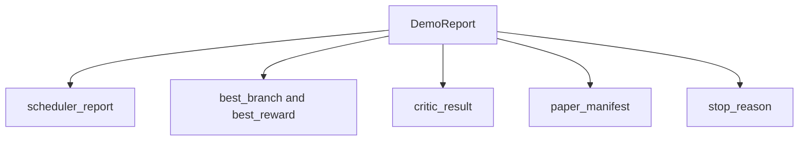

# Demo Nghiên cứu End-to-End

> Một bản demo là nơi mà mọi hợp đồng (contract) bạn đã viết trước đó phải được kết hợp lại. Nếu bất kỳ hợp đồng nào bị rò rỉ, bản demo chính là bài học để phát hiện ra điều đó.

**Type:** Build
**Languages:** Python
**Prerequisites:** Phase 19 lessons 50-53
**Time:** ~90 minutes

## Learning Objectives

- Kết nối vòng lặp nghiên cứu tự động (auto-research loop) từ đầu đến cuối: seed giả thuyết, trình chạy thực nghiệm (experiment runner), bộ lập lịch (scheduler), vòng lặp critic, và trình viết bài báo (paper writer).
- Kết hợp các thành phần cơ bản (primitives) từ bốn bài học trước của Track D thông qua việc import Python thuần túy, không sử dụng framework.
- Chạy vòng lặp cho đến khi tự kết thúc và xuất ra một báo cáo demo duy nhất liệt kê đầu ra của mọi giai đoạn.
- Giữ cho bản demo có tính tất định (deterministic) để bộ test có thể kiểm chứng (assert) cấu trúc cuối cùng.
- Hiển thị rõ ràng chế độ lỗi (failure mode) khi hợp đồng của bất kỳ giai đoạn nào bị phá vỡ, để giai đoạn tiếp theo không chạy với đầu vào bị lỗi.

```figure
ch-research-pipeline
```

## Những gì được kết hợp ở đây



Năm giai đoạn. Seed là một danh sách gồm ba giả thuyết. Scheduler chạy sáu thực nghiệm trên các giả thuyết đó với ba khe cắm (slots) song song. Bus báo cáo một hoặc nhiều trigger bài báo. Picker chọn ra kết quả đơn lẻ tốt nhất. Critic loop lặp lại trên một bản nháp được xây dựng từ kết quả đó. Paper writer xuất ra file LaTeX, BibTeX và manifest cuối cùng.

## Tại sao dùng import, không dùng copy

Mỗi bài học trước đó cung cấp một `main.py` với các dataclass và hàm công khai. Bản demo import chúng bằng cách điều chỉnh `sys.path` trỏ đến thư mục cha của mỗi bài học. Đây không phải là kết nối kiểu framework; nó chính là cách import mà các file test trong các bài học trước đã sử dụng.



Phần stub nội bộ (inline stub) thay thế cho các bài học từ 50 đến 53: một trình tạo nhỏ các seed giả thuyết và một hàm reward đồng bộ. Người dùng có thể thay thế inline stub bằng các primitives thực tế từ những bài học đó bằng cách điều chỉnh hai dòng import.

## Đảm bảo tính tất định (Determinism)

Bản demo có tính tất định nhờ cấu trúc thiết kế. Experiment runner được seed NumPy. Reviser của critic loop duyệt qua các chiều cố định theo thứ tự cố định. Prose generator của paper writer là bản mocked từ bài học 54. UCB picker của scheduler xử lý các trường hợp bằng điểm (tie-break) dựa trên thứ tự lặp, không phải lựa chọn ngẫu nhiên.

Với cùng một seed, bản demo sẽ xuất ra cùng một báo cáo. Bài test xác nhận đặc tính này bằng cách chạy demo hai lần và so sánh manifest.

## Cấu trúc báo cáo demo



Mỗi trường dữ liệu được lấy nguyên văn từ giai đoạn thượng nguồn. Bản demo không biến đổi bất kỳ đầu ra nào; nó chỉ kết hợp chúng lại. Đó chính là bài kiểm tra cho bản demo này.

## Xử lý chế độ lỗi (Failure mode)

Mỗi giai đoạn hoặc là thành công, hoặc là ném ra một lỗi có định danh (typed error).

```text
Scheduler ........ returns SchedulerReport with stop_reason
                   in {queue_empty, max_experiments, deadline}
Best-result pick . raises NoTriggerError if no paper trigger fired
Critic loop ...... returns LoopResult with status converged or stopped
Paper writer ..... raises PaperValidationError on contract break
```

Một lỗi ở bất kỳ giai đoạn nào cũng sẽ làm ngắt mạch (short-circuit) bản demo bằng một exception có định danh. Các bài test chốt chặt hợp đồng này: `test_no_triggers_raises_typed_error` và `test_best_picker_raises_when_no_triggers` xác nhận rằng picker sẽ ném ra `NoTriggerError` / `BestResultError` khi không có nhánh nào kích hoạt trigger, và writer sẽ không bao giờ được gọi.

## Bộ chọn kết quả tốt nhất (Best-result picker)

Scheduler phát ra các trigger bài báo cho mỗi nhánh. Picker chọn nhánh có reward trung bình cao nhất trong tất cả các trigger. Các trường hợp bằng điểm được giải quyết theo thứ tự bảng chữ cái của branch id để đảm bảo tính tất định. Picker là một hàm thuần túy (pure function) nhỏ; bài test chốt nó dựa trên một báo cáo scheduler cố định.

## Kết nối critic loop

Critic loop trong bài học 55 hoạt động trên một `MiniPaper`. Bản demo xây dựng một `MiniPaper` từ nhánh được chọn bằng cách điền branch id vào phần abstract, tạo seed cho hai phần (Introduction và Results), và thiết lập `originality_tag` từ reward trung bình của nhánh (cao nếu `>= 0.8`, trung bình nếu `>= 0.6`, thấp nếu ngược lại).

Sau đó, reviser sẽ lặp lại bản nháp cho đến khi hội tụ. Đầu ra sẽ được đưa vào paper writer.

## Kết nối paper writer

Paper writer trong bài học 54 hoạt động trên cấu trúc `Paper` đầy đủ với các hình ảnh và thư mục tài liệu tham khảo. Bản demo nâng cấp `MiniPaper` đã hội tụ thông qua `mini_to_full_paper`, hàm này sẽ đính kèm một hình ảnh cho nhánh được chọn và một danh mục tài liệu tham khảo tổng hợp nhỏ được xây dựng từ tập hợp các cite key mà critic đã gợi ý. Mọi trích dẫn mà demo thêm vào cũng được thêm vào danh sách bibliography, do đó quá trình validation sẽ vượt qua.

## Cách đọc mã nguồn

`code/main.py` định nghĩa `BestResultError`, `NoTriggerError`, `DemoReport`, `pick_best_branch`, `build_mini_paper`, `mini_to_full_paper`, và `run_demo`. Các lệnh import ở trên cùng điều chỉnh `sys.path` một lần và kéo `PaperWriter`, `CriticLoop`, và `IterationScheduler` từ các bài học tương ứng.

`code/tests/test_e2e.py` bao gồm: demo chạy từ đầu đến cuối và xuất ra báo cáo với cả năm trường dữ liệu được điền đầy đủ, tính tất định qua hai lần chạy, NoTriggerError khi không có nhánh nào vượt qua ngưỡng, PaperValidationError khi hợp đồng của writer bị phá vỡ, manifest của bài báo chứa hình ảnh của nhánh được chọn, và lý do dừng của scheduler là một trong các giá trị mong đợi.

## Đi xa hơn

Có ba phần mở rộng đáng để kết nối sau khi bản demo đã chạy ổn định. Thứ nhất, trạng thái bền vững (persistent state): kết quả của mỗi giai đoạn được ghi vào một kho lưu trữ JSON nhỏ để khi khởi động lại có thể tiếp tục mà không cần chạy lại các giai đoạn tốn ít chi phí. Thứ hai, dashboard: các trace events từ scheduler và critic loop được hiển thị dưới dạng một dòng thời gian duy nhất. Thứ ba, các lệnh gọi model thực tế: thay thế mocked prose generator và deterministic critic bằng các thành phần do model điều khiển; cấu trúc kết nối sẽ không thay đổi.

Nhiệm vụ của bản demo là chứng minh rằng sự kết hợp (composition) chính là kiến trúc. Năm bài học, bốn lần import, một báo cáo. Lần tới khi bạn thêm một giai đoạn, cấu trúc kết nối chỉ tăng thêm đúng một dòng.