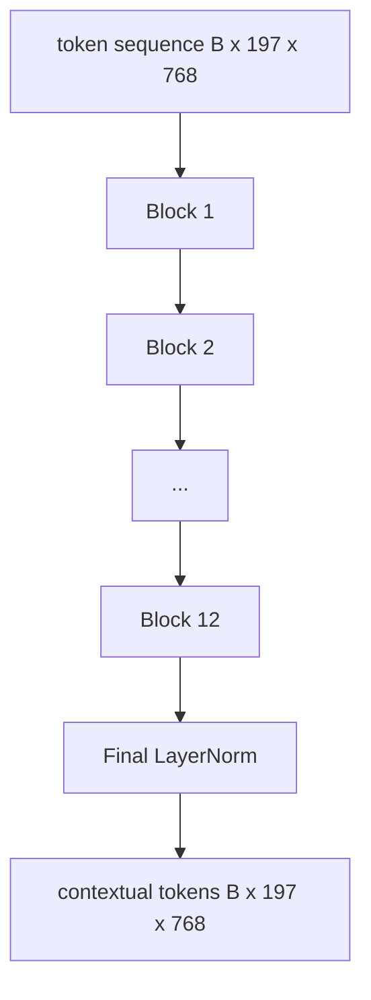
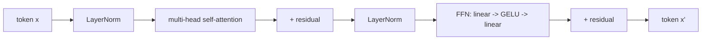

# Vision Transformer Encoder

> Chỉ riêng các patch thì không thể "nhìn" thấy gì. Một Transformer 12 lớp pre-LN với 12 attention heads sẽ biến chuỗi các patch tokens thành một chuỗi các contextual tokens, với CLS token thực hiện pooling các đặc trưng của toàn bộ hình ảnh trong hidden state cuối cùng của nó. Bài học này là "buồng máy" (engine room) của mọi vision-language model hiện đại.

**Type:** Build
**Languages:** Python
**Prerequisites:** Phase 19 lessons 30-37 (Track B foundations)
**Time:** ~90 minutes

## Learning Objectives

- Triển khai một Transformer block pre-LN với multi-head self-attention và một feed-forward sub-layer.
- Chồng (stack) 12 blocks với 12 heads để tạo thành một ViT-Base encoder.
- Kết nối patch front end từ bài 58 vào encoder và chạy một forward pass.
- Xác minh rằng CLS token tổng hợp thông tin từ mọi patch.

## The Problem

Patch embedding tạo ra một chuỗi gồm 197 tokens, mỗi token là một vector chưa có nhận thức về bất kỳ patch nào khác. Một bức ảnh con mèo cần mọi patch biết patch nào chứa râu, patch nào chứa nền, và patch nào chứa mắt. Transformer là cơ chế xây dựng nhận thức đó, qua từng lớp attention một. Nếu không có nó, patch front end chỉ là một bộ tokenizer thông minh mà không có sự hiểu biết.

Công thức tiêu chuẩn là sâu 12 blocks, rộng 12 heads, với vị trí pre-LayerNorm, kích hoạt GELU, và feed-forward expansion gấp 4 lần. Công thức này là xương sống của CLIP ViT-L, SigLIP, DINOv2, dòng Qwen-VL, InternVL, và mọi vision encoder mã nguồn mở khác của năm 2025-2026. Công thức này ổn định đến mức bạn có thể đọc bất kỳ bài báo nào trong số đó và mặc định cấu trúc block này trừ khi họ tuyên bố khác đi.

## The Concept





### Pre-LN vs post-LN

Transformer nguyên bản đặt LayerNorm sau residual. Pre-LN (LayerNorm trước mỗi sub-layer) là phiên bản mà mọi vision-language model hiện đại sử dụng, vì nó giúp huấn luyện ổn định mà không cần các thủ thuật learning-rate warm-up. Sự khác biệt chỉ là một dòng trong forward pass, và dòng chảy gradient ở độ sâu 12+ là một trời một vực.

### Multi-head self-attention

Mỗi head chiếu (project) token vector sang bộ ba `(query, key, value)` của riêng nó với dimension `head_dim = hidden / num_heads`. Với `hidden = 768` và `heads = 12`, mỗi head có `dim = 64`. 12 heads thực hiện attention song song, sau đó kết quả của chúng được concat lại về dimension 768 và đi qua một output projection. Mục đích của multi-head là một head có thể học cách "chú ý vào mắt mèo" trong khi head khác học cách "chú ý vào gradient của nền" mà không gây nhiễu lẫn nhau.

### Why the 4x feed-forward expansion

FFN đi theo hướng `hidden -> 4 * hidden -> hidden` với GELU ở giữa. Hệ số 4 là kết quả thực nghiệm và đã được giữ vững trong các language và vision transformers kể từ năm 2017. Nhỏ hơn (2x) sẽ gây underfit; lớn hơn (8x) sẽ gây overfit với cùng một ngân sách dữ liệu. MLP là nơi mô hình lưu trữ hầu hết các sự kiện đã học (learned facts), và phần giữa rộng hơn chính là nơi chúng tọa lạc.

| Component | Parameters at ViT-Base scale |
|-----------|------------------------------|
| qkv projection per block | `3 * 768 * 768 = 1.77M` |
| output projection per block | `768 * 768 = 590K` |
| FFN per block (4x expansion) | `2 * 768 * 4 * 768 = 4.72M` |
| LayerNorm per block | `4 * 768 = 3K` |
| Total per block | khoảng 7.1M |
| 12 blocks | khoảng 85M |
| Plus front end | tổng cộng khoảng 86M |

ViT-Base là một encoder 86M tham số. Con số này là nhỏ so với tiêu chuẩn năm 2026 (SigLIP-So400M là 400M, Qwen-VL ViT là 675M), nhưng kiến trúc là giống hệt nhau ngoại trừ chiều rộng và độ sâu.

### Causal mask or not?

Vision Transformers là encoder-only và bidirectional (hai chiều): token `i` có thể chú ý đến token `j` cho bất kỳ cặp nào. Không dùng mask. Phần decoder-side cross-attention trong bài 61 sẽ sử dụng causal mask, nhưng bên trong vision encoder, attention được kết nối đầy đủ (fully connected).

### What the CLS token learns

CLS token bắt đầu như một tham số có thể học được (learned parameter), không tự thân chứa nội dung patch nào, và tích lũy thông tin thông qua attention qua từng block. Đến lớp cuối cùng, hàng CLS là một vector tóm tắt của toàn bộ hình ảnh; các head ở hạ nguồn (downstream heads) sẽ chiếu vector đơn lẻ này thành các class logits, contrastive embeddings, hoặc các cross-attention keys cho một text decoder.

```figure
ch-cls-funnel
```

## Build It

`code/main.py` triển khai:

- `MultiHeadSelfAttention`, với `qkv` và output projections, các phép toán scaled-dot-product attention, và các shape assertions.
- `FeedForward`, GELU MLP với độ mở rộng 4x.
- `Block`, một block pre-LN kết hợp các sub-layers attention và feed-forward với các kết nối residual.
- `ViT`, một chồng gồm 12 blocks với một LayerNorm cuối cùng.
- `VisionEncoder`, kết nối `VisionFrontEnd` từ bài 58 vào chồng `ViT` và cung cấp một `forward()` trả về chuỗi contextual và vector CLS đã được pooling.
- Một bản demo chạy một hình ảnh fixture 224x224 tổng hợp qua toàn bộ encoder và in ra input shape, output shape, số lượng tham số, và CLS norm tại mỗi lớp cách quãng.

Run it:

```bash
python3 code/main.py
```

Output: fixture được mã hóa thành một tensor `(1, 197, 768)`. CLS norm tăng dần khi các lớp kết hợp với nhau, sau đó ổn định tại LayerNorm cuối cùng. Tổng số tham số báo cáo vào khoảng 86M.

## Use It

Encoder được định nghĩa ở đây, xét về chiều rộng và độ sâu, chính là chồng block đi kèm bên trong mọi VLM mã nguồn mở trong giai đoạn 2025-2026. Sự khác biệt nằm ở:

- **Width and depth.** ViT-Large là `hidden=1024, depth=24, heads=16`; SigLIP So400M là `hidden=1152, depth=27, heads=16`. Cùng một loại block.
- **Pooling head.** CLS pooling (bài này) so với average pooling (SigLIP) so với attention pooling (các VLM đời sau).
- **Position handling.** Fixed sinusoidal (bài 58) so với learned 1D so với ALiBi so với 2D RoPE. Các phép toán trong block không thay đổi.
- **Register tokens.** DINOv2 thêm 4 learned tokens bổ sung vào phía trước. Chỉ tốn một dòng code.

Chồng block này là nền tảng (substrate). Các bài học tiếp theo (60-63) sẽ xây dựng dựa trên nó.

## Tests

`code/test_main.py` bao gồm:

- một block đơn lẻ bảo toàn shape và bất biến với batch size đầu vào
- attention scores có tổng bằng 1 dọc theo trục key (kiểm tra tính đúng đắn của softmax)
- các đường dẫn residual được kết nối (đầu vào bằng 0 vẫn tạo ra đầu ra khác 0 thông qua CLS token)
- một forward pass của 4 lớp chồng nhau tạo ra đúng shape
- gradient chảy đến patch projection từ đầu ra CLS

Run them:

```bash
python3 -m unittest code/test_main.py
```

## Exercises

1. Thêm register tokens (4 learned vectors được thêm vào trước sau CLS) và chạy lại. So sánh độ mượt của attention map thông qua entropy của phân phối softmax ở lớp cuối cùng.

2. Hoán đổi pre-LN sang post-LN và huấn luyện trong một epoch trên một bộ phân loại hình dạng tổng hợp (synthetic shape classifier). Quan sát xem cái nào huấn luyện ổn định mà không cần LR warm-up.

3. Triển khai causal masking như một đối số `attn_mask` để cùng một block có thể được tái sử dụng làm decoder block. Shape của mask là `(seq, seq)`, tam giác dưới (lower-triangular).

4. Profile một forward pass với các batch size 1, 8, 64 bằng `torch.profiler`. Lớp MLP chiếm phần lớn thời gian thực thi (wall time), chứ không phải attention.

5. Thay thế các q-k-v projections của một attention head bằng một LoRA adapter low-rank, đóng băng phần còn lại, và xác minh rằng gradient chỉ chảy đến nơi bạn mong đợi.

## Key Terms

| Term | What it means |
|------|---------------|
| Pre-LN | LayerNorm được áp dụng trước mỗi sub-layer thay vì sau đó |
| Self-attention | Mỗi token chú ý đến mọi token khác trong cùng một chuỗi |
| Multi-head | Hidden dim được chia nhỏ qua `H` attention heads độc lập |
| FFN expansion | Lớp feed-forward mở rộng lên `4 * hidden` trước khi thu hẹp lại |
| CLS pooling | Sử dụng hidden state cuối cùng của token đầu tiên làm bản tóm tắt hình ảnh |

## Further Reading

- An Image is Worth 16x16 Words (ViT, 2021) cho công thức encoder.
- DINOv2 (2023) cho register tokens và mục tiêu huấn luyện tiền đề tự giám sát (self-supervised pretraining objective).
- SigLIP (2023) cho biến thể average-pooling và sigmoid contrastive loss được sử dụng trong bài 62.