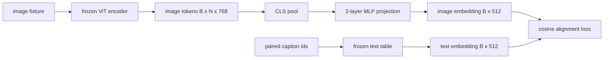

# Projection Layer cho Modality Alignment

> Một vision encoder tạo ra các image token. Một text decoder tiêu thụ các text token. Cả hai tồn tại trong các không gian vector khác nhau. Một MLP hai lớp nhỏ sẽ chiếu các image token vào không gian text embedding, và một cosine alignment loss so với một caption đi kèm sẽ kéo hai không gian này lại gần nhau. Lớp chiếu đó là thành phần nhỏ nhất của một vision-language model và là phần quan trọng nhất cho việc transfer.

**Type:** Build
**Languages:** Python
**Prerequisites:** Phase 19 lessons 30-37 (Track B foundations)
**Time:** ~90 minutes

## Learning Objectives

- Xây dựng một MLP projection hai lớp để ánh xạ các image feature vào không gian text embedding.
- Thiết lập một bảng text embedding giả lập (không dùng pretrained tokenizer, không dùng corpus thật).
- Tính toán cosine alignment loss giữa các image token đã được chiếu và một caption embedding đi kèm.
- Huấn luyện riêng lớp projection với vision encoder và text table được đóng băng (frozen).

## The Problem

Bạn có một vision encoder (bài 58-59) tạo ra các token với kích thước `vision_hidden = 768`. Bạn có một text decoder muốn gắn lên trên với kích thước embedding là `text_hidden = 512` (bất kỳ con số nào khác cũng đều khả thi). Decoder mong đợi các token có định dạng văn bản. Các image token không có định dạng văn bản: chúng tồn tại trong một cơ sở (basis) mà encoder đã học được trong quá trình pretraining chỉ với hình ảnh, không có mối liên hệ nào với các word vector của decoder.

Một MLP projection hai lớp (linear, GELU, linear) sẽ lấp đầy khoảng trống này. Nó đủ nhỏ (khoảng `768 * 1024 + 1024 * 512 = 1.3M` tham số) để huấn luyện trong vài phút trên một GPU đơn lẻ, và nó là phần duy nhất cần phải học trong giai đoạn alignment. Vision encoder được giữ đóng băng. Text embedding table được giữ đóng băng. Chỉ có lớp projection là thay đổi. Đây là công thức mà LLaVA đã sử dụng vào năm 2023, mà BLIP-2 đã tái cấu trúc thành Q-Former, và mọi VLM mã nguồn mở kể từ đó đều áp dụng dưới một hình thức nào đó.

## The Concept



### Pooling trước khi chiếu

Vision encoder tạo ra 197 token. Phía văn bản có một embedding duy nhất ở cấp độ caption. Để căn chỉnh chúng, bạn cần một vector cấp độ hình ảnh cho mỗi mẫu. CLS pooling là cách đơn giản nhất: lấy token đầu tiên từ encoder và chiếu nó. Mean pooling trên tất cả 197 token là một lựa chọn khác và là cách SigLIP sử dụng. Cả hai cách đều gom 197 vector xuống còn một.

### Tại sao dùng hai lớp mà không phải một

Một lớp chiếu tuyến tính (linear projection) đơn lẻ có thể xoay và thay đổi tỷ lệ nhưng không thể sửa lỗi cơ sở nếu hai không gian có sự không khớp về độ cong (curvature mismatches). GELU giữa hai lớp tuyến tính cung cấp cho lớp chiếu một điểm uốn phi tuyến tính, điều này theo thực nghiệm là đủ để căn chỉnh các feature kiểu CLIP với các embedding của language model. Các lớp chiếu sâu hơn (LLaVA-NeXT sử dụng GLU; Qwen-VL sử dụng một chồng các lớp attention) là các phần mở rộng; MLP hai lớp là baseline kinh điển và là thứ mà projection head của Q-Former trong BLIP-2 sử dụng bên dưới.

| Layer | Shape | Parameters |
|-------|-------|------------|
| fc1 | `(vision_hidden, projection_hidden)` | `768 * 1024 + 1024` |
| activation | GELU | 0 |
| fc2 | `(projection_hidden, text_hidden)` | `1024 * 512 + 512` |

Khoảng 1.3M tham số cho một head `768 -> 1024 -> 512`.

### Cosine alignment loss

Align không có nghĩa là `image_emb == text_emb`. Align có nghĩa là `image_emb` hướng cùng chiều với `text_emb` trong không gian chung. Cosine loss là `1 - cos_sim(image, text)`, dao động từ 0 (căn chỉnh hoàn hảo) đến 2 (ngược chiều). Quá trình huấn luyện sẽ đẩy giá trị này về 0 cho mỗi cặp. Bài 62 sẽ tổng quát hóa thành một contrastive batch (InfoNCE), nơi mỗi hình ảnh phải gần với caption của chính nó hơn bất kỳ caption nào khác trong batch; bài học này sử dụng phiên bản theo từng cặp để có thể quan sát được động lực học.

### Frozen encoder là bí quyết

Vision encoder có 86M tham số. Text table có thêm vài triệu nữa. Việc huấn luyện tất cả chúng từ một mock corpus là điều không khả thi. Việc đóng băng cả hai có nghĩa là 1.3M tham số của lớp projection là thứ duy nhất thay đổi, và vài trăm bước trên các cặp dữ liệu tổng hợp là đủ để kéo giảm loss. Đây chính xác là cấu trúc vận hành của mọi VLM dựa trên adapter: các phần nặng được giữ đóng băng, phần cầu nối nhẹ được huấn luyện.

```figure
ch-projection-bridge
```

## Build It

`code/main.py` triển khai:

- `MLPProjector(in_dim, hidden_dim, out_dim)`, một MLP tuyến tính hai lớp với kích hoạt GELU.
- `MockTextEmbedding(vocab_size, dim)`, một bảng embedding đóng băng với khởi tạo xác định từ một seed.
- `make_pair(seed, vocab_size)`, tổng hợp một mẫu cặp (image, caption). Caption là các chuỗi ID ngắn; caption embedding được mean-pooled từ các token embedding.
- `cosine_alignment_loss(image_emb, text_emb)`, mục tiêu `1 - cos_sim` theo từng cặp.
- Một vòng lặp huấn luyện chạy lớp projection trong 200 bước trên 32 cặp tổng hợp (lặp lại), với vision encoder và text table được đóng băng, và in ra loss sau mỗi 25 bước.

Chạy mã nguồn:

```bash
python3 code/main.py
```

Đầu ra: báo cáo huấn luyện cho thấy loss giảm từ mức ban đầu khoảng 1.07 xuống còn khoảng 0.80 trong vòng 200 bước, chứng minh rằng chỉ riêng lớp projection có thể kéo các image token về phía không gian văn bản. Độ tương đồng cosine cuối cùng cho mỗi cặp cũng được in ra.

## Use It

Mô hình tương tự xuất hiện trong mọi VLM mã nguồn mở:

- **LLaVA 1.5.** MLP projection GELU hai lớp từ CLIP-ViT-L hidden sang LLaMA embedding dim. Đóng băng vision encoder, đóng băng LLM, chỉ huấn luyện lớp projection (sau đó mở băng LLM ở giai đoạn hai).
- **BLIP-2.** Q-Former nhận 32 query token đã học thông qua cross-attention với các image token, sau đó chiếu sang LLM embedding dim. Projection head ở cuối Q-Former chính là bản sao của MLP trong bài học này.
- **MiniGPT-4.** Một lớp chiếu tuyến tính đơn lẻ từ đầu ra của BLIP-2 Q-Former sang Vicuna embedding dim.
- **Qwen-VL.** Adapter cross-attention với nhiều lớp, nhưng phần cuối cùng vẫn là một lớp chiếu sang LM embedding dim.

Hình dạng có thể thay đổi nhưng vai trò là đồng nhất: pooling các image token, chiếu sang text embedding dim, huấn luyện độc lập.

## Tests

`code/test_main.py` bao gồm:

- Kích thước đầu ra của projector khớp với `out_dim` đã cấu hình.
- Bảng text embedding đóng băng có `requires_grad` tham số bằng không.
- Cosine loss bằng 0 trên các vector giống hệt nhau và bằng 2 trên các vector ngược chiều.
- Gradient của projector truyền đi sau một lượt backward pass.
- Vòng lặp huấn luyện giảm loss giữa bước 0 và bước 200.

Chạy test:

```bash
python3 -m unittest code/test_main.py
```

## Exercises

1. Thay thế CLS pooling bằng mean pooling trên 196 patch token và so sánh loss cuối cùng sau 200 bước. Mean pooling thường hội tụ nhanh hơn trên dữ liệu tổng hợp; CLS hiệu quả hơn về mặt mẫu trên hình ảnh tự nhiên.

2. Thêm một tham số temperature (nhiệt độ) có thể học được vào cosine loss (`cos / tau`) và quan sát điều gì xảy ra khi `tau` quá nhỏ (nhiễu gradient) hoặc quá lớn (loss bị bão hòa ở mức cao).

3. Thay thế MLP hai lớp bằng một lớp tuyến tính đơn lẻ và định lượng khoảng cách về loss. Tính phi tuyến tính quan trọng hơn đối với các feature hình ảnh tự nhiên và ít quan trọng hơn đối với dữ liệu tổng hợp.

4. Thêm một hình phạt L2 nhỏ (L2 penalty) vào trọng số của projector và quan sát cách nó tương tác với cosine alignment (cosine là bất biến với tỷ lệ - scale-invariant, vì vậy hình phạt chủ yếu thu nhỏ các hướng không được sử dụng).

5. Lưu lại trọng số của projector, sau đó tải lại và chạy inference mà không cần backward pass của vision encoder để xác minh rằng chỉ cần projector tại thời điểm triển khai.

## Key Terms

| Term | What it means |
|------|---------------|
| Modality alignment | Hành động làm cho các embedding hình ảnh và văn bản có thể so sánh được trong một không gian chung |
| Projection head | Module nhỏ ánh xạ không gian này sang không gian khác, thường là một MLP 2 lớp |
| Cosine similarity | Tích vô hướng chia cho tích của các chuẩn L2 |
| Frozen encoder | Mô hình vision (hoặc text) có tất cả các tham số với `requires_grad=False` |
| Mock corpus | Các cặp dữ liệu tổng hợp được sử dụng để việc huấn luyện không phụ thuộc vào việc tải xuống tập dữ liệu |

## Further Reading

- Bài báo LLaVA về quy trình huấn luyện hai giai đoạn (chiếu, sau đó mở băng LLM).
- Bài báo BLIP-2 về Q-Former như một giải pháp thay thế lớp chiếu có thể học được.
- Báo cáo kỹ thuật Qwen-VL về các cross-attention adapter đóng vai trò là các projection head sâu hơn.