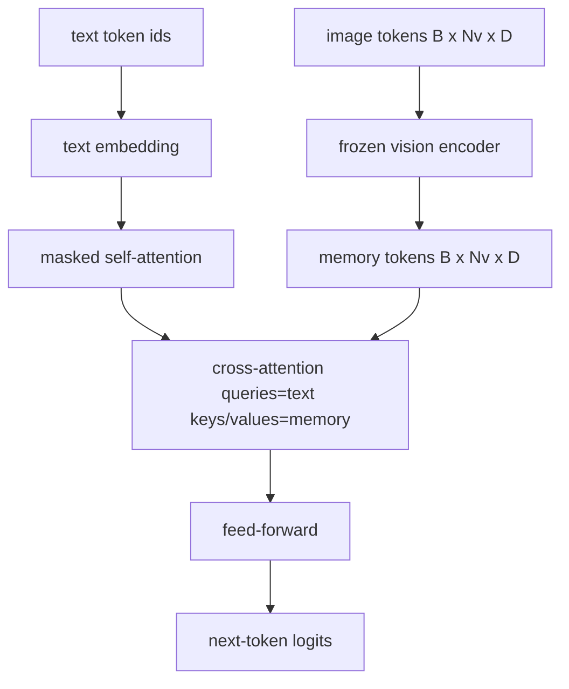
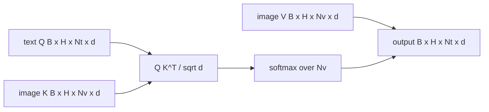

# Cross-Attention Fusion

> Lớp projection căn chỉnh một vector hình ảnh với một vector chú thích (caption). Một vision-language decoder thực thụ cần mọi text token phải attend đến mọi patch token, để mô hình có thể ánh xạ (ground) từng từ vào một vùng không gian. Cross-attention là cách quá trình grounding đó diễn ra. Văn bản đóng vai trò queries; vision keys và values sẽ trả lời. Bài học này xây dựng block cross-attention, causal text self-attention, và các hình dạng mask (mask shapes) để giữ cho cả hai hoạt động đúng quy tắc.

**Type:** Build
**Languages:** Python
**Prerequisites:** Phase 19 lessons 30-37 (Track B foundations)
**Time:** ~90 minutes

## Learning Objectives

- Triển khai multi-head cross-attention nơi luồng query là văn bản và luồng key/value là vision.
- Cấu thành một decoder block: causal self-attention + cross-attention + feed-forward.
- Thiết lập đúng các mask shapes: causal mask cho self-attention, không dùng mask cho cross-attention.
- Chạy một forward pass với các text tokens theo batch và một pool cố định các image tokens.

## The Problem

Nối các image tokens và text tokens thành một chuỗi duy nhất là một lựa chọn fusion (early fusion, hướng đi mà Chameleon và Emu3 lựa chọn). Cross-attention là lựa chọn còn lại (late fusion, hướng đi mà Flamingo đã giới thiệu và mọi Flamingo-shaped decoder kể từ đó đều sao chép). Trong late fusion, text decoder chạy trên các text-only tokens và truy xuất vào luồng hình ảnh thông qua cross-attention tại mỗi layer.

Late fusion có hai ưu điểm. Thứ nhất, luồng văn bản được giữ sạch và mô hình bảo toàn được các khả năng text-only. Thứ hai, luồng hình ảnh được tính toán một lần cho mỗi ảnh và được tái sử dụng cho mọi bước giải mã (decode), giúp việc tạo nội dung (generation) trở nên rẻ hơn ngay cả với các caption dài. Chi phí đánh đổi là thêm một sub-layer attention cho mỗi block.

## The Concept





### Mask shapes

Hai cơ chế attention bên trong một decoder block cần các mask khác nhau:

| Attention | Query length | Key length | Mask | Why |
|-----------|--------------|------------|------|-----|
| Self-attention | `Nt` (text) | `Nt` (text) | Causal: lower-triangular `(Nt, Nt)` | Text tokens không được nhìn trước trong quá trình autoregression |
| Cross-attention | `Nt` (text) | `Nv` (vision) | No mask | Toàn bộ hình ảnh hiển thị đối với mọi vị trí văn bản |

Bài học bao gồm một hàm kiểm tra shape (shape-validation) để lỗi nhầm lẫn giữa chúng sẽ xuất hiện dưới dạng `ValueError` thay vì một đường cong loss bị hỏng một cách âm thầm.

### Tại sao không dùng mask cho cross-attention

Hình ảnh được quan sát đầy đủ trước khi bất kỳ văn bản nào được tạo ra. Token `t` của caption có thể attend đến bất kỳ patch nào của hình ảnh; không có thứ tự thời gian trên các image patches. Một số biến thể Flamingo thêm một pattern masking theo từng mẫu (per-sample) khi xen kẽ nhiều hình ảnh và phân đoạn văn bản, nhưng đối với một hình ảnh duy nhất cộng với một caption, cross-attention nhìn thấy mọi thứ.

### Key/value caching

Các image keys và values được tính toán một lần khi bắt đầu decode và được lưu giữ trong một cache. Mỗi text token mới sử dụng cache mà không cần tính toán lại. Đây là điều khiến việc tạo caption nhanh chóng khi inference: ViT nặng nề chỉ chạy một lần; cross-attention tái sử dụng keys và values của nó cho mỗi bước. Bài học này sẽ giới thiệu cache và kiểm tra đường dẫn cache-hit.

### Cấu trúc Block

Một decoder block chạy: pre-LN -> self-attention -> residual -> pre-LN -> cross-attention -> residual -> pre-LN -> feed-forward -> residual. Ba sub-layers, mỗi lớp có LayerNorm riêng. Bài báo Flamingo đã thêm một learned gate vào cross-attention để mô hình có thể chọn không tham gia vào luồng hình ảnh nhằm đánh đổi chi phí ổn định khi training; baseline chuẩn (được sử dụng ở đây) không có gate.

```python
class DecoderBlock:
  def forward(self, text_tokens, image_tokens, text_mask, cross_mask):
      text_tokens = text_tokens + self.self_attn(self.ln1(text_tokens),
                                                 mask=text_mask)
      text_tokens = text_tokens + self.cross_attn(self.ln2(text_tokens),
                                                  image_tokens,
                                                  mask=cross_mask)
      text_tokens = text_tokens + self.ffn(self.ln3(text_tokens))
      return text_tokens
```

```figure
ch-crossattn-fan
```

## Build It

`code/main.py` triển khai:

- `CrossAttention(hidden, heads)`, multi-head cross-attention với các projection `q` và `kv` riêng biệt.
- `CausalSelfAttention(hidden, heads)`, masked self-attention từ một decoder tiêu chuẩn.
- `DecoderBlock`, cấu thành ba sub-layers với pre-LN residuals.
- `VisionLanguageDecoder`, decoder bốn lớp được nạp bởi đầu ra của một mock vision encoder và một bảng text embedding nhỏ.
- `causal_mask(length)` trả về một `(length, length)` lower-triangular boolean tensor.
- Một bản demo nạp một batch gồm hai chuỗi văn bản độ dài 10 với image memory độ dài 197 và in ra output shape, self-attention mask shape, và cross-attention output norm trên mỗi vị trí.

Chạy lệnh:

```bash
python3 code/main.py
```

Output: decoder tạo ra một `(2, 10, text_vocab)` logits tensor. Mask shape là `(10, 10)`. Việc kiểm tra tái sử dụng KV-cache xác nhận các logits giống hệt nhau giữa đường dẫn có cache và không có cache.

## Use It

Cross-attention xuất hiện trong hai dòng mô hình production:

- **Flamingo và IDEFICS.** Chèn một sub-layer cross-attention sau mỗi K language model blocks, với một LM đóng băng (frozen). Vision-language adapter chính là block cross-attention cộng với gate của nó.
- **BLIP-2.** Q-Former sử dụng cross-attention từ một tập hợp cố định gồm 32 query tokens vào các image features, sau đó project các queries vào không gian embedding của LM.

Hình dạng của block trong bài học này ánh xạ trực tiếp lên cả hai. Quy tắc mask (causal cho self, không có mask cho cross) là tương tự nhau.

## Tests

`code/test_main.py` bao gồm:

- causal mask là lower-triangular và khớp với boolean shape mong đợi
- cross-attention output shape là `(B, Nt, hidden)` bất kể độ dài key
- đường dẫn KV-cache khớp với đường dẫn không có cache trong phạm vi sai số float
- sự không khớp shape giữa luồng văn bản và hình ảnh sẽ gây ra một `ValueError` rõ ràng
- một lượt decoder forward pass đầy đủ tạo ra đúng batch và sequence shape

Chạy test:

```bash
python3 -m unittest code/test_main.py
```

## Exercises

1. Thêm một learned tanh gate vào cross-attention residual (mẹo của Flamingo) và xác minh quá trình training hội tụ từ một gate ban đầu gần bằng không. Gate bắt đầu tại 0; mô hình khôi phục hành vi text-only trước khi trộn luồng hình ảnh vào.

2. Triển khai interleaved attention nơi cùng một decoder tiêu thụ nhiều hình ảnh cộng với nhiều phân đoạn văn bản. Xây dựng per-sample cross-attention mask để ngăn phân đoạn văn bản 2 attend vào hình ảnh 1.

3. Profile lớp cross-attention so với self-attention tại `Nt=64, Nv=576` (một lưới 24x24 ở độ phân giải cao hơn). Chi phí cross-attention là `Nt * Nv` và chiếm ưu thế ở độ phân giải hình ảnh cao.

4. Thêm query-side dropout trên cross-attention map và đo lường sự đa dạng của caption trên bản demo (phương sai mẫu của caption tăng lên khi có dropout trong cross map).

5. Thay thế lớp cross-attention bằng một attention block kiểu Q-Former, nơi một pool query 32-token cố định attend vào các image features một lần mỗi layer.

## Key Terms

| Term | What it means |
|------|---------------|
| Late fusion | Văn bản và vision nằm trong các luồng riêng biệt; cross-attention kết nối chúng tại mỗi block |
| Cross-attention | Q đến từ một luồng, K và V đến từ luồng khác |
| Causal mask | Mask boolean hình tam giác dưới (lower-triangular) ngăn việc nhìn trước trong quá trình autoregression |
| KV cache | Image keys và values được lưu trữ một lần và tái sử dụng cho mỗi bước decode |
| Memory tokens | Các image tokens đóng băng mà decoder truy xuất vào |

## Further Reading

- Flamingo (2022) cho thiết kế late-fusion chuẩn với gated cross-attention.
- BLIP-2 (2023) cho Q-Former, thực chất là một block cross-attention được ngụy trang dưới dạng một learned query pool.
- IDEFICS (2023) cho một bản tái hiện open-weight của công thức Flamingo.