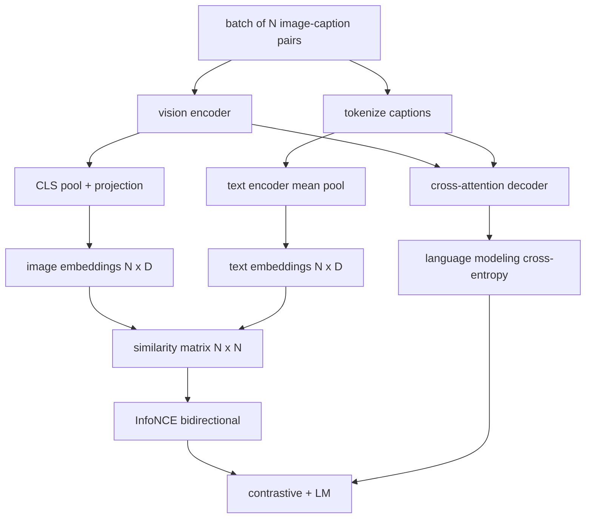

# Vision-Language Pretraining

> Encoder, projection, và decoder đã được kết nối. Bây giờ hãy huấn luyện chúng cùng nhau. Hai mục tiêu thúc đẩy việc học: một contrastive image-text loss (InfoNCE) giúp kéo các cặp khớp lại gần nhau trong không gian embedding chung, và một language modeling loss yêu cầu decoder viết mô tả (caption) cho mỗi hình ảnh. Kết hợp lại, chúng dạy mạng lưới cả cách tìm đúng hình ảnh cho một mô tả và cách viết mô tả cho hình ảnh đó.

**Type:** Build
**Languages:** Python
**Prerequisites:** Phase 19 lessons 30-37 (Track B foundations)
**Time:** ~90 minutes

## Learning Objectives

- Triển khai InfoNCE contrastive loss trên một batch các cặp hình ảnh-mô tả.
- Kết hợp contrastive loss với autoregressive language modeling loss.
- Tổng hợp một kho ngữ liệu (corpus) giả lập gồm 200 cặp hình ảnh-mô tả mà không cần tải tập dữ liệu thực tế.
- Chạy một vòng lặp huấn luyện demo 50 bước và quan sát cả hai loss đều giảm.

## The Problem

Một mô hình thị giác-ngôn ngữ cần hai kỹ năng. Nó phải biết xếp hạng (rank): cho một mô tả, tìm đúng hình ảnh trong số nhiều hình ảnh. Nó phải biết tạo (generate): cho một hình ảnh, viết một mô tả. Việc tiền huấn luyện mô hình chỉ trên một kỹ năng sẽ chỉ mang lại một nửa hệ thống. CLIP đã làm rất tốt việc xếp hạng nhưng không thể viết mô tả. GPT-4V có thể viết mô tả nhưng sử dụng một đầu truy vấn (retrieval head) riêng biệt để xếp hạng. Tiền huấn luyện đa mục tiêu (multi-objective pretraining) đạt được cả hai trong một lượt chạy.

InfoNCE xử lý phần xếp hạng. Đối với một batch gồm N cặp, mô hình coi N cặp khớp nhau là positive và `N^2 - N` cặp không khớp là negative, sau đó chạy một cross-entropy loss trên ma trận tương đồng (similarity matrix) `(N, N)` thu được. LM loss xử lý phần tạo nội dung: dự đoán token tiếp theo tiêu chuẩn dựa trên điều kiện hình ảnh. Cả hai loss đều có thể tính đạo hàm (differentiable) và có thể chia sẻ trọng số của encoder, projector, và decoder.

## The Concept



### InfoNCE trong một đoạn văn

Xếp chồng N image embeddings thành các hàng và N text embeddings thành các hàng. Chuẩn hóa L2 cho cả hai. Tính toán ma trận `N x N` `S = I T^T / tau` trong đó `tau` là một nhiệt độ (temperature) được học. Các phần tử trên đường chéo là các cặp khớp nhau; các phần tử ngoài đường chéo là các cặp negative. Áp dụng cross-entropy với target `argmax` chạy dọc theo đường chéo: hàng `i` nên có giá trị cao nhất ở cột `i`. Thực hiện tương tự một cách đối xứng dọc theo các cột. Tổng loss là trung bình cộng của cả hai. Đây là CLIP loss trong tám dòng code.

### Nhiệt độ (Temperature) rất quan trọng

Nhiệt độ `tau` kiểm soát độ nhọn (peaked) của softmax. Nếu quá nhỏ (ví dụ: `tau = 0.01`), gradient chỉ đến từ negative khó nhất (hardest negative), khiến việc huấn luyện bị nhiễu. Nếu quá lớn, softmax sẽ bị phẳng và gradient biến mất. CLIP học `tau` như một tham số; bản demo ở đây cũng làm tương tự.

### Language modeling loss

Decoder tiêu thụ các image memory tokens thông qua cross-attention và dự đoán token văn bản tiếp theo tại mọi vị trí. Loss là cross-entropy tiêu chuẩn với target là vị trí tiếp theo. Các vị trí padding được mask khỏi loss.

### Kết hợp các loss

`total = contrastive + lm_weight * lm` trong đó `lm_weight` là một đại lượng vô hướng (thường là 1.0). Hai loss chia sẻ gradient vào encoder và projection; chỉ decoder nhận gradient từ LM-loss. Đây là công thức đa nhiệm (multi-task) mà các mô hình kiểu CoCa, BLIP, và SigLIP đều sử dụng, với các trọng số khác nhau.

| Thành phần | Bề mặt Loss | Ảnh hưởng đến |
|-----------|--------------|---------|
| InfoNCE | Xếp hạng cặp trong không gian chung | Encoder + projection + text head |
| LM | Dự đoán token dựa trên hình ảnh | Encoder + projection + decoder |
| Combined | Đa nhiệm | Toàn bộ stack |

### Tại sao 50 bước là đủ cho một bản demo

Kho ngữ liệu giả lập là một tập hợp 200 cặp tổng hợp với hình ảnh ngẫu nhiên và caption id ngẫu nhiên. Sau 50 bước SGD với batch size 16, cả hai loss đều giảm rõ rệt ngay cả khi giá trị tuyệt đối vẫn cao hơn so với mô hình chạy trên dữ liệu thực. Mục đích của bản demo là xác nhận hệ thống gradient hoạt động xuyên suốt và việc thêm LM loss không làm mất ổn định mục tiêu contrastive.

```figure
ch-infonce-diagonal
```

## Build It

`code/main.py` triển khai:

- `MultimodalModel`, kết hợp một ViT encoder nhỏ, MLP projector, một text-side encoder siêu nhỏ (mean-pool trên các embedded id), và cross-attention decoder từ bài 61.
- `info_nce_loss(image_emb, text_emb, temperature)`, contrastive loss kiểu CLIP hai chiều.
- `lm_loss(logits, target_ids, padding_id)`, masked next-token cross-entropy.
- `make_mock_corpus(seed, n_pairs)`, trả về 200 cặp (image, caption_ids) xác định.
- Một vòng lặp huấn luyện chạy 50 bước với batch size 16, Adam optimizer, và một tham số log-temperature được học. Cả hai loss được in ra sau mỗi 5 bước.

Chạy nó:

```bash
python3 code/main.py
```

Kết quả: contrastive loss giảm từ khoảng `ln(16) = 2.77` xuống gần 2.4; LM loss giảm từ mức cơ sở ngẫu nhiên `ln(512) ≈ 6.24` xuống khoảng 4.7. Cả hai sự sụt giảm này chứng minh gradient được kết nối chính xác. Các mô hình thực tế huấn luyện hàng triệu bước; các động lực (dynamics) là tương tự nhau.

## Use It

Đây là cùng một công thức loss được sử dụng trong:

- **CLIP (2021).** Chỉ image-text contrastive, với một caption probe sử dụng frozen-encoder riêng biệt.
- **CoCa (2022).** Image-text contrastive cộng với image-captioning LM loss trong một mô hình. Chính xác là mô hình mà bài học này xây dựng.
- **BLIP (2022) và BLIP-2.** Contrastive cộng với LM cộng với đầu khớp hình ảnh-văn bản (image-text matching head). Kết hợp ba loss.
- **SigLIP (2023).** Thay thế InfoNCE bằng sigmoid pair loss; cùng vai trò contrastive, hình thức hàm khác nhau.
- **Họ LLaVA.** Huấn luyện hai giai đoạn, trong đó giai đoạn một là căn chỉnh (alignment - cosine trên một LM bị đóng băng) và giai đoạn hai thêm LM loss với một LM được mở băng (unfrozen). Bài 60 tương ứng với giai đoạn một; bài học này tương ứng với giai đoạn hai.

## Tests

`code/test_main.py` bao gồm:

- InfoNCE loss đối xứng qua các hàng image/text
- InfoNCE loss trả về 0 khi ma trận tương đồng là một đường chéo hoàn hảo gồm các số dương lớn
- LM loss mask chính xác các vị trí padding
- Forward pass của mô hình tạo ra cả hai loss mà không có lỗi
- Vòng lặp huấn luyện 5 bước làm giảm loss tổng hợp

Chạy chúng:

```bash
python3 -m unittest code/test_main.py
```

## Exercises

1. Thay thế InfoNCE bằng sigmoid pair loss kiểu SigLIP và so sánh sự hội tụ trên kho ngữ liệu giả lập.

2. Thêm bước khai thác negative khó (hard-negative mining): cứ mỗi batch khác, chọn cặp ngoài đường chéo khó nhất từ batch trước đó và thêm nó vào. Huấn luyện và kiểm tra xem contrastive loss có giảm nhanh hơn không.

3. Thêm một đầu nhị phân khớp hình ảnh-văn bản (image-text matching binary head) trên đỉnh của joint embedding (đúng/sai: chúng có khớp không?) cho loss thứ ba, mô phỏng thiết lập ba đầu của BLIP.

4. Thay thế kho ngữ liệu giả lập bằng các chuỗi caption-id được lấy từ một chuỗi Markov có ma trận chuyển trạng thái phụ thuộc vào hash của hình ảnh. Captioning loss sẽ giảm sâu hơn vì có tín hiệu thực sự có thể học được.

5. Huấn luyện cùng một mô hình với `lm_weight = 0` và một lần nữa với `lm_weight = 1`. So sánh contrastive loss; LM loss không được làm suy giảm mục tiêu xếp hạng.

## Key Terms

| Thuật ngữ | Ý nghĩa |
|------|---------------|
| InfoNCE | Noise contrastive estimation: cross-entropy trên một ma trận tương đồng |
| Temperature | Đại lượng vô hướng kiểm soát độ nhọn của contrastive softmax |
| Hard negative | Một cặp ngoài đường chéo mà mô hình thấy khó phân biệt, hữu ích cho việc lấy mẫu |
| LM loss | Cross-entropy dự đoán token tiếp theo tiêu chuẩn ở phía captioning |
| Joint embedding space | Không gian chung nơi các vector hình ảnh và văn bản tồn tại sau khi projection |

## Further Reading

- Bài báo CLIP cho công thức contrastive gốc.
- Bài báo CoCa cho contrastive cộng với captioning trong một mô hình.
- Bài báo SigLIP cho biến thể sigmoid pair-loss và lý do tại sao nó mở rộng quy mô tốt hơn.