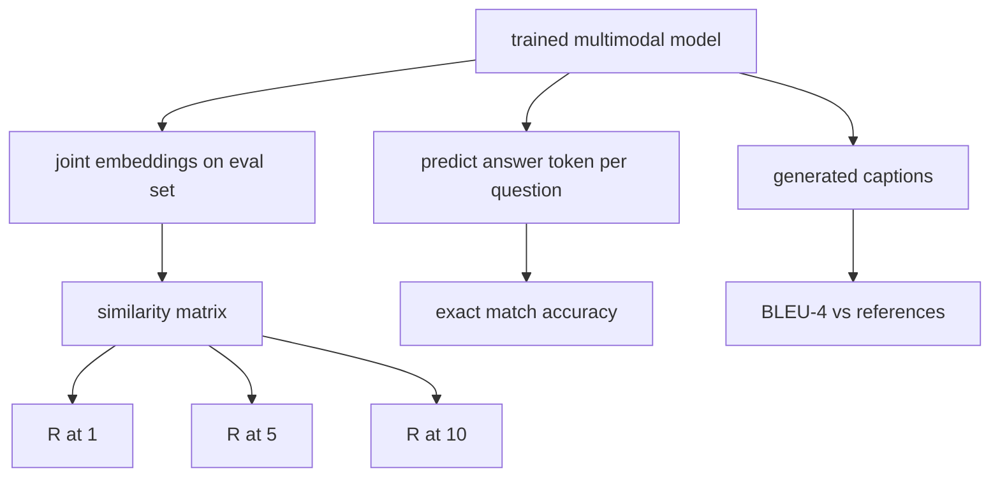

# Đánh giá đa phương thức (Multimodal Evaluation)

> Huấn luyện chỉ là một nửa của vòng lặp. Nửa còn lại là đo lường. Bài học này xây dựng ba bề mặt đánh giá từ các nguyên hàm: truy xuất ảnh-chú thích (image-caption retrieval) được báo cáo qua R@1, R@5, R@10; trả lời câu hỏi thị giác (visual question answering) được báo cáo qua độ chính xác khớp hoàn toàn (exact match accuracy); và chú thích ảnh (image captioning) được báo cáo qua BLEU-4. Mỗi chỉ số là một hàm số dựa trên đầu ra của mô hình và một bộ đánh giá tổng hợp (synthetic eval suite) chạy trong vài giây.

**Type:** Build
**Languages:** Python
**Prerequisites:** Phase 19 lessons 58-62 (Track E foundations: encoder, transformer, projection, cross-attention fusion, pretraining)
**Time:** ~90 phút

## Mục tiêu học tập

- Tính toán Recall@K từ ma trận tương đồng giữa các embedding của ảnh và chú thích.
- Tính toán độ chính xác VQA khớp hoàn toàn từ một mô hình ánh xạ các cặp (ảnh, câu hỏi) sang một từ vựng câu trả lời cố định.
- Tính toán BLEU-4 từ các chuỗi token được tạo ra và chuỗi tham chiếu mà không cần thư viện bên ngoài.
- Chạy cả ba đánh giá trên một bộ dữ liệu tổng hợp được xây dựng dựa trên mô hình đã huấn luyện từ bài học 62.

## Vấn đề

Cám dỗ lớn nhất là tuyên bố một mô hình đa phương thức đã hoàn thiện khi loss huấn luyện đi ngang. Loss huấn luyện chỉ đo lường mức độ phù hợp trên phân phối huấn luyện; nó không đo lường liệu mô hình có thể xếp hạng các cặp trong một batch dữ liệu giữ lại (held-out), trả lời câu hỏi hay viết một chú thích mà con người chấp nhận được hay không. Ba bề mặt đánh giá là tiêu chuẩn:

- **Truy xuất (R@1, R@5, R@10).** Xây dựng embedding chung cho một chú thích truy vấn; xếp hạng mọi ảnh trong tập đánh giá theo cosine; báo cáo xem ảnh khớp có nằm trong top 1, top 5, top 10 hay không. Dạng đối xứng (ảnh-sang-văn bản) cũng chạy theo cách tương tự.
- **Trả lời câu hỏi thị giác (khớp hoàn toàn).** Với (ảnh, câu hỏi), mô hình xuất ra một token câu trả lời. Khớp hoàn toàn là một bit trên mỗi mẫu: câu trả lời dự đoán có bằng câu trả lời tham chiếu không? Lấy trung bình trên tập đánh giá.
- **Chú thích ảnh (BLEU-4).** Tạo một chú thích. Tính trung bình nhân của độ chính xác từ 1-gram đến 4-gram so với các chú thích tham chiếu, kèm theo hình phạt độ dài (brevity penalty). Đa tham chiếu (multi-reference) là dạng tiêu chuẩn (một ảnh, nhiều chú thích tham chiếu).

Mỗi chỉ số là một hàm số đơn giản. Bài học này xây dựng tất cả trong code để toán học trở nên cụ thể và bề mặt đánh giá nằm trong tầm kiểm soát của bạn. Các bộ benchmark thực tế (MS-COCO, VQA v2, GQA, OK-VQA) đều cắm vào các cấu trúc hàm tương tự.

## Khái niệm



### Recall@K từ ma trận tương đồng

Xây dựng ma trận tương đồng cosine `(N, N)` giữa các embedding của ảnh và chú thích. Với mỗi hàng, sắp xếp các cột theo độ tương đồng giảm dần. Recall@K là tỷ lệ các hàng mà chỉ số cột đường chéo nằm trong top K vị trí. Recall@K đối xứng (chú thích-sang-ảnh) được tính trên ma trận chuyển vị. Cả hai con số đều được báo cáo. Với đánh giá N=100, R@1 = 0.6 nghĩa là 60 trong số 100 chú thích đã truy xuất đúng ảnh của chúng ở vị trí khớp hàng đầu.

### Khớp hoàn toàn VQA

Với mỗi (ảnh, câu hỏi, câu trả lời), mã hóa ảnh, nhúng câu hỏi, hợp nhất qua decoder và đọc token tiếp theo. ID token dự đoán được so sánh với ID tham chiếu; đúng nếu bằng nhau. Lấy trung bình trên tập đánh giá. Các bộ dữ liệu VQA thực tế đi kèm với nhiều câu trả lời do con người chú thích cho mỗi câu hỏi và sử dụng công thức độ chính xác mềm (1.0 nếu ít nhất 3 trong 10 người chú thích đồng ý, tỷ lệ thấp hơn nếu ít hơn); bài học này sử dụng khớp hoàn toàn một câu trả lời để đảm bảo tính rõ ràng.

### BLEU-4

```text
BLEU-4 = BP * exp(mean(log p1, log p2, log p3, log p4))
```

Trong đó `p_n` là độ chính xác n-gram đã sửa đổi (số lượng n-gram được tạo ra xuất hiện trong bất kỳ tham chiếu nào, chia cho tổng số n-gram được tạo ra), và `BP` là hình phạt độ dài:

```text
BP = 1                if generated length > reference length
   = exp(1 - r/g)     otherwise, where r is reference length and g is generated
```

Cần làm mịn (smoothing) cho các mẫu nhỏ nơi một số `p_n` bằng 0. Việc triển khai sử dụng "phương pháp 1" của Chen và Cherry (cộng 1 vào tử số và mẫu số cho bất kỳ số đếm bằng 0 nào), đây là mặc định an toàn nhất cho các chế độ có số đếm thấp.

### Bộ đánh giá tổng hợp

Một bộ đánh giá 50 mẫu được xây dựng trong bộ nhớ từ cùng mẫu corpus giả lập được sử dụng trong bài học 62, với một seed giữ lại. Ba danh sách tạo nên bộ đánh giá:

- `pairs`: 50 cặp (ảnh, caption_ids) để truy xuất.
- `vqa`: 50 bộ ba (ảnh, question_ids, answer_id).
- `caps`: 50 mục (ảnh, [reference_caption_ids, ...]) với tối đa 3 tham chiếu mỗi ảnh.

Bộ đánh giá mang tính tất định từ seed và được giữ lại khỏi corpus huấn luyện, vì vậy các chỉ số được tính trên dữ liệu mà mô hình chưa từng thấy. Việc lưu bộ đánh giá vào JSON được để lại như một bài tập (xem bên dưới).

| Chỉ số | Phạm vi | Baseline ngẫu nhiên (N=50) |
|--------|-------|------------------------|
| R@1 | 0 đến 1 | 0.02 (1 / N) |
| R@5 | 0 đến 1 | 0.10 |
| R@10 | 0 đến 1 | 0.20 |
| VQA EM | 0 đến 1 | 1 / vocab |
| BLEU-4 | 0 đến 1 | nhỏ nhưng khác 0 |

Đối với một lần chạy huấn luyện 50 bước trên dữ liệu tổng hợp, các chỉ số không được kỳ vọng là cao; chúng được kỳ vọng là vượt qua baseline ngẫu nhiên, đó là điều mà bản demo kiểm tra.

```figure
ch-recall-window
```

## Xây dựng

`code/main.py` triển khai:

- `recall_at_k(sim_matrix, k)`, trả về một float trong `[0, 1]` cho cả hai hướng.
- `vqa_exact_match(predictions, references)`, trả về trung bình trên `int` sự bằng nhau.
- `bleu4(generated, references, smoothing=True)`, với hỗ trợ đa tham chiếu.
- `build_eval_suite(seed, n_samples, vocab_size, max_len)`, trả về ba danh sách đánh giá tất định.
- `evaluate(model, suite)`, chạy cả ba chỉ số và trả về một `dict` các con số.
- Một bản demo tải mô hình đa phương thức mới khởi tạo từ bài học 62, đánh giá nó, sau đó huấn luyện trong 50 bước và đánh giá lại, in ra các chỉ số trước/sau.

Chạy nó:

```bash
python3 code/main.py
```

Đầu ra: bảng chỉ số trước/sau cho thấy khả năng truy xuất cải thiện từ gần như ngẫu nhiên hướng tới tín hiệu đã học của mô hình, VQA cải thiện vượt mức ngẫu nhiên, và BLEU-4 cải thiện (cấu trúc tổng hợp đủ cho một sự tăng trưởng độ chính xác 4-gram).

## Sử dụng

Mỗi chỉ số ánh xạ trực tiếp vào một benchmark sản xuất:

- **Truy xuất.** MS-COCO 5K val, Flickr30K, ImageNet zero-shot đều là các bài toán R@K trên cùng một ma trận tương đồng. Thay thế đánh giá tổng hợp bằng các tệp thực tế và chữ ký hàm không thay đổi.
- **VQA.** VQA v2, GQA, OK-VQA sử dụng cùng hình dạng khớp hoàn toàn (với độ chính xác mềm thay vì EM một câu trả lời cho VQA v2).
- **BLEU-4.** Chú thích MS-COCO, NoCaps, chú thích Flickr30K đều sử dụng BLEU-4 cộng với CIDEr và METEOR. Thêm CIDEr chỉ là thêm một hàm nữa.

Đối với các benchmark thực tế, hãy hoán đổi `build_eval_suite` bằng một trình tải thực tế và giữ nguyên thân hàm. Toán học là bất biến với benchmark.

## Kiểm thử

`code/test_main.py` bao gồm:

- recall@k trả về 1.0 trên ma trận tương đồng đồng nhất hoàn hảo và 0.0 trên ma trận bị đảo ngược cho k < N
- recall@k tôn trọng cận trên `k <= N`
- bleu4 trả về 1.0 khi kết quả tạo ra khớp chính xác với một trong các tham chiếu
- bleu4 trả về 0.0 trên từ vựng rời rạc
- vqa khớp hoàn toàn bằng tỷ lệ các cặp bằng nhau
- build_eval_suite trả về số lượng cặp, mục vqa và mục chú thích mong đợi

Chạy chúng:

```bash
python3 -m unittest code/test_main.py
```

## Bài tập

1. Thêm CIDEr vào các chỉ số chú thích. CIDEr sử dụng trọng số TF-IDF trên các n-gram, giúp thưởng cho các token giàu thông tin.

2. Triển khai VQA độ chính xác mềm: nhiều câu trả lời của con người cho mỗi câu hỏi, độ chính xác là `min(human_count / 3, 1)` nếu có bất kỳ câu trả lời nào khớp. Tái tạo VQA v2.

3. Thêm một biến thể an toàn với NaN của `bleu4` để xử lý các chuỗi tạo ra trống mà không gây crash.

4. Tính toán mean reciprocal rank (MRR) cùng với R@K. MRR nhạy cảm với vị trí mục đúng nằm ngoài top K; R@K nhạy cảm với việc liệu nó có nằm trong top K hay không.

5. Chạy đánh giá trên mô hình tại năm checkpoint trong quá trình huấn luyện (bước 0, 10, 20, 30, 40, 50) và vẽ đường cong học tập. Xác nhận quỹ đạo chỉ số theo dõi quỹ đạo loss.

## Thuật ngữ chính

| Thuật ngữ | Ý nghĩa |
|------|---------------|
| R@K | Tỷ lệ các truy vấn mà kết quả khớp đúng nằm trong top K |
| Khớp hoàn toàn | Cách tính điểm VQA đơn giản nhất: câu trả lời dự đoán bằng tham chiếu |
| BLEU-4 | Trung bình nhân của độ chính xác 1- đến 4-gram, kèm hình phạt độ dài |
| Đa tham chiếu | Chỉ số chú thích chấp nhận nhiều chú thích tham chiếu cho mỗi ảnh |
| Giữ lại (Held-out) | Tập đánh giá được lấy mẫu từ một seed rời rạc với corpus huấn luyện |

## Đọc thêm

- Bài báo VQA v2 về công thức độ chính xác mềm và thống kê bộ dữ liệu.
- Bài báo CIDEr về chú thích n-gram có trọng số TF-IDF.
- BLEU gốc (Papineni và cộng sự, 2002) cho các biến thể làm mịn.
- Các script đánh giá chú thích MS-COCO cho triển khai tham chiếu chính tắc.