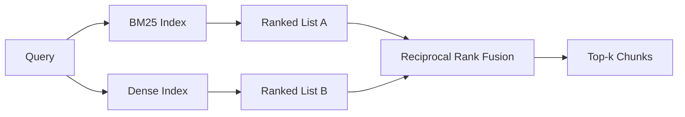

# Hybrid Retrieval với BM25 và Dense Embeddings

> Lexical retrieval (truy vấn từ khóa) và semantic retrieval (truy vấn ngữ nghĩa) đều thất bại trên các phân phối truy vấn trái ngược nhau. Hybrid retrieval (truy vấn lai) với reciprocal rank fusion không thực hiện nội suy, nó thực hiện bỏ phiếu - và phiếu bầu đó giành chiến thắng trên mọi lớp truy vấn.

**Type:** Build
**Languages:** Python
**Prerequisites:** Phase 11 bài 04 (embeddings), 06 (RAG); Phase 19 Track B foundations (bài 20-29); Phase 19 bài 64 (chiến lược chunking)
**Time:** ~90 phút

## Mục tiêu học tập
- Triển khai BM25 từ đầu dựa trên công thức của Robertson và Sparck Jones, bao gồm trọng số trường (field weighting), chuẩn hóa độ dài tài liệu, và các tham số có thể điều chỉnh k1 và b.
- Xây dựng một dense retriever dựa trên một deterministic mock embedding để vòng lặp chạy offline.
- Triển khai reciprocal rank fusion chính xác như cách Cormack, Clarke và Buettcher đã công bố vào năm 2009, và giải thích tại sao nó vượt trội hơn so với nội suy dựa trên trọng số điểm (score-weighted interpolation).
- Điều chỉnh hằng số RRF k và trọng số cho từng phương thức (modality) và đọc các đánh đổi trên một tập dữ liệu mẫu nhỏ.

## Vấn đề

Lexical search (tìm kiếm từ khóa) thắng thế khi truy vấn chứa một định danh chính xác mà kho dữ liệu có chứa nguyên văn. Một truy vấn cho `AbortMultipartOnFail` sẽ trả về hàm Go đúng thông qua BM25 trong vài micro giây. Cùng truy vấn đó, khi được nhúng (embedded), nó nằm ở ranh giới của ba cụm tương đồng và một dense retriever sẽ xếp hạng sai tệp tin lên đầu.

Dense search (tìm kiếm dày đặc/ngữ nghĩa) thắng thế khi truy vấn được diễn giải khác với các từ ngữ nguyên văn trong kho dữ liệu. Một người dùng hỏi "làm thế nào để xử lý các lượt tải lên bị hủy" không bao giờ gõ từ "abort" hay "multipart". BM25 trả về đoạn tài liệu về "tải lên tệp lớn" vì trang đó chứa từ "uploads". Dense retrieval tìm thấy hàm "abort" có tóm tắt đề cập đến việc hủy bỏ.

Sự lựa chọn giữa hai phương pháp này không phải là tĩnh. Phân phối truy vấn mới là biến số. Một hệ thống RAG trong môi trường production xử lý cả hai lớp truy vấn từ cùng một endpoint, vì vậy việc truy xuất phải xử lý cả hai cùng một lúc. Đó chính là hybrid retrieval. Bước hợp nhất (merge) là phần cần phải thực hiện chính xác.

## Khái niệm



### BM25 trong một đoạn văn

BM25 chấm điểm một cặp truy vấn-tài liệu bằng cách cộng dồn, trên các thuật ngữ truy vấn, một hệ số tần suất tài liệu nghịch đảo (IDF) nhân với một hệ số tần suất thuật ngữ (TF) bão hòa bao gồm hiệu chỉnh chuẩn hóa độ dài. Có hai núm điều chỉnh. `k1` kiểm soát độ bão hòa tần suất thuật ngữ; giá trị mặc định 1.5 là khuyến nghị được công bố và bạn không nên thay đổi nó nếu không có benchmark. `b` kiểm soát mức độ quan trọng của độ dài tài liệu; giá trị mặc định 0.75 cho biết các tài liệu dài hơn sẽ bị phạt, nhưng không phải theo tuyến tính.

Công thức IDF sử dụng định nghĩa Robertson và Sparck Jones đã được làm mịn, đó là `log((N - df + 0.5) / (df + 0.5) + 1)`. Việc cộng thêm một bên trong log giúp giữ cho IDF dương khi một thuật ngữ xuất hiện trong hơn một nửa kho dữ liệu. Điều này quan trọng trong các kho dữ liệu nhỏ nơi các từ dừng (stopwords) về mặt kỹ thuật là hiếm.

Trọng số trường (Field weighting) cho phép bạn nói với BM25 rằng một kết quả khớp trong tên biểu tượng (symbol name) quan trọng hơn một kết quả khớp trong phần thân. Việc triển khai là một hệ số nhân trên số lượng thuật ngữ trong quá trình lập chỉ mục (indexing), không phải tại thời điểm chấm điểm. Điều đó giữ cho toán học giống hệt nhau và tránh việc phải tính điểm riêng cho từng trường.

### Dense retrieval trong một đoạn văn

Nhúng mỗi đoạn (chunk) vào một vector có chiều cố định bằng một mô hình embedding. Tại thời điểm truy vấn, nhúng truy vấn, xếp hạng cosine mọi đoạn theo độ tương đồng, và trả về top-k. Mô hình là biến số quyết định chất lượng. Bản thân thuật toán truy xuất chỉ có hai dòng: tích vô hướng (dot product) và sắp xếp.

Bài học này sử dụng một deterministic hash-based embedding để bạn có thể đọc toán học hợp nhất mà không cần gọi mạng. Hash cộng dồn các offset theo token vào một vector 96 chiều và chuẩn hóa. Các xếp hạng cosine là xác định (deterministic) qua các lần chạy, đó là điều mà bộ kiểm thử yêu cầu.

### Reciprocal rank fusion, công thức đã công bố

Hai danh sách xếp hạng. Đối với mỗi ứng viên xuất hiện trong một trong hai danh sách, cộng các đóng góp xếp hạng nghịch đảo của nó. Bài báo năm 2009 sử dụng `1 / (k + rank)` với k bằng 60 làm mặc định. Sắp xếp theo tổng điểm. Đó là toàn bộ thuật toán.

Hằng số k = 60 được công bố không phải là ngẫu nhiên. Với k = 60, đóng góp của hạng 1 là 1 / 61 và đóng góp của hạng 10 là 1 / 70. Đóng góp giảm dần chậm để các ứng viên ở sâu vẫn có thể bỏ phiếu. k nhỏ hơn làm cho các kết quả hàng đầu chiếm ưu thế. k lớn hơn làm phẳng đường cong đóng góp.

Hai núm điều chỉnh trong triển khai của chúng ta. Hằng số `k`. Một cặp trọng số cho mỗi phương thức để bạn có thể tăng cường BM25 hoặc dense khi bạn có bằng chứng trước đó rằng một phương thức tốt hơn trên kho dữ liệu của mình. Nhân đóng góp xếp hạng với trọng số là cách triển khai nguyên tắc đơn giản nhất; nó bảo toàn hình dạng suy giảm xếp hạng và không phụ thuộc vào quy mô (scale-free).

### Tại sao hợp nhất lại thắng nội suy trọng số điểm

Điểm BM25 không bị giới hạn và phụ thuộc vào kho dữ liệu. Độ tương đồng Cosine bị giới hạn trong khoảng -1 đến 1. Một tổ hợp tuyến tính `alpha * bm25 + (1 - alpha) * cosine` đòi hỏi phải điều chỉnh alpha cho từng kho dữ liệu và sẽ hỏng mỗi khi bạn lập chỉ mục lại. Việc hợp nhất dựa trên xếp hạng thì không. Hai xếp hạng có thể so sánh được giữa các phương thức. Baseline RRF đã công bố đánh bại nội suy điểm trong mọi track TREC công khai kể từ năm 2010.

Đây là lập luận tương tự mà bạn nghe về RankFusion so với RRF trong tài liệu của Vespa và Weaviate. Họ đi đến cùng một kết luận: hãy giữ ở mức dựa trên xếp hạng trừ khi bạn có bằng chứng rất mạnh mẽ để nội suy điểm.

```figure
rrf-fusion
```

## Xây dựng

`code/main.py` triển khai:

- `tokenize(text)` - một bộ tokenizer regex nhanh.
- `BM25Index` - có trọng số trường, với `add` và `search` cùng k1, b có thể điều chỉnh.
- `mock_embed`, `DenseIndex` - cùng một deterministic embedding như bài 64 để các đoạn có thể so sánh được.
- `rrf(rankings, k, weights)` - phương thức hợp nhất đã công bố với trọng số đa phương thức.
- `HybridRetriever` - kết hợp BM25 và dense.
- Một bản demo `main()` tải một kho dữ liệu mẫu nhỏ, chạy ba truy vấn nhắm vào điểm mạnh và điểm yếu của từng retriever, và in ra các xếp hạng mà mỗi phương thức tạo ra cộng với danh sách đã hợp nhất.

Chạy nó:

```bash
python3 code/main.py
```

Đọc kết quả demo song song. Truy vấn định danh nguyên văn nằm ở hạng 1 của BM25, hạng 4 của dense, hạng 1 của RRF. Truy vấn diễn giải nằm ở hạng 6 của BM25, hạng 1 của dense, hạng 1 của RRF. Truy vấn mơ hồ nằm ở hạng 3 của BM25, hạng 3 của dense, hạng 1 của RRF. Sự hợp nhất không phải là bộ phá vỡ thế cân bằng; nó là hệ thống chiến thắng trên mọi lớp truy vấn.

## Điều chỉnh các núm

| Núm | Mặc định | Tăng lên khi | Giảm xuống khi |
|------|---------|----------------|------------------|
| BM25 k1 | 1.5 | Các thuật ngữ lặp lại trong tài liệu và bạn muốn tần suất quan trọng hơn | Tài liệu ngắn và việc lặp lại thuật ngữ là nhiễu |
| BM25 b | 0.75 | Tài liệu dài thực sự nói ít hơn trên mỗi từ | Độ dài tài liệu không tương quan với chủ đề |
| RRF k | 60 | Các ứng viên ở sâu nên tiếp tục bỏ phiếu | Hạng 1 nên chiếm ưu thế |
| Trọng số BM25 | 1.0 | Kho dữ liệu chứa các định danh nguyên văn và truy vấn khớp với chúng | Truy vấn là do người dùng diễn giải |
| Trọng số Dense | 1.0 | Truy vấn được diễn giải | Truy vấn là nguyên văn |

Điều chỉnh bằng cách chạy lại bộ đánh giá của bài 68 trên tập truy vấn giữ lại của bạn, không phải bằng trực giác.

## Các chế độ lỗi mà bản demo sẽ che giấu

**Token ngoài từ vựng (Out-of-vocabulary).** IDF của BM25 được tính từ kho dữ liệu, vì vậy các thuật ngữ chỉ có trong truy vấn sẽ đóng góp bằng không. Dense embeddings tạo ra một vector cho cùng thuật ngữ đó. Trên các định danh ngoài kho dữ liệu, phương thức dense trả về các hàng xóm trông có vẻ hợp lý nhưng sai. Sự hợp nhất hấp thụ điều này vì BM25 không trả về gì cả và đóng góp xếp hạng bị loại bỏ, nhưng chỉ khi bạn khử trùng lặp theo tài liệu, không phải theo đoạn.

**Sự thống trị của từ dừng (Stop-token).** BM25 đối với từ "the" tạo ra một xếp hạng đồng nhất trên kho dữ liệu. Hãy lọc các từ dừng trong bộ lập chỉ mục hoặc chấp nhận rằng các thuật ngữ có IDF cao sẽ chiếm ưu thế một cách tự nhiên.

**Nội dung giống hệt nhau giữa các phương thức.** Nếu kho dữ liệu của bạn đủ nhỏ để hạng 1 của BM25 cũng là hạng 1 của dense, RRF mang lại cho bạn cùng một hạng 1 với cùng các hàng xóm. Đó là hành vi đúng, không phải lỗi, nhưng nó làm cho sự hợp nhất trông như vô hình. Hãy thêm một cặp truy vấn đối nghịch vào bộ đánh giá của bạn để xác minh rằng sự hợp nhất thực sự đang hoạt động.

## Sử dụng

Các mô hình Production:

- Lập chỉ mục BM25 trong tiến trình; nút thắt cổ chai là từ điển tần suất thuật ngữ, không phải các vector.
- Lập chỉ mục các dense vector trong một kho lưu trữ riêng (trong bài này chúng ta sử dụng một danh sách phẳng; trong production bạn nên sử dụng HNSW).
- Chạy cả hai truy vấn song song; sự hợp nhất là một phép hợp nhất thời gian hằng số trên tập hợp hợp.
- Lưu giữ phương thức của mỗi kết quả truy xuất để một bộ reranker hạ nguồn có thể thấy phương thức nào đã bỏ phiếu cho nó.

## Triển khai

Bài 66 lấy top-k đã hợp nhất từ bài này và xếp hạng lại với một cross-encoder. Bài 68 đánh giá toàn bộ pipeline với precision, recall, MRR, và nDCG. Hybrid retriever trong bài này là giai đoạn đầu tiên của hệ thống end-to-end trong bài 69.

## Bài tập

1. Thay thế `mock_embed` bằng một mô hình thực tế từ nhà cung cấp của bạn. Chạy lại bản demo và báo cáo cách xếp hạng chỉ-dense thay đổi trên truy vấn diễn giải.
2. Thêm phương thức thứ ba: các tóm tắt đoạn được lập chỉ mục riêng biệt và hợp nhất như một danh sách xếp hạng thứ ba. Đo lường mức tăng.
3. Quét RRF k qua 10, 30, 60, 100, 200. Vẽ đường cong recall@k từ bài 68. Báo cáo giá trị của k nơi đường cong đạt đỉnh trên kho dữ liệu của bạn.
4. Triển khai BM25F đúng cách (chuẩn hóa độ dài theo trường thay vì thủ thuật hệ số nhân) và so sánh trên một kho dữ liệu nơi các khớp biểu tượng quan trọng nhất.

## Thuật ngữ chính

| Thuật ngữ | Mọi người nói | Ý nghĩa thực sự |
|------|-----------------|------------------------|
| BM25 | "Lexical search" | Xếp hạng xác suất với idf x tf bão hòa x chuẩn hóa độ dài |
| RRF | "Rank fusion" | Tổng của 1 / (k + hạng) qua các danh sách xếp hạng; mặc định k = 60 |
| k1 | "TF saturation" | Kiểm soát tốc độ một thuật ngữ lặp lại ngừng thêm điểm |
| b | "Length penalty" | 0 nghĩa là bỏ qua độ dài tài liệu, 1 nghĩa là chuẩn hóa đầy đủ |
| Field weighting | "Symbol boost" | Lặp lại các token trong khi lập chỉ mục để tăng cường khớp trong trường đó |
| Rank-based vs score-based fusion | "Tại sao RRF thắng tuyến tính" | Các hạng có thể so sánh giữa các phương thức; điểm số thì không |

## Đọc thêm

- Cormack, Clarke, Buettcher, "Reciprocal Rank Fusion outperforms Condorcet and individual rank learning methods", SIGIR 2009
- Robertson, Walker, Beaulieu, Gatford, Payne, "Okapi at TREC-3" (bài báo gốc về BM25)
- [Vespa: Hybrid Retrieval with BM25 and Embeddings](https://docs.vespa.ai/en/tutorials/hybrid-search.html)
- [Weaviate: Hybrid Search](https://weaviate.io/developers/weaviate/search/hybrid)
- Phase 11 bài 06 - RAG fundamentals
- Phase 19 bài 64 - các bộ chunker có đầu ra được lập chỉ mục ở đây
- Phase 19 bài 66 - cross-encoder reranker tiêu thụ top-k đã hợp nhất