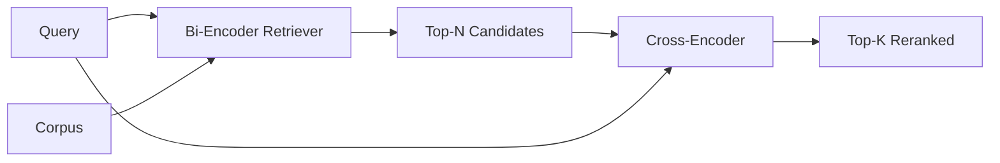

# Cross-Encoder Reranker

> Bi-encoder nhúng truy vấn (query) và tài liệu (document) một cách độc lập. Cross-encoder ghép nối chúng lại và đọc cả hai cùng lúc. Cross-encoder là bộ đọc thông minh nhất nhưng cũng chậm nhất. Khi được sử dụng như giai đoạn thứ hai sau top-k của bi-encoder, nó mang lại hiệu quả xứng đáng với chi phí bỏ ra.

**Type:** Build
**Languages:** Python
**Prerequisites:** Phase 11 lesson 06 (RAG), Phase 11 lesson 07 (advanced RAG); Phase 19 Track B foundations (lessons 20-29); Phase 19 lesson 65 (hybrid retrieval feeding this stage)
**Time:** ~90 minutes

## Mục tiêu học tập
- Phân biệt bi-encoder retriever và cross-encoder reranker dựa trên hình dạng đầu vào, số lượng tham số và chi phí trên mỗi truy vấn.
- Triển khai một cross-encoder nhỏ từ đầu dưới dạng một transformer block nhận vào chuỗi đã đóng gói (query, document) và xuất ra một giá trị vô hướng (scalar) thể hiện độ liên quan.
- Xây dựng pipeline hai giai đoạn retrieve-then-rerank: truy xuất top-N bằng retriever chi phí thấp, rerank N thành top-K bằng cross-encoder, sau đó trả về K.
- Đo lường sự đánh đổi giữa độ trễ và chất lượng trên một tập dữ liệu mẫu nhỏ và chọn N phù hợp cho ngân sách độ trễ cho trước.

## Vấn đề

Bi-encoder ánh xạ truy vấn và tài liệu vào cùng một không gian vector và xếp hạng bằng cosine similarity. Hai mã hóa này không bao giờ "nhìn thấy" nhau. Mô hình phải nén mọi thông tin hữu ích về tài liệu vào một vector duy nhất mà không biết gì về truy vấn. Cách này rất nhanh - một embedding cho mỗi tài liệu tại thời điểm đánh chỉ mục (index time) và một cho mỗi truy vấn tại thời điểm truy vấn - và đây là cách duy nhất để xếp hạng ở quy mô toàn bộ kho dữ liệu (corpus).

Cái giá phải trả là độ chính xác. Hai tài liệu có cùng chủ đề tổng quát có thể có embedding gần như giống hệt nhau ngay cả khi một tài liệu trả lời được truy vấn còn tài liệu kia thì không. Bi-encoder không thể phân biệt được chúng.

Cross-encoder giải quyết vấn đề này bằng cách đọc truy vấn và tài liệu cùng nhau. Mô hình nhận `[query] [SEP] [document]` dưới dạng một chuỗi duy nhất, thực hiện full attention trên toàn bộ phần ghép nối và tạo ra một giá trị vô hướng thể hiện độ liên quan. Mỗi token của tài liệu có thể attend tới mọi token của truy vấn. Mô hình quyết định điểm số với ngữ cảnh đầy đủ.

Cái giá phải trả là thông lượng (throughput). Trong khi bi-encoder chỉ cần nhúng một lần và truy vấn mãi mãi, cross-encoder phải chạy một lần cho mỗi cặp (query, document). Với kho dữ liệu 10 triệu tài liệu, đó là 10 triệu lượt forward pass cho mỗi truy vấn. Không thể thực hiện được trong ngân sách thời gian phản hồi.

Giải pháp là phân giai đoạn (staging). Sử dụng bi-encoder để truy xuất top-N. Sử dụng cross-encoder để rerank N đó thành top-K. N là một con số nhỏ (50 đến 200) và sự cải thiện chất lượng của cross-encoder tập trung vào nơi cần thiết nhất. Tổng độ trễ vẫn nằm trong ngân sách cho phép. Tổng chất lượng là chất lượng của cross-encoder, bị giới hạn bởi độ recall của bi-encoder tại N.

## Khái niệm



### Hình dạng đầu vào của cross-encoder

Cách đóng gói tiêu chuẩn là `[CLS] query_tokens [SEP] document_tokens [SEP]`. Đầu ra tại vị trí CLS được đưa vào một linear head duy nhất để xuất ra giá trị vô hướng độ liên quan. Một số triển khai sử dụng mean-pooling thay vì CLS; sự khác biệt là không đáng kể. Điểm mấu chốt là mô hình tạo ra một con số cho mỗi cặp.

Một cross-encoder với 22 triệu tham số (hạng trọng số `ms-marco-MiniLM-L-6-v2` đã được công bố) là điểm chuẩn trong sản xuất. Các mô hình nhỏ hơn mất chất lượng nhanh hơn là tiết kiệm được độ trễ. Các mô hình lớn hơn (ví dụ: `bge-reranker-v2-m3` với 568 triệu tham số) thường dành cho việc rerank ngoại tuyến (offline) hoặc rerank trang đầu tiên nơi K nhỏ.

### Tại sao bài học này huấn luyện một mô hình tí hon

Một cross-encoder thực thụ là một encoder transformer đã được tinh chỉnh (finetuned). Trong môi trường sản xuất, bạn tải một checkpoint và chạy nó. Trong bài học này, mục tiêu là cho bạn thấy hình dạng của mô hình và đường cong độ trễ-chất lượng, chứ không phải huấn luyện một ranker hiện đại nhất. Vì vậy, chúng ta xây dựng một `nn.Module` nhỏ với một transformer block, multi-head attention (mặc định 4 heads) và một regression head. Nó được khởi tạo một cách tất định (deterministic) từ một seed để bản demo có thể tái lập mà không cần trọng số trên đĩa.

Mô hình đồ chơi học được hình dạng đúng từ tập dữ liệu mẫu: các cặp truy vấn-tài liệu liên quan có điểm số dự đoán cao hơn các cặp không liên quan. Pipeline end-to-end rerank đầu ra của bi-encoder và top-k của rerank tương quan với các nhãn chuẩn (gold labels).

### Độ trễ so với chất lượng

Pipeline hai giai đoạn có một tham số có thể điều chỉnh: N. Quét N từ 5 đến 100 trên một tập truy vấn kiểm thử và bạn sẽ có đường cong này.

| N | Recall@1 của giai đoạn 2 | Số lượt forward pass cross-encoder mỗi truy vấn | Độ trễ |
|---|--------------------|---------------------------------------|---------|
| 5 | 0.62 | 5 | thấp |
| 20 | 0.81 | 20 | trung bình |
| 50 | 0.86 | 50 | cao |
| 100 | 0.86 | 100 | rất cao |

Các con số trên chỉ mang tính minh họa cho hình dạng, không phải phép đo từ tập dữ liệu này. Hình dạng là có thật. Luôn có một điểm "đầu gối" (knee) quanh mức 20 đến 50 ứng viên, nơi sự cải thiện của rerank bão hòa. Vượt qua điểm đó, bạn đang trả phí mà không nhận lại được gì.

Chọn N dựa trên đường cong đánh giá cộng với ngân sách độ trễ. Cross-encoder không thể nâng recall cao hơn recall của bi-encoder tại N, vì vậy N thấp sẽ giới hạn chất lượng, không chỉ giới hạn độ trễ.

```figure
rerank-funnel
```

## Xây dựng

`code/main.py` triển khai:

- `CrossEncoder` - một `torch.nn.Module` nhỏ: token embedding, một transformer block với multi-head attention và feedforward, mean-pooled head tạo ra một scalar.
- `tokenize_pair(query, document)` - đóng gói hai chuỗi thành một chuỗi id duy nhất với type ids đánh dấu ranh giới, tất định và sử dụng thư viện chuẩn.
- `train_tiny(pairs)` - một lượt huấn luyện có giám sát trên danh sách bộ ba (query, document, relevance) được gán nhãn thủ công, để mô hình tạo ra điểm số hợp lý trên tập dữ liệu mẫu.
- `rerank(query, candidates, top_k)` - giao diện sản xuất.
- `pipeline(query, retriever, top_n, top_k)` - luồng hai giai đoạn.
- Một bản demo `main()` tải kho dữ liệu từ pattern của bài 65, truy xuất top-N, rerank thành top-K, in cả hai danh sách cạnh nhau và báo cáo độ trễ của từng giai đoạn.

Chạy nó:

```bash
python3 code/main.py
```

Đầu ra hiển thị top-N của bi-encoder, top-K của cross-encoder và tóm tắt thời gian. Cross-encoder mất nhiều thời gian hơn cho mỗi lần gọi nhưng không chạy trên toàn bộ kho dữ liệu. Tổng thời gian của hai giai đoạn vẫn nằm trong ngân sách yêu cầu trong khi chọn được câu trả lời mà bi-encoder xếp hạng thứ hai hoặc thứ ba.

## Các chế độ lỗi mà bản demo sẽ che giấu

**Cross-encoder không có tính đối xứng.** `rerank(q, d)` và `rerank(d, q)` là các điểm số khác nhau. Luôn đưa truy vấn vào trước. Nếu bạn vô tình hoán đổi, recall sẽ sụp đổ.

**N quá thấp để lộ lỗi.** Nếu bạn đặt N = K, cross-encoder không thể sắp xếp lại; nó chỉ có thể điều chỉnh trọng số. Sự cải thiện trông như bằng không. Hãy chọn N ít nhất gấp ba lần K.

**Dữ liệu huấn luyện rò rỉ vào đánh giá.** Nếu các cặp huấn luyện được gán nhãn thủ công bao gồm các truy vấn đánh giá, rerank trông sẽ rất kỳ diệu. Hãy tách biệt nghiêm ngặt tập huấn luyện và đánh giá, ngay cả trên tập dữ liệu mẫu.

**Trọng số sản xuất rất dày đặc.** Một cross-encoder 22 triệu tham số chiếm 88MB ở định dạng float32. Hãy lập kế hoạch bộ nhớ cho model server trước khi hứa hẹn độ trễ p95 dưới 100ms.

**Batching rất quan trọng.** Một cross-encoder thực thụ chạy N ứng viên trong một batch. Bài học này thực hiện điều đó trong `_batch_encode`, nơi xây dựng các tensor id và type-id theo batch với `torch.tensor(...)` và chạy một lượt forward pass. Nếu bỏ qua batching, độ trễ sẽ nhân lên theo N.

## Sử dụng

Các pattern sản xuất:

- Cố định bi-encoder, cross-encoder và N cùng nhau. Thay đổi bất kỳ thành phần nào cũng làm mất hiệu lực của đánh giá.
- Cache đầu ra của reranker theo hash (query, document_id). Cùng một truy vấn trên một kho dữ liệu ổn định sẽ rerank ra cùng một thứ tự; cache hit giúp bạn cắt giảm độ trễ miễn phí.
- Ghi log điểm số cross-encoder hạng 1. Một truy vấn có điểm top-1 dưới ngưỡng cụ thể của kho dữ liệu là một truy vấn nằm ngoài phạm vi (out-of-domain); hãy phản hồi cho LLM là "Tôi không tự tin".

## Triển khai

Bài 68 đánh giá pipeline hai giai đoạn này từ đầu đến cuối. Bài 69 kết nối reranker này phía sau hybrid retriever từ bài 65 và phía trước bộ tạo câu trả lời. Reranker là giai đoạn thứ hai của hệ thống end-to-end.

## Bài tập

1. Quét N từ 5 đến 50 và vẽ biểu đồ recall@1 của đầu ra đã rerank. Tìm điểm "đầu gối" trên tập dữ liệu mẫu này.
2. Huấn luyện cross-encoder trong mười epoch thay vì một. Đo lường biên độ điểm số giữa các cặp tích cực và tiêu cực tại mỗi epoch.
3. Thay thế mean-pooling bằng CLS-token head. So sánh sự hội tụ trên tập dữ liệu mẫu này.
4. Thêm một cross-encoder head thứ hai dự đoán nhãn nhị phân "câu trả lời này có nằm trong tài liệu không". Sử dụng cả hai head khi suy luận (inference); một để xếp hạng, một để đặt ngưỡng.
5. Thay thế mock bi-encoder tất định bằng bi-encoder từ bài 65 và kết nối hai giai đoạn. Đo lường sự thay đổi trong top-K so với chỉ dùng bi-encoder.

## Thuật ngữ chính

| Thuật ngữ | Cách gọi thông thường | Ý nghĩa thực tế |
|------|-----------------|------------------------|
| Bi-encoder | "Vector retriever" | Mã hóa truy vấn và tài liệu độc lập; xếp hạng bằng cosine |
| Cross-encoder | "Reranker" | Mã hóa (truy vấn, tài liệu) chung; xuất ra một scalar độ liên quan |
| Two-stage pipeline | "Retrieve and rerank" | Retriever chi phí thấp trả về N, reranker đắt đỏ giữ lại K |
| N (candidate budget) | "Rerank pool" | Số lượng ứng viên mà cross-encoder chấm điểm mỗi truy vấn |
| Mean-pooling head | "Mean of last hidden" | Lấy trung bình đầu ra lớp cuối của encoder thành một vector |

## Đọc thêm

- Nogueira, Cho, "Passage Re-ranking with BERT", 2019 - bài báo kinh điển về cross-encoder ranker
- Reimers, Gurevych, "Sentence-BERT: Sentence Embeddings using Siamese BERT-Networks", 2019 - về bi-encoders so với cross-encoders
- [Tài liệu SentenceTransformers Cross-Encoders](https://www.sbert.net/examples/applications/cross-encoder/README.html)
- [Thẻ mô hình BGE Reranker v2](https://huggingface.co/BAAI/bge-reranker-v2-m3)
- Phase 19 lesson 65 - hybrid retriever cung cấp dữ liệu cho giai đoạn rerank này
- Phase 19 lesson 68 - bài đánh giá đo lường sự cải thiện mà rerank mang lại