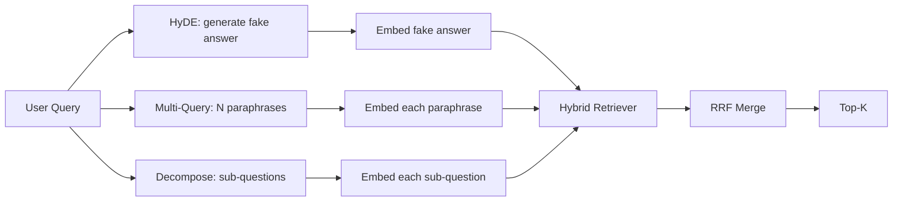

# Query Rewriting: HyDE, Multi-Query và Decomposition

> Truy vấn mà người dùng nhập vào không phải là truy vấn mà bộ truy xuất (retriever) của bạn mong muốn. Việc viết lại truy vấn (rewriting) giúp thu hẹp khoảng cách trước khi truy xuất, để chỉ mục (index) nhìn thấy nội dung gần giống với câu trả lời hơn.

**Type:** Build
**Languages:** Python
**Prerequisites:** Phase 11 bài 04 (embeddings), 06 (RAG); Phase 19 Track B foundations (bài 20-29); Phase 19 bài 64 và 65
**Time:** ~90 phút

## Mục tiêu học tập
- Triển khai Hypothetical Document Embeddings (HyDE): tạo một câu trả lời giả định, nhúng nó và truy xuất dựa trên vector đó thay vì vector truy vấn gốc.
- Triển khai mở rộng đa truy vấn (multi-query expansion): viết lại một truy vấn thành N cách diễn đạt khác nhau, truy xuất với từng cách và hợp nhất kết quả bằng Reciprocal Rank Fusion (RRF).
- Triển khai phân tách truy vấn (query decomposition): chia một câu hỏi phức tạp thành các câu hỏi con, truy xuất theo từng câu hỏi con và hợp nhất kết quả.
- So sánh trực tiếp ba kỹ thuật viết lại trên một tập dữ liệu mẫu (fixture) và giải thích khi nào mỗi chiến lược đạt hiệu quả tốt nhất.
- Xây dựng một LLM giả lập (mock LLM) tạo ra các đầu ra tất định (deterministic) trên tập dữ liệu mẫu để vòng lặp viết lại có thể chạy offline.

## Vấn đề

Người dùng nhập "what does our team do when uploads fail and the budget is gone?". Tập dữ liệu chứa một tài liệu ghi: "AbortMultipartOnFail aborts an in-flight S3 multipart upload and decrements the per-bucket retry budget when the upload fails". Truy vấn và tài liệu không chia sẻ cụm danh từ nào. BM25 thất bại. Bi-encoder xếp hạng tài liệu này ở vị trí thứ ba hoặc thứ tư vì vector truy vấn rơi vào một vùng trong không gian embedding ưu tiên các tài liệu về công việc bị hủy, thay vì tài liệu về việc hủy tải lên. Kỹ thuật rerank hai giai đoạn từ bài 66 có thể cứu vãn câu trả lời nếu nó nằm trong top-N, nhưng nếu nó thậm chí không lọt vào top-N, reranker sẽ không bao giờ nhìn thấy nó.

Giải pháp là viết lại truy vấn trước khi nó chạm đến bộ truy xuất. Bài báo năm 2023 "Precise Zero-Shot Dense Retrieval without Relevance Labels" (Gao và cộng sự) đã giới thiệu HyDE: yêu cầu LLM viết tài liệu trả lời cho truy vấn, nhúng tài liệu giả định đó và sử dụng embedding của nó làm vector truy xuất. Tài liệu giả định nằm đúng vùng trong không gian embedding vì nó được viết theo văn phong của tập dữ liệu, điều mà vector truy vấn gốc không làm được.

Hai kỹ thuật liên quan đi kèm với HyDE. Mở rộng đa truy vấn (thuật ngữ mà GraphRAG của Microsoft sử dụng) tạo ra N cách diễn đạt khác nhau của truy vấn và truy xuất với từng cách, sau đó hợp nhất. Phân tách truy vấn (được phổ biến dưới tên "subquery decomposition" trong công trình DSPy của Stanford năm 2024) chia câu hỏi "what does our team do when uploads fail and the budget is gone" thành hai câu hỏi: "what happens when an upload fails" và "what happens when the retry budget is gone". Hai lần truy xuất, một kết quả hợp nhất, cả hai phần của câu trả lời đều có thể tiếp cận được.

Bài học này triển khai cả ba kỹ thuật và chạy chúng trên cùng một tập dữ liệu mẫu.

## Khái niệm



### Chi tiết về HyDE

HyDE thay thế vector truy vấn của người dùng bằng vector của tài liệu giả định do LLM viết. Prompt rất ngắn gọn:

```
You are a domain expert. Write a one-paragraph passage that answers the question
below. Use the same vocabulary and phrasing the documentation in this domain would
use. Do not refuse. Do not say you do not know.

Question: {user_query}

Passage:
```

Câu trả lời của LLM có thể sai về mặt thực tế vì LLM không biết tập dữ liệu của bạn. Điều đó không sao cả. Bộ truy xuất không quan tâm đến tính đúng đắn thực tế, chỉ quan tâm đến phân phối token. Đoạn văn giả định chứa các từ "abort", "multipart", "bucket", "budget", vì đó là những gì một đoạn tài liệu về chủ đề này sẽ viết. Nhúng đoạn văn đó. Vector sẽ rơi gần với đoạn văn thực tế.

Trong môi trường sản xuất, bạn nên giới hạn tài liệu giả định ở hai hoặc ba câu. Các giả định dài hơn sẽ thu thập nhiều nhiễu hơn. Các giả định ngắn hơn sẽ làm mất tín hiệu từ vựng mà HyDE cần.

### Chi tiết về mở rộng đa truy vấn (Multi-query expansion)

Tạo N cách diễn đạt khác nhau của truy vấn người dùng. Prompt đơn giản nhất:

```
Rewrite the following question in {N} different ways. Each rewrite must preserve
the original intent. Number them 1 to {N}. Do not add explanations.
```

Truy xuất top-k cho mỗi cách diễn đạt. Hợp nhất N danh sách xếp hạng bằng RRF (thuật toán tương tự từ bài 65). Rẻ, song song, tất định.

Mở rộng đa truy vấn hiệu quả khi cách diễn đạt của người dùng chỉ là một trong nhiều cách hợp lệ để đặt câu hỏi, và bất kỳ cách viết lại nào cũng có thể làm rõ câu hỏi hơn. Nó thất bại khi tất cả các cách viết lại đều tệ như nhau vì truy vấn gốc đã có vấn đề tương tự.

### Chi tiết về phân tách truy vấn (Decomposition)

Một lần truy xuất đơn lẻ không thể thỏa mãn một câu hỏi đa diện. Phân tách truy vấn yêu cầu LLM chia câu hỏi thành các câu hỏi con và hệ thống truy xuất theo từng câu hỏi con. Prompt:

```
The following question may require information from multiple distinct topics.
Decompose it into a list of sub-questions. Each sub-question must be answerable
independently. If the question is already atomic, return it unchanged.

Question: {user_query}
```

Truy xuất theo từng câu hỏi con. Hợp nhất. Phân tách là công cụ phù hợp cho các câu hỏi chứa liên từ, so sánh nhiều mệnh đề hoặc hai chủ đề không liên quan. Đây là công cụ sai cho các câu hỏi nguyên tử (atomic); công việc của bộ phân tách ở đó là trả về chính câu hỏi đó và không tạo ra các câu hỏi con giả.

### Tại sao cả ba đều tồn tại

Ba kỹ thuật này bổ sung cho nhau. HyDE thu hẹp khoảng cách token giữa truy vấn và tập dữ liệu. Mở rộng đa truy vấn bao phủ sự biến thiên trong cách diễn đạt. Phân tách bao phủ các truy vấn đa chủ đề. Một hệ thống sản xuất sẽ chạy cả ba và chọn chiến lược cho từng truy vấn (hệ thống end-to-end ở bài 69 sẽ hiển thị bộ chọn).

## LLM giả lập (Mock LLM)

Bài học này chạy offline. LLM giả lập là một bảng tra cứu nhỏ dựa trên truy vấn của người dùng, cộng với một phương án dự phòng cho các truy vấn chưa từng thấy. Bảng tra cứu chứa:

- Với mỗi truy vấn mẫu: một đoạn văn giả định, ba cách diễn đạt lại và một bản phân tách.
- Với một truy vấn chưa biết: một phép biến đổi tất định: lấy các từ nội dung của truy vấn, mở rộng chúng thông qua bản đồ từ đồng nghĩa và trả về kết quả.

Hình dạng của mock mới là thứ quan trọng, không phải dữ liệu. Trong sản xuất, bạn thay thế mock bằng một lời gọi mô hình thực tế. Bộ truy xuất không thay đổi.

```figure
cd-hyde-vector
```

## Xây dựng

`code/main.py` triển khai:

- `MockLLM` - phương án thay thế tất định được mô tả ở trên.
- `HyDERewriter` - gọi LLM để viết tài liệu giả định, trả về đầu ra của bộ viết lại dưới dạng `RewriteResult` với văn bản giả định và truy vấn mà bộ truy xuất nên sử dụng.
- `MultiQueryRewriter` - gọi LLM để tạo N cách diễn đạt, trả về danh sách các truy vấn.
- `DecomposeRewriter` - gọi LLM để phân tách, trả về các câu hỏi con.
- `retrieve_with_rewriter` - nhận một bộ viết lại và một bộ truy xuất, chạy các truy vấn đã viết lại, hợp nhất kết quả.
- Một bản demo chạy ba bộ viết lại trên tập dữ liệu mẫu và in ra chiến lược nào trả về tài liệu chứa câu trả lời đúng (gold answer) đầu tiên.

Hình dạng bộ truy xuất được tái sử dụng từ bài 65 (hybrid BM25 + dense). Việc hợp nhất vẫn là RRF. Hình dạng mới duy nhất là giao diện bộ viết lại, vốn rất nhỏ gọn.

Chạy nó:

```bash
python3 code/main.py
```

Đầu ra là bảng xếp hạng theo từng chiến lược và tóm tắt cuối cùng. HyDE thắng trên truy vấn bị lệch cách diễn đạt. Mở rộng đa truy vấn thắng trên truy vấn có sự biến thiên cách diễn đạt. Phân tách thắng trên truy vấn đa chủ đề. Phương án dự phòng (không dùng bộ viết lại) thua trên ít nhất một trong ba trường hợp.

## Các chế độ thất bại mà bản demo sẽ che giấu

**HyDE tạo ra các định danh cụ thể cho tập dữ liệu sai.** Mô hình tự tạo ra một tên hàm. Điểm BM25 của tài liệu giả định trên tài liệu đúng sẽ giảm mạnh vì tên được tạo ra giờ đây là một token trọng số cao không xuất hiện trong chỉ mục. Hãy giới hạn độ dài của tài liệu giả định và giảm trọng số BM25 trong quá trình hợp nhất.

**Các truy vấn mở rộng đa truy vấn hội tụ.** Một mô hình yếu tạo ra ba cách diễn đạt gần như giống hệt nhau. N lần truy xuất trả về cùng một top-k. Việc hợp nhất RRF không tốt hơn một lần truy xuất đơn lẻ. Hãy thêm hướng dẫn về sự đa dạng vào prompt viết lại và phát hiện các bản sao bằng Jaccard.

**Phân tách quá mức.** Bộ phân tách biến một câu hỏi nguyên tử thành một danh sách. Tất cả các lần truy xuất đều trả về cùng một tài liệu nhưng với thứ hạng giảm. Việc hợp nhất tệ hơn bản gốc. Phát hiện điều này bằng một bước kiểm tra "các câu hỏi con này có đủ khác biệt không" trước khi thực hiện truy xuất.

**Độ trễ nhân lên.** HyDE tốn một lần gọi LLM. Mở rộng đa truy vấn tốn một lần gọi LLM để tạo N truy vấn, sau đó là N lần truy xuất. Phân tách tốn một lần gọi LLM để phân tách, sau đó là M lần truy xuất. Các lần truy xuất chạy song song; lời gọi LLM là giới hạn dưới.

## Sử dụng

Các mô hình sản xuất:

- Chọn chiến lược theo từng truy vấn dựa trên độ dài truy vấn: các truy vấn ngắn, nguyên tử sử dụng mở rộng đa truy vấn; các truy vấn phức tạp, nhiều mệnh đề sử dụng phân tách; các truy vấn chứa nhiều thuật ngữ chuyên ngành sử dụng HyDE.
- Cache đầu ra của bộ viết lại theo hash của truy vấn. Nhiều truy vấn bị lặp lại.
- Chạy cả ba song song và hợp nhất ba tập kết quả thành một bằng RRF. Chi phí là ba lần gọi LLM và một lần hợp nhất; chất lượng là sự kết hợp độ bao phủ của cả ba chiến lược.

## Triển khai

Bài 69 kết nối giai đoạn viết lại này trước bộ truy xuất từ bài 65 và bộ reranker từ bài 66. Bài 68 đánh giá mức độ cải thiện mà bộ viết lại mang lại cho khả năng thu hồi (recall) của truy xuất.

## Bài tập

1. Triển khai RAG-Fusion (một biến thể năm 2024 của đa truy vấn) trong đó các cách diễn đạt của bộ viết lại được cố tình làm cho đa dạng, sau đó bước rerank (bài 66) sẽ chọn danh sách cuối cùng.
2. Thêm chiến lược thứ tư: step-back prompting (yêu cầu LLM đưa ra câu hỏi tổng quát hơn, truy xuất trên đó, sau đó thu hẹp lại). So sánh trên tập dữ liệu mẫu.
3. Huấn luyện bộ phân tách để nhận diện các truy vấn nguyên tử bằng cách thêm một "đầu ra" (head) kiểm tra "câu hỏi có phải là nguyên tử không". Đo tỷ lệ phân tách quá mức trước và sau khi huấn luyện.
4. Thay thế LLM giả lập bằng một lời gọi mô hình thực tế. Đo độ trễ trên mỗi chiến lược trong stack của bạn.
5. Thêm điểm tin cậy cho mỗi truy vấn viết lại. Loại bỏ các truy vấn dưới ngưỡng. Đo lường tác động đến recall.

## Thuật ngữ chính

| Thuật ngữ | Cách gọi thông thường | Ý nghĩa thực tế |
|------|-----------------|------------------------|
| HyDE | "Truy xuất tài liệu giả" | LLM viết câu trả lời; nhúng và truy xuất trên đó thay vì truy vấn gốc |
| Multi-query | "Mở rộng diễn đạt" | N cách viết lại truy vấn; truy xuất N lần, hợp nhất bằng RRF |
| Decomposition | "Chia nhỏ truy vấn" | Truy vấn đa chủ đề được chia thành các câu hỏi con, truy xuất riêng biệt |
| Atomic query | "Đơn chủ đề" | Không thể phân tách nếu không tạo ra các câu hỏi con giả |
| Step-back | "Trừu tượng hóa truy vấn" | Hỏi câu hỏi tổng quát hơn, truy xuất, sau đó thu hẹp lại |

## Đọc thêm

- Gao, Ma, Lin, Callan, "Precise Zero-Shot Dense Retrieval without Relevance Labels" (HyDE), 2023
- Microsoft Research, "Multi-Query Expansion for Retrieval"
- Stanford DSPy, "Subquery Decomposition for Multi-Hop QA"
- [Tài liệu về biến đổi truy vấn của LlamaIndex](https://docs.llamaindex.ai/en/stable/optimizing/advanced_retrieval/query_transformations/)
- Phase 11 bài 07 - các mô hình RAG nâng cao
- Phase 19 bài 65 - bộ truy xuất mà bộ viết lại này cung cấp dữ liệu
- Phase 19 bài 68 - đánh giá đo lường mức độ cải thiện của bộ viết lại