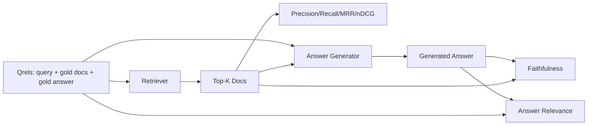

# Đánh giá RAG: Precision, Recall, MRR, nDCG, Faithfulness, Answer Relevance

> Nếu bạn không thể chấm điểm quá trình truy xuất (retrieval) và câu trả lời của mình cùng một lúc, bạn không thể đưa hệ thống vào vận hành. Hai chỉ số này không giống nhau và cùng một prompt có thể thất bại trên các trục khác nhau.

**Type:** Build
**Languages:** Python
**Prerequisites:** Phase 11 bài 06 (RAG), 10 (đánh giá); Phase 19 Track B nền tảng (bài 20-29); Phase 19 bài 64, 65, 66, 67
**Time:** ~90 phút

## Mục tiêu học tập
- Tính toán bốn chỉ số truy xuất từ tập gold qrels: precision@k, recall@k, MRR (mean reciprocal rank) và nDCG@k.
- Tính toán hai chỉ số đánh giá câu trả lời: faithfulness (mọi khẳng định đều dựa trên ngữ cảnh được truy xuất) và answer relevance (câu trả lời giải quyết được câu hỏi).
- Xây dựng tệp fixture qrels (truy vấn, ID tài liệu gold, văn bản câu trả lời gold) để quá trình đánh giá đọc từ đầu đến cuối.
- Đọc các giá trị chỉ số để chẩn đoán pipeline đang thất bại ở đâu: truy xuất, xếp hạng, tạo văn bản hay căn cứ (grounding).

## Vấn đề

Một hệ thống RAG có ít nhất bốn thành phần chuyển động: chunker, retriever, reranker, generator. Bất kỳ thành phần nào trong số đó cũng có thể là nguyên nhân gây ra câu trả lời sai. Nếu không có các chỉ số cho từng giai đoạn, bạn đang làm việc trong mù quáng.

Người dùng báo cáo một câu trả lời sai. Liệu có phải do chunker cắt mất đoạn chứa câu trả lời? Do retriever không đưa chunk đó vào top-k? Do reranker đẩy chunk đúng ra khỏi vị trí số một? Hay do generator bỏ qua chunk và tự bịa ra nội dung? Bạn không thể biết nếu chỉ nhìn vào câu trả lời. Bạn cần:

- Các chỉ số truy xuất để chấm điểm những gì retriever trả về.
- Các chỉ số xếp hạng để chấm điểm vị trí của chunk đúng trong danh sách.
- Faithfulness để chấm điểm xem generator có nằm trong ngữ cảnh được truy xuất hay không.
- Answer relevance để chấm điểm xem câu trả lời có thực sự giải quyết câu hỏi hay không.

Bài học này xây dựng cả sáu chỉ số trên dựa trên một tệp fixture qrels. Quá trình đánh giá là ngoại tuyến (offline) và tất định; trong môi trường production, bạn sẽ thay thế mock LLM-as-judge bằng một LLM thực tế.

## Khái niệm



### Precision@k

Trong số k tài liệu hàng đầu mà retriever trả về, bao nhiêu phần trăm nằm trong tập gold? Nếu tập gold có ba tài liệu và top-3 trả về hai tài liệu đúng và một tài liệu sai, precision@3 là 2 / 3. Sử dụng precision khi chi phí cho một chunk không liên quan được truy xuất là cao (generator lãng phí token vào đó, hoặc chunk đó làm sai lệch câu trả lời).

### Recall@k

Trong số các tài liệu gold, bao nhiêu phần trăm nằm trong top-k? Nếu tập gold có ba tài liệu và top-5 chứa cả ba, recall@5 là 1.0. Sử dụng recall khi chi phí cho việc bỏ lỡ câu trả lời là cao (bạn thà thấy thêm một chunk sai còn hơn là bỏ lỡ hoàn toàn chunk chứa câu trả lời).

Trong RAG thực tế, chỉ số mà mọi người thường trích dẫn là recall@k. Việc tạo văn bản có thể dễ dàng loại bỏ các chunk không liên quan; nhưng nó không thể tạo ra câu trả lời từ một chunk mà nó chưa bao giờ thấy.

### MRR (Mean Reciprocal Rank)

Đối với mỗi truy vấn, hãy tìm vị trí của tài liệu liên quan đầu tiên trong danh sách đã xếp hạng. Reciprocal rank là 1 / vị trí. Tính trung bình trên tập truy vấn. MRR là một con số tóm tắt mức độ hiệu quả của retriever trong việc đưa câu trả lời tốt nhất lên đầu.

MRR đặt trọng số lớn cho vị trí số 1. Một truy vấn có tài liệu gold ở hạng 1 đóng góp 1.0. Hạng 2 đóng góp 0.5. Hạng 10 đóng góp 0.1. Chỉ số này bị chi phối bởi phần đầu của danh sách.

### nDCG@k

Normalized Discounted Cumulative Gain. Công thức đầy đủ gán một giá trị gain cho mỗi tài liệu được truy xuất (thường là 1 cho liên quan, 0 cho không liên quan), chiết khấu theo log của vị trí, tính tổng và chia cho DCG lý tưởng (DCG bạn có được nếu xếp hạng hoàn hảo). Phạm vi từ 0 đến 1.

nDCG hỗ trợ mức độ liên quan được phân loại: tập gold có thể nói "tài liệu A là 3, tài liệu B là 2, tài liệu C là 1". MRR và recall@k làm phẳng mọi thứ thành nhị phân. Sử dụng nDCG khi kho dữ liệu có nhiều tài liệu liên quan một phần cho mỗi truy vấn.

### Faithfulness

Đối với mỗi khẳng định trong câu trả lời được tạo, hãy kiểm tra xem khẳng định đó có được hỗ trợ bởi ngữ cảnh được truy xuất hay không. Cách triển khai tiêu chuẩn sử dụng prompt LLM-as-judge nhận đầu vào là (khẳng định, ngữ cảnh) và trả về yes hoặc no. Chỉ số này là tỷ lệ các khẳng định vượt qua kiểm tra.

Faithfulness giúp phát hiện lỗi generator tự bịa ra nội dung. Ngay cả khi retriever trả về đúng các chunk, một generator bị ảo giác vẫn là một hệ thống lỗi. Faithfulness còn được gọi là groundedness, support, attribution.

Bài học này triển khai faithfulness với một mock judge tất định, kiểm tra xem các token của mỗi khẳng định có trùng lặp với ngữ cảnh được truy xuất vượt quá một ngưỡng hay không. Trong production, bạn sẽ thay thế bằng một lời gọi model thực tế. Hình thái của chỉ số vẫn giữ nguyên.

### Answer relevance

Câu trả lời có thực sự giải quyết câu hỏi không? Faithfulness hỏi "câu trả lời có dựa trên ngữ cảnh không?". Answer relevance hỏi "câu trả lời có dựa trên câu hỏi không?". Một câu trả lời trung thành (faithful) nhưng lạc đề sẽ có điểm faithfulness cao và relevance thấp. Một câu trả lời ngắn gọn, đúng trọng tâm nhưng bỏ qua ngữ cảnh sẽ có điểm relevance cao và faithfulness thấp.

Cách triển khai tiêu chuẩn cũng sử dụng LLM-as-judge: nhận (câu hỏi, câu trả lời) và hỏi xem câu trả lời có giải quyết câu hỏi hay không. Bài học này triển khai một phương án thay thế bằng cách kết hợp token-overlap và judge.

## Tệp fixture qrels

```python
{
  "qid": "q1",
  "query": "what is the abort threshold for multipart uploads",
  "gold_doc_ids": ["d1", "d3"],
  "gold_answer_substring": "three failed parts",
  "graded_relevance": {"d1": 3, "d3": 2},
}
```

Mỗi truy vấn bao gồm:
- chuỗi truy vấn,
- một tập hợp các ID tài liệu gold (cho precision / recall / MRR),
- một từ điển mức độ liên quan được phân loại (cho nDCG),
- chuỗi con câu trả lời gold (được giữ làm metadata tham chiếu trên mỗi qrel; faithfulness trong bài học này được tính bằng cách đánh giá các khẳng định được trích xuất so với ngữ cảnh được truy xuất, không phải so với chuỗi con này).

Trong production, bạn sẽ tự gắn nhãn các dữ liệu này. Bài học này cung cấp một fixture được xây dựng thủ công để quá trình đánh giá có thể chạy ngay lập tức.

```figure
ci-rag-metric-ladder
```

## Xây dựng

`code/main.py` triển khai:

- `precision_at_k(retrieved, gold, k)` - định nghĩa theo nghĩa đen.
- `recall_at_k(retrieved, gold, k)` - định nghĩa theo nghĩa đen.
- `mean_reciprocal_rank(retrieved_list_of_lists, gold_list)` - giá trị trung bình trên các truy vấn.
- `ndcg_at_k(retrieved, graded_relevance, k)` - DCG / IDCG với các mức gain nhị phân hoặc phân loại.
- `extract_claims(answer)` - chia câu trả lời thành các khẳng định dạng câu.
- `faithfulness(claims, context_texts, judge)` - tỷ lệ các khẳng định được đánh giá là có hỗ trợ.
- `answer_relevance(question, answer, judge)` - judge về việc câu trả lời có giải quyết câu hỏi hay không.
- `MockJudge` - judge dựa trên token-overlap tất định để đánh giá chạy ngoại tuyến.
- `evaluate_pipeline(pipeline_fn, qrels, ks)` - bộ điều phối chạy mọi chỉ số.
- Một bản demo chạy ba biến thể pipeline (chunker baseline, hybrid retrieval, hybrid + rerank) so với qrels và in ra bảng chỉ số.

Chạy nó:

```bash
python3 code/main.py
```

Kết quả hiển thị precision@k, recall@k, MRR, nDCG@k, faithfulness và answer relevance cho mỗi biến thể trong một bảng chỉ số duy nhất. Hàng hybrid retrieval vượt qua chunker baseline về recall; hàng rerank vượt qua hybrid về MRR.

## Đọc các chỉ số để chẩn đoán lỗi

| Triệu chứng | Nguyên nhân có thể | Cách khắc phục |
|---------|-------------|-------------|
| Recall@k thấp, precision@k thấp | Chunker cắt mất câu trả lời hoặc retriever không tìm thấy | Ranh giới chunker (bài 64) hoặc phương thức truy xuất (bài 65) |
| Recall@k khá, MRR thấp | Chunk đúng nằm trong top-k nhưng không ở vị trí 1 | Reranker (bài 66) |
| MRR cao, faithfulness thấp | Generator tự bịa nội dung dù có ngữ cảnh đúng | Prompt tạo văn bản; ép buộc trích dẫn hoặc từ chối |
| Faithfulness cao, relevance thấp | Câu trả lời có căn cứ nhưng lạc đề | Query rewriter (bài 67) hoặc prompt tạo văn bản |
| Cả bốn đều cao, người dùng vẫn phàn nàn | Tập đánh giá không đại diện | Mở rộng qrels với các truy vấn thực tế từ người dùng |

## Các chế độ lỗi mà bản demo sẽ che giấu

**Định kiến LLM-as-judge.** Một model thường đánh giá kết quả đầu ra của chính nó là trung thực hơn thực tế. Hãy sử dụng một dòng model khác cho judge so với generator, hoặc tự chấm điểm thủ công một mẫu.

**Qrels bị lỗi thời (rot).** Các câu trả lời gold bị trôi khi kho dữ liệu thay đổi. Một tài liệu từng là gold cho q1 vào tháng 1 năm 2024 không còn là câu trả lời đúng vào tháng 10 năm 2024 vì nhóm đã đổi tên hàm. Hãy lên lịch đánh giá lại qrels hàng quý.

**Kiểm tra faithfulness theo từng câu bỏ lỡ các khẳng định tổng thể.** Faithfulness theo từng câu có thể vượt qua kiểm tra trong khi cấu trúc tổng thể của câu trả lời lại gây hiểu lầm. Hãy thêm đánh giá định tính ở cấp độ mẫu bên cạnh chỉ số tự động.

**Recall@k che giấu các lỗi trên từng truy vấn.** Recall trung bình 90% có thể che giấu việc một nhóm truy vấn nào đó luôn bị bỏ lỡ. Hãy chia nhỏ qrels theo loại truy vấn (nghĩa đen, diễn giải lại, đa chủ đề) và báo cáo theo từng nhóm.

## Sử dụng

Các mô hình trong production:

- Chạy đánh giá trên mỗi thay đổi của retriever hoặc generator. Hãy coi việc giảm recall@k như một lỗi kiểm thử.
- Lưu vết chỉ số theo từng truy vấn. Khi người dùng phàn nàn, hãy tra cứu mục qrels tương ứng và xem liệu lỗi đó có thể bị phát hiện hay không.
- Phân tầng qrels: một tập smoke gồm 20 truy vấn chạy trong CI; một tập regression gồm 200 chạy hàng đêm; một tập chuyên sâu gồm 2000 chạy hàng tuần.

## Đưa vào vận hành

Bài 69 kết nối toàn bộ pipeline (chunker, retriever, reranker, generator) và chạy đánh giá này đối với hệ thống end-to-end.

## Bài tập

1. Thêm chỉ số truy xuất thứ năm: hit-rate@k. So sánh nó với recall@k. Giải thích khi nào chúng khác nhau.
2. Triển khai faithfulness được phân loại: 0 (không hỗ trợ), 1 (hỗ trợ một phần), 2 (hỗ trợ đầy đủ). Cập nhật chỉ số tương ứng.
3. Thay thế mock judge bằng một lời gọi model thực tế. Đo lường sự bất đồng giữa mock và judge thực tế trên fixture.
4. Thêm phân loại truy vấn ("nghĩa đen", "diễn giải lại", "đa chủ đề"). Báo cáo chỉ số theo từng nhóm.
5. Thêm chỉ số "độ dài câu trả lời" và tương quan nó với faithfulness. Vẽ biểu đồ đường cong.

## Thuật ngữ chính

| Thuật ngữ | Cách gọi thông thường | Ý nghĩa thực tế |
|------|-----------------|------------------------|
| Precision@k | "Tỷ lệ trúng trên kết quả truy xuất" | Tỷ lệ các tài liệu trong top-k là gold |
| Recall@k | "Tỷ lệ trúng trên tập gold" | Tỷ lệ các tài liệu gold nằm trong top-k |
| MRR | "Vị trí của kết quả trúng đầu tiên" | Trung bình của 1 / hạng của tài liệu liên quan đầu tiên |
| nDCG@k | "Chất lượng xếp hạng được phân loại" | DCG trên top-k chia cho DCG lý tưởng |
| Faithfulness | "Tính căn cứ" | Tỷ lệ các khẳng định trong câu trả lời được hỗ trợ bởi ngữ cảnh |
| Answer relevance | "Có giải quyết câu hỏi không?" | Liệu câu trả lời có khớp với ý định của câu hỏi không |
| Qrels | "Nhãn gold" | Tập hợp các truy vấn đã được gắn nhãn cùng tài liệu và câu trả lời gold |

## Đọc thêm

- Buckley, Voorhees, "Evaluating Evaluation Measure Stability", SIGIR 2000 - bài báo kinh điển về các chỉ số xếp hạng
- Jarvelin, Kekalainen, "Cumulated Gain-based Evaluation of IR Techniques" - bài báo về nDCG
- [Ragas: Automated Evaluation of RAG Pipelines](https://docs.ragas.io)
- [Anthropic, Evaluating RAG](https://www.anthropic.com/news/evaluating-rag)
- Phase 11 bài 10 - nền tảng khung đánh giá
- Phase 19 bài 64-67 - các thành phần được đánh giá ở đây
- Phase 19 bài 69 - pipeline end-to-end mà bài đánh giá này chấm điểm