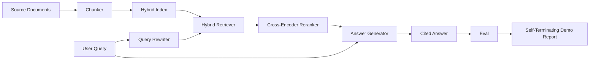

# Hệ thống RAG End-to-End

> Sáu bài học về các thành phần. Một pipeline. Một vòng lặp đánh giá. Một bản demo tự kết thúc. Đây là hệ thống bạn sẽ triển khai.

**Type:** Build
**Languages:** Python
**Prerequisites:** Phase 11 bài 06 (RAG), 10 (đánh giá); Phase 19 Track B nền tảng (bài 20-29); Phase 19 bài 64, 65, 66, 67, 68
**Time:** ~90 phút

## Mục tiêu học tập
- Kết hợp chunker, hybrid retriever, query rewriter, cross-encoder reranker và answer generator thành một pipeline end-to-end duy nhất.
- Triển khai một answer generator có khả năng trích dẫn các khẳng định theo chunk anchor, với cơ chế từ chối trả lời khi độ tin cậy thấp (refuse-on-low-confidence).
- Chạy bài đánh giá của bài 68 trên pipeline đã lắp ráp và chứng minh rằng bản build theo từng giai đoạn vượt trội hơn so với việc chạy các thành phần riêng lẻ trên mọi chỉ số.
- Xây dựng một bản demo CLI tự kết thúc, thực hiện nạp dữ liệu từ corpus mẫu, chạy tập truy vấn cố định và thoát với mã trạng thái 0 kèm báo cáo tóm tắt.

## Vấn đề

Sáu thành phần khi đứng riêng lẻ không chứng minh được điều gì. Chunker có thể thắng về recall@5 trên corpus nhưng lại thua về recall@5 của hệ thống vì retriever không thể xếp hạng những gì chunker tạo ra. Reranker có thể cải thiện MRR trên tập ứng viên tổng hợp nhưng lại thất bại với các ứng viên bi-encoder thực tế vì recall của bi-encoder tại ngân sách rerank quá thấp. Query rewriter có thể thúc đẩy tài liệu chuẩn (gold doc) trên một truy vấn nhưng lại hỏng ở truy vấn tiếp theo vì LLM mock trả về một giả thuyết suy biến.

Kiểm thử tích hợp (integration test) là toàn bộ pipeline chạy end-to-end trên cùng tập qrels mẫu, với cùng chỉ số, thông qua một file điều phối kết nối mọi thứ lại với nhau. Đó là những gì bài học này xây dựng. Nếu các chỉ số trên pipeline tích hợp vượt qua chỉ số của bản demo riêng lẻ từng giai đoạn, bạn đã chứng minh được hệ thống.

## Khái niệm



### Lựa chọn kết nối

Pipeline là một đồ thị nhỏ. Mỗi giai đoạn là một hàm với signature rõ ràng.

| Giai đoạn | Đầu vào | Đầu ra |
|-------|-------|-------|
| Chunker | Văn bản tài liệu | Danh sách các bản ghi Chunk |
| Retriever | Chuỗi truy vấn | Top-N bản ghi Chunk |
| Rewriter (tùy chọn) | Chuỗi truy vấn | Danh sách các truy vấn viết lại + giả thuyết |
| Reranker | Truy vấn, ứng viên | Top-K bản ghi Chunk kèm điểm cross-score |
| Generator | Truy vấn, top-K Chunk | Chuỗi câu trả lời kèm trích dẫn |

Việc kết hợp trở nên đơn giản khi mỗi signature ổn định. Lớp `Pipeline` của bài học chứa năm giai đoạn và một phương thức `query` thực thi chúng theo thứ tự. Mọi giai đoạn đều có thể thay thế: truyền vào một chunker, retriever, rewriter, reranker hoặc generator khác và pipeline vẫn hoạt động.

### Answer generator với trích dẫn

Generator là giai đoạn cuối cùng và dễ hỏng nhất. Bài học cung cấp một mock generator tất định (deterministic) thực hiện:

1. Nhận các chunk đã rerank top-K.
2. Chọn tối đa hai chunk có văn bản chứa độ trùng lặp token nội dung cao nhất với truy vấn.
3. Tạo ra câu trả lời là sự kết hợp của một câu từ mỗi chunk được chọn, với mỗi câu theo sau là một anchor `[doc_id:chunk_index]`.
4. Nếu không có chunk nào có độ trùng lặp vượt ngưỡng từ chối, trả về "I do not know" mà không có trích dẫn.

Trong môi trường production, bạn thay thế mock bằng một lời gọi LLM thực tế với prompt template:

```
You are answering a question using only the snippets below.
Cite every claim with the anchor in parentheses.
If the snippets do not answer the question, say "I do not know".

Question: {query}

Snippets:
{enumerated chunks with anchors}

Answer:
```

Cơ chế từ chối khi độ tin cậy thấp chính là lý do tại sao điểm rank-1 của cross-encoder được ghi lại. Nếu nó nằm dưới ngưỡng của corpus, generator sẽ từ chối. Đây là van an toàn chống lại các câu trả lời bị ảo giác (hallucination).

### Bản demo tự kết thúc

Bản demo chạy mọi thứ end-to-end. Nó in ra phân tích từng giai đoạn của một truy vấn, chạy đánh giá trên bốn qrels mẫu, in bảng chỉ số và thoát với trạng thái 0 nếu tất cả các chỉ số của bài 68 đạt ngưỡng thiết lập trong demo. Nếu bất kỳ chỉ số nào dưới ngưỡng, demo thoát với trạng thái khác 0 và thông báo tên chỉ số bị lỗi.

Đây là hình thái của một bài kiểm tra CI smoke test. Pipeline chạy offline, nhanh, tất định. Các ngưỡng được thiết lập chặt chẽ trên dữ liệu mẫu để bất kỳ sự hồi quy (regression) nào trong sáu bài học đều làm hỏng bản demo.

```figure
rag-pipeline-flow
```

## Xây dựng

`code/main.py` triển khai:

- `Chunk` - bản ghi được truyền qua tất cả các giai đoạn (mở rộng cấu trúc của bài 64 với chunk_index và source doc_id).
- `Chunker` - chọn chiến lược từ bài 64 (mặc định là recursive split).
- `HybridIndex` - kết hợp BM25 + dense + RRF từ bài 65.
- `Rewriter` (tùy chọn) - chọn một trong các phương pháp HyDE, multi-query, decomposition từ bài 67 dựa trên độ dài truy vấn và sự hiện diện của các liên từ.
- `Reranker` - cross-encoder đã huấn luyện từ bài 66, với tập huấn luyện mẫu nhỏ hơn để hội tụ trong vài giây.
- `Generator` - mock generator tất định với trích dẫn và cơ chế từ chối khi độ tin cậy thấp.
- `Pipeline` - kết hợp năm giai đoạn với phương thức `query(question)` trả về `Result(answer, top_k, latency_ms_per_stage)`.
- `run_demo()` - nạp corpus, chạy ba truy vấn mẫu, chạy đánh giá, in kết quả, thiết lập mã thoát theo ngưỡng.

Chạy nó:

```bash
python3 code/main.py
```

Đầu ra là một dấu vết truy vấn được in ra, bảng đánh giá đầy đủ và trạng thái pass/fail cuối cùng. Trả về mã thoát 0 trên dữ liệu mẫu.

## Các chế độ lỗi mà demo sẽ che giấu

**Chunker boundary drift.** Nếu bạn thay đổi chiến lược chunker giữa bước gán nhãn qrels đánh giá và bản demo, các id tài liệu chuẩn sẽ không còn khớp. Hãy khóa chiến lược chunker trong file qrels. Bản demo bao gồm một tiêu đề ghi tên chunker.

**Tập huấn luyện Reranker rò rỉ vào đánh giá.** 14 bộ ba huấn luyện trong bài 66 bao gồm các truy vấn giống với các truy vấn đánh giá. Trong production, hãy giữ các truy vấn đánh giá tách biệt hoàn toàn. Các truy vấn đánh giá của demo được cố tình tách biệt khỏi tập huấn luyện rerank.

**Mock generator che giấu rủi ro ảo giác.** Mock không thể ảo giác vì nó chỉ phát ra văn bản từ các chunk đã truy xuất. Bài học lưu ý điều này và chỉ ra đường dẫn thay thế trong production bằng một mô hình thực tế.

**Không có streaming.** Pipeline trả về câu trả lời đầy đủ ở cuối mỗi giai đoạn. Một hệ thống production sẽ stream đầu ra của generator. Streaming nằm ngoài phạm vi; các chỉ số đánh giá câu trả lời hoạt động trên chuỗi cuối cùng dù thế nào đi nữa.

**Độ trễ là offline.** Các lời gọi LLM mock có thời gian cố định. Các lời gọi LLM thực tế sẽ chiếm ưu thế. Hãy lập kế hoạch ngân sách độ trễ trong phạm vi yêu cầu; thời gian đo lường theo giai đoạn của bài học chỉ đo công việc của CPU.

## Sử dụng

Các mô hình production:

- Triển khai file pipeline dưới một trình điều phối với các giao diện giai đoạn rõ ràng. Tránh rải rác việc kết nối khắp repo.
- Chạy đánh giá trước mỗi lần merge tác động đến một giai đoạn. Nếu đánh giá giảm, merge sẽ không được thực hiện.
- Lưu trữ dấu vết chỉ số cho mỗi lần chạy CI để bạn có thể quy trách nhiệm các sự hồi quy cho việc thay đổi giai đoạn.
- Thêm một tập smoke test gồm 20 truy vấn (tập con của tập hồi quy) chạy trong dưới 30 giây; tập hồi quy đầy đủ chạy hàng đêm.

## Triển khai

File pipeline trong bài học này là hình mẫu mà các bài học còn lại của Phase 19 Track F giả định. Các bài học tiếp theo sẽ thêm tự động hóa nạp dữ liệu, tái lập chỉ mục tăng dần, đo lường từ xa (telemetry) và một lớp phục vụ (serving layer) bên trên. Các phần truy xuất, rerank, viết lại và đánh giá đã hoàn tất tại đây.

## Bài tập

1. Thêm bộ chọn chiến lược theo truy vấn bên trong rewriter: các heuristic từ bài 67 (độ dài, liên từ, tỷ lệ thuật ngữ chuyên ngành) chọn HyDE, multi-query hoặc decomposition.
2. Thêm một lời gọi LLM thực tế cho generator đằng sau một cờ môi trường (env flag). Mặc định là mock. Đo lường sự chênh lệch độ trễ.
3. Mở rộng demo để nhận cờ `--corpus path` nạp một corpus thực tế. Chạy lại đánh giá và kiểm tra ngưỡng.
4. Thêm cờ `--strategy` vào chunker. Đo lường đóng góp của từng chiến lược vào recall end-to-end.
5. Thêm giao diện generator streaming và đưa nó vào đánh giá. Xác nhận rằng tính trung thực (faithfulness) được tính toán trên chuỗi cuối cùng chứ không phải trên tiền tố được stream.

## Thuật ngữ chính

| Thuật ngữ | Cách gọi thông thường | Ý nghĩa thực tế |
|------|-----------------|------------------------|
| Pipeline | "RAG pipeline" | Các giai đoạn được kết hợp từ nạp dữ liệu đến câu trả lời có trích dẫn |
| Citation anchor | "Source link" | Tham chiếu (doc_id, chunk_index) đính kèm mỗi khẳng định |
| Refuse-on-low-confidence | "I do not know" | Generator không trả về câu trả lời khi điểm top-1 của reranker nằm dưới ngưỡng |
| Smoke set | "CI eval" | Tập con qrels tối thiểu chạy trong mỗi lần kiểm tra PR |
| Stage interface | "Function signature" | Kiểu đầu vào và đầu ra ổn định của mỗi giai đoạn pipeline |

## Đọc thêm

- [Anthropic, Building search and retrieval](https://www.anthropic.com/news/contextual-retrieval)
- [Pinterest, MCP internal search](https://medium.com/pinterest-engineering) - tham khảo kiến trúc production
- [Ragas: Automated Evaluation of RAG Pipelines](https://docs.ragas.io)
- Phase 11 bài 06 - Nền tảng RAG
- Phase 19 bài 64-68 - các thành phần được kết hợp tại đây