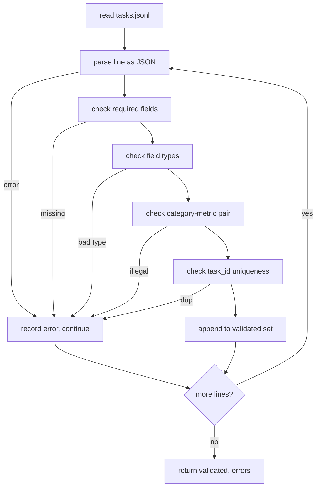

# Task Spec Format

> Một eval harness chỉ tốt khi hợp đồng mà các task của nó tuân thủ. Hãy đóng băng cấu trúc JSONL và từ vựng metric trước khi bạn viết bất kỳ hàm chấm điểm nào.

**Type:** Build
**Languages:** Python
**Prerequisites:** Phase 19 Track B foundations
**Time:** ~90 min

## Learning objectives

- Định nghĩa một schema bản ghi task JSONL bao gồm số học, trắc nghiệm (multiple-choice), thực thi mã (code execution), phân loại (classification) và tóm tắt văn bản tự do (free-text summarisation) trong cùng một cấu trúc.
- Cố định một từ vựng đóng (closed vocabulary) cho các tên metric để các bài học tiếp theo (71-73) có thể điều phối dựa trên một trường duy nhất.
- Chỉ định các ví dụ few-shot và quy tắc hậu xử lý (post-processing) như một phần của task, không phải của runner, để cùng một prompt tạo ra cùng một mục tiêu (target) trên các model khác nhau.
- Triển khai một trình xác thực (validator) nghiêm ngặt để loại bỏ các bản ghi sai định dạng trước khi chúng đến được runner.
- Cung cấp một bộ 10 task mẫu (fixture set) thực thi mọi nhánh của spec để trình xác thực có dữ liệu thực tế để kiểm tra.

```figure
ci-task-spec-gate
```

## Tại sao cần một spec cố định

Một codebase nghiên cứu sẽ tích lũy các script đánh giá nhanh hơn là tích lũy các bài kiểm tra. Sau sáu tháng, mỗi notebook sẽ có cấu trúc JSON riêng, mỗi metric được triển khai lại hai lần và không có gì có thể so sánh giữa các lần chạy. Giải pháp rất đơn giản: Hãy chọn một schema. Viết một trình xác thực. Từ chối mọi thứ khác. Đó là những gì bài học này thực hiện.

Cấu trúc này mượn ý tưởng từ BIG-bench, HELM và các harness kiểu lm-eval, nhưng tên các trường là của chúng ta. Mỗi trường có một chủ sở hữu duy nhất. Runner đọc task. Metric đọc các target. Bước hậu xử lý chuẩn hóa kết quả tạo ra (generation). Không trường nào có thể thay đổi giữa chừng trong pipeline.

## Cấu trúc bản ghi

Một task là một đối tượng JSON trên một dòng duy nhất. Harness đọc `tasks.jsonl` và xác thực từng dòng một cách độc lập. Một dòng lỗi sẽ hủy bỏ bản ghi đó, không phải toàn bộ quá trình chạy.

```json
{
  "task_id": "arith_001",
  "category": "arithmetic",
  "prompt": "Compute the result. Question: 17 + 24\nAnswer:",
  "targets": ["41"],
  "metric_name": "exact_match",
  "few_shot_examples": [
    {"prompt": "Question: 2 + 2\nAnswer:", "completion": "4"}
  ],
  "post_process": "strip_whitespace",
  "metadata": {"difficulty": "easy"}
}
```

Các trường bắt buộc là `task_id`, `category`, `prompt`, `targets`, `metric_name`, `post_process`. `few_shot_examples` và `metadata` là tùy chọn. Các trường cấp cao nhất không xác định sẽ khiến việc xác thực thất bại.

## Quy tắc trường

`task_id` là một chuỗi không có khoảng trắng. Trình xác thực thực thi tính duy nhất trên toàn bộ tệp.

`category` là một trong các giá trị `arithmetic`, `mcq`, `code_exec`, `classification`, `summary`. Danh mục này ràng buộc cặp metric và hậu xử lý nào là hợp lệ. Một task `code_exec` phải sử dụng `metric_name = code_exec` và một task `mcq` phải sử dụng `metric_name = exact_match` đối với một target gồm một ký tự.

`prompt` là một chuỗi không rỗng. Trình xác thực cấm khoảng trắng thừa ở cuối và từ chối các bản ghi đã chứa khối few-shot trong phần thân prompt. Việc render few-shot diễn ra trong runner, không phải bởi tác giả.

`targets` là một danh sách không rỗng các chuỗi. Đối với `exact_match`, bất kỳ phần tử nào khớp đều được tính. Đối với `f1` và `rouge_l`, target có điểm cao nhất sẽ thắng. Đối với `mcq`, danh sách chứa chính xác một phần tử.

`metric_name` là một trong các giá trị `exact_match`, `f1`, `bleu_4`, `rouge_l`, `accuracy`, `code_exec`. Từ vựng này là đóng. Một metric mới yêu cầu một bài học mới và một mục mới tại đây.

`few_shot_examples` là một danh sách các cặp `{prompt, completion}`. Trình xác thực giới hạn danh sách ở mức tám mục để giữ cho các prompt nằm trong giới hạn.

`post_process` là một trong các giá trị `none`, `strip_whitespace`, `lower`, `extract_letter`, `extract_code_block`, `extract_first_line`. Mỗi quy tắc có một hành vi xác định duy nhất. Trình xác thực cấm kết hợp các quy tắc.

## Hành vi của trình xác thực



Trình xác thực trả về hai danh sách: các bản ghi đã xác thực và các bản ghi lỗi kèm theo dòng vi phạm, quy tắc bị vi phạm và trường bị lỗi. Runner sẽ từ chối khởi chạy nếu danh sách lỗi không rỗng, trừ khi cờ `--allow-bad-tasks` được thiết lập rõ ràng.

## Render few-shot

Runner nối các ví dụ few-shot vào phía trước prompt với một dòng trống ngăn cách. Cùng một đường dẫn mã (code path) chạy cho mọi model, vì vậy nguồn biến thiên duy nhất chính là bản thân model. Tác giả viết ví dụ một lần, không phải một lần cho mỗi nhà cung cấp.

```python
def render(task):
    parts = []
    for ex in task.get("few_shot_examples", []):
        parts.append(ex["prompt"] + " " + ex["completion"])
    parts.append(task["prompt"])
    return "\n\n".join(parts)
```

## Quy tắc hậu xử lý

Bước hậu xử lý chạy sau khi tạo kết quả và trước khi tính metric. Nó có tính xác định và không trạng thái (stateless).

- `none` trả về chuỗi không thay đổi.
- `strip_whitespace` loại bỏ khoảng trắng ở đầu và cuối.
- `lower` chuyển chuỗi thành chữ thường.
- `extract_letter` trả về ký tự đầu tiên khớp với `[A-E]`, được sử dụng cho MCQ.
- `extract_code_block` trả về nội dung của khối được bao bởi ba dấu backtick đầu tiên, được sử dụng cho thực thi mã.
- `extract_first_line` trả về dòng không rỗng đầu tiên, được sử dụng cho phân loại tóm tắt.

Một task cần một quy tắc nằm ngoài danh sách này thuộc về một bài học mới.

## Những gì bài học này không thực hiện

Nó không chấm điểm. Nó không gọi model. Nó không chạy mã. Những phần đó sẽ có trong bài học 71, 72 và 75. Bài học này đóng băng hợp đồng mà tất cả chúng đều tuân thủ.

Bộ 10 task mẫu bao gồm hai mục số học, hai mục MCQ, hai mục thực thi mã, hai mục phân loại và hai mục tóm tắt. Trình xác thực vượt qua tất cả 10 mục. Một fixture riêng biệt (`tasks_bad.jsonl`) sẽ kích hoạt mọi quy tắc và trình xác thực sẽ trả về chính xác số lỗi tương ứng.

## Cách đọc mã

`main.py` định nghĩa `TaskSpec`, `validate_task`, `validate_file` và một điểm truy cập CLI. Trình tải fixture là `load_fixtures`. Các helper render và hậu xử lý nằm cạnh phần xác thực để runner trong bài học 75 có thể import một module duy nhất.

Đọc `main.py` từ trên xuống dưới. Sau đó đọc `code/tests/test_spec.py`. Các bài kiểm tra ghim chặt mọi quy tắc xác thực và mọi hành vi hậu xử lý. Bản demo ở cuối `main.py` xác thực fixture đi kèm và in ra bản tóm tắt.

## Đi xa hơn

Các bộ eval thực tế phát triển các danh mục giống như cách các schema phát triển các cột. Bước đi tỉnh táo là từ chối thêm một danh mục mà không thêm một metric, một quy tắc hậu xử lý và ít nhất một task mẫu. Hãy coi spec như một quá trình di chuyển cơ sở dữ liệu (database migration). Mọi thay đổi đều được xem xét, đánh số phiên bản và đi kèm với các bài kiểm tra. Trình xác thực trong bài học này chính là cổng kiểm soát.