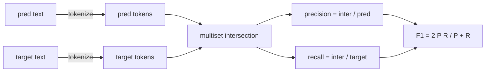
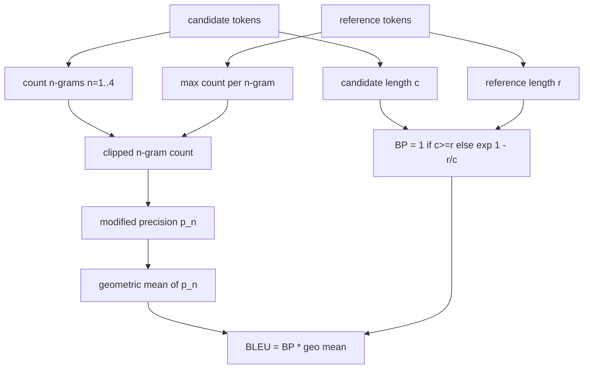

# Các chỉ số cổ điển (Classical Metrics)

> BLEU, ROUGE-L, F1, exact-match, accuracy. Năm chỉ số vẫn chiếm phần lớn các con số đánh giá LLM được công bố. Hãy triển khai từng chỉ số từ những nguyên lý cơ bản để bạn hiểu rõ ý nghĩa của các con số đó.

**Type:** Build
**Languages:** Python
**Prerequisites:** Phase 19 Track B foundations, lesson 70
**Time:** ~90 min

## Mục tiêu học tập

- Triển khai exact-match, F1 và accuracy ở cấp độ token với các quy tắc token hóa rõ ràng.
- Triển khai BLEU-4 từ đầu: modified n-gram precision, trung bình nhân trên n từ 1 đến 4, brevity penalty.
- Triển khai ROUGE-L sử dụng longest common subsequence, kết hợp precision và recall bằng F-beta.
- Dispatch dựa trên trường metric_name từ bài 70 để runner không phụ thuộc vào loại chỉ số.
- Cố định hành vi với các vector tham chiếu được rút ra từ các ví dụ thực tế, không phải từ thư viện bên thứ ba.

```figure
cd-bleu-overlap
```

## Tại sao phải triển khai lại

Bạn sẽ đọc các bài báo báo cáo BLEU 28.3 và bài khác báo cáo BLEU 0.283. Bạn sẽ thấy các điểm số ROUGE-L chênh lệch mười điểm giữa hai thư viện vì một bên chuyển về chữ thường còn bên kia thì không. Cách nhanh nhất để ngừng bối rối là tự viết các chỉ số, sau đó chỉ ra dòng quyết định tokenizer và dòng áp dụng làm mịn (smoothing). Sau đó, việc so sánh các con số giữa các bài báo trở thành vấn đề đọc cách thiết lập chỉ số, thay vì tranh cãi về các thư viện.

Stdlib cộng với numpy là đủ. BLEU là đếm và clamp. ROUGE-L là quy hoạch động. F1 là giao tập hợp trên các token. Phần khó nhất là chọn một tokenizer và cam kết sử dụng nó.

## Tokenisation

Tokenizer là `re.findall(r"\w+", text.lower())`. Chuyển về chữ thường, các chuỗi chữ và số, loại bỏ dấu câu. Mọi chỉ số trong bài học này đều sử dụng chính xác tokenizer này. Runner không được phép chọn lựa. Nếu bạn thay đổi tokenizer, bạn đang chạy một benchmark khác.

```python
TOKEN_RE = re.compile(r"\w+", re.UNICODE)
def tokenize(text):
    return TOKEN_RE.findall(text.lower())
```

Đây là sự đơn giản hóa có chủ đích. Các thiết lập trong môi trường production sẽ cần quan tâm đến CJK, các từ viết tắt (contractions) và các định danh mã nguồn. Mục đích của bài học là tokenizer là một hợp đồng, không phải là một núm xoay tùy chỉnh.

## Exact match

```python
def exact_match(pred, targets):
    return float(any(pred.strip() == t.strip() for t in targets))
```

Nó trả về 1.0 hoặc 0.0 cho mỗi tác vụ. Tổng hợp trên một tập dữ liệu là giá trị trung bình. Đây là công cụ chủ lực cho các tác vụ số học, MCQ và phân loại ngắn.

## Token-level F1

Thiết lập tập hợp đa phần tử (multiset) token cho dự đoán và mục tiêu. Precision là giao của tập hợp đa phần tử chia cho tập hợp đa phần tử của dự đoán. Recall là giao tương tự chia cho tập hợp đa phần tử của mục tiêu. F1 là trung bình điều hòa. Việc triển khai xử lý các trường hợp biên như dự đoán rỗng và mục tiêu rỗng.



Đối với các tác vụ đa mục tiêu, chúng ta lấy F1 tốt nhất trên danh sách mục tiêu. Điều này khớp với hành vi kiểu SQuAD được báo cáo rộng rãi trong tài liệu.

## BLEU-4

BLEU là chỉ số dịch máy kinh điển và nó vẫn xuất hiện trong các công việc tóm tắt văn bản. Công thức chúng ta sử dụng là BLEU-4 cấp độ corpus với brevity penalty tiêu chuẩn và làm mịn cộng một (additive-one smoothing) trên các số đếm n-gram đã sửa đổi để một 4-gram bị thiếu duy nhất không đẩy điểm số về 0.

Đối với mỗi cặp ứng viên-tham chiếu, chúng ta đếm modified n-gram precision cho n bằng 1, 2, 3, 4. Modified precision cắt tỉa số đếm n-gram của ứng viên theo số đếm tối đa của n-gram đó trong bất kỳ tham chiếu nào, vì vậy một ứng viên không thể làm tăng điểm bằng cách lặp lại một cụm từ. Trung bình nhân trên bốn độ chính xác được bao bọc bởi brevity penalty.



Quy tắc làm mịn là quy tắc mà Lin và Och gọi là phương pháp 1: cộng một vào cả tử số và mẫu số của mọi n-gram precision trước khi lấy log. Điều này tránh `log 0` khi một tham chiếu không có 4-gram khớp và vẫn giữ giá trị gần với giá trị chưa làm mịn trên các ứng viên dài.

## ROUGE-L

ROUGE-L so sánh longest common subsequence (LCS) của các chuỗi token ứng viên và tham chiếu. LCS nắm bắt thứ tự từ mà không bắt buộc phải liên tục, đó là lý do tại sao nó là chỉ số tóm tắt mặc định. Chúng ta tính độ dài LCS với bảng quy hoạch động tiêu chuẩn, sau đó suy ra recall là `lcs / reference length`, precision là `lcs / candidate length`, và kết hợp với F-beta trong đó beta bằng một cho dạng F1 đối xứng.

```python
def lcs_length(a, b):
    n, m = len(a), len(b)
    dp = numpy.zeros((n + 1, m + 1), dtype=int)
    for i in range(n):
        for j in range(m):
            if a[i] == b[j]:
                dp[i+1, j+1] = dp[i, j] + 1
            else:
                dp[i+1, j+1] = max(dp[i+1, j], dp[i, j+1])
    return int(dp[n, m])
```

Bảng numpy làm cho việc triển khai dễ đọc; các danh sách Python thuần túy cũng có thể hoạt động. Các tác vụ chọn ROUGE-L phải trả chi phí O(n m) cho mỗi tác vụ. Đối với độ dài tóm tắt thông thường, thời gian thực hiện dưới một mili giây.

## Accuracy

Đối với các tác vụ phân loại đa mục tiêu, accuracy rút gọn thành exact-match so với một mục tiêu đơn lẻ đã chuẩn hóa. Chúng ta hiển thị nó như một hàm riêng biệt để bộ điều phối (dispatcher) có thể dispatch trên `metric_name` mà không cần thực hiện so sánh chuỗi bên trong runner.

## Dispatch contract

Điểm truy cập duy nhất là `score(metric_name, prediction, targets)`. Nó trả về một số thực trong `[0, 1]`. Runner không phân nhánh dựa trên tên chỉ số. Nó chuyển lệnh gọi đi và ghi lại kết quả. Đây là bề mặt mà bài 75 sẽ gắn vào đặc tả tác vụ từ bài 70.

```python
def score(metric_name, pred, targets):
    if metric_name == "exact_match":
        return exact_match(pred, targets)
    if metric_name == "f1":
        return max(f1_score(pred, t) for t in targets)
    if metric_name == "bleu_4":
        return max(bleu4(pred, t) for t in targets)
    if metric_name == "rouge_l":
        return max(rouge_l(pred, t) for t in targets)
    if metric_name == "accuracy":
        return accuracy(pred, targets)
    raise ValueError(f"unknown metric_name: {metric_name}")
```

`code_exec` được xử lý trong bài 72 và được đưa vào bộ điều phối ở đó.

## Những gì bài học này không làm

Nó không gọi một mô hình. Nó không chuẩn hóa các kết quả tạo ra ngoài những gì các quy tắc hậu xử lý từ bài 70 đã thực hiện. Nó không tính toán khoảng tin cậy. Nó không thực hiện BLEURT hoặc BERTScore (những thứ đó cần một mô hình và nằm trong một bài học khác). Điểm mấu chốt là nền tảng: năm chỉ số, một tokenizer, một bảng điều phối.

## Cách đọc mã nguồn

`main.py` định nghĩa mỗi chỉ số như một hàm tự do cộng với bộ điều phối. Các vector tham chiếu nằm trong khối `_reference_examples` ở cuối tệp. Bản demo chạy bộ điều phối với tám ví dụ và in ra điểm số cho từng chỉ số. Các bài kiểm tra trong `code/tests/test_metrics.py` cố định các vector tham chiếu và kiểm tra mọi trường hợp biên (dự đoán rỗng, tham chiếu rỗng, không có token chung, khớp chính xác, cắt tỉa cụm từ lặp lại).

Đọc `main.py` từ trên xuống dưới. Các hàm được sắp xếp theo độ phức tạp. exact_match và accuracy mỗi hàm chỉ có một dòng. F1 là sáu dòng. BLEU và ROUGE-L là các phần nặng và chúng bao gồm các chú thích chi tiết về quy tắc làm mịn và đệ quy LCS.

## Đi xa hơn

Các chỉ số cổ điển là cần thiết, nhưng chưa đủ. Chúng thưởng cho sự trùng lặp bề mặt và bỏ lỡ ý nghĩa. Giải pháp là xếp chồng các chỉ số dựa trên mô hình lên trên (BLEURT, BERTScore, GEval) một khi bạn tin tưởng vào nền tảng cổ điển. Đó là một bài học sau này. Hiện tại: hãy làm cho năm chỉ số này hoạt động, cố định chúng bằng các bài kiểm tra, và bạn sẽ có một bộ chỉ số có thể kiểm toán, nhanh chóng và có thể tái lập.