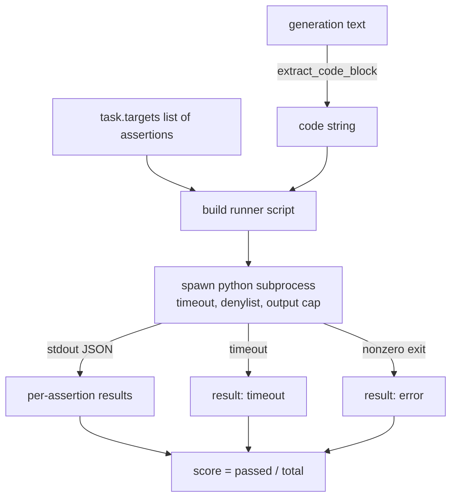
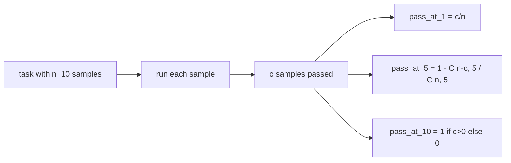

# Code Exec Metric

> Mã được tạo ra là đúng khi nó vượt qua các bài kiểm tra. Eval harness phải trích xuất mã, chạy nó mà không làm treo máy chủ và tính toán tỷ lệ vượt qua (pass-rates) một cách trung thực. Bài học này xây dựng bề mặt đó.

**Type:** Build
**Languages:** Python
**Prerequisites:** Phase 19 Track B foundations, lessons 70 and 71
**Time:** ~90 min

## Learning objectives

- Trích xuất một khối mã từ một nội dung được tạo tự do theo cách khớp với quy tắc hậu xử lý từ bài học 70.
- Thực thi mã ứng viên trong một subprocess cô lập với giới hạn thời gian thực (wall-clock timeout), giới hạn đầu ra và danh sách chặn (denylist) các module import.
- Chấm điểm một tác vụ dựa trên tỷ lệ các chuỗi xác nhận (assertion strings) được cung cấp vượt qua so với ứng viên.
- Tính toán pass-at-k cho các tác vụ lấy mẫu nhiều thế hệ từ một model.
- Xử lý các lỗi sandbox, lỗi cú pháp và lỗi timeout như các chế độ thất bại hạng nhất với các mã thoát (exit codes) riêng biệt mà trình chạy có thể ghi lại.

```figure
sandbox-runner
```

## Tại sao cần một subprocess cô lập

Việc thực thi `exec` nội tuyến là một mối nguy hiểm về bảo mật và tính ổn định. Một `while True: pass` được tạo ra có thể làm treo quá trình đánh giá mãi mãi. Một `import shutil; shutil.rmtree('/')` được tạo ra có thể gây ra hậu quả thảm khốc. Giải pháp là tạo ra một trình thông dịch Python mới cho mỗi ứng viên, truyền mã qua stdin, ghi kết quả xác nhận vào stdout và tiêu diệt tiến trình nếu nó vượt quá thời gian cho phép. Quá trình đánh giá chính vẫn tiếp tục chạy.

Các hệ thống đánh giá thực tế như HumanEval, MBPP, BigCodeBench và LiveCodeBench đều sử dụng sandbox subprocess. Một số lớp phủ Docker lên trên. Chúng ta dừng lại ở subprocess vì lý do: nó có tính di động, nó là stdlib và nó bắt được các chế độ thất bại quan trọng đối với việc đánh giá mang tính giáo dục. Các triển khai sản xuất sẽ thêm seccomp, cô lập mạng và hệ thống tệp chỉ đọc. Bài học tiếp theo về tăng cường bảo mật nằm ngoài lộ trình này.

## Hình dạng của một tác vụ thực thi mã

Một tác vụ `code_exec` mang các chuỗi xác nhận trong `targets`. Trình chạy trích xuất một khối mã được bao quanh từ nội dung được tạo, xây dựng một bộ kiểm tra xung quanh nó và chạy kết quả.



Điểm số là một phân số trong `[0, 1]`. Một tác vụ với ba xác nhận mà hai cái vượt qua sẽ đạt 0.667. Trình chạy trả về cùng một hình dạng bất kể điều gì thất bại: các lỗi subprocess được ánh xạ tới một mã lỗi chuẩn hóa, thay vì một traceback Python nổi lên tới harness.

## Danh sách chặn (Denylist)

Danh sách chặn dựa trên việc import. Trước khi chạy mã ứng viên, tập lệnh trình chạy viết lại các lệnh import của các module nguy hiểm thành một stub gây ra `ImportError("denied")`. Danh sách này được cố tình giữ ở mức bảo thủ: `os.system`, `subprocess`, `socket`, `requests`, `urllib`, `urllib.request`, `urllib.error`, `urllib.parse`, `ctypes`, `shutil`, `http.client`, `asyncio.subprocess`.

Chúng ta không giả vờ rằng điều này là hoàn hảo. Mã độc hại có chủ đích có thể thoát khỏi bất kỳ sandbox nội tiến trình nào trong Python. Danh sách chặn chỉ là một biện pháp phòng vệ cuối cùng. Giới hạn thời gian thực và giới hạn đầu ra là các kiểm soát chịu tải chính.

```python
DENIED = {
    "os.system": True,
    "subprocess": True,
    "socket": True,
    "shutil": True,
    "requests": True,
    "urllib": True,
    "ctypes": True,
}
```

Chúng ta bao bọc ứng viên bằng cách thêm `import sys` và một bộ bảo vệ thực hiện monkey-patch `os.system` để gây ra lỗi. Mẫu đầy đủ nằm trong `main.py`.

## Giới hạn thời gian thực (Wall-clock timeout)

Mỗi subprocess nhận được ngân sách mặc định là ba giây thời gian thực. Trình chạy sử dụng `subprocess.run(..., timeout=t)`. Nếu timeout xảy ra, trình chạy bắt `TimeoutExpired`, tiêu diệt tiến trình và ghi lại lý do thoát `timeout` cho tác vụ đó. Điểm số cho tác vụ đó là không. Trình chạy tiếp tục thực hiện các tác vụ khác.

Thời gian chờ có thể cấu hình cho mỗi tác vụ thông qua `task.metadata.timeout_s`. Các bài kiểm tra đơn vị chạy lâu có thể yêu cầu nhiều thời gian hơn; trình xác thực từ bài học 70 giới hạn giá trị này ở mức ba mươi giây để giữ cho bộ kiểm tra nằm trong giới hạn.

## Giới hạn đầu ra (Output cap)

Subprocess có thể làm tràn stdout, gây cạn kiệt bộ nhớ máy chủ. Trình chạy truyền luồng stdout vào một bộ đệm và tiêu diệt tiến trình con ngay khi tổng số lượng vượt quá 256 KB. Kết quả được ghi lại là `exit_code = error` với chuỗi chi tiết `"output overflow"`. Điều này xảy ra trong thực tế khi một thế hệ mã vô tình tạo ra một vòng lặp vô hạn có in dữ liệu.

## Pass-at-k

Pass-at-k là công cụ ước tính không chệch được sử dụng bởi HumanEval và các hệ thống tương tự. Với `n` mẫu độc lập cho mỗi tác vụ và `c` trong số đó vượt qua, xác suất để một mẫu có kích thước `k` từ `n` chứa ít nhất một giải pháp vượt qua là:

```
pass_at_k(n, c, k) = 1 - C(n - c, k) / C(n, k)
```

Khi `n - c < k`, tử số không được xác định và giá trị là `1`. Việc triển khai xử lý trường hợp biên này trực tiếp. Chúng ta cung cấp `pass_at_k(n, c, k)` để sử dụng bởi lớp bảng xếp hạng trong bài học 74.



## Mã thoát (Exit codes)

Trình chạy trả về một trong năm kết quả cho mỗi tác vụ:

- `pass` khi mọi xác nhận đều vượt qua.
- `assertion_fail` khi mã chạy nhưng ít nhất một xác nhận thất bại.
- `syntax_error` khi mã không thể import hoặc có SyntaxError.
- `timeout` khi thời gian thực đã hết.
- `error` cho bất kỳ lỗi nào khác, bao gồm việc chạm vào danh sách chặn và tràn đầu ra (tràn dữ liệu xuất hiện với chi tiết `"output overflow"`).

Điểm số vẫn là một phân số. Mã thoát là siêu dữ liệu. Các bài học tiếp theo có thể quyết định xem có tính timeout là không hay là dữ liệu bị thiếu.

## Những gì bài học này không làm

Nó không cung cấp cho bạn một sandbox thực sự. Nó không chạy mã không đáng tin cậy từ web mở. Nó không xử lý các tác vụ có trạng thái như I/O tệp hoặc các cuộc gọi mạng. Những tác vụ đó cần một container hoặc một microVM. Mục đích của bài học này là hợp đồng: một subprocess cô lập, một danh sách chặn, một timeout, một giới hạn đầu ra, một từ vựng mã thoát sạch sẽ và toán học pass-at-k.

## Cách đọc mã

`main.py` định nghĩa `extract_code`, `run_candidate`, `score_code_exec` và `pass_at_k`. Tập lệnh trình chạy subprocess được xây dựng dưới dạng một chuỗi và được truyền dưới dạng `-c` cho một trình thông dịch Python mới. Các bài kiểm tra trong `code/tests/test_exec.py` thực hiện bốn mã thoát cộng với pass-at-k dựa trên các ví dụ thực tế được rút ra từ phong cách HumanEval.

Đọc `main.py` từ trên xuống dưới. Mẫu trình chạy là phần chịu tải chính. Hãy nhìn kỹ vào vòng lặp xác nhận cho đến khi bạn có thể dự đoán phong bì JSON mà nó ghi lại cho tiến trình cha.

## Đi xa hơn

Khi hình dạng subprocess hoạt động, mối quan tâm tiếp theo là tính di động. Các phiên bản Python khác nhau xử lý SIGKILL khác nhau trên Windows. Giải pháp sạch nhất là đặt trình chạy vào một hình ảnh Docker. Điều tiếp theo sau đó là thay thế các chuỗi xác nhận bằng các tệp kiểm tra đơn vị thực tế để việc đánh giá khớp với những gì CI sản xuất thực hiện. Đừng gọi các chuỗi xác nhận là bài kiểm tra tại thời điểm đó; chúng là các bài kiểm tra đồ chơi và chúng có các chế độ thất bại đồ chơi.