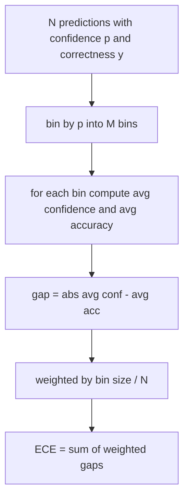
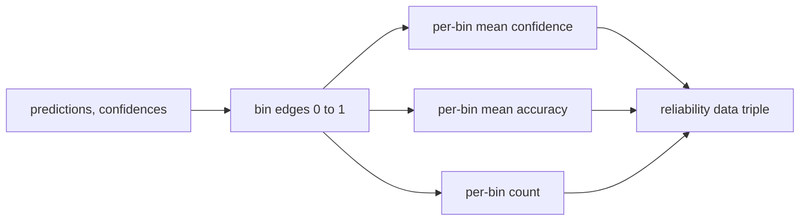

# Perplexity và Calibration

> Nếu mô hình của bạn tự tin 90 phần trăm trên một nghìn câu trả lời và trả lời đúng sáu trăm, thì nó không được hiệu chỉnh (calibrate) tốt. Calibration là một nửa của việc đánh giá đáng tin cậy. Một nửa còn lại là perplexity, cho biết liệu mô hình có coi văn bản được giữ lại (held-out text) là hợp lý hay không.

**Type:** Build
**Languages:** Python
**Prerequisites:** Phase 19 Track B foundations, lessons 70 và 71
**Time:** ~90 phút

## Mục tiêu học tập

- Tính toán perplexity ở cấp độ token trên một corpus được giữ lại từ các negative log-probability của token do model adapter cung cấp.
- Tính toán expected calibration error (ECE) của một bộ phân loại hoặc đánh giá trắc nghiệm từ các xác suất dự đoán đã được phân nhóm (binned).
- Tính toán Brier score (sai số bình phương trung bình so với chỉ số đúng sai) và giải thích khi nào nó thực hiện những gì ECE không làm được.
- Xây dựng dữ liệu biểu đồ độ tin cậy (reliability diagram) cần thiết để vẽ đường cong độ tin cậy so với độ chính xác.
- Kết nối cả ba vào eval harness để runner có thể đính kèm các con số `perplexity`, `ece`, và `brier` vào báo cáo mô hình.

```figure
cd-reliability-diagram
```

## Perplexity cho bạn biết điều gì

Perplexity là lũy thừa của trung bình negative log-likelihood trên mỗi token. Chỉ số càng thấp càng tốt. Perplexity bằng một nghĩa là mô hình gán xác suất một cho mọi token thực tế. Perplexity bằng kích thước từ vựng nghĩa là mô hình phân phối đều và không học được gì cả. Các con số thực tế nằm ở giữa: một base model 2026 mạnh trên WikiText-103 nằm trong khoảng từ tám đến mười hai. Một mô hình tệ trên cùng văn bản đó sẽ nằm ở mức năm mươi trở lên.

Harness không tự tính toán log-probability. Những giá trị đó đến từ model adapter. Harness thực hiện tổng hợp: nó lấy một danh sách các log-probability trên mỗi token, một danh sách số lượng token trên mỗi chuỗi và trả về perplexity của corpus.

```python
def perplexity(neg_log_probs, token_counts):
    total_nll = sum(neg_log_probs)
    total_tokens = sum(token_counts)
    return math.exp(total_nll / total_tokens)
```

Việc triển khai xử lý các trường hợp biên không có token và khẳng định rằng các negative log-probability không âm. Một sai lầm phổ biến là quên phép phủ định: một adapter trả về `log p` thay vì `-log p` sẽ tạo ra perplexity dưới một, điều này là không thể. Hàm này sẽ bắt lỗi đó như một sự vi phạm hợp đồng.

## ECE đo lường điều gì

Expected calibration error nhóm các dự đoán theo độ tin cậy của chúng vào một số lượng bin cố định, sau đó đo khoảng cách trung bình giữa độ tin cậy và độ chính xác trên các bin, được trọng số theo kích thước bin.



Công thức tiêu chuẩn sử dụng mười bin có độ rộng bằng nhau trên `[0, 1]`. Việc triển khai hỗ trợ bất kỳ số nguyên dương nào. Chúng tôi cung cấp tham số `bins` để runner có thể chọn giữa quy ước xuất bản (10) và quy ước so sánh (15).

ECE bị sai lệch bởi số lượng bin và kích thước mẫu. Với mười bin và một trăm dự đoán, bạn không thể phân biệt ECE 0.02 với nhiễu ngẫu nhiên. Việc triển khai trả về số lượng bin đã được điền cùng với ECE để runner có thể từ chối báo cáo một con số duy nhất trên quá ít mẫu.

## Brier score làm được gì mà ECE không làm được

ECE chỉ quan tâm đến các khoảng cách trung bình. Một mô hình quá tự tin trên một nửa số bin và thiếu tự tin trên nửa còn lại có thể có ECE thấp trong khi vẫn được hiệu chỉnh kém ở cấp độ cục bộ. Brier score đo lường sai số bình phương so với kết quả thực tế trên mỗi dự đoán, vì vậy nó trực tiếp phạt sự phân tán.

Đối với các kết quả nhị phân, Brier là `mean((p_i - y_i)^2)`. Nó phân tách thành độ tin cậy (reliability), độ phân giải (resolution) và độ không chắc chắn (uncertainty). Chúng tôi tính toán điểm số và sự phân tách đó. Runner báo cáo giá trị vô hướng nhưng ghi lại sự phân tách cho dashboard.

```python
def brier(p, y):
    return float(np.mean((p - y) ** 2))
```

## Dữ liệu biểu đồ độ tin cậy (Reliability diagram)

Biểu đồ độ tin cậy vẽ độ tin cậy dự đoán so với độ chính xác thực nghiệm trong mỗi bin. Đường chéo là sự hiệu chỉnh hoàn hảo. Hàm trả về ba mảng: độ tin cậy trung bình mỗi bin, độ chính xác trung bình mỗi bin và số lượng mỗi bin. Mã vẽ biểu đồ nằm ở hạ nguồn; bài học này dừng lại ở cấu trúc dữ liệu.



Tuple được trả về là những gì một lớp gọi (calling layer) cần để vẽ biểu đồ hoặc tính toán một biến thể ECE tùy chỉnh (adaptive ECE, sweep ECE, v.v.). Chúng tôi trả về các mảng numpy để mã hạ nguồn không phải chuyển đổi.

## Nguồn gốc độ tin cậy

Harness không giả định độ tin cậy đến từ softmax. Nó chấp nhận bất kỳ số nào trong `[0, 1]` trên mỗi dự đoán. Đối với các tác vụ trắc nghiệm, độ tin cậy tự nhiên là `softmax over option log-likelihoods`. Đối với văn bản tự do, độ tin cậy tự nhiên là xác suất do mô hình tự báo cáo hoặc lũy thừa của log-likelihood trung bình. Eval chỉ tiêu thụ con số đó. Nguồn gốc của nó là công việc của adapter.

## Các trường hợp biên

- Tất cả dự đoán sai: ECE là độ tin cậy trung bình, Brier cao, perplexity là bất cứ điều gì mô hình nghĩ về văn bản.
- Tất cả dự đoán đúng với độ tin cậy cao: ECE gần bằng 0, Brier gần bằng 0.
- Bộ dự đoán hoàn toàn không chắc chắn tại p=0.5: ECE là 0.5 trừ đi độ chính xác, Brier là 0.25 trừ đi một số hạng hiệu chỉnh.
- Đầu vào trống: ECE, Brier và reliability trả về `0.0` (hoặc các mảng chứa đầy số 0). Perplexity trả về `NaN` cho trường hợp không có token. Không có đường dẫn nào trong số này phát ra cảnh báo; runner kiểm tra các giá trị và quyết định báo cáo hay bỏ qua.

Các trường hợp này được tích hợp vào các bài kiểm tra. Một mô hình thực tế trên một benchmark thực tế sẽ không gặp phải chúng, nhưng một adapter bị lỗi hoặc một mẫu quá nhỏ thì có, và runner không nên bị crash.

## Điều phối

Calibration không phải là một chỉ số theo tác vụ như F1. Nó là một báo cáo theo mô hình. Runner tích lũy các cặp `(confidence, correct)` trên toàn bộ eval và tính toán ECE, Brier và dữ liệu reliability một lần. Perplexity được tính toán trên một corpus văn bản được giữ lại, tách biệt với việc chấm điểm từng tác vụ.

Giao diện là:

```python
report = CalibrationReport.from_predictions(confidences, correct)
report.ece          # float
report.brier        # float
report.reliability  # tuple of three numpy arrays
report.populated_bins  # int
```

`PerplexityResult.from_token_nll(neg_log_probs, token_counts)` trả về perplexity và trung bình negative log-likelihood trên mỗi token.

## Những gì bài học này không thực hiện

Nó không gọi mô hình. Nó không triển khai softmax. Nó không ước tính độ tin cậy từ các token đầu ra; đó là công việc của adapter. Nó không thực hiện temperature scaling hoặc Platt scaling; đó là các bản sửa lỗi hậu kỳ nằm trong một bài học khác. Mục đích của bài học này là làm cho ba con số (perplexity, ECE, Brier) trở nên đáng tin cậy và có thể tái lập.

## Cách đọc mã

`main.py` định nghĩa `perplexity`, `expected_calibration_error`, `brier_score`, `reliability_diagram`, và các dataclass `CalibrationReport` / `PerplexityResult`. Bản demo chạy trên các dự đoán tổng hợp nơi biết được ground truth: một mô hình được hiệu chỉnh tốt, một mô hình quá tự tin và một mô hình thiếu tự tin. Các bài kiểm tra trong `code/tests/test_calibration.py` ghim mọi trường hợp biên cộng với các giá trị tham chiếu cho các bộ dự đoán tổng hợp.

Đọc `main.py` từ trên xuống dưới. Thứ tự hàm đi từ vô hướng đến vector đến báo cáo. Mỗi hàm có một docstring ngắn với công thức toán học và hợp đồng.

## Đi xa hơn

Calibration là trục bị bỏ qua nhiều nhất trong các đánh giá được công bố. Hầu hết các bảng xếp hạng chỉ báo cáo một con số độ chính xác duy nhất và coi đó là xong. Một mô hình thắng về độ chính xác nhưng thua về Brier là một triển khai sản xuất tồi tệ hơn so với một mô hình có điểm số thấp hơn một chút về độ chính xác nhưng báo cáo độ không chắc chắn của nó một cách đáng tin cậy. Khi bạn đã có hệ thống calibration tại chỗ, hãy thêm temperature scaling trên một lát cắt validation được giữ lại, tính toán lại ECE và quan sát khoảng cách thu hẹp lại. Đó là một bài học riêng biệt, nhưng nền tảng nằm ở đây.