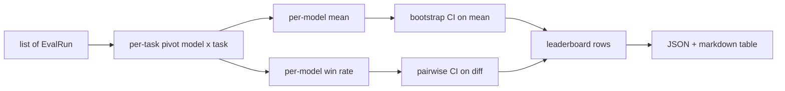
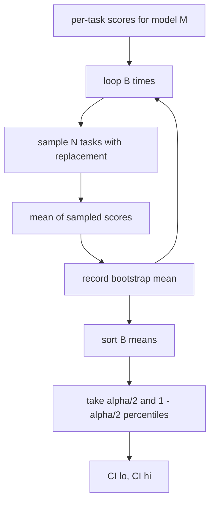

# Leaderboard Aggregation

> Điểm số theo từng tác vụ (task) thì dễ. Xếp hạng theo mô hình trên các tác vụ không đồng nhất thì khó hơn. Ý nghĩa thống kê trên một bảng xếp hạng với hàng nghìn dự đoán là phần mà mọi người thường bỏ qua. Bài học này sẽ không bỏ qua điều đó.

**Type:** Build
**Languages:** Python
**Prerequisites:** Phase 19 Track B foundations, lessons 70, 71, 73
**Time:** ~90 min

## Mục tiêu học tập

- Tổng hợp điểm số theo từng tác vụ trên nhiều mô hình và nhiều tác vụ thành một hàng dữ liệu gọn gàng cho mỗi mô hình.
- Chuẩn hóa các điểm số không đồng nhất để tỷ lệ vượt qua (pass rates) và giá trị BLEU không gây ảnh hưởng quá mức đến kết quả tổng hợp.
- Xếp hạng các mô hình theo giá trị trung bình (mean) và tỷ lệ thắng (win-rate), đồng thời giải thích khi nào mỗi phương pháp là bản tóm tắt phù hợp.
- Tính toán khoảng tin cậy bootstrap cho điểm trung bình của mỗi mô hình và cho sự khác biệt theo cặp.
- Xuất bảng xếp hạng dưới dạng báo cáo JSON và bảng markdown để runner trong bài học 75 có thể dán vào bình luận CI.

```figure
ci-leaderboard-ci
```

## Hình dạng của dữ liệu đầu vào

Bộ tổng hợp (aggregator) tiêu thụ một danh sách các bản ghi `EvalRun`:

```python
@dataclass
class EvalRun:
    model_id: str
    task_id: str
    metric_name: str
    score: float          # in [0, 1]
    category: str
```

Runner trong bài học 75 phát ra một bản ghi cho mỗi cặp `(model, task)`. Bộ tổng hợp không quan tâm điểm số được tạo ra như thế nào. Nó mong đợi việc chuẩn hóa đã được thực hiện: mọi điểm số đều nằm trong khoảng `[0, 1]`.

## Đầu ra

Ba bảng sẽ được tạo ra:



Hàng của bảng xếp hạng bao gồm: `model_id`, `mean_score`, `mean_ci_lo`, `mean_ci_hi`, `win_rate`, `tasks_completed`, và một bản đồ `categories` tùy chọn cho giá trị trung bình theo danh mục.

## Chuẩn hóa

Nếu một tác vụ có điểm số trong khoảng `[0, 1]` và tác vụ khác trong khoảng `[0, 100]`, tác vụ thứ hai sẽ âm thầm chi phối giá trị trung bình. Bộ tổng hợp xác thực rằng mọi điểm số đầu vào đều nằm trong khoảng `[0, 1]` và sẽ từ chối chạy nếu không thỏa mãn. Việc sửa lỗi nằm ở phía thượng nguồn: metric cần trả về một phân số. Các bài học từ 71 đến 73 thực thi hợp đồng đó.

## Giá trị trung bình và tỷ lệ thắng

Hai sơ đồ xếp hạng phục vụ các mục tiêu khác nhau.

Điểm trung bình là trung bình cộng của các điểm số theo từng tác vụ cho một mô hình. Đây là con số tiêu đề mà các bảng xếp hạng báo cáo. Nó nhạy cảm với các giá trị ngoại lai (outliers) và sự mất cân bằng giữa các tác vụ.

Tỷ lệ thắng đếm số lần một mô hình đánh bại mọi mô hình khác trên cùng một tác vụ. Đối với mỗi tác vụ, mô hình có điểm số cao nhất sẽ thắng (hòa thì chia điểm). Tỷ lệ thắng bằng số trận thắng chia cho số tác vụ mà mô hình đó có điểm. Nó ít nhạy cảm với các giá trị ngoại lai và sự khác biệt về thang đo nhưng lại làm mất thông tin.

```python
def win_rate(model_id, runs_by_task, all_models):
    wins, total = 0, 0
    for task_id, runs in runs_by_task.items():
        scores = {r.model_id: r.score for r in runs if r.model_id in all_models}
        if model_id not in scores:
            continue
        total += 1
        best = max(scores.values())
        if scores[model_id] >= best:
            wins += 1
    return wins / total if total else 0.0
```

Harness báo cáo cả hai. Runner trong bài học 75 mặc định xếp hạng theo giá trị trung bình; cột markdown cho tỷ lệ thắng luôn có sẵn trong trường hợp người dùng ưu tiên nó.

## Khoảng tin cậy Bootstrap

Giá trị trung bình của mỗi mô hình đi kèm với một khoảng tin cậy được ước tính bằng cách lấy mẫu lại bootstrap trên các tác vụ. Chúng ta lấy mẫu lại các id tác vụ có thay thế, tính giá trị trung bình trên tập hợp đã lấy mẫu lại, lặp lại `B` lần và lấy khoảng phân vị ở mức `alpha`.



Đối với các so sánh theo cặp, chúng ta bootstrap sự khác biệt theo từng tác vụ `score_A - score_B`, lấy khoảng phân vị và báo cáo nó. Người dùng sẽ đọc xem liệu khoảng đó có loại trừ số 0 hay không. Nếu có, sự khác biệt là có ý nghĩa ở mức alpha. Nếu không, bảng xếp hạng coi các mô hình là ngang bằng.

Các hàm hỗ trợ cấp thấp (`bootstrap_mean_ci`, `bootstrap_pairwise_diff`) mặc định là `B=1000`; các bộ tổng hợp công khai (`aggregate`, `pairwise_diffs`) mặc định là `b=500` để bản demo và các bài kiểm tra chạy nhanh. Mức alpha mặc định là 0.05. Bài học này giữ cho bootstrap thuần túy bằng numpy, không dùng scipy.

## Danh mục

Nếu `EvalRun.category` được thiết lập, bộ tổng hợp cũng báo cáo giá trị trung bình theo danh mục. Đây là cột trên mọi bảng xếp hạng hiển thị `math`, `reasoning`, `code`, `safety`. Nó cho phép runner phát hiện liệu một mô hình có tốt tổng thể nhưng yếu về code hay không, đây là thông tin mà giá trị trung bình tiêu đề che giấu.

## Kết xuất Markdown

Bảng xếp hạng được kết xuất dưới dạng bảng markdown:

```text
| Rank | Model | Mean | 95% CI | Win rate | Tasks |
|------|-------|------|--------|----------|-------|
| 1    | gpt   | 0.78 | 0.74-0.82 | 0.62 | 50 |
| 2    | claude| 0.75 | 0.71-0.79 | 0.34 | 50 |
| 3    | random| 0.10 | 0.07-0.13 | 0.04 | 50 |
```

Bảng được sắp xếp theo điểm trung bình. CI được kết xuất với hai chữ số thập phân. Các id mô hình dài được cắt ngắn còn hai mươi ký tự.

## Những gì bài học này không làm

Nó không chạy các mô hình. Nó không gọi lớp metric. Nó không triển khai ECE thích ứng hoặc các biến thể hiệu chuẩn khác; đó là nội dung của bài học 73. Nó không triển khai trọng số tác vụ. Mọi tác vụ đều có giá trị như nhau ở đây. Các bảng xếp hạng trong môi trường thực tế sẽ gán trọng số cho các tác vụ; chúng ta để ngỏ hook đó thông qua trường `weight` nhưng bỏ qua nó trong bộ tổng hợp. Hãy thêm trọng số trong một bài học tiếp theo nếu bạn cần.

## Cách đọc mã nguồn

`main.py` định nghĩa `EvalRun`, `LeaderboardRow`, `aggregate`, `bootstrap_mean_ci`, `bootstrap_pairwise_diff`, và `render_markdown`. Bản demo xây dựng một bộ gồm ba mô hình và mười hai tác vụ tổng hợp, sau đó in bảng xếp hạng cùng bảng chênh lệch theo cặp. Các bài kiểm tra trong `code/tests/test_leaderboard.py` ghim chặt bootstrap, kết xuất markdown, các trường hợp biên của tỷ lệ thắng và hành vi khi đầu vào trống.

Hãy đọc `main.py` từ trên xuống dưới. Hình dạng dữ liệu (EvalRun, LeaderboardRow) đứng đầu, bộ tổng hợp tiếp theo, bootstrap thứ ba, và kết xuất cuối cùng. Mỗi hàm đều có một hợp đồng tập trung.

## Đi xa hơn

Bước tiếp theo tự nhiên là ý nghĩa của tác vụ theo cặp thay vì bootstrap không theo cặp. Nếu mô hình A và B cùng chạy một trăm tác vụ, bài kiểm tra phù hợp là bootstrap theo cặp trên sự khác biệt giữa các tác vụ, điều mà chúng ta đã triển khai. Xa hơn nữa, bạn sẽ muốn một bootstrap phân cấp tôn trọng các họ tác vụ (các bài toán toán học không độc lập với nhau; một mẫu lỗi số học ảnh hưởng đến mười trong số chúng). Đó là một bài học tiếp theo. Mục đích của bài học này là thiết lập nền tảng đúng đắn để báo cáo đánh giá đưa ra một con số mà bạn có thể bảo vệ.