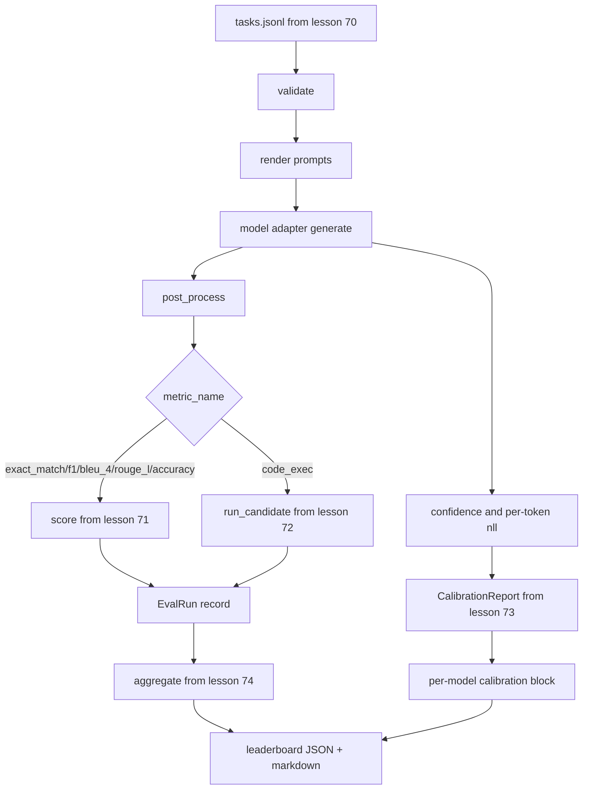

# End-to-End Eval Runner

> Năm bài học về hệ thống đường ống, một bài học để kết nối chúng lại với nhau. Runner đọc đặc tả tác vụ từ bài học 70, gọi model thông qua một adapter, chấm điểm bằng các bài học 71 và 72, đính kèm báo cáo hiệu chuẩn từ bài học 73 và xuất ra bảng xếp hạng từ bài học 74. Bản demo sẽ tự kết thúc.

**Type:** Build
**Languages:** Python
**Prerequisites:** Phase 19 Track B foundations, lessons 70 through 74
**Time:** ~90 min

## Learning objectives

- Định nghĩa một giao diện `ModelAdapter` mà bất kỳ model nào (mock, local, API) cũng có thể đáp ứng với một bề mặt phương thức nhỏ gọn.
- Chạy eval trên tệp fixture JSONL với việc thực thi tác vụ song song thông qua một worker pool.
- Kết hợp lớp metric (exact_match, F1, BLEU-4, ROUGE-L, code_exec) với lớp hiệu chuẩn trong một lần chạy duy nhất.
- Xuất các bản ghi `EvalRun` cho mỗi model và đưa chúng trực tiếp vào bộ tổng hợp bảng xếp hạng.
- Xuất cả báo cáo JSON và bảng markdown; tự kết thúc với exit zero khi chạy thành công, hoặc khác zero khi có lỗi xác thực hoặc lỗi runtime.

```figure
eval-grid
```

## The pipeline



Runner là điểm tích hợp. Mỗi bài học từ 70 đến 74 sở hữu một module mà runner sẽ kết hợp. Runner không sao chép bất kỳ logic nào từ các module đó: nó thực hiện import chúng.

## The adapter interface

Adapter là đường nối giữa runner và bất kỳ model nào. Giao diện này được thiết kế cố ý rất nhỏ gọn.

```python
class ModelAdapter:
    model_id: str

    def generate(self, prompt: str, task: TaskSpec) -> Generation: ...
```

`Generation` là một dataclass với:

- `text`: đầu ra tự do của model
- `confidence`: một số thực trong `[0, 1]` đại diện cho xác suất tự đánh giá của model cho câu trả lời
- `token_nll`: tổng tùy chọn của negative log-likelihoods trên các token được tạo
- `token_count`: số lượng token được tạo tùy chọn

Các mock adapter trong runner cung cấp ba loại: `RuleBasedAdapter` (xác định, gần như hoàn hảo), `NoisyAdapter` (quá tự tin, thường sai) và `BiasedAdapter` (giỏi ở một danh mục, tệ ở danh mục khác). Bản demo chạy cả ba trên fixture của bài học 70.

## Parallel execution

Runner sử dụng `concurrent.futures.ThreadPoolExecutor` để chạy các tác vụ song song cho mỗi model. Số lượng worker mặc định là giá trị nhỏ hơn giữa tám và số lượng tác vụ. Các thread là đủ vì nút thắt cổ chai cho các cuộc gọi model thực tế là network I/O. Đường dẫn code-exec tạo ra subprocess riêng bên trong tác vụ và executor chỉ lên lịch chờ đợi.

Đối với các bài kiểm tra xác định, runner cung cấp `run_eval(adapters, tasks, parallel=False)` để các bài kiểm tra có thể cố định thứ tự thực thi.

## The single-pass scoring loop

Đối với mỗi tác vụ:

1. Render prompt (tiền tố few-shot cộng với nội dung prompt).
2. Gọi adapter và đo thời gian gọi.
3. Xử lý hậu kỳ quá trình tạo theo quy tắc của tác vụ.
4. Chuyển đến lớp metric.
5. Xây dựng bản ghi `EvalRun` với điểm số và metadata của metric.
6. Thêm cặp `(confidence, correct)` vào bộ đệm hiệu chuẩn.

Tín hiệu `correct` là `score >= 1.0` cho các metric kiểu exact_match (`exact_match`, `accuracy`, `code_exec`) và `score >= 0.5` cho các metric có phân loại. Ngưỡng nằm trong `_correct_from_score` và runner không cung cấp ghi đè công khai.

## Aggregation

Sau khi mỗi tác vụ có kết quả, runner gọi `aggregate` và `pairwise_diffs` từ bài học 74 và `CalibrationReport.from_predictions` từ bài học 73. Đầu ra là một phong bì JSON duy nhất:

```json
{
  "leaderboard": [...],
  "pairwise": [...],
  "calibration": {
    "model_id_a": {"ece": 0.04, "brier": 0.10, "populated_bins": 8, ...},
    ...
  },
  "summary": {
    "tasks": 10,
    "models": 3,
    "wall_seconds": 1.2
  }
}
```

Runner cũng ghi một bảng markdown ra stdout để người dùng có thể dán kết quả vào phần review PR.

## Self-terminating demo

Bản demo chạy ba mock adapter trên mười tác vụ fixture từ bài học 70. Thời gian thực tế (wall time) sẽ dưới mười giây. Mã thoát là zero khi chạy thành công.

Các tiêu chí chạy thành công là:

- Mọi tác vụ được xác thực theo bài học 70.
- Mọi tác vụ được chấm điểm theo bài học 71 và 72.
- Báo cáo hiệu chuẩn được tổng hợp theo bài học 73 mà không có lỗi.
- Bảng xếp hạng xếp hạng adapter dựa trên quy tắc cao hơn hẳn so với adapter ngẫu nhiên.

Nếu bất kỳ điều nào trong số đó bị phá vỡ, runner sẽ thoát với mã khác zero cùng một lỗi có cấu trúc trong phong bì JSON.

## What this lesson does not do

Nó không gọi một model thực tế. Nó không triển khai luồng API key hoặc xử lý giới hạn tốc độ (rate-limit). Nó không triển khai streaming hoặc tạo một phần; adapter trả về một lần tạo cho mỗi cuộc gọi. Nó không thực hiện thử lại (retry) hoặc lưu bộ nhớ đệm (caching). Những mối quan tâm đó nằm ở lớp adapter; runner không phụ thuộc vào metric và nhà cung cấp.

## How to read the code

`main.py` là phần tích hợp. Nó import từ năm module bài học khác thông qua một helper `_load_sibling` nhỏ giúp giải quyết chúng theo đường dẫn tương đối. Các dataclass `Generation`, `EvalReport` và `ModelAdapter` được định nghĩa cục bộ. Các mock adapter nằm ở cuối tệp.

Đọc `main.py` từ trên xuống dưới. Lướt qua các phần import, sau đó xem `run_eval`, tiếp theo là `_score_one`, và cuối cùng là các adapter. Bản demo ở cuối là điểm bắt đầu.

Các bài kiểm tra trong `code/tests/test_runner.py` cố định giao diện adapter, vòng lặp đơn, sự tương đương giữa song song và tuần tự, bộ đệm hiệu chuẩn và hình dạng phong bì JSON.

## Going further

Runner này là nền tảng cơ bản. Một hệ thống eval sản xuất sẽ thêm: bộ nhớ đệm kết quả được khóa bởi `(task_id, model_id, model_version)`, sổ cái chi phí theo dõi đô la và token cho mỗi lần chạy, lớp thử lại (retry) lùi lại khi gặp giới hạn tốc độ, chính sách lấy mẫu cho các tác vụ pass-at-k và định dạng đầu ra streaming cho các bộ suite dài. Mỗi thứ đó là một mối quan tâm đơn lẻ bao bọc runner mà không làm thay đổi các lớp metric hoặc tổng hợp. Sự tách biệt đó chính là mục đích của hợp đồng này.

Hãy thêm một adapter cho nhà cung cấp thực tế sau khi bạn đã làm cho các mock hoạt động. Chọn một nhà cung cấp có gói miễn phí, viết ba mươi dòng mã kết nối, và xem bảng xếp hạng hoạt động. Sau đó, thêm nhà cung cấp thứ hai và để hệ thống thực hiện công việc của nó.