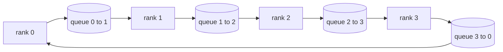

# Collective Ops From Scratch

> Bốn thao tác collective tạo nên nền tảng của huấn luyện phân tán là allreduce, broadcast, allgather và reduce_scatter. Mọi primitive khác mà một framework huấn luyện cung cấp đều là các wrapper bao quanh những thao tác này. Hãy xây dựng chúng một lần trên một `multiprocessing.Queue` mesh, xác thực chúng dựa trên một implementation tham chiếu, và phần còn lại của lộ trình này sẽ chỉ là công việc lắp đặt hệ thống.

**Type:** Build
**Languages:** Python
**Prerequisites:** Phase 19 Track C lessons 42-49
**Time:** ~90 min

## Mục tiêu học tập

- Triển khai ring allreduce theo hai lượt (reduce-scatter sau đó là allgather) và chứng minh khối lượng truyền tin trên mỗi rank là 2(N-1)/N byte trên mỗi phần tử.
- Xây dựng broadcast, allgather và reduce_scatter dựa trên các lệnh gửi point-to-point qua `multiprocessing.Queue`.
- Xác thực mọi primitive dựa trên một tham chiếu gloo `torch.distributed` cho cùng một đầu vào.
- Biện luận cho việc lựa chọn giữa ring và tree dựa trên hình thái cụm (cluster shape), ngưỡng độ trễ (latency floor) và giới hạn băng thông (bandwidth ceiling).

## Vấn đề

Một allreduce ngây thơ trên N rank sẽ gửi tensor N lần tới root và broadcast N lần ngược lại. Băng thông mở rộng theo O(N) trên mỗi rank, root trở thành nút thắt cổ chai, và thời gian thực tế (wall-clock floor) bị giới hạn bởi liên kết chậm nhất nhân với N. Ring allreduce làm phẳng điều đó thành 2(N-1) khối có kích thước T/N, vì vậy số byte trên mỗi rank giảm xuống còn 2T(N-1)/N, độc lập với kích thước cụm. Tree allreduce chiếm ưu thế khi N nhỏ và các liên kết có độ trễ cao vì độ sâu là log2(N) bước nhảy thay vì 2(N-1). Chọn sai cấu trúc liên kết cho hình thái cụm sẽ khiến GPU chậm nhất quyết định thời gian của mỗi bước.

Mọi framework huấn luyện phân tán mà bạn sẽ đọc trong lộ trình này đều phụ thuộc vào bốn primitive này. PyTorch DDP đồng bộ hóa gradient với một allreduce cho mỗi bucket tham số. ZeRO phân mảnh trạng thái bộ tối ưu hóa (optimizer state) bằng reduce_scatter và broadcast các tham số đã cập nhật bằng allgather. FSDP biến toàn bộ quá trình forward thành allgather cộng với reduce_scatter. Pipeline parallel cần broadcast cho các activation giữa các nhóm stage. Nếu bạn không thể triển khai bốn collective này, bạn không thể suy luận tại sao quá trình huấn luyện bị đình trệ, tại sao sự không khớp gradient xuất hiện ở rank 3, hoặc tại sao pipeline bubble tăng gấp đôi khi bạn thay đổi cấu trúc liên kết.

## Khái niệm



### Ring allreduce trong hai lượt

Chia tensor thành N khối bằng nhau được đánh chỉ số 0..N-1. Mỗi rank sở hữu chỉ số khối bằng với rank của nó. Lượt 1, reduce-scatter, chạy N-1 bước. Tại bước s, rank r gửi khối (r - s) mod N tới rank (r + 1) mod N và nhận khối (r - s - 1) mod N từ rank (r - 1) mod N, tích lũy khối nhận được vào bản sao cục bộ của nó. Sau N-1 bước, rank r sở hữu tổng đầy đủ cho khối r. Lượt 2, allgather, chạy thêm N-1 bước nữa và xoay các khối đã hoàn thành quanh vòng ring cho đến khi mọi rank giữ tổng đầy đủ cho mọi khối.

| Primitive | Byte trên mỗi rank | Các bước | Khi nào nên dùng |
|-----------|---------------|-------|-------------|
| Ring allreduce | 2T(N-1)/N | 2(N-1) | T lớn, cụm đồng nhất băng thông cao |
| Tree allreduce | T log2(N) | 2 log2(N) | T nhỏ hoặc liên kết độ trễ cao |
| Broadcast | T | log2(N) tree | Khởi tạo tham số, cấu hình scalar |
| Allgather | T(N-1)/N | N-1 | Sharded forward, ZeRO unshard |
| Reduce_scatter | T(N-1)/N | N-1 | ZeRO gradient sharding |

### Queue mesh thay thế cho NCCL

NCCL chạy trên PCIe và NVLink với các phép giảm (reduction) được tăng tốc phần cứng. Trên CPU, bạn không có điều đó. Một `multiprocessing.Queue` cho mỗi cạnh ring cung cấp cho bạn khả năng truyền point-to-point có thứ tự với một producer và một consumer duy nhất. Phép giảm xảy ra trong user space, vì vậy bạn phải trả chi phí overhead của Python, nhưng mô hình truyền tin giống hệt với NCCL ring allreduce. Hãy suy luận về tính đúng đắn trên phiên bản queue và hành vi của cụm sẽ tuân theo đó.

### Xác thực với gloo

Mọi primitive đều đi kèm với một unit test so sánh đầu ra của nó với `torch.distributed` được khởi tạo với backend gloo trên cùng một tensor qua cùng một world size. Nếu ring allreduce của bạn sai lệch so với gloo quá epsilon của float32, bài kiểm tra sẽ thất bại. Việc xác thực dựa trên một implementation tham chiếu là không thể thương lượng; nếu không có nó, primitive trông có vẻ đúng cho đến bước 10000 của một lần huấn luyện thực tế.

```figure
ci-ring-allreduce
```

## Xây dựng

`code/main.py` triển khai:

- Lớp `Mesh` kết nối N instance `multiprocessing.Queue` thành một vòng ring và cung cấp `send(dst, tensor)` và `recv(src)` cho mỗi rank.
- `ring_allreduce(mesh, rank, world_size, tensor)` chạy thuật toán hai lượt.
- `broadcast(mesh, rank, world_size, tensor, src)` trên một cây logarit.
- `allgather(mesh, rank, world_size, tensor)` sử dụng N-1 phép xoay.
- `reduce_scatter(mesh, rank, world_size, tensor)` như nửa đầu của allreduce.
- `_gloo_reference(op, world_size, tensor)` chạy cùng đầu vào qua `torch.distributed` với gloo để so sánh byte-equal.

Chạy nó:

```bash
python3 code/main.py
```

Đầu ra: bảng xác thực cho mỗi primitive so sánh đầu ra của queue-mesh và gloo, theo sau là bộ đếm byte trên mỗi rank chứng minh sự mở rộng 2T(N-1)/N.

## Các mô hình sản xuất thực tế

Ba mô hình giúp củng cố các primitive đủ để đưa vào sản xuất.

**Bucket gradient trước khi allreduce.** Một mô hình 1 tỷ tham số có hàng chục nghìn tensor gradient. Một allreduce cho mỗi tensor sẽ phải trả giá cho ngưỡng độ trễ N lần. DDP gom các gradient vào các bucket khoảng 25 MB và thực hiện một allreduce cho mỗi bucket; các tensor nhỏ sẽ đi kèm với các tensor lớn. Nếu không có bucketing, overhead độ trễ sẽ chiếm ưu thế trong mỗi bước.

**Chồng lấp truyền tin với tính toán.** Quá trình backward tính toán gradient từng lớp theo thứ tự ngược lại. Ngay khi gradient của lớp cuối cùng sẵn sàng, hãy bắt đầu allreduce của nó trong khi lớp tiếp theo vẫn đang tính toán. PyTorch DDP thực hiện điều này với các bucket-ready hook. Sự chồng lấp này giảm một nửa thời gian truyền tin hiển thị khi mạng có dư thừa băng thông.

**Chọn ring hoặc tree theo kích thước thông điệp, không phải theo lý thuyết.** NCCL cung cấp một bộ phát hiện cấu trúc liên kết chọn ring cho các thông điệp trên ~1 MB và tree cho các thông điệp dưới mức đó. Điểm giao thoa là sự đánh đổi giữa băng thông và độ trễ: trên 1 MB, thuật ngữ băng thông 2T(N-1)/N chiếm ưu thế và ring thắng; dưới 1 MB, số bước nhảy log2(N) thắng. Việc cố định một cấu trúc liên kết sẽ làm giảm thông lượng ở kích thước thông điệp không phù hợp.

## Sử dụng

Các mô hình sản xuất:

- **PyTorch DDP.** Gọi `dist.all_reduce` trên các gradient đã được bucket sau quá trình backward. Kích thước bucket có thể điều chỉnh; mặc định 25 MB là hợp lý cho 100Gbit Ethernet.
- **DeepSpeed ZeRO.** Thực hiện reduce_scatter để phân mảnh gradient và allgather để tái tạo đầy đủ tham số trước khi forward. Các primitive trong bài học này chính là các lệnh gọi mà ZeRO thực hiện.
- **FSDP.** Quá trình forward bắt đầu với allgather để unshard lớp, tính toán, sau đó giảm với reduce_scatter và loại bỏ phần unshard. Các primitive giống nhau, lịch trình khác nhau.

## Triển khai

Sử dụng các primitive queue-mesh trong các bài học 77-81. Bài học 77 kết nối allreduce vào DDP. Bài học 78 kết nối reduce_scatter vào ZeRO. Bài học 79 kết nối broadcast vào các activation của pipeline. Bài học 81 kết hợp cả bốn vào bản demo end-to-end.

## Bài tập

1. Thêm một biến thể tree allreduce và chuyển đổi giữa ring và tree theo kích thước thông điệp. Đo lường điểm giao thoa.
2. Thêm một `recv_timeout_ms` để một rank bị đình trệ sẽ báo lỗi deadline thay vì treo vĩnh viễn.
3. Thay thế `multiprocessing.Queue` bằng các socket TCP cho bốn primitive. Các bài kiểm tra tương tự, trên đường truyền thực tế.
4. Thêm một hook đo lường băng thông để bộ đếm byte trên mỗi rank ghi vào JSONL.
5. So sánh thời gian thực tế của ring và tree trên 4 rank cho các tensor kích thước 1KB, 1MB, 16MB. Biện luận cho điểm giao thoa bằng thực nghiệm.

## Thuật ngữ chính

| Thuật ngữ | Cách gọi thông thường | Ý nghĩa thực tế |
|------|----------------|------------------------|
| Allreduce | "Tổng trên các rank" | Sau lệnh gọi, mọi rank đều giữ cùng một tensor đã giảm |
| Ring | "Cấu trúc nhanh" | N-1 khối kích thước T/N luân chuyển quanh vòng tròn hai lần |
| Tree | "Cấu trúc log" | Phép giảm theo cây nhị phân; độ sâu là log2(N) bước nhảy |
| Allgather | "Nối các mảnh" | Mọi rank kết thúc với mảnh của tất cả các rank khác |
| Reduce_scatter | "Chia nhỏ tổng" | Mỗi rank kết thúc với tổng của chỉ một khối |
| Bucket | "Gộp các tensor nhỏ" | Kết hợp N allreduce nhỏ thành một cái lớn |

## Đọc thêm

- [PyTorch Distributed: NCCL collectives](https://pytorch.org/docs/stable/distributed.html#collective-functions)
- [Horovod ring allreduce paper](https://arxiv.org/abs/1802.05799)
- [NCCL topology and algorithm selection](https://docs.nvidia.com/deeplearning/nccl/user-guide/docs/index.html)
- [Patarasuk and Yuan, Bandwidth optimal allreduce algorithms](https://www.cs.fsu.edu/~xyuan/paper/09jpdc.pdf)
- Phase 10 Lesson 05 - tổng quan về huấn luyện phân tán
- Phase 19 Lesson 77 - DDP được kết nối trên các primitive này