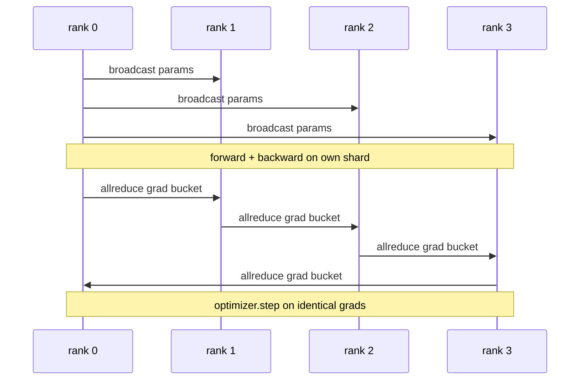

# Data Parallel DDP From Scratch

> DistributedDataParallel là một hook nằm trên tất cả các thao tác allreduce. Nó bao bọc (wrap) một mô hình, broadcast các tham số ban đầu từ rank 0 để mọi rank bắt đầu giống hệt nhau, cài đặt một backward hook trên mỗi tham số để thực hiện allreduce cho gradient, và phần còn lại chính là gradient descent. Toàn bộ mô hình này chỉ gói gọn trong 200 dòng code.

**Type:** Build
**Languages:** Python
**Prerequisites:** Phase 19 Track C lessons 42-49
**Time:** ~90 min

## Learning Objectives

- Xây dựng một wrapper có dạng `DistributedDataParallel` giúp broadcast các tham số ban đầu và thực hiện allreduce cho gradient sau bước backward.
- Khởi tạo N CPU ranks với `torch.multiprocessing.spawn` thông qua backend gloo với cơ chế file-based rendezvous.
- Chứng minh tính đúng đắn của việc đồng bộ gradient bằng cách huấn luyện cùng một mô hình trên cùng một dữ liệu theo trình tự và cho thấy sự tương đương của tham số sau mỗi bước.
- Bảo vệ việc sử dụng buckets (gradient fusion) và overlap (giao tiếp trong khi backward) như hai thay đổi biến một DDP hoạt động bình thường thành một DDP chuẩn production.

## The Problem

Một mô hình 1 tỷ tham số với 12 GB activations không thể nằm vừa trên một GPU tiêu dùng. Ngay cả khi nó vừa, việc huấn luyện cũng mất hàng tuần. Data parallel chia batch ra trên N ranks, mỗi rank tính toán forward và backward trên shard của nó, và tại mỗi bước, gradient của mọi rank được cộng dồn để N bản sao luôn giống hệt nhau. Gradient đã cộng dồn chính là thứ mà optimizer sử dụng để cập nhật.

Nếu không có đồng bộ gradient, N bản sao sẽ lệch nhau ngay từ bước 2. Mô hình không còn là "một mô hình được huấn luyện trên nhiều dữ liệu" nữa, mà là N mô hình riêng biệt tình cờ chia sẻ trọng số ban đầu. Nếu đồng bộ gradient thực hiện kém (một allreduce cho mỗi tham số, không có overlap, không có bucketing), mạng sẽ trở thành nút thắt cổ chai và các GPU sẽ nhàn rỗi chờ đợi dữ liệu trên đường truyền. Nghệ thuật của DDP là làm cho việc đồng bộ gradient gần như không tốn chi phí so với tính toán. PyTorch DDP chuẩn đạt được điều đó bằng cách gom gradient vào các bucket, chồng lấp (overlap) allreduce với bước backward của layer tiếp theo, và sử dụng NCCL trên NVLink. Chúng ta có thể thực hiện cả ba điều này trên CPU với gloo và rút ra những bài học tương tự.

## The Concept



### Ba thao tác mà DDP cần

| Giai đoạn | Collective | Lý do |
|-------|-----------|-----|
| Init | broadcast từ rank 0 | Mỗi rank bắt đầu với cùng tham số |
| Sau backward | allreduce của mỗi grad | Gradient trung bình là thứ optimizer dùng để cập nhật |
| Đôi khi | broadcast các buffers | Batchnorm running stats cần được đồng bộ |

### Tại sao là trung bình (mean) mà không phải tổng (sum)

Allreduce-SUM chia cho world_size sẽ cho ra gradient trung bình. Giá trị trung bình này bất biến với world_size: một learning rate được tinh chỉnh ở một rank sẽ hoạt động tốt ở bốn rank vì độ lớn gradient mỗi bước không thay đổi. Allreduce-SUM mà không chia sẽ buộc bạn phải tinh chỉnh lại learning rate mỗi khi thay đổi kích thước cụm. DDP bao bọc thao tác SUM và thực hiện chia; hãy làm tương tự trong bài học này.

### Tại sao cần bucket gradients

Một Transformer có hàng ngàn tensor tham số. Một allreduce cho mỗi tensor sẽ phải chịu độ trễ (latency) của gloo hàng ngàn lần. DDP nhóm các gradient vào các bucket khoảng ~25 MB và thực hiện một allreduce cho mỗi bucket. Tổng số byte di chuyển trên đường truyền là như nhau nhưng độ trễ được phân bổ đều cho cả bucket. Đối với mô hình nhỏ trong bài học, chúng ta nhóm mọi thứ vào một bucket; cấu trúc này là thứ có thể áp dụng cho các mô hình lớn hơn.

### Tại sao cần cố định seed

Mỗi rank phải gọi `torch.manual_seed(seed + rank)` để xáo trộn dữ liệu nhưng `torch.manual_seed(seed)` để khởi tạo tham số. Một seed chung duy nhất có nghĩa là mọi rank đều thấy cùng một thứ tự batch (phá vỡ tính chất data parallel); một seed riêng cho từng rank đối với tham số có nghĩa là các tham số ban đầu sẽ khác nhau ở mức float epsilon và việc đồng bộ gradient sẽ không còn làm các bản sao giống hệt nhau được nữa. Hãy thực hiện đúng mô hình seed nếu không bài kiểm tra sự tương đương tham số sẽ thất bại ngay từ bước 1.

```figure
ci-ddp-grad-sync
```

## Build It

`code/main.py` triển khai:

- `MiniMLP`: một MLP 3 lớp đủ nhỏ để hội tụ trong vài giây, đủ lớn để lộ ra cách kết nối.
- `DistributedDataParallel(model, world_size)`: broadcast các tham số tại thời điểm khởi tạo, trả về một wrapper có `sync_grads` thực hiện chia các gradient đã allreduce-sum cho world_size.
- `worker(rank, world_size, ...)`: vòng lặp huấn luyện đầy đủ với `torch.distributed` khởi tạo qua gloo, forward, backward, sync, step.
- `_reference_single_process_loop(...)`: huấn luyện cùng một mô hình trên cùng một dữ liệu theo trình tự trên một rank, được sử dụng bởi bài kiểm tra để so sánh sự tương đương byte của tham số sau mỗi bước.

Chạy nó:

```bash
python3 code/main.py
```

Đầu ra: một bảng huấn luyện theo từng bước so sánh loss của tiến trình đơn lẻ và checksum tham số với quá trình DDP chạy trên 4 ranks. Hai đường chạy tạo ra các đường cong loss giống hệt nhau đến mức float epsilon, chứng minh rằng việc đồng bộ gradient là chính xác.

## Production patterns in the wild

Ba mô hình giúp DDP đủ cứng cáp để đưa vào môi trường thực tế.

**Find unused parameters.** Một số đường dẫn forward bỏ qua các tham số một cách có điều kiện (early exit, mixture-of-experts router). Các tham số bị bỏ qua không có gradient, nhưng hook chờ bucket của DDP vẫn đợi chúng và gây ra deadlock. `find_unused_parameters=True` yêu cầu DDP kiểm tra xem tham số nào có gradient trước khi thực hiện reduce. Chi phí là một lần duyệt đồ thị mỗi bước, vì vậy hãy tắt nó nếu forward của bạn không có nhánh.

**Static graph optimisation.** Khi forward ổn định qua các bước, `static_graph=True` cho phép DDP tính toán trước lịch trình bucket. Tối ưu hóa này quan trọng ở quy mô lớn: tính toán trước giúp tiết kiệm vài ms mỗi bước, con số này sẽ tích lũy qua 10.000 bước.

**Gradient accumulation needs care.** Tích lũy gradient qua K microbatches mà không đồng bộ mỗi microbatch giúp tăng thông lượng lên 10 lần. DDP cung cấp `no_sync()` như một context manager để tạm dừng allreduce sau bước backward. Nếu quên manager này, bạn sẽ allreduce K lần một cách vô ích; thông lượng sẽ giảm xuống mức thấp nhất.

## Use It

Các mô hình production:

- **PyTorch DDP.** Triển khai chuẩn. `torch.nn.parallel.DistributedDataParallel(model)` kết nối việc bucketing, overlap, và context no_sync.
- **HuggingFace Accelerate.** Thêm một trình khởi chạy xử lý các biến môi trường `torchrun` và việc bao bọc mô hình. Vẫn là DDP bên dưới.
- **Megatron-LM data parallel.** Kết hợp DDP với tensor parallel cho các mô hình lớn; phần data-parallel vẫn là mô hình allreduce-sau-backward tương tự.

## Ship It

Bài học 78 (ZeRO sharding) thay thế allreduce cho mỗi tham số bằng reduce_scatter để mỗi rank chỉ lưu trữ shard của trạng thái optimizer. Bài học 81 kết hợp DDP với ZeRO thành một bản demo end-to-end.

## Exercises

1. Thêm các gradient bucket với kích thước có thể cấu hình và đo lường tốc độ so với việc thực hiện một allreduce cho mỗi tham số trên một mô hình sâu hơn.
2. Triển khai `no_sync()` dưới dạng một context manager và xác minh rằng việc tích lũy gradient khớp với baseline đơn tiến trình qua K microbatches.
3. Thêm chế độ `find_unused_parameters` trong đó forward đôi khi bỏ qua một trong các lớp MLP; nếu không có cờ này, quá trình chạy sẽ bị deadlock.
4. Thay thế gloo bằng đồng bộ chỉ với `torch.distributed.barrier()` để cảm nhận sự khác biệt giữa đồng bộ dựa trên allreduce và dựa trên barrier.
5. Đo lường chi phí đồng bộ gradient dưới dạng một phần của thời gian bước cho các batch size 1, 16, 256 và giải thích khả năng mở rộng.

## Key Terms

| Thuật ngữ | Cách gọi thông thường | Ý nghĩa thực tế |
|------|----------------|------------------------|
| DDP | "Data parallel" | Wrapper broadcast tham số và allreduce grad mỗi bước |
| Bucket | "Fuse grads" | Nhóm N allreduce nhỏ thành một cái lớn |
| Overlap | "Hide comm" | Thực hiện allreduce trong khi các lớp sau vẫn đang tính backward |
| no_sync | "Accumulate" | Bỏ qua allreduce sau backward để tích lũy gradient |
| find_unused | "Branchy forward" | Phát hiện các tham số không có grad trước khi reduce |

## Further Reading

- [Tài liệu PyTorch DistributedDataParallel](https://pytorch.org/docs/stable/generated/torch.nn.parallel.DistributedDataParallel.html)
- [Hướng dẫn về nội bộ DDP của PyTorch](https://pytorch.org/tutorials/intermediate/ddp_tutorial.html)
- [Li et al, PyTorch Distributed: Experiences on Accelerating Data Parallel Training](https://arxiv.org/abs/2006.15704)
- Phase 19 Lesson 76 - các collective mà DDP được xây dựng trên đó
- Phase 19 Lesson 78 - ZeRO sharding thay thế allreduce cho mỗi tham số bằng reduce_scatter