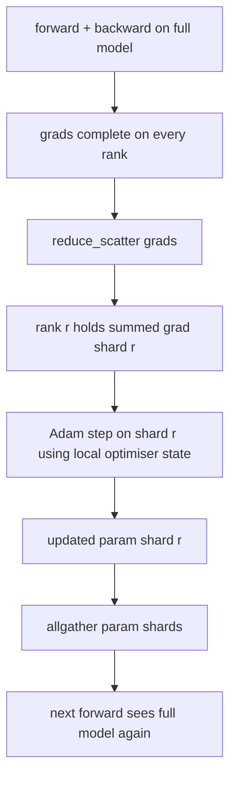

# ZeRO Optimizer State Sharding

> Adam lưu trữ hai ước tính moment cho mỗi tham số, cả hai đều ở định dạng float32. Một mô hình 7B tham số mang theo 56 GB trạng thái bộ tối ưu hóa (optimizer state). ZeRO stage 1 phân mảnh (shard) lượng dữ liệu đó trên N rank; mỗi rank sở hữu 1/N của bộ tối ưu hóa. Sau bước local step, các phân mảnh tham số đã cập nhật được broadcast trở lại, mỗi rank tái tạo lại toàn bộ mô hình và bước tiếp theo bắt đầu. Lợi ích đạt được là sự sụt giảm bộ nhớ tuyến tính trên phân bổ đơn lẻ lớn nhất trong stack huấn luyện.

**Type:** Build
**Languages:** Python
**Prerequisites:** Phase 19 Track C lessons 42-49
**Time:** ~90 min

## Mục tiêu học tập

- Phân mảnh trạng thái bộ tối ưu hóa (moment bậc nhất, moment bậc hai, bản sao master fp32) trên N rank sao cho mỗi rank sở hữu 1/N.
- Sử dụng reduce_scatter để chỉ gửi tổng gradient của phân mảnh đó đến từng rank, sau đó dùng allgather để broadcast các phân mảnh tham số đã cập nhật trở lại.
- Tính toán bảng tiết kiệm bộ nhớ cho stage 1, stage 2, stage 3 so với DDP thông thường.
- Bảo vệ lựa chọn giữa stage 1, stage 2 và stage 3 dựa trên kích thước mô hình và ngân sách băng thông.

## Vấn đề

DDP thông thường sao chép mọi thứ: tham số, gradient và trạng thái bộ tối ưu hóa đều hiện diện đầy đủ trên mỗi rank. Đối với mô hình 7B tham số ở định dạng fp16, điều đó có nghĩa là 14 GB tham số, 14 GB gradient và 28 GB trạng thái bộ tối ưu hóa trên mỗi rank. Trạng thái bộ tối ưu hóa là thành phần lớn nhất và dễ phân mảnh nhất vì nó chỉ được truy cập trong quá trình thực hiện bước cập nhật (step), không phải trong quá trình forward hay backward.

ZeRO stage 1 phân mảnh trạng thái bộ tối ưu hóa. Mỗi rank giữ 1/N các moment của Adam. Sau backward, thay vì allreduce toàn bộ gradient và thực hiện bước cập nhật cục bộ, ZeRO thực hiện reduce_scatter để mỗi rank chỉ nhận được tổng gradient của phân mảnh mà nó sở hữu. Rank đó áp dụng bước tối ưu hóa lên phân mảnh tham số master của mình. Các phân mảnh tham số đã cập nhật sau đó được allgather trở lại để mọi rank có mô hình đầy đủ cho bước forward tiếp theo. Bộ nhớ bộ tối ưu hóa giảm đi N lần. Lưu lượng truyền tải trên dây mỗi bước vẫn giống như DDP: một lệnh reduce_scatter cộng một lệnh allgather bằng một lệnh allreduce về mặt băng thông. Bộ nhớ được tối ưu, throughput được duy trì.

## Khái niệm



### Các giai đoạn của ZeRO

| Stage | Thành phần được phân mảnh | Bộ nhớ mỗi rank | Giao tiếp mỗi bước |
|-------|----------------|------------------|---------------|
| DDP | không có | params + grads + optim | 1x allreduce |
| ZeRO-1 | trạng thái bộ tối ưu hóa | params + grads + optim/N | 1x reduce_scatter + 1x allgather |
| ZeRO-2 | optim + grads | params + grads/N + optim/N | 1x reduce_scatter + 1x allgather |
| ZeRO-3 | optim + grads + params | params/N + grads/N + optim/N | 1x allgather mỗi layer + 1x reduce_scatter mỗi layer |

Stage 1 là chiến thắng dễ dàng nhất vì trạng thái bộ tối ưu hóa chiếm ưu thế trong ngân sách bộ nhớ. Stage 2 cần logic tích lũy phân mảnh gradient nhưng băng thông vẫn như cũ. Stage 3 (FSDP) phải trả chi phí giao tiếp theo từng layer cho mỗi lần forward và backward, đổi lại là sự sụt giảm bộ nhớ của phân mảnh tham số. Bài học này triển khai đầy đủ stage 1.

### Toán học về bộ nhớ, con số thực tế

Đối với một mô hình có P tham số được huấn luyện với Adam trong mixed precision:

| Thành phần | Vanilla | ZeRO-1 | Tại sao |
|------|---------|--------|-----|
| fp16 params | 2P bytes | 2P bytes | cần cho forward |
| fp16 grads | 2P bytes | 2P bytes | cần cho backward |
| fp32 master copy | 4P bytes | 4P/N bytes | chỉ bộ tối ưu hóa dùng |
| fp32 first moment | 4P bytes | 4P/N bytes | chỉ bộ tối ưu hóa dùng |
| fp32 second moment | 4P bytes | 4P/N bytes | chỉ bộ tối ưu hóa dùng |
| Tổng | 16P bytes | 4P + 12P/N bytes |   |

Tại N=8: vanilla 16P, ZeRO-1 5.5P, giảm 65%. Tại N=64: vanilla 16P, ZeRO-1 4.19P, giảm 74%.

### Tại sao reduce_scatter tốt hơn allreduce-rồi-mới-phân-mảnh

Allreduce cung cấp cho mỗi rank toàn bộ gradient đã tổng hợp. Nếu bạn chỉ cần phân mảnh r, thì (N-1)/N lượng gradient đã được reduce sẽ bị lãng phí trên rank r. Reduce_scatter cung cấp chính xác phân mảnh mà mỗi rank sở hữu; số byte trên mỗi rank giống như allreduce (vì allreduce là reduce_scatter + allgather) nhưng nửa sau được thay thế bằng lệnh allgather phân mảnh tham số sau đó. Lưu lượng truyền tải trên dây giống hệt DDP, bộ nhớ được chia nhỏ.

```figure
cd-zero-shard
```

## Xây dựng

`code/main.py` triển khai:

- `flatten_params(module)` và `unflatten_into(module, flat)` giúp đóng gói các tham số của mô hình thành một tensor liên tục và giải nén ngược lại. Bố cục phẳng (flat layout) là thứ giúp việc phân mảnh theo rank trở thành một thao tác slice đơn giản.
- `ZeroOptimizer(model, world_size, rank, lr)` sở hữu phân mảnh của bản sao master và các moment Adam của rank đó.
- `step()` chạy reduce_scatter trên gradient phẳng, áp dụng Adam cho phân mảnh của rank, và allgather các tham số đã cập nhật trở lại.
- Một bản demo huấn luyện MLP 3 lớp trong 20 bước và in ra ngân sách bộ nhớ mỗi bước so với baseline DDP thông thường.

Chạy nó:

```bash
python3 code/main.py
```

Đầu ra: loss mỗi bước và bảng bộ nhớ cho thấy ZeRO-1 giữ 1/N trạng thái bộ tối ưu hóa trên mỗi rank so với bản sao đầy đủ của DDP.

## Các mô hình sản xuất thực tế

Ba mô hình giúp ZeRO đủ ổn định để đưa vào sản xuất.

**Sharded checkpointing là quan trọng.** Trạng thái bộ tối ưu hóa của ZeRO-1 bị chia nhỏ trên các rank; checkpoint phải ghi lại rank nào sở hữu cái gì. Bài học 80 xây dựng manifest checkpoint phân mảnh để tiếp tục chạy ZeRO trên cùng số lượng world size. Nếu không có nó, trạng thái đã lưu sẽ không thể đọc được khi khởi động lại.

**Mixed precision là trọng tâm.** ZeRO là một kỹ thuật mixed-precision; bản sao master fp32 là thứ được phân mảnh. Chạy ZeRO mà không có mixed precision sẽ phải trả thuế bộ nhớ trên bản master fp32 mà không đạt được lợi ích forward fp16 tương ứng. Các hệ thống sản xuất luôn kết hợp ZeRO với autocast hoặc trọng số bf16.

**Stage 1 là chiến thắng gần như miễn phí.** Giao tiếp giống hệt DDP về băng thông. Tiết kiệm bộ nhớ là tuyến tính theo N. Chi phí duy nhất là việc quản lý sổ sách cho phân mảnh bộ tối ưu hóa. Các stack sản xuất mặc định sử dụng stage 1 trừ khi bộ nhớ phân mảnh tham số cũng là một vấn đề; khi đó stage 2 hoặc 3 sẽ đánh đổi giao tiếp lấy bộ nhớ.

## Sử dụng

Các mô hình sản xuất:

- **DeepSpeed ZeRO.** Triển khai tham chiếu. `deepspeed_config.json` chọn stage 1/2/3 và kích thước phân vùng.
- **PyTorch FSDP.** Tương đương với PyTorch-native. `ShardingStrategy.SHARD_GRAD_OP` là ZeRO-2; `FULL_SHARD` là ZeRO-3.
- **HuggingFace Accelerate.** Bao bọc cả DeepSpeed và FSDP dưới một cấu hình thống nhất.

## Triển khai

Bài học 79 (pipeline parallel) là trục phân mảnh trực giao: thay vì phân mảnh trạng thái bộ tối ưu hóa trên cùng một mô hình, pipeline phân mảnh các lớp trên các rank. Bài học 81 kết hợp DDP + ZeRO trong bản demo end-to-end.

## Bài tập

1. Mở rộng sang ZeRO-2 bằng cách phân mảnh gradient: mỗi rank chỉ lưu gradient cho phân mảnh của nó, đạt được bằng cách zero-out phần không thuộc phân mảnh sau khi backward.
2. Thêm một trình đo lường bộ nhớ in ra mức sử dụng byte fp32 thực tế trên rank 0 so với dự đoán công thức.
3. Đo thời gian thực (wall-clock time) mỗi bước của DDP thông thường so với ZeRO-1 và phân tách thành forward, backward, giao tiếp.
4. Triển khai gradient clipping dưới ZeRO-1: chuẩn L2 phải được tính toán trên tất cả các phân mảnh thông qua allreduce của bình phương chuẩn cục bộ.
5. Triển khai một "ZeRO ngây thơ" với allreduce thay vì reduce_scatter, đo sự khác biệt về thời gian truyền tải. Bảo vệ lựa chọn reduce_scatter bằng các con số.

## Thuật ngữ chính

| Thuật ngữ | Cách gọi thông thường | Ý nghĩa thực tế |
|------|----------------|------------------------|
| ZeRO-1 | "Shard the optimiser" | Mỗi rank giữ 1/N của master fp32 + moment Adam |
| ZeRO-2 | "Shard grads too" | Mỗi rank cũng loại bỏ các gradient không thuộc phân mảnh sau reduce_scatter |
| ZeRO-3 | "Shard params" | Mỗi rank giữ 1/N của tham số fp16; allgather mỗi layer trong forward |
| Master copy | "fp32 weights" | Bản sao tham số độ chính xác cao mà bộ tối ưu hóa cập nhật |
| Reduce_scatter | "Split the sum" | Gửi đến mỗi rank chỉ tổng gradient của phân mảnh đó |

## Đọc thêm

- [Rajbhandari et al, ZeRO: Memory Optimizations Toward Training Trillion Parameter Models](https://arxiv.org/abs/1910.02054)
- [Tài liệu DeepSpeed ZeRO](https://www.deepspeed.ai/tutorials/zero/)
- [Tài liệu PyTorch FSDP](https://pytorch.org/docs/stable/fsdp.html)
- Phase 19 Bài học 76 - reduce_scatter và allgather mà bài học này dựa trên
- Phase 19 Bài học 80 - sharded checkpointing mà trạng thái ZeRO phải sử dụng