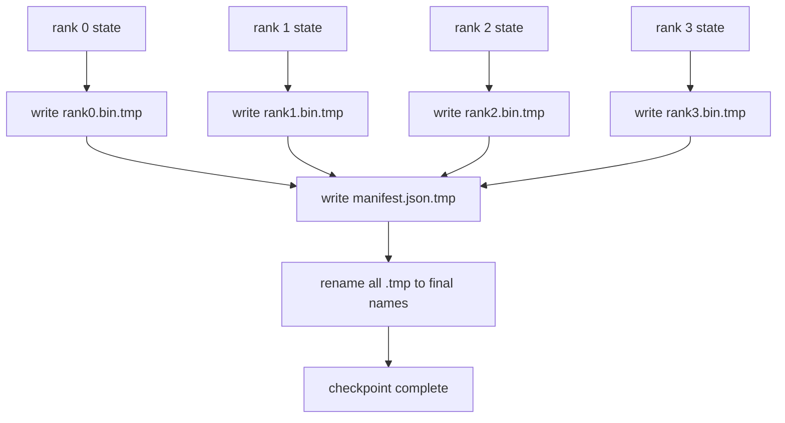

# Sharded Checkpoint và Atomic Resume

> Một job huấn luyện mô hình 70B-parameter bị tạm dừng do lỗi node mỗi vài giờ. Định dạng checkpoint quyết định việc bạn mất 30 phút hay 30 giờ. Sharded checkpoint ghi shard của mỗi rank song song và ghi lại quyền sở hữu trong một manifest. Khi resume, hệ thống tải shard của từng rank từ file riêng của nó, tái tạo trạng thái trên cùng world size, và optimiser tiếp tục như thể chưa có chuyện gì xảy ra. Atomic write ngăn chặn việc checkpoint bị hỏng do ghi dở dang làm ảnh hưởng đến lần resume tiếp theo.

**Type:** Build
**Languages:** Python
**Prerequisites:** Phase 19 Track C lessons 42-49
**Time:** ~90 min

## Mục tiêu học tập

- Lưu checkpoint đa rank dưới dạng file shard cho mỗi rank kèm theo một manifest ghi lại rank nào sở hữu shard nào.
- Sử dụng mô hình atomic write (ghi vào đường dẫn tạm rồi đổi tên) để đảm bảo việc crash giữa chừng không bao giờ tạo ra một checkpoint bị lỗi.
- Resume từ manifest, xác minh trạng thái bằng byte cho cả tham số fp16 và trạng thái ZeRO optimiser trên mọi rank.
- Bảo vệ manifest schema trước ba chế độ lỗi: thay đổi world-size, sai lệch số lượng shard, và ghi dở dang (partial write).

## Vấn đề

Checkpoint thông thường đọc tất cả tham số và trạng thái optimiser vào rank 0, gom lại (gather) và ghi thành một file duy nhất. Với mô hình 70B, đó là 1.1 TB dữ liệu đi qua cổng mạng của một rank. Việc ghi này chặn mọi rank khác vì chúng phải chờ đợi quá trình gather. Băng thông IO lúc này là băng thông mạng của một GPU đơn lẻ, chứ không phải tổng băng thông. Trên một cluster thực tế, bước gather-rồi-ghi có thể mất nhiều thời gian hơn cả giờ huấn luyện trước đó, nghĩa là job không thể hoàn thành nổi một checkpoint mỗi ngày.

Sharded checkpoint thay đổi mô hình này: mỗi rank tự ghi shard của nó vào file riêng song song. Manifest ghi lại rank nào sở hữu shard nào để khi resume có thể đặt từng shard về đúng vị trí. Tổng băng thông ghi tỉ lệ thuận với cluster. Một checkpoint 1 TB mất 4 giờ qua một rank nay chỉ mất 4 phút qua 64 rank. Thêm vào đó, manifest cung cấp một hợp đồng cho các lần resume không tương thích: thay đổi world-size có thể phát hiện được, ghi dở dang có thể phát hiện được, và quá trình tải có thể báo lỗi thay vì âm thầm sử dụng dữ liệu cũ.

## Khái niệm



### Manifest schema

```json
{
  "world_size": 4,
  "step": 1234,
  "wall_clock_seconds": 4521,
  "shards": [
    {"rank": 0, "path": "rank0.bin", "sha256": "...", "param_shard_offset": 0, "param_shard_numel": 65536},
    {"rank": 1, "path": "rank1.bin", "sha256": "...", "param_shard_offset": 65536, "param_shard_numel": 65536}
  ],
  "schema_version": 1
}
```

Ba trường đóng vai trò quan trọng. `world_size` khiến việc resume trên một world size khác sẽ báo lỗi thay vì âm thầm gây hỏng dữ liệu. `sha256` cho mỗi shard giúp phát hiện các file bị ghi dở dang hoặc bị hỏng. `param_shard_offset` và `param_shard_numel` cho mỗi shard cho phép trình tải tái tạo tensor tham số phẳng tại đúng vị trí.

### Atomic write

Mô hình tiêu chuẩn: ghi mọi shard vào `<name>.tmp`, ghi manifest vào `manifest.json.tmp`, fsync từng cái, sau đó đổi tên (rename). POSIX rename trong cùng một filesystem là atomic; hoặc file mới hiện diện đầy đủ, hoặc file cũ vẫn còn đó. Một vụ crash trước khi đổi tên cuối cùng sẽ để lại checkpoint trước đó là checkpoint đang hoạt động. Nếu không có atomic write, một vụ crash có thể để lại một shard bị ghi dở dang cùng với một manifest hiện hữu trỏ tới nó, và quá trình tải sẽ làm hỏng trạng thái optimiser khi resume.

### Ba chế độ lỗi mà schema phải bảo vệ

| Lỗi | Triệu chứng | Cách bảo vệ |
|---------|---------|---------|
| Thay đổi world-size | resume trên N=8 với manifest từ N=4 | world_size không khớp trong manifest, báo lỗi |
| Sai lệch số lượng shard | resume thấy ít file rank*.bin hơn số shard trong manifest | liệt kê các shard, xác minh mọi shard đều tồn tại |
| Ghi dở dang (Partial write) | file shard bị cắt cụt giữa chừng | xác minh sha256 khi tải |

Mỗi cách bảo vệ đều từ chối việc tải dữ liệu xấu ngay từ đầu; thay thế cho việc hỏng dữ liệu âm thầm mà 100 bước sau loss mới nhảy lên NaN.

### Tại sao dùng file cho mỗi rank thay vì một file lớn

Ghi đồng thời vào một file thông qua `O_APPEND` hoạt động trên POSIX cho các lần ghi căn chỉnh theo byte, nhưng trong thực tế, các offset trong một shard trải dài trên các vùng kích thước MB và việc khóa (locking) sẽ chiếm ưu thế. Các file cho mỗi rank không có sự tranh chấp và hưởng lợi từ việc striping khi filesystem bên dưới là filesystem song song (Lustre, GPFS). Các stack sản xuất (DeepSpeed, FSDP, NeMo) đều sử dụng file cho mỗi rank vì lý do đó.

```figure
ci-sharded-checkpoint
```

## Xây dựng

`code/main.py` triển khai:

- `ShardManifest` dataclass với schema ở trên cộng với `to_json`/`from_json`.
- `save_sharded(state_dict_per_rank, dir, step)` ghi trạng thái nhị phân của mỗi rank vào file riêng bằng mô hình atomic temp-then-rename, sau đó ghi manifest.
- `load_sharded(dir, expected_world_size)` đọc manifest, xác minh sha256 của từng shard, và trả về state dict cho mỗi rank.
- Một bài kiểm tra round-trip: xây dựng trạng thái cho mỗi rank, lưu, tải, và khẳng định dữ liệu bằng byte.

Chạy nó:

```bash
python3 code/main.py
```

Đầu ra: 4 file shard cộng với manifest được ghi, sau đó được tải lại với xác minh bằng byte.

## Các mô hình sản xuất thực tế

Ba mô hình giúp củng cố checkpoint đủ để đưa vào vận hành.

**Async write.** Các stack sản xuất thực hiện ghi checkpoint trên một luồng hoặc tiến trình riêng biệt để quá trình huấn luyện tiếp tục. Rào cản (barrier) nằm ở checkpoint tiếp theo: không bắt đầu lưu mới cho đến khi lần lưu trước hoàn tất. Cờ `async_io` của DeepSpeed thực hiện chính xác điều này. Bài học này giữ cho việc ghi là đồng bộ để các bước có thể quan sát được.

**Local fast disk first, then async upload.** Ghi vào NVMe cục bộ (nhanh) sau đó upload bất đồng bộ lên S3 hoặc GCS. Mô hình hai tầng này giữ cho checkpoint trong cluster nhanh để resume, đồng thời gửi một bản sao bền vững ra ngoài cluster để lưu trữ. Manifest mang đường dẫn cục bộ; một upload manifest mang đường dẫn từ xa.

**Rotation matters.** Các hệ thống sản xuất giữ K checkpoint gần nhất (thường là 3-5) và xoay vòng cái cũ nhất. Nếu không xoay vòng, đĩa sẽ đầy giữa chừng và checkpoint tiếp theo sẽ thất bại. Với xoay vòng, lần lưu tiếp theo sẽ xóa cái cũ nhất trước, giải phóng dung lượng.

## Sử dụng

Các mô hình sản xuất:

- **DeepSpeed checkpointing.** `deepspeed.save_checkpoint(tag=step)` ghi các file cho mỗi rank và một file `latest` trỏ đến tag đang hoạt động.
- **PyTorch FSDP checkpointing.** `torch.distributed.checkpoint` lưu trạng thái sharded với một `Planner` quyết định bố cục cho mỗi rank.
- **NeMo.** Bao bọc DeepSpeed và FSDP với một API `save_to_checkpoint` đồng nhất bổ sung metadata.

## Triển khai

Bài học 81 lưu một sharded checkpoint của quá trình chạy DDP+ZeRO end-to-end và tải lại nó trên cùng world size để chứng minh hợp đồng resume vẫn giữ nguyên.

## Bài tập

1. Thêm async write: bắt đầu việc lưu trong một luồng và để quá trình huấn luyện tiếp tục. Chặn lần lưu tiếp theo cho đến khi lần trước hoàn tất.
2. Thêm một `last_5_steps` xoay vòng: giữ 5 checkpoint gần nhất, xóa cái cũ nhất trước khi lưu cái mới.
3. Thêm đường dẫn xác minh nhanh chỉ bằng CRC cho việc tải lại trong vòng lặp (rotation chuyển một checkpoint thành checkpoint hoạt động mới mà không cần sha256 đầy đủ).
4. Thêm tải chéo world-size: cân bằng lại shard từ N=4 sang N=8 bằng cách đọc manifest, nối lại và chia shard lại.
5. Thêm upload lên một S3 giả (một thư mục thứ hai) và ghi upload manifest. Bảo vệ chính sách lưu trữ hai tầng.

## Thuật ngữ chính

| Thuật ngữ | Cách gọi thông thường | Ý nghĩa thực tế |
|------|----------------|------------------------|
| Sharded checkpoint | "Lưu theo rank" | Mỗi rank ghi file shard riêng của nó song song |
| Manifest | "Chỉ mục" | File JSON ghi lại đường dẫn shard, offset, và sha256 |
| Atomic write | "tmp rồi rename" | Ghi vào .tmp rồi POSIX rename để crash không làm hỏng file cũ |
| Partial write | "Shard bị cắt cụt" | Crash trong khi ghi tạo ra shard lỗi; sha256 sẽ phát hiện |
| Rotation | "Giữ K cái cuối" | Xóa checkpoint cũ nhất trước khi ghi cái mới để giới hạn dung lượng đĩa |

## Đọc thêm

- [DeepSpeed checkpointing](https://deepspeed.readthedocs.io/en/latest/model-checkpointing.html)
- [PyTorch torch.distributed.checkpoint](https://pytorch.org/docs/stable/distributed.checkpoint.html)
- [POSIX rename atomicity](https://pubs.opengroup.org/onlinepubs/9699919799/functions/rename.html)
- Phase 19 Lesson 78 - trạng thái ZeRO mà checkpoint này được thiết kế để lưu
- Phase 19 Lesson 81 - demo end-to-end round-trip trạng thái đã lưu