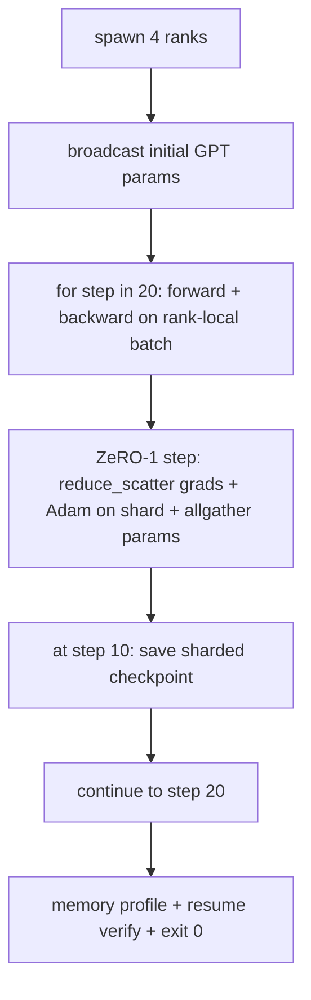

# Huấn luyện phân tán End-to-End

> Các bài học từ 76 đến 80 mỗi bài xây dựng một thành phần riêng lẻ. Đây là bước lắp ráp: một mô hình GPT nhỏ được huấn luyện trên 4 rank mô phỏng với DDP để đồng bộ gradient, ZeRO-1 để phân mảnh trạng thái bộ tối ưu (optimiser-state sharding), và một checkpoint phân mảnh tại mốc giữa chặng. Bản demo chạy 20 bước, tự kết thúc, in ra biểu đồ loss cùng hồ sơ bộ nhớ, và ghi lại một checkpoint có khả năng resume.

**Type:** Build
**Languages:** Python
**Prerequisites:** Phase 19 Track C lessons 42-49
**Time:** ~90 min

## Mục tiêu học tập

- Kết hợp DDP (bài 77) cộng với ZeRO-1 (bài 78) và checkpoint phân mảnh (bài 80) vào một vòng lặp huấn luyện duy nhất.
- Huấn luyện một mô hình ngôn ngữ transformer 2 lớp trên một tập dữ liệu tổng hợp nhỏ trong 20 bước trên 4 rank mô phỏng.
- In ra bảng loss theo từng bước, hồ sơ bộ nhớ theo từng rank, và một manifest checkpoint có khả năng resume với byte bằng nhau trên cùng world size.
- Chứng minh tính hợp lý của việc kết hợp: mỗi thành phần đều có thể kiểm thử độc lập trong các bài học trước và bài học này chứng minh chúng hoạt động cùng nhau.

## Vấn đề

Một dự án capstone là bằng chứng cho thấy các mảnh ghép khớp với nhau. Bài 76 đã triển khai các collective. Bài 77 bao bọc chúng trong DDP. Bài 78 phân mảnh trạng thái bộ tối ưu với reduce_scatter. Bài 79 phân tích pipeline. Bài 80 lưu một checkpoint phân mảnh. Mỗi bài học đều đứng độc lập với bài kiểm tra riêng. Một quá trình huấn luyện thực tế sử dụng mọi primitive cùng một lúc; nếu việc kết hợp sai, loss sẽ phân kỳ, checkpoint từ chối resume, hoặc bộ nhớ trên mỗi rank tăng lên khi lẽ ra nó phải giảm.

Bài học này chạy bản demo end-to-end và xác minh bốn bất biến: (a) loss giảm đơn điệu qua 20 bước trong phạm vi nhiễu float, (b) mọi rank giữ cùng một chuẩn tham số (parameter norm) tại mỗi bước, (c) bộ nhớ bộ tối ưu trên mỗi rank bằng công thức ZeRO-1 12P/N bytes, và (d) checkpoint tại bước 10 tải lại với byte bằng nhau khi khởi động lại. Bản demo tự kết thúc: 20 bước, một lệnh duy nhất, exit 0.

## Khái niệm



### Mini GPT

Mô hình được thiết kế nhỏ có chủ đích: 2 khối transformer, embed dim 32, 4 attention head, vocab 64, độ dài chuỗi 16, batch 4. Vài nghìn tham số. Đủ lớn để thực hiện mọi quyết định về cấu trúc (multi-head attention chạy đường dẫn masked tiêu chuẩn; LayerNorm có trọng số cần đồng bộ; LM head là một phép chiếu tuyến tính riêng biệt quay lại vocab). Đủ nhỏ để 20 bước trên 4 rank CPU hoàn thành trong vài giây.

### Các quy tắc kết hợp

| Thành phần bài học | Những gì nó sở hữu | Những gì nó để lại cho vòng lặp |
|--------------|--------------|----------------------------|
| DDP broadcast | Đồng bộ tham số ban đầu | Một lệnh gọi tại thời điểm khởi tạo |
| ZeRO-1 step | Đồng bộ gradient, cập nhật bản master, broadcast tham số | Một lệnh gọi mỗi bước thay thế optimiser.step |
| Checkpoint phân mảnh | Lưu trạng thái mỗi rank, manifest với sha256 | Được gọi trên rank 0 với trạng thái thu thập qua allgather |
| Vòng lặp huấn luyện | Forward, backward, ghi log loss | Gọi ba thành phần trên theo thứ tự |

Vòng lặp không cần biết về reduce_scatter hay các file rendezvous. Các module ZeRO và checkpoint cung cấp các giao diện hẹp mà vòng lặp sẽ kết hợp.

### Tại sao lại là GPT nhỏ mà không phải MLP

MLP từ bài 77 là đủ để xác minh đồng bộ gradient. Một GPT nhỏ bổ sung ba thứ: một LM head riêng biệt trên vocab (trong bài này, không buộc/untied để rõ ràng; GPT đầy đủ thường buộc head với token embedding), softmax+cross-entropy làm loss (nhiều trường hợp biên về số học hơn MSE), và một forward không đối xứng (embeddings sau đó là attention rồi MLP mỗi lớp). Việc tiếp tục sử dụng MLP cho capstone sẽ che giấu việc liệu sự kết hợp có xử lý đúng LayerNorm hoặc hình dạng grad của lớp embedding hay không.

### Tự kết thúc nghĩa là exit 0

Vòng lặp chạy cố định 20 bước và thoát. Không có `while True`, không có sự can thiệp của con người, không resume từ trạng thái bên ngoài. Một capstone mà bạn có thể để chạy mà không cần giám sát và tìm thấy log hoàn chỉnh khi nó kết thúc là một capstone chứng minh hệ thống được kết nối chính xác. Nếu bất kỳ thành phần nào gây deadlock, bản demo sẽ không bao giờ trả về và bộ kiểm thử sẽ bắt được lỗi đó.

```figure
ci-distributed-assembly
```

## Xây dựng

`code/main.py` triển khai:

- `MiniGPT`: transformer 2 lớp với masked self-attention và một LM head riêng biệt.
- `make_corpus(seed, total_tokens)`: dữ liệu dự đoán token tiếp theo mang tính tất định.
- `_train_worker`: được spawn trên mỗi rank; broadcast tham số khởi tạo, chạy vòng lặp, gọi ZeRO step, ghi checkpoint phân mảnh tại bước 10.
- `verify_resume`: sau khi chạy chính, tải lại checkpoint bước 10 trong tiến trình và khẳng định các master shard đã lưu khớp byte-cho-byte với snapshot trong bộ nhớ.
- `main`: điều phối toàn bộ bản demo, in bảng loss, hồ sơ bộ nhớ, và kết quả xác minh.

Chạy nó:

```bash
python3 code/main.py
```

Đầu ra: bảng loss 20 hàng, hồ sơ bộ nhớ 4 hàng theo rank, manifest checkpoint, và dòng "RESUME VERIFIED" khi thành công.

## Các mô hình sản xuất thực tế

Ba mô hình hoàn thiện việc kết hợp cho các lần chạy thực tế.

**Checkpoint mỗi K phút, không phải mỗi K bước.** Thời gian mỗi bước thay đổi theo độ dài chuỗi và số lượng microbatch. Chu kỳ checkpoint 10 phút bắt được cùng một lượng tính toán bất kể kích thước mô hình. Bài học sử dụng dựa trên bước để đơn giản hóa; sản xuất sử dụng dựa trên thời gian thực (wall-clock).

**Phát hiện phân kỳ sớm.** Các lần chạy sản xuất thêm bộ bảo vệ NaN sau backward và bộ phát hiện loss-spike; nếu loss nhảy vọt hơn 2x trong một bước, hãy quay lại checkpoint trước đó thay vì để bộ tối ưu tiến vào trạng thái thoái hóa. Biểu đồ loss của bài học mượt mà nên bộ bảo vệ không được sử dụng nhưng hook vẫn được giữ lại.

**Tổng hợp hồ sơ bộ nhớ trên các rank.** Bộ nhớ trên mỗi rank khác nhau trong các lần chạy thực tế (rank với pipeline stage lớn nhất giữ nhiều activation hơn). Log sản xuất ghi lại giá trị max trên các rank cộng với giá trị trung bình; bài học in theo từng rank để cho thấy công thức khớp với nhau.

## Sử dụng

Các mô hình sản xuất:

- **DeepSpeed.** Kết hợp DDP + ZeRO + pipeline + activation checkpointing dưới một cấu hình. Sự kết hợp của bài học là hình thái thu nhỏ của DeepSpeed.
- **PyTorch FSDP.** Tương đương với bản gốc. `FullyShardedDataParallel` với `ShardingStrategy.SHARD_GRAD_OP` chính là ZeRO-2.
- **NeMo và Megatron-LM.** Thêm tensor parallel cho các mô hình lớn nhất; nếu không thì sự kết hợp có hình thái tương tự.

## Triển khai

Toàn bộ track kết thúc tại đây. 6 bài học cùng nhau tạo thành hệ thống con huấn luyện phân tán mà một đội ngũ thực tế sẽ xây dựng trước khi áp dụng DeepSpeed; sự trừu tượng hóa đã được chứng minh với gloo và các chế độ lỗi đã được thực hành. Phase 17 (cơ sở hạ tầng và sản xuất) là nơi để đưa điều này lên một cụm máy chủ thực tế.

## Bài tập

1. Thêm phân tách tensor-parallel của attention head và xác minh loss khớp với baseline đơn rank. Hai rank: một nửa số head mỗi rank, allreduce đầu ra của attention.
2. Thêm tích lũy gradient qua 4 microbatch và chứng minh gradient bằng với gradient của một batch lớn.
3. Thêm đường dẫn resume-từ-bước-10 thực sự tiếp tục huấn luyện đến bước 20 và tạo ra cùng loss cuối cùng như lần chạy gốc.
4. Thêm xuất số liệu (loss, grad norm, step time) sang JSONL để có thể trực quan hóa sau khi chạy.
5. Thêm bộ bảo vệ NaN quay lại checkpoint trước đó khi có loss spike, và ép một spike với hệ số nhân LR một bước để thực hành rollback.

## Thuật ngữ chính

| Thuật ngữ | Cách gọi thông thường | Ý nghĩa thực tế |
|------|----------------|------------------------|
| End-to-end | "Kết nối tất cả" | Một lần chạy kết hợp mọi thành phần, không phải unit test cho từng phần |
| Hồ sơ bộ nhớ | "GB mỗi rank" | Bytes giữ trên mỗi rank cho tham số, grad, trạng thái bộ tối ưu |
| Hợp đồng resume | "Lưu và tải" | Trạng thái mỗi rank bằng byte sau một vòng checkpoint |
| Tự kết thúc | "Chạy có giới hạn" | Số bước cố định, exit 0 khi hoàn thành, không có con người can thiệp |

## Đọc thêm

- [Hướng dẫn huấn luyện DeepSpeed end-to-end](https://www.deepspeed.ai/getting-started/)
- [Hướng dẫn nâng cao PyTorch FSDP](https://pytorch.org/tutorials/intermediate/FSDP_advanced_tutorial.html)
- [Tham chiếu script huấn luyện Megatron-LM](https://github.com/NVIDIA/Megatron-LM)
- Phase 19 Bài 76-80 - mỗi thành phần mà bài học này kết hợp
- Phase 17 - chuyển sự kết hợp lên một cụm máy chủ thực tế