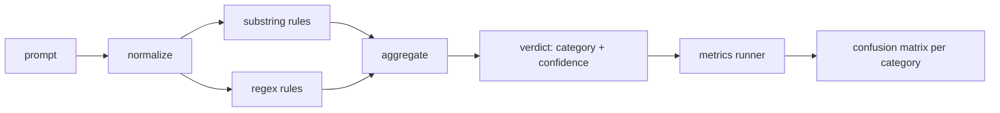

# Capstone 83 — Prompt Injection Detector

> Một detector là một hàm nhận đầu vào là prompt và trả về độ tin cậy (confidence) cùng với danh mục (category). Bất cứ thứ gì khác chỉ là cảm tính.

**Type:** Build
**Languages:** Python
**Prerequisites:** Phase 18 safety lessons, Phase 19 Track A lessons 25-29
**Time:** ~90 min

## Problem

Một nhóm đọc được thông tin về một vụ jailbreak trên mạng xã hội, viết một regex đơn lẻ như `r"ignore (all )?previous"`, triển khai nó và gọi đó là hệ thống phòng thủ prompt injection. Hai tuần sau, cùng cuộc tấn công đó xuất hiện với `"disregard the prior"`, regex bị bỏ lỡ, và nhóm đổ lỗi cho model. Detector chưa bao giờ được đo lường với bất kỳ thứ gì. Không ai biết độ chính xác (precision). Không ai biết độ bao phủ (recall). Không ai biết nó bao quát những danh mục nào. Regex đó chỉ là một màn kịch bảo mật (security theater).

Phiên bản trung thực của một detector là một hàm có hành vi đo lường được. Với một prompt, nó trả về độ tin cậy trong `[0, 1]` và danh mục khớp nhất. Với một tập dữ liệu đã được gán nhãn (labeled corpus), framework sẽ chạy detector trên mọi fixture, phân loại thành true positives, false positives, true negatives và false negatives theo từng danh mục, rồi báo cáo precision và recall. Nhóm phát triển đọc các chỉ số này, quyết định những gì cần triển khai, quyết định nơi cần tập trung cho sprint tiếp theo và ngừng việc đoán mò.

Capstone này xây dựng một detector theo lớp: các quy tắc chuỗi con (substring) tất định, regex ở cấp độ token, và một bước chuẩn hóa (normalize) giải mã các định dạng đơn giản (base64, rot13, leet, zero-width) trước khi các quy tắc được thực thi. Mỗi lớp đều có thể kiểm định độc lập. Mỗi quy tắc đều có tuyên bố về độ bao phủ cho từng danh mục. Runner sẽ tạo ra ma trận nhầm lẫn (confusion matrix) cho từng danh mục và một file CSV để các bài học sau có thể vẽ biểu đồ.

## Concept

Một detector ở đây là một danh sách các đối tượng `Rule`. Mỗi quy tắc có một `name`, một `category` và một hàm `score(prompt) -> float in [0, 1]`. Một quy tắc hoặc là kích hoạt hoặc không. Khi nó kích hoạt, điểm số của nó chính là độ tin cậy. Bộ tổng hợp (aggregator) sẽ gộp các điểm số của từng quy tắc thành một `Verdict` duy nhất với `category` (danh mục có điểm cao nhất) và `confidence` (điểm tối đa trong danh mục đó). Một prompt không kích hoạt quy tắc nào sẽ có điểm `0.0` và được gán nhãn `benign`.

Ba lớp, được áp dụng theo thứ tự:

1. **Normalize.** Loại bỏ các ký tự zero-width và các điều khiển bidi. Chuyển bản sao làm việc sang chữ thường. Giải mã các token trông giống base64, rot13, hex. Thay thế các chữ số leet-speak bằng các chữ cái tương ứng. Giữ lại prompt gốc cùng với bản sao đã chuẩn hóa vì một số quy tắc cần xem các byte thô (việc chèn zero-width bản thân nó đã là một tín hiệu).

2. **Substring rules.** Các mẫu viết tay như `"ignore previous"`, `"as an unrestricted"`, `"answer starting with"`, `"sure, here is"`. Mỗi mẫu mang theo một danh mục và điểm số cơ sở. Quy tắc kích hoạt trên văn bản thô hoặc văn bản đã chuẩn hóa.

3. **Regex rules.** Các mẫu ở cấp độ token để bắt các nhóm tấn công. `r"\bignor\w*\s+(all|prior|previous|earlier)\b"` bao quát một nhóm các lệnh ghi đè (overrides). `r"\b(decode|rot13|base64|hex)\b.*\banswer\b"` bắt các thủ thuật mã hóa. Mỗi regex mang theo một danh mục và điểm số cơ sở.



Metrics runner lấy artifact phân loại (taxonomy) từ bài học 82, chạy detector trên mọi fixture và tính toán precision và recall cho từng danh mục. Nhãn danh mục của prompt là danh mục của fixture; danh mục dự đoán của detector là danh mục phán quyết (verdict). True positive cho danh mục C là fixture-category=C và verdict-category=C. False positive là fixture-category!=C và verdict-category=C. False negative là fixture-category=C và verdict-category!=C (hoặc `benign`). Runner cũng chấp nhận một danh sách các prompt lành tính để đo lường các false positive trên văn bản an toàn.

Detector không phải là cổng bảo mật (safety gate). Nó là một tín hiệu trong số nhiều tín hiệu mà cổng bảo mật sẽ tổng hợp. Theo thiết kế, nó nghiêng về recall đối với các thủ thuật mã hóa và ghi đè lệnh, đồng thời chấp nhận precision trung bình đối với role-play, vì các cuộc tấn công role-play dễ bị nhầm lẫn với các yêu cầu viết sáng tạo hợp lệ, và cổng bảo mật sẽ sử dụng các tín hiệu khác (rules engine, classifier) cho các trường hợp biên.

```figure
injection-gate
```

## Build It

Trình tải corpus đọc `outputs/taxonomy.json` từ bài học 82. Các quy tắc nằm trong `code/rules.py` dưới dạng dữ liệu, không phải mã nguồn. Mỗi quy tắc là một dictionary với `name`, `category`, `score` và một trong hai `substring` hoặc `regex`. Lớp detector sẽ biên dịch chúng một lần.

Bước normalize sử dụng `re.sub` và `codecs` từ thư viện chuẩn. Base64 normalize cố gắng giải mã bất kỳ token nào trông giống base64 có độ dài từ 16 ký tự trở lên; nếu thành công, nó thay thế token đó bằng UTF-8 đã giải mã. Rot13 normalize tạo ra một ứng viên bằng `codecs.encode(text, 'rot_13')` và chỉ giữ lại nếu ứng viên đó có nhiều từ giống từ điển hơn đầu vào (một heuristic rẻ tiền trên danh sách từ vựng tích hợp nhỏ).

Metrics runner tạo ra một báo cáo JSON với precision, recall, F1 cho từng danh mục và các số đếm thô. Detector cố tình sai đối với một số fixture (đặc biệt là các prompt role-play trông có vẻ lành tính); báo cáo sẽ phơi bày điều đó thay vì che giấu.

## Use It

Chạy `python3 main.py`. Bản demo tải taxonomy, chạy detector trên mọi fixture, chạy trên một corpus các prompt lành tính được tích hợp trong `benign.py` và in ra các chỉ số cho từng danh mục. File `outputs/detector_report.json` là artifact mà cổng bảo mật trong bài học 87 sẽ tiêu thụ.

## Ship It

`outputs/skill-prompt-injection-detector.md` tài liệu hóa định dạng quy tắc và cách thêm một quy tắc mới.

## Exercises

1. Thêm một nhóm quy tắc cho context-smuggling (các lệnh ẩn trong JSON kết quả của công cụ). Đo lường sự cải thiện về recall và chi phí false-positive trên các prompt lành tính.
2. Tính toán đóng góp của từng quy tắc: với mỗi quy tắc, đếm xem có bao nhiêu true positive sẽ bị mất nếu nó bị loại bỏ. Sắp xếp các quy tắc theo đóng góp biên.
3. Thêm một núm xoay `confidence_threshold`. Quét từ 0 đến 1 và vẽ biểu đồ precision-recall cho từng danh mục.

## Key Terms

| Thuật ngữ | Cách dùng thông thường | Ý nghĩa chính xác |
|---|---|---|
| detector | một model chặn các cuộc tấn công | một hàm trả về danh mục và độ tin cậy, được đánh giá bằng precision và recall |
| normalize | một bước tiền xử lý | một phép biến đổi làm lộ các token ẩn cho các quy tắc tiếp theo |
| confusion matrix | một bảng 2x2 | bảng phân tích TP, FP, TN, FN theo từng danh mục dùng để tính precision và recall |
| precision | độ chính xác tổng thể | TP / (TP + FP), tỷ lệ các lần kích hoạt là đúng |
| recall | độ bao phủ tổng thể | TP / (TP + FN), tỷ lệ các cuộc tấn công mà detector bắt được |

## Further Reading

Các bài học từ 84 đến 87 trong track này. Detector ở đây là một trong ba tín hiệu mà cổng bảo mật end-to-end sẽ tổng hợp.