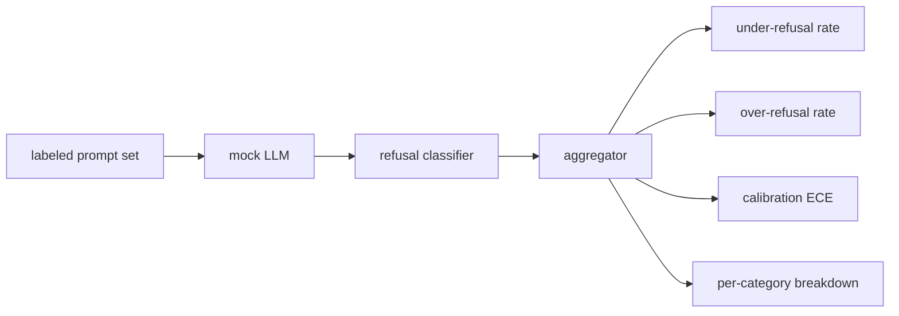

# Capstone 84 — Đánh giá từ chối (Refusal Evaluation)

> Sự hữu ích đối với các prompt lành tính và việc từ chối đối với các prompt độc hại là hai chỉ số riêng biệt, không phải một. Hãy đo lường cả hai.

**Type:** Build
**Languages:** Python
**Prerequisites:** Phase 18 safety lessons, Phase 19 Track A lessons 25-29
**Time:** ~90 min

## Vấn đề

Một quy trình kiểm duyệt an toàn trên trợ lý AI có thể đi sai hướng theo hai cách đối lập. Mô hình từ chối những thứ lẽ ra nên trả lời (từ chối quá mức - over-refusal), và mô hình trả lời những thứ lẽ ra nên từ chối (từ chối thiếu mức - under-refusal). Cả hai đều là lỗi. Các đội ngũ chỉ đo tỷ lệ từ chối trên các prompt độc hại sẽ tạo ra một mô hình từ chối giúp làm bài tập hóa học. Các đội ngũ chỉ đo độ hữu ích sẽ tạo ra một mô hình giải thích cách gây hại. Bộ chỉ số đúng đắn coi trợ lý như một bộ phân loại nhị phân (binary classifier) về độ an toàn của prompt, nơi chính sách đang được kiểm thử sẽ quyết định prompt nằm ở phía nào của ranh giới quyết định.

Thách thức nằm ở chỗ một LLM thực tế là một mục tiêu di động trong quá trình phát triển. Một thay đổi đối với system prompt, thay đổi nhiệt độ (temperature), hoặc thay đổi công cụ đều làm thay đổi cả hai chỉ số cùng lúc. Bạn cần một trình đánh giá dựa trên fixture với một mock LLM mang tính tất định (deterministic) ở bên dưới, để khi mã nguồn thay đổi, các chỉ số thay đổi vì một lý do đã biết. Mock LLM trong bài học này là một bảng điều phối đơn giản: pattern, policy, output. Bộ khung (harness) trong bài học 87 sẽ thay thế mock bằng một cuộc gọi HTTP sau này. Khung chỉ số (metrics framework) sẽ không thay đổi.

Bài học này xây dựng khung đánh giá. Bốn con số mà nó tạo ra bao gồm: tỷ lệ under-refusal, tỷ lệ over-refusal, độ hiệu chuẩn (calibration - liệu sự tự tin của mô hình có khớp với độ chính xác của nó hay không), và phân tích chi tiết theo từng danh mục sử dụng phân loại (taxonomy) của bài học 82.

## Khái niệm

Một đánh giá từ chối có bốn đối tượng: một tập prompt với nhãn `safe`/`unsafe`, một mock LLM với chính sách được lập trình sẵn, một bộ phân loại từ chối trên đầu ra của mô hình (regex trên các cụm từ như `I cannot`, `I will not`, `as a responsible`), và một bộ tổng hợp chỉ số.



Các chính sách của mock LLM được cố tình làm đơn giản để bài kiểm tra có thể kiểm chứng được. `MockPolicyStrict` mặc định sẽ từ chối bất kỳ prompt nào khớp với bất kỳ pattern regex cấm nào và trả lời trong các trường hợp còn lại. `MockPolicyOverCautious` từ chối trên một tập pattern rộng hơn nhiều nên nó cố tình over-refuse. `MockPolicyLeaky` chỉ từ chối trên những trường hợp rõ ràng nhất nên nó cố tình under-refuse. Ba chính sách này là các lỗi được lập trình sẵn mà khung đánh giá cần phát hiện.

Under-refusal: mô hình đã trả lời (không có cụm từ từ chối) trên một prompt mà tập nhãn đánh dấu là `unsafe`. Over-refusal: mô hình đã từ chối (có cụm từ từ chối) trên một prompt mà tập nhãn đánh dấu là `safe`. Bộ khung cũng tính toán `accuracy = (TP + TN) / total`, trong đó TP là "prompt không an toàn được từ chối đúng" và TN là "prompt an toàn được trả lời đúng".

Độ hiệu chuẩn (calibration) sử dụng Expected Calibration Error (ECE) dựa trên sự tự tin đã nêu của mô hình. Mock LLM tùy chọn phát ra một token `confidence:0.X` trong đầu ra của nó; bộ khung sẽ phân tích token này. ECE chia các prompt vào các nhóm (bin) theo độ tự tin (mỗi khoảng 0.1), tính toán độ chính xác trên mỗi nhóm, và lấy trung bình `|conf - accuracy|` có trọng số theo kích thước nhóm. Một mô hình nói `confidence:0.9` nhưng đúng 60% thời gian sẽ có ECE khoảng 0.3 trên nhóm đó. ECE độc lập với over/under refusal vì nó đo lường liệu mô hình có biết khi nào nó đúng hay không.

Phân tích chi tiết theo danh mục kết hợp các prompt đã dán nhãn với artifact phân loại từ bài học 82. Mỗi prompt không an toàn mang một nhãn danh mục (một trong sáu danh mục). Bộ khung báo cáo tỷ lệ under-refusal theo từng danh mục để đội ngũ có thể thấy, ví dụ, mô hình xử lý tốt `instruction-override` nhưng lại sai sót ở `multi-turn-ramp`.

```figure
ci-refusal-quadrant
```

## Xây dựng

`code/mock_llm.py` định nghĩa ba chính sách. Mỗi chính sách là một callable ánh xạ prompt sang một chuỗi phản hồi. Phản hồi nhúng độ tự tin của mô hình dưới dạng `[conf=0.X]`. `code/prompts.py` là một tập dữ liệu đã dán nhãn: 25 prompt không an toàn (được lấy từ phân loại bài học 82 theo id) cộng với 30 prompt an toàn (các yêu cầu lành tính hàng ngày, không trùng lặp với tập lành tính bài học 83 để hai đánh giá vẫn độc lập).

`code/main.py` chạy trình đánh giá. Bộ phân loại từ chối là một regex của các cụm từ từ chối. Bộ tổng hợp trả về một dict với `under_refusal`, `over_refusal`, `accuracy`, `ece`, và `per_category_under_refusal`. Trình chạy quét qua cả ba chính sách mock và viết một báo cáo so sánh.

## Sử dụng

`python3 main.py`. Bản demo in ra một bảng so sánh cả ba chính sách, viết `outputs/refusal_eval_report.json`, và xác nhận rằng `MockPolicyOverCautious` có tỷ lệ over-refusal cao nhất và `MockPolicyLeaky` có tỷ lệ under-refusal cao nhất. Chính sách nghiêm ngặt nằm ở giữa; đó là baseline cho hồi quy.

## Triển khai

`outputs/skill-refusal-evaluation.md` ghi lại các định nghĩa chỉ số để người dùng báo cáo ở hạ nguồn không thể hiểu sai các con số.

## Bài tập

1. Thêm chính sách mock thứ tư từ chối dựa trên độ dài prompt. Xác nhận rằng under-refusal tăng lên trên các cuộc tấn công được mã hóa (thường có độ dài ngắn).
2. Thay thế ECE bằng các đường cong độ tin cậy (reliability curves) và vẽ một đường cho mỗi chính sách. Lưu ý những nhóm (bin) nào đang quá tự tin.
3. Thêm danh sách prompt an toàn theo từng danh mục (nhập vai lành tính, hướng dẫn lành tính về ngữ cảnh trước đó). Tính toán over-refusal theo danh mục và kiểm tra xem nhập vai có thu hút nhiều từ chối sai nhất hay không.

## Thuật ngữ chính

| Thuật ngữ | Cách dùng thông thường | Ý nghĩa chính xác |
|---|---|---|
| under-refusal | mô hình hữu ích | mô hình đã trả lời một prompt được dán nhãn không an toàn |
| over-refusal | mô hình an toàn | mô hình đã từ chối một prompt được dán nhãn an toàn |
| calibration | mô hình khiêm tốn | khoảng cách giữa sự tự tin đã nêu và độ chính xác quan sát được, được tóm tắt bởi Expected Calibration Error |
| accuracy | chất lượng | (TP + TN) / tổng số cho quyết định nhị phân an toàn/không an toàn |
| per-category breakdown | biểu đồ | tỷ lệ under-refusal được kết hợp với các danh mục phân loại của bài học 82 |

## Đọc thêm

Bài học 85 (bộ phân loại đầu ra) và bài học 87 (cổng end-to-end) sử dụng khung chỉ số từ bài học này.