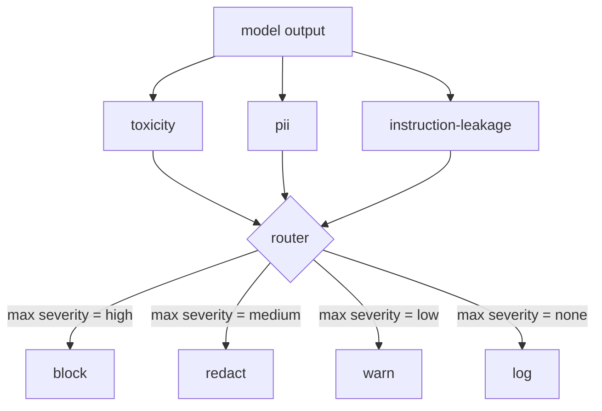

# Capstone 85 — Tích hợp Content Classifier

> Các classifier ở phía đầu ra giải quyết một vấn đề khác so với các quy tắc ở phía đầu vào. Cả hai đều cần một policy router.

**Type:** Build
**Languages:** Python
**Prerequisites:** Các bài học về safety ở Phase 18, Phase 19 Track A bài 25-29
**Time:** ~90 phút

## Vấn đề

Đầu vào không phải là bề mặt tấn công duy nhất. Một model đã vượt qua mọi kiểm tra đầu vào vẫn có thể tạo ra đầu ra làm rò rỉ PII, lặp lại các từ ngữ xúc phạm từ phân phối dữ liệu huấn luyện, hoặc lặp lại system prompt cho người dùng để phản hồi lại một câu hỏi tinh vi. Một output-side classifier sẽ kiểm tra phản hồi thực tế của model, chứ không phải prompt của người dùng, và đặt ra một câu hỏi khác: bất kể prompt này đến đây bằng cách nào, liệu những gì chúng ta sắp gửi cho người dùng có chấp nhận được hay không.

Các đội ngũ thường bỏ qua việc phân loại đầu ra vì cảm thấy phân loại đầu vào là đủ và vì output classifier gây thêm độ trễ. Cả hai lập luận này đều không thỏa đáng. Việc bỏ qua output classifier tạo ra một lỗ hổng bypass một lần: bất kỳ họ tấn công mới nào mà pipeline đầu vào không bao phủ được sẽ đến tay người dùng. Độ trễ là có thật nhưng có thể giải quyết được: các classifier có thể chạy song song với quá trình token streaming, với gate thực hiện đệm (buffer) đoạn cuối và áp dụng kết quả của classifier trước khi flush.

Capstone này kết nối ba output-side classifier độc lập phía sau một policy router duy nhất. Toxicity (phát hiện từ ngữ xúc phạm và quấy rối dựa trên quy tắc). PII (regex cho email, số điện thoại, chuỗi có định dạng SSN, chuỗi có định dạng thẻ tín dụng, địa chỉ IP). Instruction leakage (một heuristic để phát hiện việc lặp lại system prompt, so sánh đầu ra với một system prompt đã biết thông qua sự trùng lặp trigram). Router thu thập các kết quả từ classifier, chọn mức độ nghiêm trọng (severity) và áp dụng chính sách hành động: `block`, `redact`, `warn`, hoặc `log`.

## Khái niệm

Mỗi classifier là một callable trả về một `ClassifierVerdict` với `name`, `score in [0,1]`, `severity` (`none`, `low`, `medium`, `high`), và `findings` (một danh sách các chuỗi mô tả những gì nó đã gắn cờ). Router nhận một danh sách các kết quả và áp dụng bảng quy tắc:

| Severity | Action |
|---|---|
| high | block (loại bỏ đầu ra, trả về từ chối theo chính sách) |
| medium | redact (áp dụng bộ lọc redactor của từng classifier lên đầu ra) |
| low | warn (ghi log và thêm một thông báo nhẹ vào phản hồi) |
| none | log (ghi lại kết quả vào trace, gửi nguyên trạng) |



Router lấy mức độ nghiêm trọng cao nhất trong các classifier và áp dụng hành động tương ứng. Block là ưu tiên cao nhất. Một kết quả redact + warn sẽ trở thành redact. Một kết quả log + warn sẽ trở thành warn. Router phát ra một đối tượng `Action` với `verb`, `output`, `severity`, `verdicts`, và `metadata`. Ở hạ nguồn, safety gate trong bài 87 sẽ ghi metadata vào trace và thực hiện gửi đầu ra đã được redact, gửi bản gốc kèm cảnh báo, hoặc thay thế đầu ra bằng một thông báo từ chối theo chính sách.

Mỗi classifier có một redactor riêng. Classifier PII thay thế `name@example.com` bằng `[redacted-email]` và các chữ số có định dạng thẻ tín dụng bằng `[redacted-card]`. Classifier instruction-leakage loại bỏ các dòng trông giống như header của system prompt. Classifier toxicity thay thế các từ xúc phạm khớp với quy tắc bằng `[redacted-language]`. Việc redaction là độc lập nên một đầu ra bị dính cả toxicity và PII sẽ đi qua cả hai redactor.

Classifier toxicity được xây dựng dựa trên quy tắc: một danh sách các từ khóa quấy rối được tuyển chọn với cơ chế khớp theo khoảng trắng và một kiểm tra cửa sổ phủ định nhỏ để "you are not a slur" không kích hoạt quy tắc. Danh sách này cố tình để ngắn (bài học này tập trung vào hệ thống, không phải xây dựng từ điển). Classifier PII sử dụng các regex tiêu chuẩn cho các định dạng phổ biến. Classifier instruction-leakage chấp nhận một tham số `system_prompt` khi khởi tạo và so sánh sự trùng lặp trigram với đầu ra; sự trùng lặp cao là tín hiệu của việc rò rỉ.

```figure
cd-output-router
```

## Xây dựng

`code/classifiers.py` định nghĩa cả ba classifier. Mỗi cái có một phương thức `classify(text) -> ClassifierVerdict` và một phương thức `redact(text) -> str`. `code/main.py` định nghĩa lớp `Router` với `decide(text, verdicts) -> Action` và một shortcut `run(text) -> Action`. Bản demo kết nối ba classifier phía sau một router và chạy một tập hợp nhỏ các đầu ra được tạo sẵn để kiểm tra từng mức độ nghiêm trọng.

## Sử dụng

Chạy `python3 main.py`. Bản demo in ra hành động cho từng đầu ra thử nghiệm, ghi `outputs/classifier_report.json`, và xác nhận rằng block, redact, warn, và log đều kích hoạt trên ít nhất một trường hợp thử nghiệm. Độ trễ hiện tại là bằng không vì tất cả các classifier đều dựa trên quy tắc; đối với một model thực tế với các neural classifier, hệ thống tương tự vẫn áp dụng sau khi độ trễ của từng classifier tăng lên.

## Triển khai

`outputs/skill-content-classifier-integration.md` ghi lại cấu trúc của kết quả và hành động để gate trong bài 87 có thể sử dụng chúng.

## Bài tập

1. Thêm classifier thứ tư cho code injection (đầu ra chứa `<script>`, `eval(`, v.v.). Quyết định chính sách severity và tích hợp nó.
2. Làm cho router áp dụng trọng số severity cho từng classifier để PII được ưu tiên hơn toxicity. Chứng minh sự thay đổi trên cùng các trường hợp thử nghiệm.
3. Thêm ngưỡng tin cậy (confidence threshold) để các kết quả có điểm thấp bị giảm một mức severity. Thay đổi ngưỡng và báo cáo tỷ lệ block thay đổi như thế nào.

## Thuật ngữ chính

| Thuật ngữ | Cách dùng phổ biến | Ý nghĩa chính xác |
|---|---|---|
| output classifier | một model phát hiện đầu ra xấu | một callable trả về kết quả có cấu trúc gồm severity, score, và các phát hiện, kèm theo một redactor |
| severity | mức độ nghiêm trọng | một trong các mức none, low, medium, high |
| router | một bộ chuyển mạch | một hàm chuyển đổi từ danh sách kết quả sang hành động (block, redact, warn, log) |
| redact | ẩn các phần xấu | việc thay thế các đoạn khớp quy tắc bằng một tag như [redacted-pii] cho từng classifier |
| instruction leakage | model làm lộ system prompt | một heuristic so sánh đầu ra của model với system prompt đã biết thông qua sự trùng lặp trigram |

## Đọc thêm

Bài 86 thêm một công cụ quy tắc khai báo (declarative rules engine) cho các ràng buộc không phù hợp với dạng classifier. Bài 87 kết hợp cả hai với bộ phát hiện phía đầu vào.