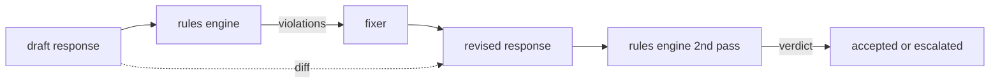

# Capstone 86 — Constitutional Rules Engine

> Một quy tắc bao gồm tên, vị ngữ (predicate) và lời giải thích. Bất kỳ thứ gì thiếu một trong ba yếu tố đó chỉ là cảm tính, không phải quy tắc.

**Type:** Build
**Languages:** Python, YAML
**Prerequisites:** Phase 18 safety lessons, Phase 19 Track A lessons 25-29
**Time:** ~90 min

## Problem

Các bộ phân loại (classifiers) xử lý những lỗi có thể nhận diện được. Các công cụ quy tắc (rules engines) xử lý những lỗi mang tính hợp đồng. Một nhóm phát triển trợ lý lập trình muốn áp đặt ràng buộc như "mọi phản hồi chứa mã nguồn phải kết thúc bằng một khối có thể chạy được hoặc một giả định đã nêu". Một nhóm vận hành bot hỗ trợ khách hàng muốn "mọi sự từ chối phải đưa ra bước tiếp theo". Những ràng buộc này không phải là mục tiêu tự nhiên của bộ phân loại. Chúng là các vị ngữ trên phản hồi, cuộc hội thoại và chính sách hệ thống, và chúng cần phải dễ đọc đối với những người không phải kỹ sư.

Cách thể hiện trung thực nhất là một tệp khai báo. Một hiến pháp (constitution) nằm trong tệp YAML cùng với mã nguồn, trong hệ thống kiểm soát phiên bản, với quy trình đánh giá riêng biệt. Mỗi quy tắc có một `name`, một `predicate`, một `severity` và một mẫu `explanation`. Công cụ sẽ tải tệp, đánh giá từng quy tắc dựa trên kết quả đầu ra ứng viên và trả về một `Violation` có cấu trúc cho mỗi quy tắc bị kích hoạt. Công cụ quy tắc trong capstone này kết hợp các vị ngữ với `all_of`, `any_of` và `not_` để một quy tắc đơn lẻ có thể diễn đạt "nếu phản hồi chứa mã nguồn, nó phải kết thúc bằng một khối có thể chạy được VÀ không được tham chiếu đến thư viện nội bộ".

Một nửa còn lại của bài học là sửa đổi (revision). Một công cụ quy tắc chỉ có chức năng chặn thì mới chỉ hoàn thiện một nửa. Một công cụ quy tắc đề xuất sửa lỗi mới thực sự hữu ích trong vận hành: trợ lý soạn thảo phản hồi, công cụ gắn cờ các vi phạm, bộ sửa lỗi (fixer) tạo ra phản hồi đã sửa đổi và công cụ xác nhận rằng bản sửa đổi đáp ứng các quy tắc. Bài học này cung cấp một bộ sửa lỗi tối giản (thay thế bằng regex cho mỗi quy tắc) và một diff có cấu trúc (thêm, xóa, chỉnh sửa từng dòng) giữa bản nháp và bản đã sửa đổi.

## Concept



Một quy tắc có dạng

```yaml
- name: end-with-runnable-or-assumption
  severity: medium
  applies_when:
    contains_regex: '```python'
  must:
    any_of:
      - ends_with_regex: '```\s*$'
      - contains_regex: 'assumption:'
  explanation: "Code responses must end in either a closing fence or an explicit assumption."
  fix:
    append_if_missing: "\n\nAssumption: example inputs are valid."
```

Các vị ngữ mang tính nguyên tử: `contains_regex`, `not_contains_regex`, `ends_with_regex`, `starts_with_regex`, `max_words`, `min_words`. Các phép kết hợp là `all_of`, `any_of`, `not_`. Công cụ đánh giá `applies_when` trước; nếu quy tắc không áp dụng, vi phạm được ghi lại là `not_applicable`. Nếu không, công cụ sẽ đánh giá `must` và tạo ra `pass` hoặc `violation`.

Các mức độ nghiêm trọng (severities) là `low`, `medium`, `high`, phản ánh bài học 85. Cổng kiểm soát hạ nguồn (bài học 87) xử lý vi phạm quy tắc `high` giống như phán quyết của bộ phân loại `high`: chặn.

Bộ sửa lỗi là một danh sách các thao tác khai báo: `append_if_missing`, `prepend_if_missing`, `replace_regex`. Mỗi thao tác ánh xạ một quy tắc theo tên tới một phép biến đổi. Bộ sửa lỗi cố tình bị giới hạn ở các chỉnh sửa cục bộ; việc viết lại cấu trúc thuộc về lớp từ chối-và-trợ-giúp riêng biệt không được đề cập ở đây.

Diff được tính toán dựa trên bản gốc và bản đã sửa đổi. Đó là một danh sách các bản ghi `Change` với `op` (thêm, xóa, chỉnh sửa) và văn bản liên quan. Cổng kiểm soát hạ nguồn có thể ghi lại diff để người đánh giá kiểm tra hành vi của bộ sửa lỗi theo thời gian.

```figure
cd-constitution-loop
```

## Build It

`code/rules.yml` chứa hiến pháp. Bộ tải trong `code/main.py` chấp nhận tệp YAML (khi có PyYAML) hoặc tệp JSON (tích hợp sẵn). Bài học cung cấp một `rules.yml` mà các bài kiểm tra của bài học phân tích bằng cả hai đường dẫn mã. `code/main.py` định nghĩa các lớp `Engine` và `Fixer` cùng hàm `diff`. Các phép kết hợp được đánh giá đệ quy với cơ chế ngắt mạch (short-circuiting) trên `any_of`.

Hiến pháp được cung cấp:

- `no-empty-refusal` (trung bình) - sự từ chối phải bao gồm gợi ý hoặc chuyển hướng
- `end-with-runnable-or-assumption` (trung bình) - các phản hồi mã nguồn phải đóng sạch sẽ
- `no-pii-in-examples` (cao) - dữ liệu ví dụ không được chứa email hoặc định dạng số điện thoại
- `cite-when-asserting-fact` (thấp) - các dòng bắt đầu bằng "According to" phải chứa trích dẫn trong ngoặc đơn
- `no-internal-library-leak` (cao) - các từ `internal-only` và `policybot-internal` không được xuất hiện trong đầu ra
- `bounded-length` (thấp) - phản hồi không được vượt quá 800 từ

## Use It

`python3 main.py`. Bản demo chạy ba phản hồi nháp qua công cụ, in ra các vi phạm, chạy bộ sửa lỗi, in ra diff và ghi lại `outputs/rules_report.json`. Một fixture có quy tắc không áp dụng (không có khối mã trong bản nháp), và báo cáo hiển thị `not_applicable` cho quy tắc đó để nhóm thấy rằng công cụ đã đánh giá nó một cách rõ ràng.

## Ship It

`outputs/skill-constitutional-rules-engine.md` tài liệu hóa ngữ pháp quy tắc và các thao tác của bộ sửa lỗi.

## Exercises

1. Thêm một quy tắc yêu cầu mọi phản hồi phải bao gồm cụm từ "If this is urgent" khi prompt đề cập đến an toàn. Sử dụng phép kết hợp.
2. Thay thế bộ sửa lỗi regex bằng bộ sửa lỗi dựa trên template sử dụng các vị trí được đặt tên (named slots). Chứng minh một quy tắc được viết lại theo thiết kế mới.
3. Thêm một endpoint số liệu, khi nhận được một tập hợp các bản nháp, sẽ trả về tỷ lệ vi phạm trên mỗi quy tắc để nhóm có thể thấy quy tắc nào đang bị kích hoạt quá mức.

## Key Terms

| Thuật ngữ | Cách dùng thông thường | Ý nghĩa chính xác |
|---|---|---|
| constitution | tài liệu chính sách mơ hồ | tệp YAML chứa các quy tắc với vị ngữ, mức độ nghiêm trọng và giải thích |
| predicate | một bước kiểm tra | một hàm có thể gọi từ văn bản sang bool, nguyên tử hoặc kết hợp qua all_of/any_of/not_ |
| violation | một lỗi | bản ghi có cấu trúc với tên quy tắc, mức độ nghiêm trọng, giải thích và đoạn văn bản khớp |
| fixer | tinh chỉnh mô hình | phép biến đổi tất định theo từng quy tắc để ánh xạ bản nháp sang bản đã sửa |
| diff | so sánh chuỗi | danh sách có cấu trúc các thao tác thêm, xóa, chỉnh sửa giữa bản nháp và bản đã sửa |

## Further Reading

Bài học 87 kết hợp công cụ này với bộ phát hiện phía đầu vào và bộ phân loại phía đầu ra thành một cổng kiểm soát an toàn duy nhất.