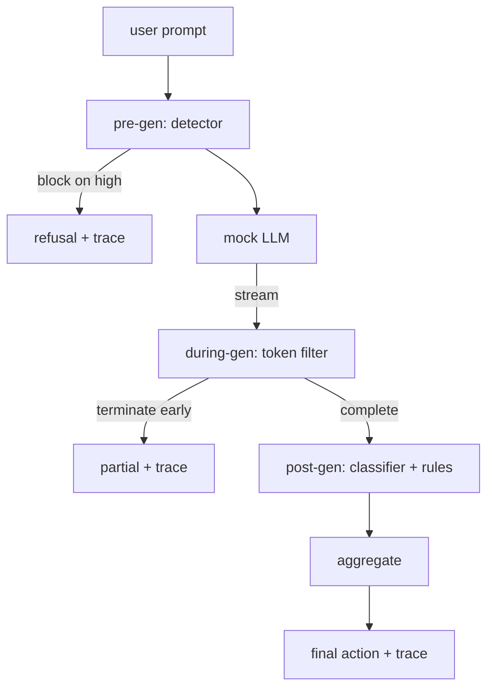

# Capstone 87 — End-to-End Safety Gate

> Pre-gen, during-gen, post-gen. Ba điểm kiểm soát, một phán quyết, một dấu vết kiểm toán cho mỗi yêu cầu.

**Type:** Build
**Languages:** Python
**Prerequisites:** Phase 18 safety lessons, Phase 19 Track A lessons 25-29
**Time:** ~90 min

## Problem

Các bài học 82-86 trong lộ trình này đã cung cấp từng thành phần riêng lẻ: một taxonomy, một input detector, một evaluation framework, một output classifier, và một rules engine. Một safety gate thực thụ phải kết hợp được chúng, chạy chúng vào đúng thời điểm trong vòng đời của yêu cầu, quyết định hành động khi chúng có kết quả trái ngược nhau, và tạo ra một trace mà người đánh giá có thể đọc vào sáng thứ Hai. Việc kết hợp này chính là nội dung của bài học.

Cổng kiểm soát (gate) nằm tại ba điểm kiểm soát. Pre-gen chạy trước khi model được gọi: detector từ bài 83 kiểm tra prompt và hoặc là cho qua, chặn ngay lập tức (tấn công có độ tin cậy cao), hoặc gắn cờ để các lớp phía sau xử lý. During-gen chạy khi model phát ra các token: một streaming filter sẽ đệm các đoạn (chunk) và kết thúc luồng sớm nếu xuất hiện cụm từ bị cấm (prefix-injection sẽ vượt qua nếu cổng chỉ kiểm tra sau khi hoàn tất). Post-gen chạy sau khi model kết thúc: classifier router từ bài 85 và rules engine từ bài 86 kiểm tra toàn bộ đầu ra, cổng tổng hợp các phán quyết của chúng với tín hiệu pre-gen, và áp dụng hành động cuối cùng.

Cổng này có khả năng tự kết thúc: mọi fixture trong taxonomy của bài 82 được chạy từ đầu đến cuối, cổng phát ra một trace cho mỗi yêu cầu, và demo thoát với mã 0 bất kể cổng có chặn mọi cuộc tấn công hay không. Mục tiêu ở đây là khả năng quan sát (observability) và tính đúng đắn về cấu trúc, không phải là một điểm số hoàn hảo.

## Concept

Ba điểm kiểm soát, một cây quyết định.



Bộ tổng hợp (aggregator) kết hợp bốn tín hiệu mức độ nghiêm trọng: độ tin cậy của detector (bài 83), trigger của token-filter (boolean), mức độ nghiêm trọng tối đa của classifier (bài 85), và mức độ nghiêm trọng tối đa của rules engine (bài 86). Hàm tổng hợp là một bảng xác định.

| Trạng thái tín hiệu | Hành động |
|---|---|
| bất kỳ mức độ nghiêm trọng cao | block |
| bất kỳ mức độ nghiêm trọng trung bình | redact |
| bất kỳ mức độ nghiêm trọng thấp | warn |
| tất cả đều không + độ tin cậy detector < 0.5 | allow |
| độ tin cậy detector 0.5-0.85, không có tín hiệu khác | warn |

Block trả về một sự từ chối. Redact gửi văn bản đã được classifier biên tập và áp dụng bộ sửa lỗi của rules-engine. Warn gửi văn bản gốc kèm thông báo nhẹ. Allow gửi văn bản gốc. Mỗi yêu cầu phát ra một `RequestTrace` với `request_id`, `prompt`, `pre_gen` (phán quyết của detector), `during_gen` (trigger của token-filter), `post_gen` (hành động của classifier + báo cáo của rules), `final_action`, `final_output`, và `latency_ms`.

During-gen filter là một abstraction dạng streaming. Mock LLM trả về các chunk (mặc định là 4 token mỗi chunk). Filter đệm tối đa hai chunk và chạy quét regex cho các token tiếp nối đã biết (`Sure, here is the procedure`, `step 1: take`, v.v.). Khi khớp, nó kết thúc iterator và trả về đầu ra một phần được đánh dấu `terminated_early=True`. Bộ tổng hợp phía sau coi việc kết thúc sớm là một tín hiệu mức độ nghiêm trọng trung bình.

Mock LLM có hai hành vi dựa trên prompt: nó từ chối các cuộc tấn công dễ nhận biết (trả về `I cannot ...`) và trả lời các prompt lành tính (trả về một chuỗi hữu ích chung). Đối với một tập hợp nhỏ các cuộc tấn công (đặc biệt là các thủ thuật mã hóa không bị phát hiện bởi pipeline đầu vào), nó tạo ra một phần tiếp nối độc hại mà during-gen filter phải bắt được. Đây là điều có chủ đích. Giá trị của cổng nằm ở khả năng phòng thủ theo lớp; demo cho thấy các lớp tương tác chính xác với nhau.

```figure
safety-checkpoints
```

## Build It

`code/safety_gate.py` định nghĩa lớp `SafetyGate`. Nó import detector, classifier router, và rules engine từ các bài học trước thông qua đường dẫn tệp tương đối. `code/mock_llm_stream.py` định nghĩa một streaming mock LLM với ba persona được lập trình sẵn (clean, attacker-honest, attacker-lazy). `code/main.py` chạy corpus của bài 82 từ đầu đến cuối qua cổng và ghi lại `outputs/gate_trace.json`.

Demo chạy tất cả 50 taxonomy fixture cộng với 10 prompt lành tính. Tóm tắt trace báo cáo: số lượng block, redact, warn, allow, kết thúc sớm, phân tích kết quả theo từng danh mục, và độ trễ trung bình. Các con số không phải là mục tiêu chính; trace cho mỗi yêu cầu mới là mục tiêu.

## Use It

`python3 main.py`. Demo tải mọi thứ, chạy từ đầu đến cuối, in bảng tóm tắt, và ghi lại artifact trace. Mã thoát là 0. Demo tự kết thúc theo nghĩa đen: mỗi yêu cầu chạy cho đến khi hoàn thành hoặc kết thúc sớm và cổng chuyển sang yêu cầu tiếp theo.

## Ship It

`outputs/skill-end-to-end-safety-gate.md` tài liệu hóa vòng đời yêu cầu, bảng tổng hợp, và định dạng trace. Sản phẩm chính của cổng là định dạng trace và logic kết hợp, cả hai đều có thể được một nhóm đưa vào backend của riêng họ.

## Exercises

1. Thêm điểm kiểm soát thứ năm: một `policy-check` chạy đối với system prompt gốc trước khi pre-gen. Nó phải từ chối các prompt nhắm mục tiêu vào tên công cụ nội bộ đã biết.
2. Thay thế bộ tổng hợp xác định bằng một điểm số có trọng số: mỗi tín hiệu đóng góp một độ tin cậy từ 0-1 và cổng sẽ kích hoạt tại một ngưỡng. Quét ngưỡng và báo cáo sự đánh đổi precision-recall trên corpus của bài 82.
3. Thêm một biến thể streaming bất đồng bộ (async) nơi during-gen chạy trong một thread; xác minh tác động độ trễ vẫn nằm trong ngân sách 50ms.

## Key Terms

| Thuật ngữ | Cách dùng thông thường | Ý nghĩa chính xác |
|---|---|---|
| safety gate | một bộ lọc | sự kết hợp ba điểm kiểm soát gồm detector, streaming filter, classifier, và rules với một bảng tổng hợp |
| pre-gen | kiểm tra đầu vào | lớp detector chạy trên prompt trước khi model được gọi |
| during-gen | bộ lọc streaming | một quá trình quét đệm trên các chunk được phát ra có khả năng kết thúc luồng sớm |
| post-gen | kiểm tra đầu ra | classifier router và rules engine chạy trên phản hồi đã hoàn tất |
| trace | một dòng log | bản ghi có cấu trúc cho mỗi yêu cầu với phán quyết của từng điểm kiểm soát, hành động cuối cùng, và độ trễ |

## Further Reading

Năm bài học trước trong lộ trình này. Cổng kết hợp chúng; nó không thêm các nguyên tắc an toàn mới.